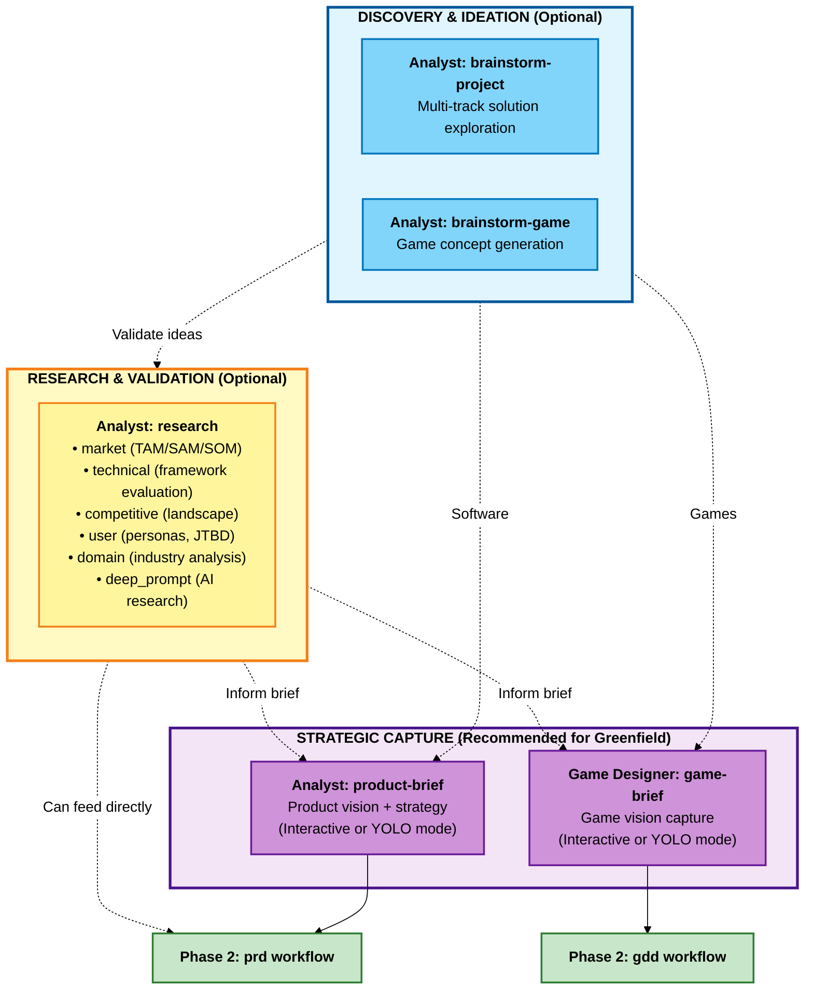

# BMM Analysis Workflows (Phase 1)

**Reading Time:** ~7 minutes

## Overview

Phase 1 (Analysis) workflows are **optional** exploration and discovery tools that help validate ideas, understand markets, and generate strategic context before planning begins.

**Key principle:** Analysis workflows help you think strategically before committing to implementation. Skip them if your requirements are already clear.

**When to use:** Starting new projects, exploring opportunities, validating market fit, generating ideas, understanding problem spaces.

**When to skip:** Continuing existing projects with clear requirements, well-defined features with known solutions, strict constraints where discovery is complete.

---

## Phase 1 Analysis Workflow Map



---

## Quick Reference

| Workflow               | Agent         | Required    | Purpose                                                        | Output                       |
| ---------------------- | ------------- | ----------- | -------------------------------------------------------------- | ---------------------------- |
| **brainstorm-project** | Analyst       | No          | Explore solution approaches and architectures                  | Solution options + rationale |
| **brainstorm-game**    | Analyst       | No          | Generate game concepts using creative techniques               | Game concepts + evaluation   |
| **research**           | Analyst       | No          | Multi-type research (market/technical/competitive/user/domain) | Research reports             |
| **product-brief**      | Analyst       | Recommended | Define product vision and strategy (interactive)               | Product Brief document       |
| **game-brief**         | Game Designer | Recommended | Capture game vision before GDD (interactive)                   | Game Brief document          |

---

## Workflow Descriptions

### brainstorm-project

**Purpose:** Generate multiple solution approaches through parallel ideation tracks (architecture, UX, integration, value).

**Agent:** Analyst

**When to Use:**

- Unclear technical approach with business objectives
- Multiple solution paths need evaluation
- Hidden assumptions need discovery
- Innovation beyond obvious solutions

**Key Outputs:**

- Architecture proposals with trade-off analysis
- Value framework (prioritized features)
- Risk analysis (dependencies, challenges)
- Strategic recommendation with rationale

**Example:** "We need a customer dashboard" → Options: Monolith SSR (faster), Microservices SPA (scalable), Hybrid (balanced) with recommendation.

---

### brainstorm-game

**Purpose:** Generate game concepts through systematic creative exploration using five brainstorming techniques.

**Agent:** Analyst

**When to Use:**

- Generating original game concepts
- Exploring variations on themes
- Breaking creative blocks
- Validating game ideas against constraints

**Techniques Used:**

- SCAMPER (systematic modification)
- Mind Mapping (hierarchical exploration)
- Lotus Blossom (radial expansion)
- Six Thinking Hats (multi-perspective)
- Random Word Association (lateral thinking)

**Key Outputs:**

- Method-specific artifacts (5 separate documents)
- Consolidated concept document with feasibility
- Design pillar alignment matrix

**Example:** "Roguelike with psychological themes" → Emotions as characters, inner demons as enemies, therapy sessions as rest points, deck composition affects narrative.

---

### research

**Purpose:** Comprehensive multi-type research system consolidating market, technical, competitive, user, and domain analysis.

**Agent:** Analyst

**Research Types:**

| Type            | Purpose                                                | Use When                            |
| --------------- | ------------------------------------------------------ | ----------------------------------- |
| **market**      | TAM/SAM/SOM, competitive analysis                      | Need market viability validation    |
| **technical**   | Technology evaluation, ADRs                            | Choosing frameworks/platforms       |
| **competitive** | Deep competitor analysis                               | Understanding competitive landscape |
| **user**        | Customer insights, personas, JTBD                      | Need user understanding             |
| **domain**      | Industry deep dives, trends                            | Understanding domain/industry       |
| **deep_prompt** | Generate AI research prompts (ChatGPT, Claude, Gemini) | Need deeper AI-assisted research    |

**Key Features:**

- Real-time web research
- Multiple analytical frameworks (Porter's Five Forces, SWOT, Technology Adoption Lifecycle)
- Platform-specific optimization for deep_prompt type
- Configurable research depth (quick/standard/comprehensive)

**Example (market):** "SaaS project management tool" → TAM $50B, SAM $5B, SOM $50M, top competitors (Asana, Monday), positioning recommendation.

---

### product-brief

**Purpose:** Interactive product brief creation that guides strategic product vision definition.

**Agent:** Analyst

**When to Use:**

- Starting new product/major feature initiative
- Aligning stakeholders before detailed planning
- Transitioning from exploration to strategy
- Need executive-level product documentation

**Modes:**

- **Interactive Mode** (Recommended): Step-by-step collaborative development with probing questions
- **YOLO Mode**: AI generates complete draft from context, then iterative refinement

**Key Outputs:**

- Executive summary
- Problem statement with evidence
- Proposed solution and differentiators
- Target users (segmented)
- MVP scope (ruthlessly defined)
- Financial impact and ROI
- Strategic alignment
- Risks and open questions

**Integration:** Feeds directly into PRD workflow (Phase 2).

---

### game-brief

**Purpose:** Lightweight interactive brainstorming session capturing game vision before Game Design Document.

**Agent:** Game Designer

**When to Use:**

- Starting new game project
- Exploring game ideas before committing
- Pitching concepts to team/stakeholders
- Validating market fit and feasibility

**Game Brief vs GDD:**

| Aspect       | Game Brief         | GDD                       |
| ------------ | ------------------ | ------------------------- |
| Purpose      | Validate concept   | Design for implementation |
| Detail Level | High-level vision  | Detailed specs            |
| Format       | Conversational     | Structured                |
| Output       | Concise vision doc | Comprehensive design      |

**Key Outputs:**

- Game vision (concept, pitch)
- Target market and positioning
- Core gameplay pillars
- Scope and constraints
- Reference framework
- Risk assessment
- Success criteria

**Integration:** Feeds into GDD workflow (Phase 2).

---

## Decision Guide

### Starting a Software Project

```
brainstorm-project (if unclear) → research (market/technical) → product-brief → Phase 2 (prd)
```

### Starting a Game Project

```
brainstorm-game (if generating concepts) → research (market/competitive) → game-brief → Phase 2 (gdd)
```

### Validating an Idea

```
research (market type) → product-brief or game-brief → Phase 2
```

### Technical Decision Only

```
research (technical type) → Use findings in Phase 3 (architecture)
```

### Understanding Market

```
research (market/competitive type) → product-brief → Phase 2
```

---

## Integration with Phase 2 (Planning)

Analysis outputs feed directly into Planning:

| Analysis Output             | Planning Input             |
| --------------------------- | -------------------------- |
| product-brief.md            | **prd** workflow           |
| game-brief.md               | **gdd** workflow           |
| market-research.md          | **prd** context            |
| technical-research.md       | **architecture** (Phase 3) |
| competitive-intelligence.md | **prd** positioning        |

Planning workflows automatically load these documents if they exist in the output folder.

---

## Best Practices

### 1. Don't Over-Invest in Analysis

Analysis is optional. If requirements are clear, skip to Phase 2 (Planning).

### 2. Iterate Between Workflows

Common pattern: brainstorm → research (validate) → brief (synthesize)

### 3. Document Assumptions

Analysis surfaces and validates assumptions. Document them explicitly for planning to challenge.

### 4. Keep It Strategic

Focus on "what" and "why", not "how". Leave implementation for Planning and Solutioning.

### 5. Involve Stakeholders

Use analysis workflows to align stakeholders before committing to detailed planning.

---

## Common Patterns

### Greenfield Software (Full Analysis)

```
1. brainstorm-project - explore approaches
2. research (market) - validate viability
3. product-brief - capture strategic vision
4. → Phase 2: prd
```

### Greenfield Game (Full Analysis)

```
1. brainstorm-game - generate concepts
2. research (competitive) - understand landscape
3. game-brief - capture vision
4. → Phase 2: gdd
```

### Skip Analysis (Clear Requirements)

```
→ Phase 2: prd or tech-spec directly
```

### Technical Research Only

```
1. research (technical) - evaluate technologies
2. → Phase 3: architecture (use findings in ADRs)
```

---

## Related Documentation

- [Phase 2: Planning Workflows](./workflows-planning.md) - Next phase
- [Phase 3: Solutioning Workflows](./workflows-solutioning.md)
- [Phase 4: Implementation Workflows](./workflows-implementation.md)
- [Scale Adaptive System](./scale-adaptive-system.md) - Understanding project complexity
- [Agents Guide](./agents-guide.md) - Complete agent reference

---

## Troubleshooting

**Q: Do I need to run all analysis workflows?**
A: No! Analysis is entirely optional. Use only workflows that help you think through your problem.

**Q: Which workflow should I start with?**
A: If unsure, start with `research` (market type) to validate viability, then move to `product-brief` or `game-brief`.

**Q: Can I skip straight to Planning?**
A: Yes! If you know what you're building and why, skip Phase 1 entirely and start with Phase 2 (prd/gdd/tech-spec).

**Q: How long should Analysis take?**
A: Typically hours to 1-2 days. If taking longer, you may be over-analyzing. Move to Planning.

**Q: What if I discover problems during Analysis?**
A: That's the point! Analysis helps you fail fast and pivot before heavy planning investment.

**Q: Should brownfield projects do Analysis?**
A: Usually no. Start with `document-project` (Phase 0), then skip to Planning (Phase 2).

---

_Phase 1 Analysis - Optional strategic thinking before commitment._
