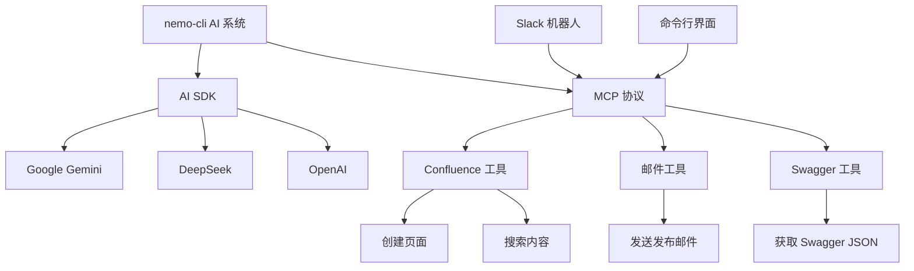
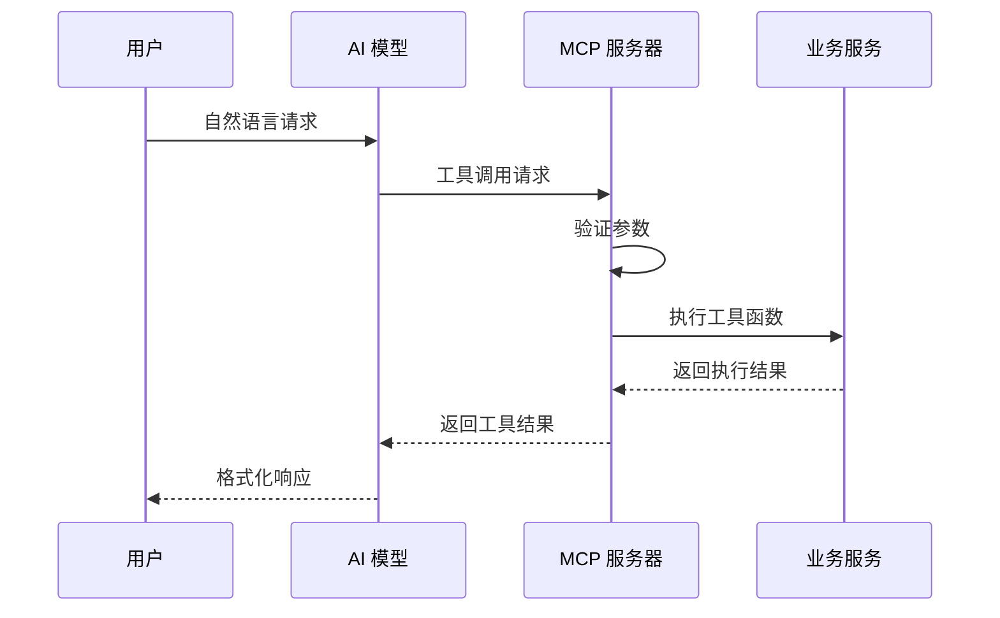
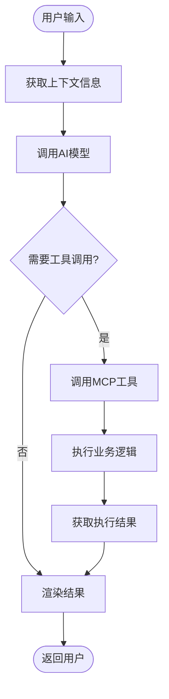

# AI 集成

<cite>
**本文档中引用的文件**  
- [index.ts](file://packages/ai/src/index.ts)
- [chat/index.ts](file://packages/ai/src/services/chat/index.ts)
- [confluence/mcp.ts](file://packages/ai/src/services/confluence/mcp.ts)
- [mails/mcp.ts](file://packages/ai/src/services/mails/mcp.ts)
- [slack/bot.ts](file://packages/ai/src/services/slack/bot.ts)
- [swagger/mcp.ts](file://packages/ai/src/services/swagger/mcp.ts)
- [createContent.ts](file://packages/ai/src/services/confluence/createContent.ts)
- [getContent.ts](file://packages/ai/src/services/confluence/getContent.ts)
- [tools/index.ts](file://packages/ai/src/services/slack/tools/index.ts)
- [getPRD.ts](file://packages/ai/src/services/slack/tools/getPRD.ts)
- [sendEmail.ts](file://packages/ai/src/services/slack/tools/sendEmail.ts)
- [package.json](file://packages/ai/package.json)
</cite>

## 目录
1. [简介](#简介)
2. [AI 包结构与服务](#ai-包结构与服务)
3. [MCP 协议实现机制](#mcp-协议实现机制)
4. [AI 请求数据流分析](#ai-请求数据流分析)
5. [实际使用案例](#实际使用案例)
6. [错误处理与安全性](#错误处理与安全性)
7. [总结](#总结)

## 简介

nemo-cli 是一个集成了多种 AI 模型的命令行工具，通过 AI SDK 和 MCP（Model Control Protocol）协议实现上下文感知的智能交互。该系统支持与 OpenAI、Google Gemini 和 DeepSeek 等主流 AI 模型的集成，并通过统一的 MCP 协议协调不同 AI 服务的调用。核心功能包括聊天交互、Slack 机器人、Confluence 文档集成和邮件自动化等。

**Section sources**
- [index.ts](file://packages/ai/src/index.ts)
- [package.json](file://packages/ai/package.json)

## AI 包结构与服务

nemo-cli 的 AI 功能主要封装在 `@nemo-cli/ai` 包中，其核心服务分布在 `src/services` 目录下，每个子模块负责特定的集成功能。

### 聊天服务
聊天服务 (`chat`) 提供基于 AI 模型的自然语言交互能力，主要用于生成 Git commit 消息和翻译任务。该服务使用 Google Gemini 和 DeepSeek 模型，通过 `ai` SDK 的 `generateText` 和 `streamText` 方法实现流式响应。

### Confluence 集成
Confluence 服务提供与 Confluence Wiki 的双向集成，支持创建发布页面和搜索内容。通过 `createPage` 函数可以基于模板创建新的 Confluence 页面，而 `fuzzySearchContent` 函数则使用 CQL 查询语言实现模糊搜索功能。

### Slack 机器人
Slack 机器人服务使用 Slack Bolt 框架实现，能够监听消息事件和应用提及事件。机器人支持通过自然语言触发工具调用，如获取 PRD 文档或发送发布邮件。

### 邮件服务
邮件服务通过 MCP 工具与 Confluence 服务集成，实现自动化发送发布邮件的功能。当用户请求发送邮件时，系统会先在 Confluence 中查找对应的发布文档内容，然后调用邮件发送服务。

### Swagger 集成
Swagger 服务提供获取 Swagger JSON 的能力，支持根据 API URL 自动识别并返回相应的接口文档数据，便于后续的 API 分析和文档生成。



**Diagram sources**
- [index.ts](file://packages/ai/src/index.ts)
- [services/chat/index.ts](file://packages/ai/src/services/chat/index.ts)
- [services/confluence/mcp.ts](file://packages/ai/src/services/confluence/mcp.ts)
- [services/mails/mcp.ts](file://packages/ai/src/services/mails/mcp.ts)
- [services/slack/bot.ts](file://packages/ai/src/services/slack/bot.ts)
- [services/swagger/mcp.ts](file://packages/ai/src/services/swagger/mcp.ts)

**Section sources**
- [index.ts](file://packages/ai/src/index.ts)
- [chat/index.ts](file://packages/ai/src/services/chat/index.ts)
- [confluence/mcp.ts](file://packages/ai/src/services/confluence/mcp.ts)
- [mails/mcp.ts](file://packages/ai/src/services/mails/mcp.ts)
- [slack/bot.ts](file://packages/ai/src/services/slack/bot.ts)
- [swagger/mcp.ts](file://packages/ai/src/services/swagger/mcp.ts)

## MCP 协议实现机制

MCP（Model Control Protocol）是 nemo-cli 中用于协调不同 AI 服务调用的核心协议，基于 `fastmcp` 库实现。MCP 协议采用工具注册模式，允许将各种功能封装为可调用的工具。

### MCP 服务器初始化
系统首先创建一个 `FastMCP` 服务器实例，作为所有工具的注册中心。这个服务器负责管理工具的注册、发现和执行。

### 工具注册模式
每个服务模块通过 `addTool` 方法向 MCP 服务器注册工具，每个工具包含以下要素：
- **名称**：工具的唯一标识符
- **描述**：工具功能的简要说明
- **参数**：使用 Zod 库定义的输入参数模式
- **执行函数**：实际的业务逻辑实现

例如，Confluence 服务注册了 `createReleasePage` 和 `openConfluence` 两个工具，分别用于创建发布页面和打开 Confluence 页面。

### 工具调用流程
当 AI 模型需要执行特定任务时，会生成符合工具签名的调用请求，MCP 服务器负责验证参数并调用相应的执行函数。执行结果会被返回给 AI 模型，由模型决定如何向用户呈现结果。



**Diagram sources**
- [index.ts](file://packages/ai/src/index.ts)
- [confluence/mcp.ts](file://packages/ai/src/services/confluence/mcp.ts)
- [mails/mcp.ts](file://packages/ai/src/services/mails/mcp.ts)
- [swagger/mcp.ts](file://packages/ai/src/services/swagger/mcp.ts)

**Section sources**
- [index.ts](file://packages/ai/src/index.ts)
- [confluence/mcp.ts](file://packages/ai/src/services/confluence/mcp.ts)
- [mails/mcp.ts](file://packages/ai/src/services/mails/mcp.ts)
- [swagger/mcp.ts](file://packages/ai/src/services/swagger/mcp.ts)

## AI 请求数据流分析

nemo-cli 的 AI 请求处理遵循清晰的数据流模式，从用户输入到最终结果呈现，经过多个处理阶段。

### 数据流阶段
1. **用户输入**：用户通过命令行或 Slack 发送自然语言请求
2. **上下文获取**：系统收集相关上下文信息（如 Git 差异）
3. **AI 处理**：将输入和上下文发送给 AI 模型进行处理
4. **工具调用**：AI 模型决定是否需要调用外部工具
5. **结果渲染**：将 AI 响应格式化后返回给用户

### 上下文感知机制
系统通过多种方式获取上下文信息，增强 AI 交互的智能性。例如，在生成 Git commit 消息时，`getGitDiff` 函数会执行 `git diff --cached` 命令获取暂存区的变更内容，然后将这些变更作为上下文提供给 AI 模型。

### 结果处理与链式调用
AI 响应不仅可以直接呈现给用户，还可以触发其他模块的执行。例如，当用户请求创建发布文档时，系统会：
1. 使用 AI 模型理解用户意图
2. 调用 Confluence 工具创建页面
3. 获取创建结果
4. 可能进一步触发邮件服务发送通知



**Diagram sources**
- [chat/index.ts](file://packages/ai/src/services/chat/index.ts)
- [services/slack/bot.ts](file://packages/ai/src/services/slack/bot.ts)
- [services/confluence/createContent.ts](file://packages/ai/src/services/confluence/createContent.ts)

**Section sources**
- [chat/index.ts](file://packages/ai/src/services/chat/index.ts)
- [services/slack/bot.ts](file://packages/ai/src/services/slack/bot.ts)
- [services/confluence/createContent.ts](file://packages/ai/src/services/confluence/createContent.ts)

## 实际使用案例

### 生成 Git Commit 消息
用户可以通过 `na chat` 命令生成智能的 Git commit 消息。系统会自动获取暂存区的变更内容，将其作为上下文提供给 AI 模型，生成简洁且描述清晰的 commit 消息。

```bash
na chat
```

### 创建发布文档
用户可以通过自然语言指令创建 Confluence 发布文档：

```bash
na createReleasePage --id 123
```

这将创建一个标题为 "提测工单: PRIME-123" 的 Confluence 页面。

### 发送发布邮件
系统支持自动化发送发布邮件，通过 MCP 工具链实现：

```bash
na sendReleaseMail --id 123
```

此命令会先查找 ID 为 123 的 Confluence 发布文档，然后基于文档内容发送邮件。

### Slack 机器人交互
在 Slack 中，用户可以直接提及机器人并发送请求：

```
@nemo-bot 请帮我查找 PRIME-123 的需求文档
```

机器人会调用相应的工具并返回结果。

**Section sources**
- [chat/index.ts](file://packages/ai/src/services/chat/index.ts)
- [confluence/mcp.ts](file://packages/ai/src/services/confluence/mcp.ts)
- [mails/mcp.ts](file://packages/ai/src/services/mails/mcp.ts)
- [slack/bot.ts](file://packages/ai/src/services/slack/bot.ts)

## 错误处理与安全性

### 错误处理机制
系统实现了多层次的错误处理机制：
- **工具级错误处理**：每个工具的执行函数都包含 try-catch 块，捕获并处理特定异常
- **MCP 协议层错误**：MCP 服务器验证输入参数，防止无效调用
- **AI 模型错误**：处理 AI 模型调用失败的情况，提供降级方案

### 安全性考虑
系统在安全性方面采取了多项措施：
- **API 密钥管理**：敏感信息如 API 密钥通过环境变量注入，不硬编码在代码中
- **输入验证**：使用 Zod 库对所有工具输入进行严格验证
- **权限控制**：Slack 机器人仅响应授权用户的消息
- **错误信息脱敏**：向用户返回的错误信息经过处理，不暴露系统内部细节

### 速率限制
虽然当前代码中未显式实现速率限制，但通过以下方式间接控制：
- 使用 Gemini 和 DeepSeek 的官方 SDK，这些 SDK 通常内置了速率限制机制
- 通过环境变量配置 API 密钥，便于在外部进行流量控制

**Section sources**
- [confluence/createContent.ts](file://packages/ai/src/services/confluence/createContent.ts)
- [confluence/getContent.ts](file://packages/ai/src/services/confluence/getContent.ts)
- [mails/mcp.ts](file://packages/ai/src/services/mails/mcp.ts)
- [slack/bot.ts](file://packages/ai/src/services/slack/bot.ts)

## 总结

nemo-cli 通过 AI SDK 和 MCP 协议实现了强大的 AI 集成功能，支持多种 AI 模型和丰富的服务集成。系统采用模块化设计，通过 MCP 协议统一管理各种工具的调用，实现了上下文感知的智能交互。从用户输入到结果呈现的数据流清晰，支持复杂的链式操作。尽管在错误处理和安全性方面已有基本实现，但仍有改进空间，如增加显式的速率限制机制和更完善的错误恢复策略。