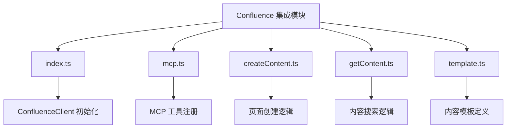
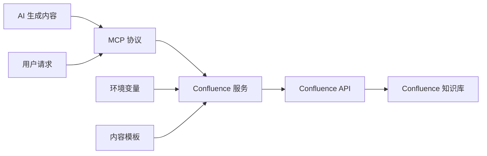
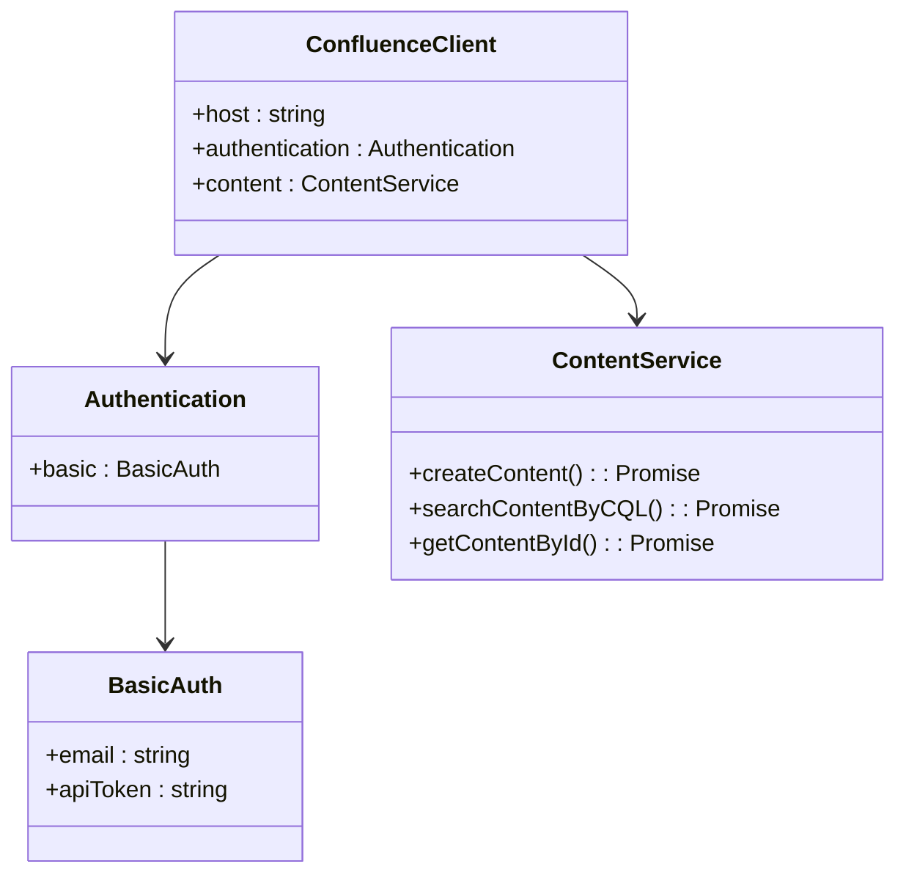
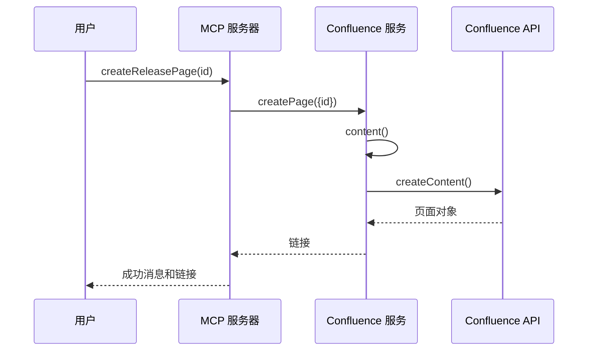
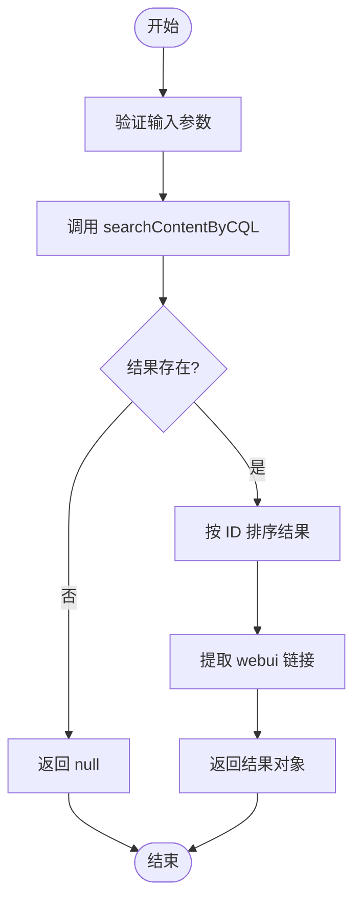

# Confluence 集成

<cite>
**本文档引用的文件**  
- [index.ts](file://packages/ai/src/services/confluence/index.ts)
- [mcp.ts](file://packages/ai/src/services/confluence/mcp.ts)
- [createContent.ts](file://packages/ai/src/services/confluence/createContent.ts)
- [getContent.ts](file://packages/ai/src/services/confluence/getContent.ts)
- [template.ts](file://packages/ai/src/services/confluence/template.ts)
- [index.ts](file://packages/ai/src/index.ts)
- [browser.ts](file://packages/shared/src/utils/browser.ts)
- [.env.example](file://packages/ai/.env.example)
</cite>

## 目录
1. [简介](#简介)
2. [项目结构](#项目结构)
3. [核心组件](#核心组件)
4. [架构概述](#架构概述)
5. [详细组件分析](#详细组件分析)
6. [依赖分析](#依赖分析)
7. [性能考虑](#性能考虑)
8. [故障排除指南](#故障排除指南)
9. [结论](#结论)

## 简介
本文档详细介绍了nemo-cli如何通过Confluence API实现与Confluence的知识库集成。系统利用MCP协议协调AI生成内容的自动化发布流程，实现了从AI内容生成到知识库自动更新的完整闭环。文档涵盖了身份验证机制、空间权限管理、内容模板使用方法以及错误处理策略等关键方面，并提供了实际应用案例。

## 项目结构
nemo-cli的Confluence集成功能主要位于`packages/ai/src/services/confluence`目录下，该目录包含了实现Confluence读取和创建功能的所有核心文件。系统采用模块化设计，将客户端初始化、内容创建、内容获取、模板管理和MCP协议集成等功能分离到不同的文件中。



**图示来源**  
- [index.ts](file://packages/ai/src/services/confluence/index.ts)
- [mcp.ts](file://packages/ai/src/services/confluence/mcp.ts)
- [createContent.ts](file://packages/ai/src/services/confluence/createContent.ts)
- [getContent.ts](file://packages/ai/src/services/confluence/getContent.ts)
- [template.ts](file://packages/ai/src/services/confluence/template.ts)

**本节来源**  
- [packages/ai/src/services/confluence](file://packages/ai/src/services/confluence)

## 核心组件
Confluence集成的核心组件包括Confluence客户端初始化、内容创建服务、内容获取服务、模板引擎和MCP协议适配器。这些组件协同工作，实现了从AI生成内容到Confluence知识库的自动化发布流程。系统通过环境变量进行身份验证配置，使用预定义的模板确保内容格式的一致性，并通过MCP协议与外部系统进行协调。

**本节来源**  
- [index.ts](file://packages/ai/src/services/confluence/index.ts)
- [createContent.ts](file://packages/ai/src/services/confluence/createContent.ts)
- [getContent.ts](file://packages/ai/src/services/confluence/getContent.ts)

## 架构概述
nemo-cli的Confluence集成架构基于MCP（Model-Controller-Protocol）模式构建，实现了AI生成内容与企业知识库的无缝对接。系统通过Confluence.js库与Atlassian Confluence API进行通信，利用环境变量进行安全的身份验证，并通过预定义的HTML模板确保发布内容的格式规范。



**图示来源**  
- [index.ts](file://packages/ai/src/services/confluence/index.ts)
- [mcp.ts](file://packages/ai/src/services/confluence/mcp.ts)
- [index.ts](file://packages/ai/src/index.ts)

## 详细组件分析

### Confluence 客户端初始化
Confluence客户端初始化组件负责创建和配置与Confluence API的连接。该组件从环境变量中读取认证信息，确保敏感数据不会硬编码在源代码中。客户端使用基本认证方式，通过电子邮件和API令牌进行身份验证。



**图示来源**  
- [index.ts](file://packages/ai/src/services/confluence/index.ts)

**本节来源**  
- [index.ts](file://packages/ai/src/services/confluence/index.ts)

### 内容创建服务
内容创建服务负责将AI生成的内容发布到Confluence知识库。该服务使用预定义的模板，确保所有发布的文档都遵循统一的格式标准。服务支持通过ID或分支名称创建页面，并自动处理页面标题的生成。



**图示来源**  
- [mcp.ts](file://packages/ai/src/services/confluence/mcp.ts)
- [createContent.ts](file://packages/ai/src/services/confluence/createContent.ts)

**本节来源**  
- [createContent.ts](file://packages/ai/src/services/confluence/createContent.ts)
- [mcp.ts](file://packages/ai/src/services/confluence/mcp.ts)

### 内容获取服务
内容获取服务提供模糊搜索功能，可以根据ID查找相关的Confluence页面。该服务使用Confluence Query Language (CQL)进行高效的内容检索，并对搜索结果进行排序，确保返回最相关的结果。



**图示来源**  
- [getContent.ts](file://packages/ai/src/services/confluence/getContent.ts)

**本节来源**  
- [getContent.ts](file://packages/ai/src/services/confluence/getContent.ts)

### 模板引擎
模板引擎组件定义了发布到Confluence的内容结构和格式。模板采用Confluence存储格式（Storage Format），包含预定义的章节、表格、代码块和任务列表，确保所有生成的文档都具有专业和一致的外观。

**本节来源**  
- [template.ts](file://packages/ai/src/services/confluence/template.ts)

### MCP 协议集成
MCP协议集成组件将Confluence功能暴露为MCP工具，使得这些功能可以被AI系统调用和编排。通过addTool方法注册的工具可以被AI代理使用，实现自动化的工作流程。

```mermaid
classDiagram
class FastMCP {
+addTool(tool : Tool)
+start()
}
class Tool {
+name : string
+description : string
+parameters : Schema
+execute : Function
}
class CreateReleasePageTool {
+name : "createReleasePage"
+description : "创建 Confluence 发布页面"
+parameters : {id : number}
+execute : async ({id}) => {...}
}
class OpenConfluenceTool {
+name : "openConfluence"
+description : "打开 Confluence 页面"
+parameters : {id : number}
+execute : async ({id}) => {...}
}
FastMCP --> Tool
Tool <|-- CreateReleasePageTool
Tool <|-- OpenConfluenceTool
```

**图示来源**  
- [mcp.ts](file://packages/ai/src/services/confluence/mcp.ts)
- [index.ts](file://packages/ai/src/index.ts)

**本节来源**  
- [mcp.ts](file://packages/ai/src/services/confluence/mcp.ts)

## 依赖分析
nemo-cli的Confluence集成依赖于多个外部库和内部模块。主要外部依赖包括confluence.js用于与Confluence API通信，fastmcp用于MCP协议实现。内部依赖包括shared包中的工具函数，如openBrowser用于打开浏览器。

```mermaid
graph TD
A[nemo-cli] --> B[confluence.js]
A --> C[fastmcp]
A --> D[zod]
A --> E[@nemo-cli/shared]
B --> F[Confluence API]
E --> G[open]
A --> H[Node.js]
```

**图示来源**  
- [package.json](file://packages/ai/package.json)
- [index.ts](file://packages/ai/src/index.ts)

**本节来源**  
- [package.json](file://packages/ai/package.json)
- [index.ts](file://packages/ai/src/index.ts)

## 性能考虑
Confluence集成的性能主要受网络延迟和API速率限制的影响。系统通过异步操作和错误处理机制来提高可靠性。内容创建和获取操作都包含适当的错误处理，确保在API调用失败时系统能够优雅地降级。

## 故障排除指南
Confluence集成的常见问题包括身份验证失败、页面创建冲突和内容格式问题。系统通过环境变量验证在启动时检查必要的认证信息，通过try-catch块处理API调用异常，并通过返回null值来处理未找到内容的情况。

**本节来源**  
- [index.ts](file://packages/ai/src/services/confluence/index.ts)
- [createContent.ts](file://packages/ai/src/services/confluence/createContent.ts)
- [getContent.ts](file://packages/ai/src/services/confluence/getContent.ts)

## 结论
nemo-cli的Confluence集成提供了一套完整的解决方案，用于将AI生成的内容自动发布到企业知识库。通过MCP协议的协调作用，系统实现了高度自动化的文档工作流程，提高了团队的知识共享效率。身份验证机制、内容模板和错误处理策略共同确保了系统的安全性和可靠性。