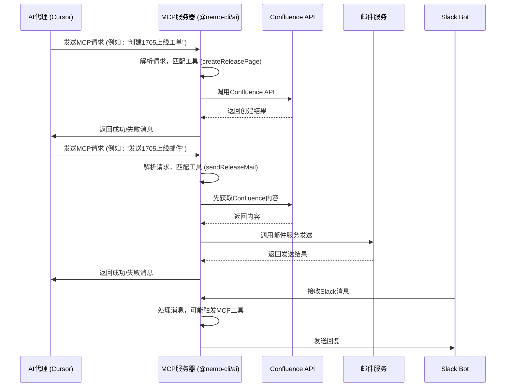

# MCP协议协调

<cite>
**本文档引用的文件**  
- [mcp.ts](file://packages/ai/src/services/confluence/mcp.ts)
- [mcp.ts](file://packages/ai/src/services/mails/mcp.ts)
- [mcp.ts](file://packages/ai/src/services/swagger/mcp.ts)
- [index.ts](file://packages/ai/src/index.ts)
- [createContent.ts](file://packages/ai/src/services/confluence/createContent.ts)
- [getContent.ts](file://packages/ai/src/services/confluence/getContent.ts)
- [index.ts](file://packages/ai/src/services/confluence/index.ts)
- [bot.ts](file://packages/ai/src/services/slack/bot.ts)
- [send.ts](file://packages/mail/src/services/send.ts)
- [architecture.md](file://docs/architecture.md)
- [packages-ai/index.md](file://docs/packages-ai/index.md)
</cite>

## 目录
1. [引言](#引言)
2. [项目结构](#项目结构)
3. [核心组件](#核心组件)
4. [架构概述](#架构概述)
5. [详细组件分析](#详细组件分析)
6. [依赖分析](#依赖分析)
7. [性能考虑](#性能考虑)
8. [故障排除指南](#故障排除指南)
9. [结论](#结论)

## 引言
本文档旨在深入解析MCP（Model Context Protocol）协议在Confluence集成中的协调作用。重点阐述`mcp.ts`文件如何作为中介协调层，将高层AI指令转换为具体的Confluence API调用。文档将详细描述工具注册机制、能力声明模式、请求-响应的序列化过程，以及相关的安全性和跨平台协同工作模式。

## 项目结构
`@nemo-cli/ai` 模块是整个MCP协议的核心，它作为一个MCP服务器，为AI代理提供与Confluence、邮件、Slack等外部服务交互的能力。其结构清晰地分为服务层、工具注册层和主入口。

```mermaid
graph TD
A[@nemo-cli/ai] --> B[src/index.ts]
A --> C[src/services/confluence/]
A --> D[src/services/mails/]
A --> E[src/services/slack/]
B --> F[启动MCP服务器]
C --> G[mcp.ts]
C --> H[createContent.ts]
C --> I[getContent.ts]
D --> J[mcp.ts]
E --> K[bot.ts]
```

**Diagram sources**
- [index.ts](file://packages/ai/src/index.ts)
- [mcp.ts](file://packages/ai/src/services/confluence/mcp.ts)
- [mcp.ts](file://packages/ai/src/services/mails/mcp.ts)
- [bot.ts](file://packages/ai/src/services/slack/bot.ts)

**Section sources**
- [architecture.md](file://docs/architecture.md)
- [packages-ai/index.md](file://docs/packages-ai/index.md)

## 核心组件
`mcp.ts` 文件是MCP协议实现的核心，它定义了可供AI代理调用的具体工具。每个工具都包含一个名称、描述、参数模式和执行函数。`index.ts` 文件负责创建MCP服务器实例并注册所有服务。

**Section sources**
- [mcp.ts](file://packages/ai/src/services/confluence/mcp.ts)
- [mcp.ts](file://packages/ai/src/services/mails/mcp.ts)
- [index.ts](file://packages/ai/src/index.ts)

## 架构概述
MCP协议的架构是一个典型的中介模式。AI代理（如Cursor）通过MCP协议发送高层指令，`@nemo-cli/ai` 作为MCP服务器接收这些指令，根据注册的工具进行路由，并调用相应的服务（如Confluence API）来执行具体操作，最后将结果返回给AI代理。



**Diagram sources**
- [mcp.ts](file://packages/ai/src/services/confluence/mcp.ts)
- [mcp.ts](file://packages/ai/src/services/mails/mcp.ts)
- [bot.ts](file://packages/ai/src/services/slack/bot.ts)

## 详细组件分析
### Confluence MCP 工具分析
`packages/ai/src/services/confluence/mcp.ts` 文件定义了与Confluence交互的工具。它通过`addConfluenceMCP`函数向MCP服务器注册工具。

#### 工具注册机制
该文件使用`server.addTool()`方法注册了两个主要工具：
- `createReleasePage`: 创建发布页面，参数为`id`。
- `openConfluence`: 打开Confluence页面，参数为`id`。

```mermaid
classDiagram
class FastMCP {
+addTool(tool : ToolDefinition) : void
+start(config : TransportConfig) : void
}
class ToolDefinition {
+name : string
+description : string
+parameters : ZodSchema
+execute : Function
}
class ConfluenceMCP {
+addConfluenceMCP(server : FastMCP) : void
}
FastMCP --> "1" ToolDefinition : 包含
ConfluenceMCP --> FastMCP : 使用
ConfluenceMCP --> "createReleasePage" : 注册
ConfluenceMCP --> "openConfluence" : 注册
```

**Diagram sources**
- [mcp.ts](file://packages/ai/src/services/confluence/mcp.ts)

#### 能力声明与请求-响应序列化
能力声明通过`zod`库定义。例如，`createReleasePage`工具的参数被声明为一个包含`id`（数字类型）的对象。当AI代理发送请求时，MCP服务器会根据这个模式验证输入。执行函数的返回值会被序列化为字符串，通过stdio传输回AI代理。

**Section sources**
- [mcp.ts](file://packages/ai/src/services/confluence/mcp.ts)
- [createContent.ts](file://packages/ai/src/services/confluence/createContent.ts)

### 邮件 MCP 工具分析
邮件MCP工具展示了跨服务调用的模式。

#### 跨平台协同工作模式
`sendReleaseMail`工具的执行逻辑（`executeSendReleaseMail`）首先调用`fuzzySearchContent`从Confluence获取内容，然后调用`sendReleaseMail`服务发送邮件。这实现了Confluence和邮件服务之间的协同工作。

```mermaid
flowchart TD
A[执行 sendReleaseMail] --> B[调用 fuzzySearchContent{id}]
B --> C{内容找到?}
C --> |是| D[调用 sendReleaseMail{id, content}]
C --> |否| E[返回错误]
D --> F{发送成功?}
F --> |是| G[返回成功]
F --> |否| H[返回错误]
```

**Diagram sources**
- [mcp.ts](file://packages/ai/src/services/mails/mcp.ts)
- [getContent.ts](file://packages/ai/src/services/confluence/getContent.ts)
- [send.ts](file://packages/mail/src/services/send.ts)

**Section sources**
- [mcp.ts](file://packages/ai/src/services/mails/mcp.ts)

## 依赖分析
MCP服务器的正常运行依赖于多个内部和外部组件。

```mermaid
graph LR
A[MCP服务器] --> B[fastmcp]
A --> C[confluence.js]
A --> D[nodemailer]
A --> E[@slack/bolt]
A --> F[@nemo-cli/shared]
B --> G[AI代理]
C --> H[Confluence API]
D --> I[SMTP服务器]
E --> J[Slack API]
F --> K[工具函数]
```

**Diagram sources**
- [go.mod](file://package.json)
- [index.ts](file://packages/ai/src/index.ts)

**Section sources**
- [package.json](file://package.json)

## 性能考虑
MCP调用是同步的，因此执行函数的性能直接影响AI代理的响应速度。对于涉及网络请求的操作（如API调用），应确保有适当的超时和错误处理机制。避免在MCP工具中执行长时间的计算任务。

## 故障排除指南
### 查看MCP调用链
1.  **启用日志**: 在`@nemo-cli/ai`的执行环境中，确保日志输出是开启的。`console.log`语句会输出到stdout/stderr。
2.  **检查执行流程**: 从`index.ts`的`server.start()`开始，跟踪请求如何被`mcp.ts`中的`execute`函数处理。
3.  **调试网络请求**: 对于Confluence或邮件服务的调用，检查`createContent.ts`和`send.ts`中的`try-catch`块，查看是否有错误被抛出。

### 诊断通信故障
-   **AI代理无法发现工具**: 检查`manifest.json`是否正确配置，以及MCP服务器是否成功启动。
-   **工具执行失败**: 检查环境变量（如`CONFLUENCE_API_TOKEN`）是否正确设置。查看日志中的错误信息，特别是来自`confluence.js`或`nodemailer`的错误。
-   **参数验证失败**: 确保AI代理发送的参数符合`zod`模式定义。

### 模拟响应
为了测试，可以直接调用`mcp.ts`中`execute`函数的实现，传入模拟的参数，观察其返回值。

**Section sources**
- [mcp.ts](file://packages/ai/src/services/confluence/mcp.ts)
- [mcp.ts](file://packages/ai/src/services/mails/mcp.ts)
- [index.ts](file://packages/ai/src/index.ts)

## 结论
`mcp.ts`文件在`@nemo-cli/ai`模块中扮演着至关重要的中介角色。它通过标准化的工具注册和能力声明，成功地将非结构化的AI指令桥接到具体的、结构化的API调用上。其设计体现了清晰的职责分离和良好的可扩展性，为实现跨平台（Confluence、邮件、Slack）的自动化工作流提供了坚实的基础。安全性和错误处理是其设计中不可或缺的部分，确保了系统的稳定运行。