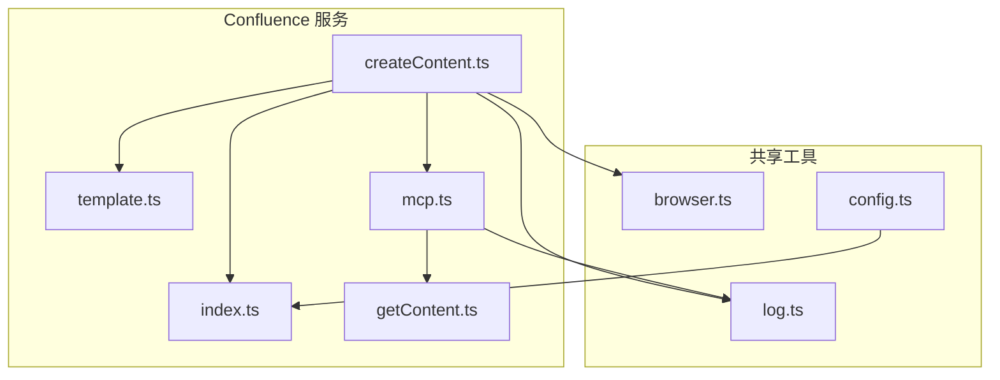
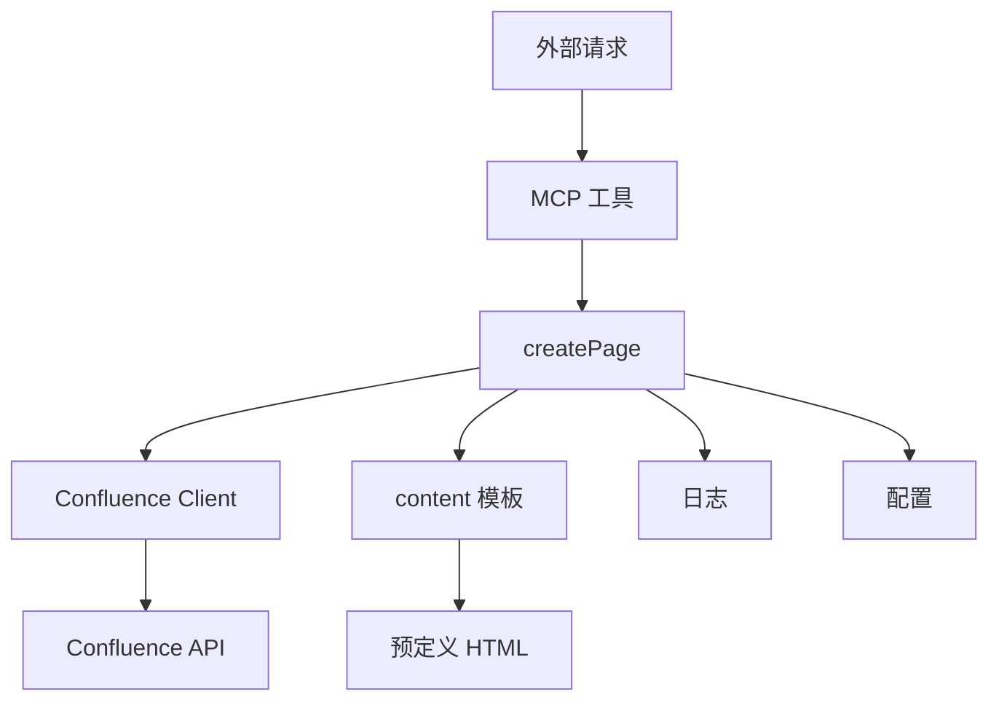
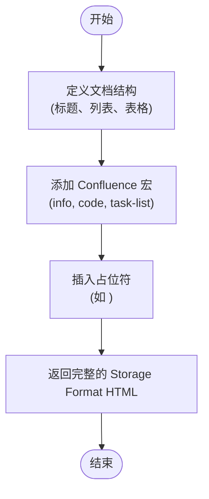
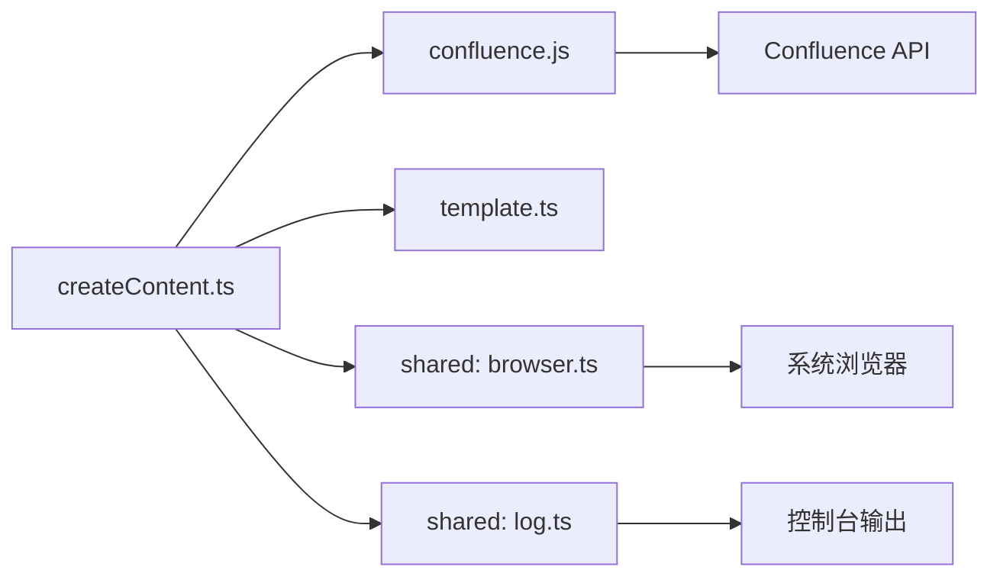

# 内容创建

<cite>
**本文档中引用的文件**  
- [createContent.ts](file://packages/ai/src/services/confluence/createContent.ts)
- [template.ts](file://packages/ai/src/services/confluence/template.ts)
- [index.ts](file://packages/ai/src/services/confluence/index.ts)
- [mcp.ts](file://packages/ai/src/services/confluence/mcp.ts)
- [getContent.ts](file://packages/ai/src/services/confluence/getContent.ts)
- [browser.ts](file://packages/shared/src/utils/browser.ts)
- [log.ts](file://packages/shared/src/utils/log.ts)
- [config.ts](file://packages/shared/src/utils/config.ts)
- [constants.ts](file://packages/shared/src/constants.ts)
- [package.json](file://packages/ai/package.json)
- [README.md](file://packages/ai/README.md)
- [ai/src/index.ts](file://packages/ai/src/index.ts)
</cite>

## 目录
1. [介绍](#介绍)
2. [项目结构](#项目结构)
3. [核心组件](#核心组件)
4. [架构概述](#架构概述)
5. [详细组件分析](#详细组件分析)
6. [依赖分析](#依赖分析)
7. [性能考虑](#性能考虑)
8. [故障排除指南](#故障排除指南)
9. [结论](#结论)

## 介绍
本文档详细阐述了 `nemo-cli` 项目中 Confluence 内容创建功能的实现机制。该功能旨在自动化生成符合特定模板的 Confluence 页面，主要用于创建“提测&上线单”等标准化文档。系统通过 `createContent.ts` 模块与 Confluence API 交互，利用预定义的模板和动态数据填充，实现内容的快速创建与发布。文档将深入解析请求体构造、富文本格式、版本控制、异常处理等关键环节，并提供实际应用案例。

## 项目结构
`nemo-cli` 是一个基于 TypeScript 的命令行工具，其 AI 功能模块（`@nemo-cli/ai`）负责与外部服务（如 Confluence、邮件、Slack）集成。Confluence 相关的功能集中于 `packages/ai/src/services/confluence/` 目录下，形成了一个独立的服务层。



**Diagram sources**
- [createContent.ts](file://packages/ai/src/services/confluence/createContent.ts)
- [template.ts](file://packages/ai/src/services/confluence/template.ts)
- [index.ts](file://packages/ai/src/services/confluence/index.ts)
- [mcp.ts](file://packages/ai/src/services/confluence/mcp.ts)
- [getContent.ts](file://packages/ai/src/services/confluence/getContent.ts)
- [browser.ts](file://packages/shared/src/utils/browser.ts)
- [log.ts](file://packages/shared/src/utils/log.ts)
- [config.ts](file://packages/shared/src/utils/config.ts)

**Section sources**
- [project_structure](#project_structure)

## 核心组件
本功能的核心组件包括 `createPage` 函数，它负责调用 Confluence 客户端创建页面；`content` 函数，它提供预定义的页面模板；以及 `addConfluenceMCP` 函数，它将创建页面的功能注册为一个可被外部调用的工具（Tool）。这些组件协同工作，实现了从请求接收、内容生成到 API 调用的完整流程。

**Section sources**
- [createContent.ts](file://packages/ai/src/services/confluence/createContent.ts#L18-L34)
- [template.ts](file://packages/ai/src/services/confluence/template.ts#L1-L643)
- [mcp.ts](file://packages/ai/src/services/confluence/mcp.ts#L8-L19)

## 架构概述
该功能的架构遵循清晰的分层模式。最上层是 MCP（Model Context Protocol）工具注册层，它暴露 `createReleasePage` 工具给外部系统（如 AI 助手）。中间是业务逻辑层，由 `createContent.ts` 组成，负责协调 API 调用和数据准备。底层是服务与数据层，包括 Confluence 客户端、内容模板和共享的工具函数（如日志、配置管理）。



**Diagram sources**
- [mcp.ts](file://packages/ai/src/services/confluence/mcp.ts#L8-L19)
- [createContent.ts](file://packages/ai/src/services/confluence/createContent.ts#L18-L34)
- [index.ts](file://packages/ai/src/services/confluence/index.ts#L13-L22)
- [template.ts](file://packages/ai/src/services/confluence/template.ts#L1-L643)
- [log.ts](file://packages/shared/src/utils/log.ts)
- [config.ts](file://packages/shared/src/utils/config.ts)

## 详细组件分析

### 内容创建与请求体构造分析
`createContent.ts` 模块中的 `createPage` 函数是内容创建的核心。它接收一个包含 `id` 或 `branch` 的参数对象，用于动态生成页面标题。函数通过调用 `client.content.createContent` 方法向 Confluence API 发送请求。请求体由 `template.ts` 文件中的 `content` 函数提供，并在此处被展开。此外，函数还设置了 `ancestors`（父页面ID）、`title`（标题）和 `space`（空间键）等关键属性。

```mermaid
sequenceDiagram
participant User as "用户/AI"
participant MCP as "MCP Server"
participant Create as "createPage"
participant Template as "content()"
participant Client as "Confluence Client"
participant Confluence as "Confluence API"
User->>MCP : createReleasePage(id=1705)
MCP->>Create : createPage({id : 1705})
Create->>Template : await content()
Template-->>Create : 返回模板对象
Create->>Client : client.content.createContent({...})
Client->>Confluence : POST /content
Confluence-->>Client : 返回页面信息
Client-->>Create : 返回页面链接
Create-->>MCP : 返回成功消息和链接
MCP-->>User : Success to Create Release Doc Page 1705...
```

**Diagram sources**
- [createContent.ts](file://packages/ai/src/services/confluence/createContent.ts#L18-L34)
- [template.ts](file://packages/ai/src/services/confluence/template.ts#L1-L643)
- [mcp.ts](file://packages/ai/src/services/confluence/mcp.ts#L15-L17)

**Section sources**
- [createContent.ts](file://packages/ai/src/services/confluence/createContent.ts#L18-L34)

### 富文本内容与模板机制分析
Confluence 使用其专有的存储格式（Storage Format）来表示富文本内容，这是一种基于 XML 的标记语言。`template.ts` 文件中的 `content` 函数返回一个包含此格式 HTML 字符串的对象。该字符串定义了页面的完整结构，包括标题、段落、表格、代码块、任务列表和宏（如 `ac:structured-macro`）。这种机制允许创建高度结构化和格式化的文档，确保了生成内容的一致性。



**Diagram sources**
- [template.ts](file://packages/ai/src/services/confluence/template.ts#L1-L643)

**Section sources**
- [template.ts](file://packages/ai/src/services/confluence/template.ts#L1-L643)

### 版本控制与冲突解决机制分析
当前的代码实现中，**并未直接体现**基于版本号的乐观锁或其他复杂的版本控制策略。`createPage` 函数直接调用 `createContent` 方法创建新页面，而不是更新现有页面。因此，它通过创建新页面来规避了更新冲突。如果需要实现更新功能，Confluence API 通常要求在请求体中包含当前页面的版本号（`version.number`），并在更新时递增该值，这正是乐观锁的实现方式。但在此特定功能中，由于是创建而非更新，此机制未被应用。

**Section sources**
- [createContent.ts](file://packages/ai/src/services/confluence/createContent.ts#L22-L27)

### 实际用例分析
一个典型的应用场景是自动化生成“提测&上线单”。当开发人员完成一个需求（如 PRIME-1705）并准备提测时，可以通过 AI 助手发出指令“帮我创建 1705 上线工单”。AI 助手通过 MCP 协议调用 `createReleasePage` 工具，传入 `id=1705`。系统随后生成一个标题为“提测工单: PRIME-1705”的 Confluence 页面，并填充预定义的模板，其中包含了需求内容、开发变更记录和发布步骤等章节，极大地提高了文档创建的效率。

**Section sources**
- [mcp.ts](file://packages/ai/src/services/confluence/mcp.ts#L10-L18)
- [README.md](file://packages/ai/README.md#L27)

### 异常处理机制分析
该功能的异常处理相对基础。在 `createPage` 函数中，使用了 `try-catch` 语句来捕获 API 调用过程中可能发生的错误。如果捕获到错误，函数会通过 `console.error` 打印错误信息，并返回 `null`。然而，它没有对不同类型的错误（如网络超时、认证失败、内容过大、标题重复）进行精细化的区分和处理。例如，当标题重复时，Confluence API 会返回特定的错误码，但当前代码并未对此进行特殊处理，只是统一记录错误并返回失败。

**Section sources**
- [createContent.ts](file://packages/ai/src/services/confluence/createContent.ts#L21-L33)
- [log.ts](file://packages/shared/src/utils/log.ts)

## 依赖分析
该功能依赖于多个内部和外部模块。内部依赖包括 `shared` 包中的工具函数（如 `openBrowser` 用于打开浏览器，`log` 用于日志记录）和 `confluence.js` 库用于与 Confluence API 通信。外部依赖则通过环境变量（`.env` 文件）配置，如 `CONFLUENCE_API_TOKEN` 和 `CONFLUENCE_EMAIL`，用于 API 认证。这些依赖关系确保了功能的完整性和可配置性。



**Diagram sources**
- [createContent.ts](file://packages/ai/src/services/confluence/createContent.ts)
- [index.ts](file://packages/ai/src/services/confluence/index.ts)
- [browser.ts](file://packages/shared/src/utils/browser.ts)
- [log.ts](file://packages/shared/src/utils/log.ts)
- [package.json](file://packages/ai/package.json)

**Section sources**
- [index.ts](file://packages/ai/src/services/confluence/index.ts#L6-L11)
- [package.json](file://packages/ai/package.json#L41-L51)
- [config.ts](file://packages/shared/src/utils/config.ts)

## 性能考虑
由于该功能主要涉及单次 API 调用和模板字符串的返回，其性能开销非常低。主要的性能瓶颈在于网络延迟和 Confluence API 的响应时间。代码中没有复杂的计算或大量数据处理，因此性能优化的空间不大。确保网络连接稳定和 API 认证信息正确是保证功能快速响应的关键。

## 故障排除指南
当内容创建功能出现问题时，可以按照以下步骤进行排查：
1.  **检查环境变量**：确认 `.env` 文件中已正确设置 `CONFLUENCE_API_TOKEN` 和 `CONFLUENCE_EMAIL`。
2.  **检查 API 权限**：确保使用的 API Token 具有在目标空间创建页面的权限。
3.  **查看日志输出**：运行命令时，观察控制台输出的错误信息，`console.error` 会打印出原始的 API 错误。
4.  **验证网络连接**：确保可以访问 `https://antalpha.atlassian.net`。
5.  **检查模板**：确认 `template.ts` 文件中的 HTML 格式正确，没有语法错误。

**Section sources**
- [index.ts](file://packages/ai/src/services/confluence/index.ts#L6-L11)
- [createContent.ts](file://packages/ai/src/services/confluence/createContent.ts#L30-L32)
- [README.md](file://packages/ai/README.md#L7-L14)

## 结论
`nemo-cli` 的 Confluence 内容创建功能通过简洁的代码实现了高效的文档自动化。它利用预定义的模板和 MCP 协议，能够快速生成标准化的“提测&上线单”。虽然当前的异常处理和版本控制机制较为基础，但它已经满足了核心的自动化需求。未来可以通过增强错误处理、支持页面更新和引入更复杂的模板变量来进一步提升其健壮性和灵活性。