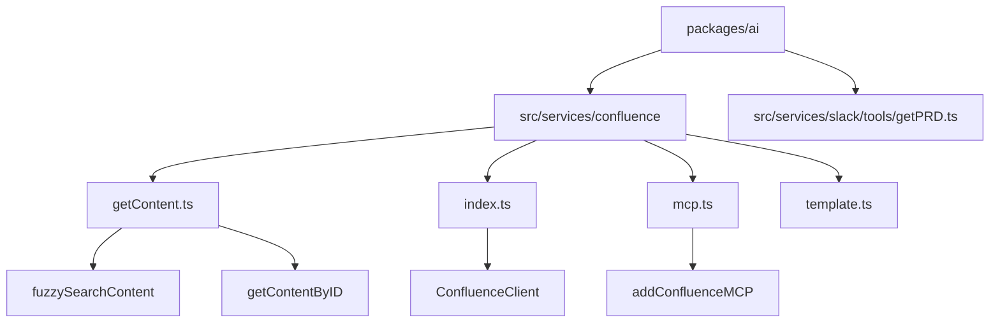
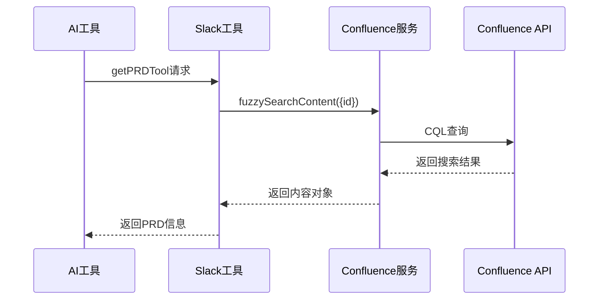
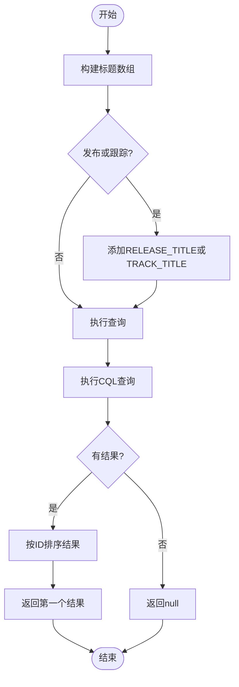
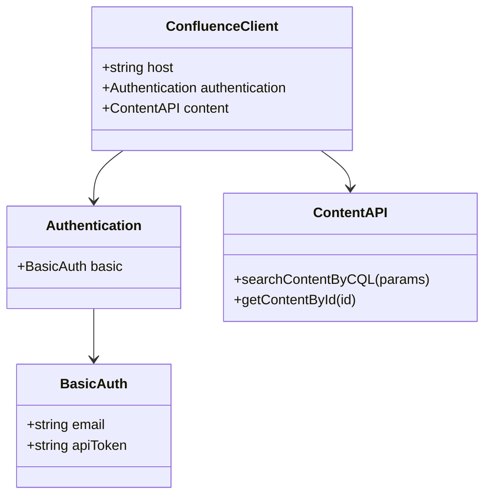

# 内容读取

<cite>
**本文档引用的文件**  
- [getContent.ts](file://packages/ai/src/services/confluence/getContent.ts)
- [index.ts](file://packages/ai/src/services/confluence/index.ts)
- [mcp.ts](file://packages/ai/src/services/confluence/mcp.ts)
- [template.ts](file://packages/ai/src/services/confluence/template.ts)
- [getPRD.ts](file://packages/ai/src/services/slack/tools/getPRD.ts)
- [package.json](file://packages/ai/package.json)
</cite>

## 目录
1. [简介](#简介)
2. [项目结构](#项目结构)
3. [核心组件](#核心组件)
4. [架构概述](#架构概述)
5. [详细组件分析](#详细组件分析)
6. [依赖分析](#依赖分析)
7. [性能考虑](#性能考虑)
8. [故障排除指南](#故障排除指南)
9. [结论](#结论)

## 简介
本文档详细介绍了nemo-cli项目中Confluence内容读取功能的实现。该功能通过Confluence REST API检索页面内容，支持基于空间键、页面ID等参数的精确和模糊搜索。系统实现了内容解析、错误处理和集成机制，用于在AI工作流中获取项目文档上下文，支持智能问答等应用场景。

## 项目结构



**图示来源**  
- [getContent.ts](file://packages/ai/src/services/confluence/getContent.ts#L1-L39)
- [index.ts](file://packages/ai/src/services/confluence/index.ts#L1-L23)

**本节来源**  
- [getContent.ts](file://packages/ai/src/services/confluence/getContent.ts#L1-L39)
- [index.ts](file://packages/ai/src/services/confluence/index.ts#L1-L23)

## 核心组件

`getContent.ts`模块提供了两个主要功能：`fuzzySearchContent`用于基于CQL查询的模糊搜索，`getContentByID`用于通过页面ID精确获取内容。`index.ts`文件配置了Confluence客户端，包含认证信息和API端点。这些组件共同实现了安全、高效的内容检索功能。

**本节来源**  
- [getContent.ts](file://packages/ai/src/services/confluence/getContent.ts#L1-L39)
- [index.ts](file://packages/ai/src/services/confluence/index.ts#L1-L23)

## 架构概述



**图示来源**  
- [getPRD.ts](file://packages/ai/src/services/slack/tools/getPRD.ts#L1-L36)
- [getContent.ts](file://packages/ai/src/services/confluence/getContent.ts#L12-L34)

## 详细组件分析

### 内容获取分析

`fuzzySearchContent`函数通过构建CQL查询来搜索Confluence内容。它接受ID和可选的发布或跟踪标志，构建包含"PRIME"前缀和ID的标题搜索模式。查询在"metalpha"空间中执行，返回匹配的页面内容。



**图示来源**  
- [getContent.ts](file://packages/ai/src/services/confluence/getContent.ts#L12-L34)

### 认证与客户端分析

Confluence客户端使用基本认证，通过环境变量CONFLUENCE_EMAIL和CONFLUENCE_API_TOKEN进行身份验证。客户端配置了Atlassian的主机地址，并在初始化时验证必要的环境变量是否存在。



**图示来源**  
- [index.ts](file://packages/ai/src/services/confluence/index.ts#L1-L23)

**本节来源**  
- [getContent.ts](file://packages/ai/src/services/confluence/getContent.ts#L1-L39)
- [index.ts](file://packages/ai/src/services/confluence/index.ts#L1-L23)

## 依赖分析

```mermaid
graph TD
A[ai包] --> B[confluence.js]
A --> C[fastmcp]
A --> D[@nemo-cli/shared]
B --> E[Confluence REST API]
C --> F[MCP协议]
D --> G[共享工具]
A --> H[Slack集成]
H --> I[getPRD工具]
I --> J[Confluence服务]
```

**图示来源**  
- [package.json](file://packages/ai/package.json#L40-L51)
- [mcp.ts](file://packages/ai/src/services/confluence/mcp.ts#L1-L40)

**本节来源**  
- [package.json](file://packages/ai/package.json#L1-L54)
- [mcp.ts](file://packages/ai/src/services/confluence/mcp.ts#L1-L40)

## 性能考虑
系统通过CQL查询优化了内容检索性能，使用精确的搜索条件减少返回结果的数量。客户端实现了一次性认证机制，避免了重复的身份验证开销。对于频繁访问的内容，建议在应用层实现缓存机制以提高响应速度。

## 故障排除指南

系统实现了完善的错误处理机制。当环境变量缺失时，会抛出明确的错误信息。内容搜索时会检查结果是否存在，避免返回空值导致的后续错误。在集成场景中，提供了onSuccess和onFailure回调函数来处理各种执行结果。

**本节来源**  
- [index.ts](file://packages/ai/src/services/confluence/index.ts#L9-L11)
- [getPRD.ts](file://packages/ai/src/services/slack/tools/getPRD.ts#L21-L28)

## 结论
Confluence内容读取功能通过精心设计的API封装和错误处理机制，实现了高效、可靠的内容检索。该功能已成功集成到AI工作流中，支持基于需求ID的智能文档查找，为项目管理和知识获取提供了有力支持。未来可考虑添加缓存机制和分页支持以进一步提升性能和功能完整性。