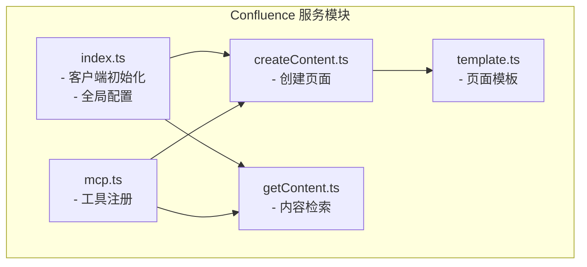
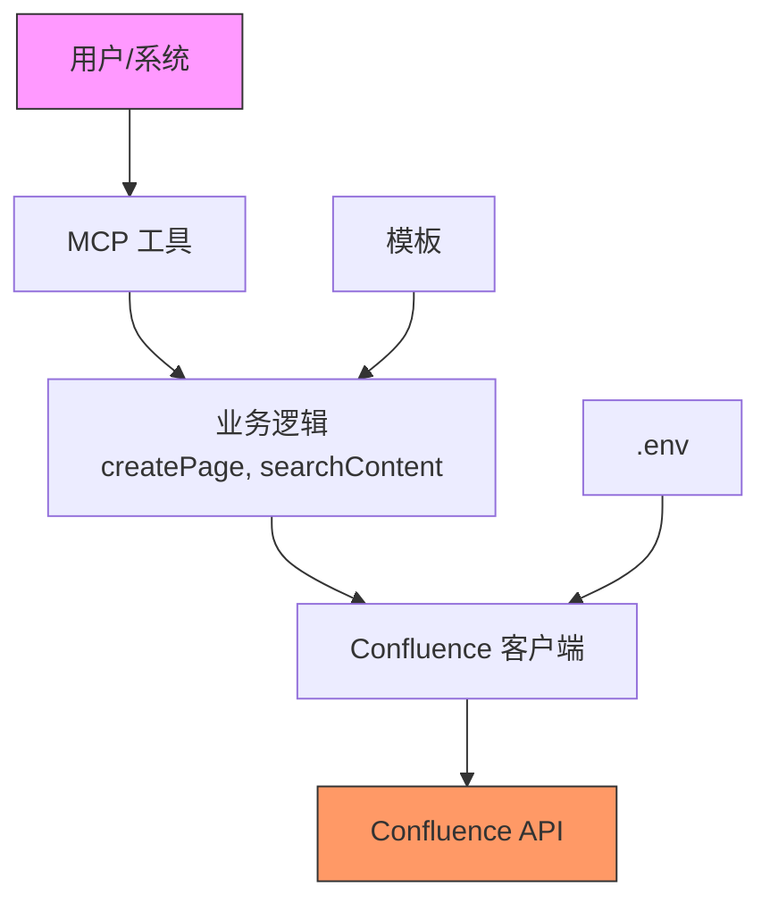
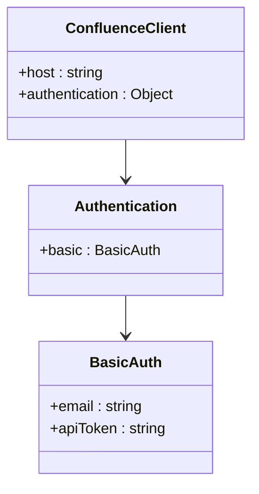
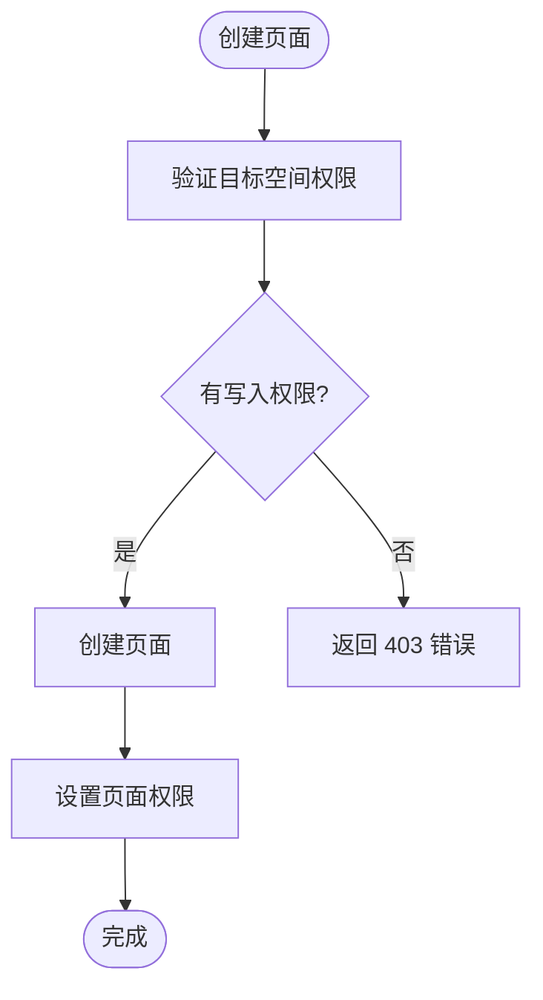
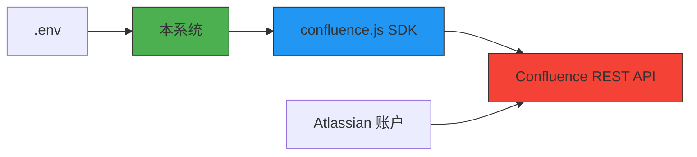
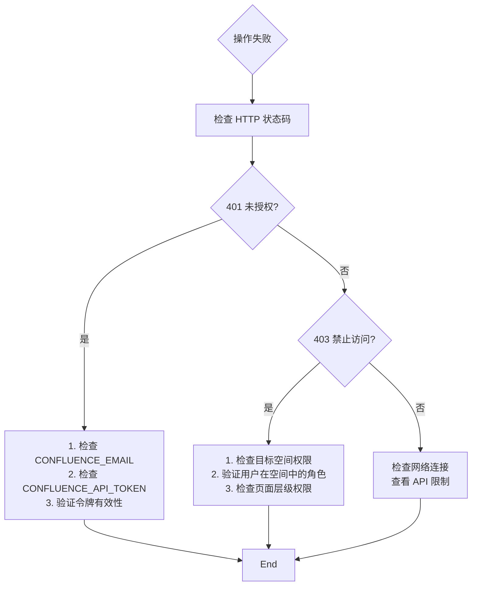

# 认证与权限管理

<cite>
**本文档中引用的文件**  
- [index.ts](file://packages/ai/src/services/confluence/index.ts)
- [createContent.ts](file://packages/ai/src/services/confluence/createContent.ts)
- [getContent.ts](file://packages/ai/src/services/confluence/getContent.ts)
- [mcp.ts](file://packages/ai/src/services/confluence/mcp.ts)
- [template.ts](file://packages/ai/src/services/confluence/template.ts)
- [.env.example](file://packages/ai/.env.example)
</cite>

## 目录
1. [简介](#简介)
2. [项目结构](#项目结构)
3. [核心组件](#核心组件)
4. [架构概述](#架构概述)
5. [详细组件分析](#详细组件分析)
6. [依赖分析](#依赖分析)
7. [性能考虑](#性能考虑)
8. [故障排除指南](#故障排除指南)
9. [结论](#结论)

## 简介
本文档旨在全面阐述基于 Confluence 的认证与权限管理机制。系统通过环境变量配置 API 凭据，使用基本认证方式与 Confluence 平台集成，实现自动化文档创建、检索和权限控制。文档涵盖认证机制实现、权限模型设计、错误处理策略以及安全最佳实践。

## 项目结构
Confluence 相关功能集中于 `packages/ai/src/services/confluence` 目录下，采用模块化设计，各文件职责明确，共同构成完整的 Confluence 集成服务。

**图示来源**
- [index.ts](file://packages/ai/src/services/confluence/index.ts#L1-L23)
- [createContent.ts](file://packages/ai/src/services/confluence/createContent.ts#L1-L35)
- [getContent.ts](file://packages/ai/src/services/confluence/getContent.ts#L1-L39)
- [mcp.ts](file://packages/ai/src/services/confluence/mcp.ts#L1-L40)
- [template.ts](file://packages/ai/src/services/confluence/template.ts#L1-L643)

**本节来源**
- [packages/ai/src/services/confluence](file://packages/ai/src/services/confluence)

## 核心组件
核心组件包括认证客户端初始化、页面创建、内容检索和工具集成。系统通过 `confluence.js` SDK 与 Confluence API 交互，所有操作均需通过认证。

**本节来源**
- [index.ts](file://packages/ai/src/services/confluence/index.ts#L1-L23)
- [createContent.ts](file://packages/ai/src/services/confluence/createContent.ts#L1-L35)

## 架构概述
系统采用分层架构，上层为工具接口，中层为业务逻辑，底层为 Confluence SDK 和认证机制。环境变量提供安全的凭证管理，确保敏感信息不硬编码。

**图示来源**
- [mcp.ts](file://packages/ai/src/services/confluence/mcp.ts#L8-L39)
- [index.ts](file://packages/ai/src/services/confluence/index.ts#L6-L22)
- [.env.example](file://packages/ai/.env.example#L4-L5)

## 详细组件分析

### 认证机制分析
系统采用 Atlassian 基本认证（Basic Auth）机制，结合 API 令牌实现安全访问。

#### 认证实现

**图示来源**
- [index.ts](file://packages/ai/src/services/confluence/index.ts#L13-L22)

#### OAuth 2.0 与基本认证对比
| 特性 | 基本认证 | OAuth 2.0 |
|------|---------|---------|
| 实现复杂度 | 简单 | 复杂 |
| 适用场景 | 内部自动化脚本 | 第三方应用集成 |
| 凭证管理 | API 令牌 | 访问令牌 + 刷新令牌 |
| 安全性 | 高（配合 API 令牌） | 高 |
| 选择依据 | 本项目为内部工具，需简单可靠的自动化访问 | 不适用 |

**本节来源**
- [index.ts](file://packages/ai/src/services/confluence/index.ts#L6-L22)
- [.env.example](file://packages/ai/.env.example#L4-L5)

### 权限管理分析
系统通过 Confluence 的空间（Space）和页面（Page）权限模型进行访问控制。

#### 空间与页面权限

**图示来源**
- [createContent.ts](file://packages/ai/src/services/confluence/createContent.ts#L18-L34)
- [template.ts](file://packages/ai/src/services/confluence/template.ts#L15-L16)

#### 用户角色影响
- **创建者**：自动获得页面所有者权限
- **空间管理员**：可管理空间内所有页面
- **普通成员**：根据空间权限配置访问内容
- **操作影响**：创建页面时，系统验证执行者在目标空间的写入权限，否则操作失败。

**本节来源**
- [createContent.ts](file://packages/ai/src/services/confluence/createContent.ts#L22-L27)
- [template.ts](file://packages/ai/src/services/confluence/template.ts#L15-L16)

## 依赖分析
系统依赖 `confluence.js` SDK 与 Confluence 交互，并通过环境变量注入配置。

**图示来源**
- [index.ts](file://packages/ai/src/services/confluence/index.ts#L1-L22)
- [.env.example](file://packages/ai/.env.example#L4-L5)

**本节来源**
- [index.ts](file://packages/ai/src/services/confluence/index.ts#L1-L22)
- [package.json](file://packages/ai/package.json)

## 性能考虑
- **连接复用**：`ConfluenceClient` 实例全局单例，避免重复建立连接
- **错误处理**：操作失败时捕获异常并返回 null，保证调用链稳定
- **异步操作**：所有 API 调用均为异步，避免阻塞主线程

## 故障排除指南
提供常见权限错误的诊断流程。

**图示来源**
- [index.ts](file://packages/ai/src/services/confluence/index.ts#L9-L11)
- [createContent.ts](file://packages/ai/src/services/confluence/createContent.ts#L30-L32)

**本节来源**
- [index.ts](file://packages/ai/src/services/confluence/index.ts#L9-L11)
- [createContent.ts](file://packages/ai/src/services/confluence/createContent.ts#L30-L32)

## 结论
本系统通过环境变量安全管理 Confluence API 令牌，采用基本认证实现可靠的身份验证。权限控制基于 Confluence 原生的空间和页面权限模型，遵循最小权限原则。凭证轮换可通过更新环境变量中的 `CONFLUENCE_API_TOKEN` 实现，建议定期轮换以增强安全性。