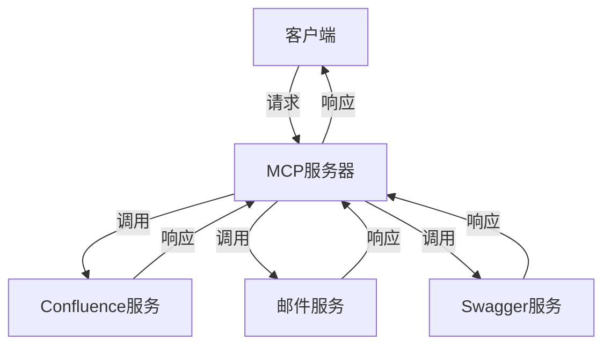

# MCP 协议实现

<cite>
**本文档中引用的文件**  
- [mcp.ts](file://packages/ai/src/services/confluence/mcp.ts)
- [mcp.ts](file://packages/ai/src/services/mails/mcp.ts)
- [mcp.ts](file://packages/ai/src/services/swagger/mcp.ts)
- [index.ts](file://packages/ai/src/index.ts)
- [test-architecture.md](file://_bmad/bmm/docs/test-architecture.md)
</cite>

## 目录
1. [引言](#引言)
2. [MCP协议设计理念与架构](#mcp协议设计理念与架构)
3. [核心功能](#核心功能)
4. [插件化扩展支持](#插件化扩展支持)
5. [调用流程与数据结构](#调用流程与数据结构)
6. [性能优化策略](#性能优化策略)
7. [结论](#结论)

## 引言
MCP（Model Control Protocol）协议是nemo-cli项目中用于协调不同AI服务调用的统一接口。该协议通过标准化请求路由、上下文管理、错误处理和结果格式，实现了对多种AI服务的高效集成与管理。本文档将详细阐述MCP协议的设计理念、核心功能、插件化扩展机制、调用流程及性能优化策略。

## MCP协议设计理念与架构
MCP协议的设计理念是提供一个统一的接口，以协调不同AI服务的调用。该协议基于FastMCP库实现，通过定义工具（tools）来封装不同的服务功能。每个工具都有一个名称、描述、参数模式和执行函数。这些工具被注册到一个FastMCP服务器实例上，该实例负责处理来自客户端的请求，并根据请求中的工具名称调用相应的执行函数。

在架构上，MCP协议位于AI服务层之上，作为中间件协调各个具体服务（如Confluence、邮件、Swagger等）的调用。这种设计使得新增AI服务时只需添加新的工具定义，而无需修改核心逻辑，从而实现了良好的可扩展性。

**图示来源**
- [index.ts](file://packages/ai/src/index.ts#L7-L17)
- [mcp.ts](file://packages/ai/src/services/confluence/mcp.ts#L8-L39)
- [mcp.ts](file://packages/ai/src/services/mails/mcp.ts#L18-L27)
- [mcp.ts](file://packages/ai/src/services/swagger/mcp.ts#L6-L19)

## 核心功能
### 请求路由
MCP协议通过工具名称进行请求路由。当接收到客户端请求时，服务器会解析请求中的工具名称，并查找已注册的对应工具执行函数。如果找到匹配的工具，则调用其执行函数；否则返回错误信息。

### 上下文管理
MCP协议利用Zod库定义每个工具的参数模式，确保输入参数的有效性和一致性。这不仅有助于防止无效请求，还为开发者提供了清晰的API文档。

### 错误处理
MCP协议在执行过程中捕获并处理异常，确保服务的稳定运行。例如，在`createPage`函数中，使用try-catch块捕获创建Confluence页面时可能出现的错误，并返回适当的错误信息。

### 结果标准化
所有工具的执行结果都被格式化为字符串形式返回给客户端。这种统一的结果格式简化了客户端的处理逻辑，提高了系统的互操作性。

**章节来源**
- [mcp.ts](file://packages/ai/src/services/confluence/mcp.ts#L8-L39)
- [mcp.ts](file://packages/ai/src/services/mails/mcp.ts#L18-L27)
- [mcp.ts](file://packages/ai/src/services/swagger/mcp.ts#L6-L19)

## 插件化扩展支持
MCP协议支持插件化扩展，允许新增AI服务而无需修改核心逻辑。这一特性通过模块化设计实现：每个AI服务的功能被封装在一个独立的模块中，该模块导出一个函数，用于向MCP服务器注册相关工具。例如，`addConfluenceMCP`函数向服务器添加了两个与Confluence相关的工具：`createReleasePage`和`openConfluence`。类似地，`addMailMCP`和`addSwaggerMCP`函数分别添加了邮件和Swagger服务的工具。

这种设计模式使得系统具有高度的灵活性和可维护性。当需要引入新的AI服务时，只需编写相应的模块并调用其导出的注册函数即可完成集成。

**章节来源**
- [mcp.ts](file://packages/ai/src/services/confluence/mcp.ts#L8-L39)
- [mcp.ts](file://packages/ai/src/services/mails/mcp.ts#L18-L27)
- [mcp.ts](file://packages/ai/src/services/swagger/mcp.ts#L6-L19)

## 调用流程与数据结构
### 调用流程
1. 客户端发送包含工具名称和参数的请求至MCP服务器。
2. 服务器解析请求，根据工具名称查找对应的执行函数。
3. 执行函数被调用，处理业务逻辑并返回结果。
4. 服务器将结果封装后返回给客户端。

### 数据结构定义
- **工具定义**：包含名称（name）、描述（description）、参数模式（parameters）和执行函数（execute）。
- **参数模式**：使用Zod库定义，确保输入参数的类型安全。
- **执行函数**：异步函数，接收参数对象作为输入，返回处理结果。

**章节来源**
- [index.ts](file://packages/ai/src/index.ts#L7-L17)
- [mcp.ts](file://packages/ai/src/services/confluence/mcp.ts#L8-L39)

## 性能优化策略
虽然当前代码中未直接体现连接池管理和请求批处理等高级性能优化技术，但MCP协议的设计为未来引入这些策略提供了良好的基础。例如，可以通过以下方式进一步优化性能：
- **连接池管理**：对于频繁调用的外部服务（如数据库或API），可以引入连接池机制，减少连接建立和销毁的开销。
- **请求批处理**：对于可以合并的请求，实现批处理逻辑，减少网络往返次数，提高吞吐量。

此外，通过合理配置FastMCP服务器的transportType（如使用stdio而非HTTP），也可以在一定程度上提升通信效率。

**章节来源**
- [index.ts](file://packages/ai/src/index.ts#L15-L17)

## 结论
MCP协议通过提供统一的接口，成功实现了对多种AI服务的协调调用。其设计充分考虑了可扩展性和易维护性，支持插件化扩展，允许新增AI服务而无需修改核心逻辑。尽管当前实现侧重于功能完整性，但其架构为未来的性能优化留下了充足的空间。随着项目的不断发展，预计将进一步引入连接池管理和请求批处理等高级优化技术，以满足更高性能需求。