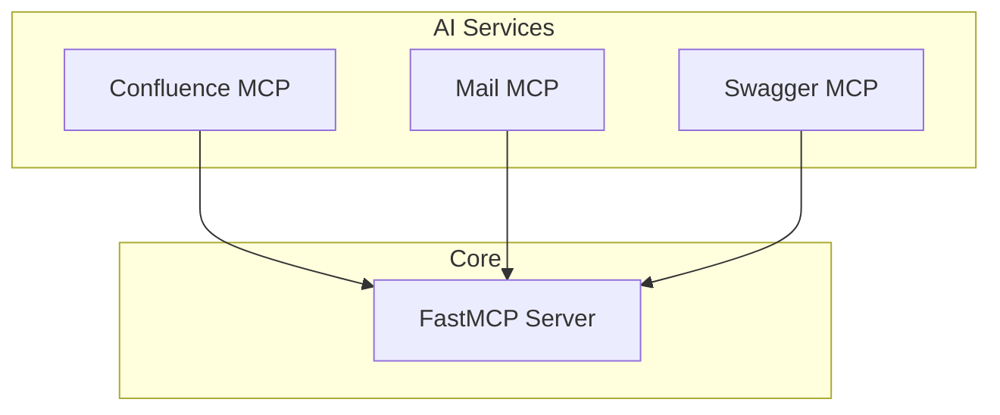
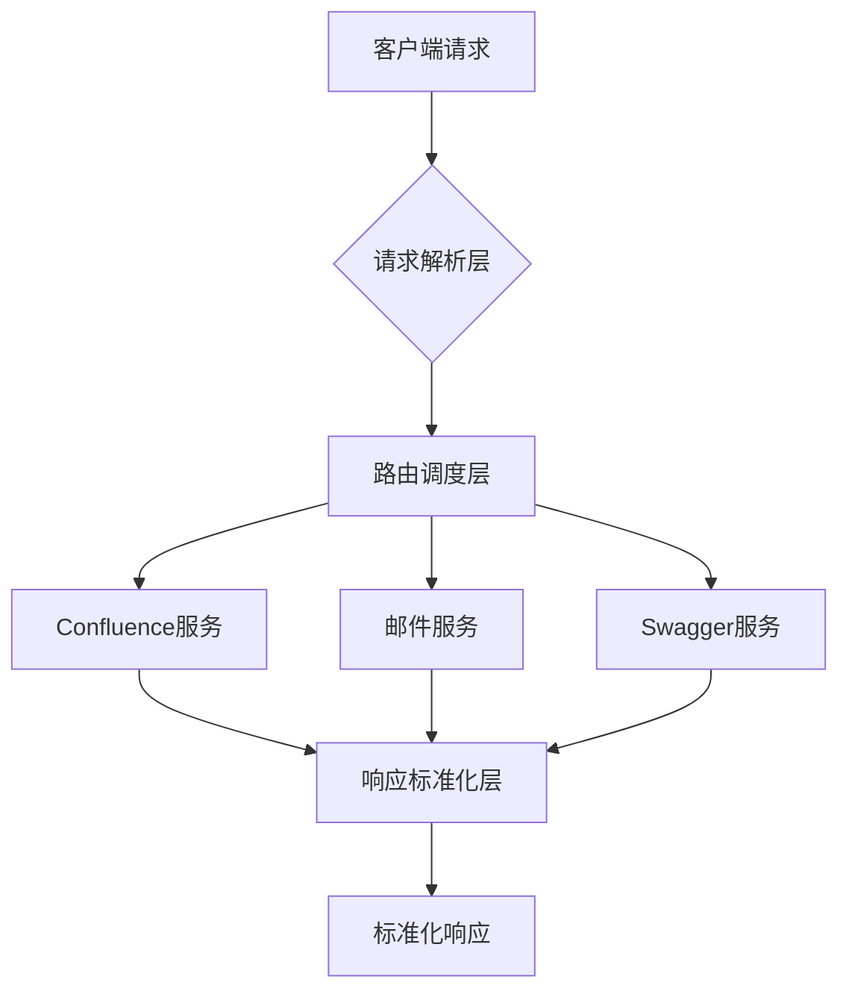
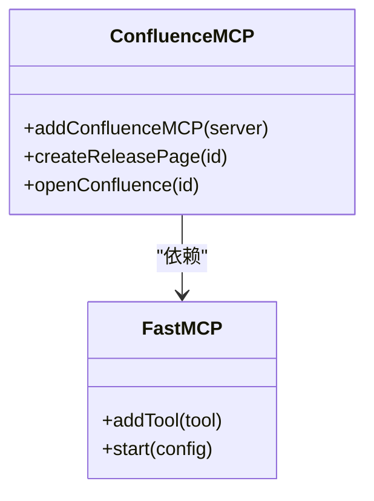
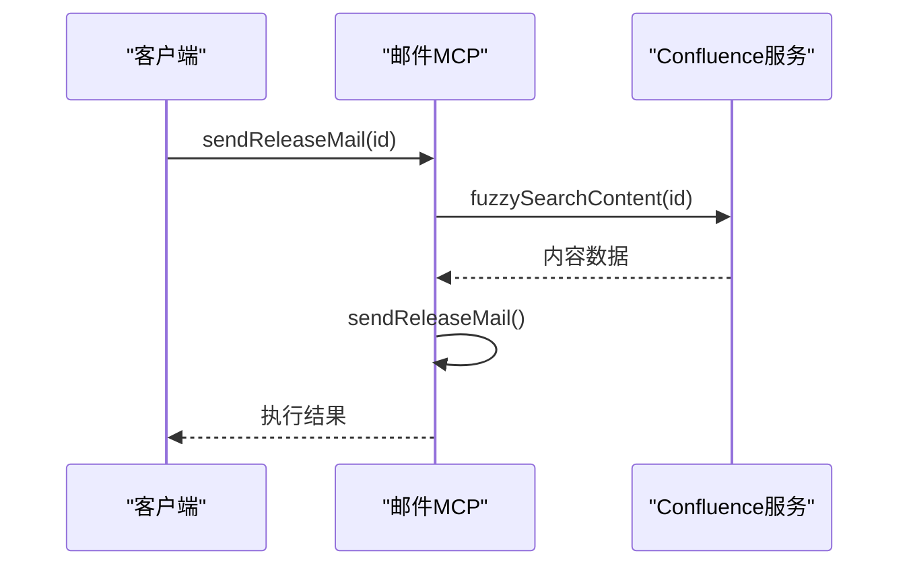
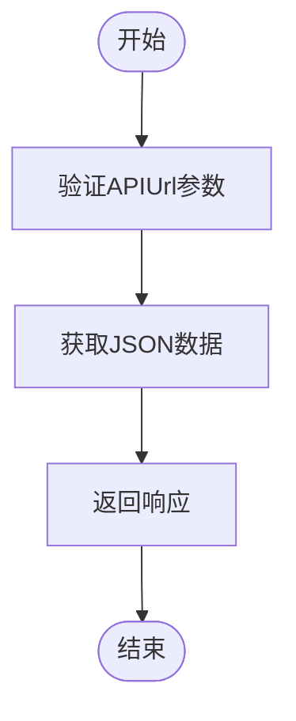

# MCP 架构设计

<cite>
**本文档中引用的文件**  
- [index.ts](file://packages/ai/src/index.ts)
- [mcp.ts](file://packages/ai/src/services/confluence/mcp.ts)
- [mcp.ts](file://packages/ai/src/services/mails/mcp.ts)
- [mcp.ts](file://packages/ai/src/services/swagger/mcp.ts)
- [package.json](file://packages/ai/package.json)
</cite>

## 目录
1. [引言](#引言)
2. [项目结构](#项目结构)
3. [核心组件](#核心组件)
4. [架构概述](#架构概述)
5. [详细组件分析](#详细组件分析)
6. [依赖分析](#依赖分析)
7. [性能考虑](#性能考虑)
8. [故障排除指南](#故障排除指南)
9. [结论](#结论)

## 引言
MCP（Model Control Protocol）协议是本系统中用于统一不同AI服务接口的核心抽象层。它通过标准化工具调用方式，实现了对多种AI提供商（如Google、DeepSeek等）的无缝集成。该协议作为中间层，屏蔽了底层AI服务的实现差异，使得上层应用可以一致地调用各种功能而无需关心具体实现细节。

## 项目结构
MCP相关代码主要分布在`packages/ai/src/services`目录下，每个服务模块（如Confluence、Mail、Swagger）都有独立的MCP集成文件。整体结构采用模块化设计，便于扩展新的AI服务集成。



**图示来源**  
- [index.ts](file://packages/ai/src/index.ts#L7-L17)
- [confluence/mcp.ts](file://packages/ai/src/services/confluence/mcp.ts#L8-L39)
- [mail/mcp.ts](file://packages/ai/src/services/mails/mcp.ts#L18-L27)
- [swagger/mcp.ts](file://packages/ai/src/services/swagger/mcp.ts#L6-L19)

**本节来源**  
- [index.ts](file://packages/ai/src/index.ts#L1-L20)
- [package.json](file://packages/ai/package.json#L1-L54)

## 核心组件
MCP协议的核心由FastMCP服务器和一系列工具插件组成。FastMCP作为基础框架，提供了工具注册和执行机制；各服务模块通过addTool方法注册具体功能，形成统一的服务接口。

**本节来源**  
- [index.ts](file://packages/ai/src/index.ts#L7-L17)
- [confluence/mcp.ts](file://packages/ai/src/services/confluence/mcp.ts#L8-L39)

## 架构概述
MCP协议采用分层架构设计，主要包括：
- **请求解析层**：接收并解析客户端请求
- **路由调度层**：根据请求类型分发到对应服务
- **上下文管理层**：维护会话状态和上下文信息
- **响应标准化层**：统一输出格式



**图示来源**  
- [index.ts](file://packages/ai/src/index.ts#L7-L17)
- [confluence/mcp.ts](file://packages/ai/src/services/confluence/mcp.ts#L8-L39)
- [mail/mcp.ts](file://packages/ai/src/services/mails/mcp.ts#L18-L27)

## 详细组件分析

### Confluence MCP 分析
Confluence MCP模块提供了创建和打开Confluence页面的功能。通过定义清晰的参数结构和执行逻辑，实现了与Confluence系统的集成。



**图示来源**  
- [confluence/mcp.ts](file://packages/ai/src/services/confluence/mcp.ts#L8-L39)
- [index.ts](file://packages/ai/src/index.ts#L7-L17)

### 邮件 MCP 分析
邮件MCP模块负责发送发布邮件，通过集成Confluence内容检索功能，实现了自动化邮件发送流程。



**图示来源**  
- [mail/mcp.ts](file://packages/ai/src/services/mails/mcp.ts#L7-L27)
- [confluence/getContent.ts](file://packages/ai/src/services/confluence/getContent.ts)

### Swagger MCP 分析
Swagger MCP模块提供获取Swagger JSON的功能，支持通过API URL动态获取接口文档。



**图示来源**  
- [swagger/mcp.ts](file://packages/ai/src/services/swagger/mcp.ts#L6-L19)
- [swagger/index.ts](file://packages/ai/src/services/swagger/index.ts)

**本节来源**  
- [confluence/mcp.ts](file://packages/ai/src/services/confluence/mcp.ts#L1-L40)
- [mail/mcp.ts](file://packages/ai/src/services/mails/mcp.ts#L1-L28)
- [swagger/mcp.ts](file://packages/ai/src/services/swagger/mcp.ts#L1-L20)

## 依赖分析
MCP协议依赖于fastmcp库作为核心框架，同时通过zod进行参数验证。各服务模块之间保持松耦合，通过标准接口进行通信。

```mermaid
graph LR
A[fastmcp] --> B[Confluence MCP]
A --> C[邮件 MCP]
A --> D[Swagger MCP]
E[zod] --> B
E --> C
F[@nemo-cli/shared] --> B
G[@nemo-cli/mail] --> C
```

**图示来源**  
- [package.json](file://packages/ai/package.json#L41-L51)
- [confluence/mcp.ts](file://packages/ai/src/services/confluence/mcp.ts#L1-L40)
- [mail/mcp.ts](file://packages/ai/src/services/mails/mcp.ts#L1-L28)

**本节来源**  
- [package.json](file://packages/ai/package.json#L1-L54)
- [index.ts](file://packages/ai/src/index.ts#L1-L20)

## 性能考虑
MCP协议的设计考虑了性能优化，通过异步执行和流式处理机制，确保在高并发场景下的响应效率。各工具的执行都是异步的，避免阻塞主线程。

## 故障排除指南
当MCP服务出现问题时，应首先检查：
1. FastMCP服务器是否正常启动
2. 各服务模块是否正确注册
3. 环境变量配置是否完整
4. 网络连接是否正常

**本节来源**  
- [index.ts](file://packages/ai/src/index.ts#L15-L17)
- [confluence/mcp.ts](file://packages/ai/src/services/confluence/mcp.ts#L15-L36)

## 结论
MCP协议通过统一的接口抽象，成功实现了对多种AI服务的集成。其模块化设计使得新增服务变得简单，只需实现标准接口即可，无需修改核心调度逻辑。这种解耦设计提高了系统的可维护性和扩展性。