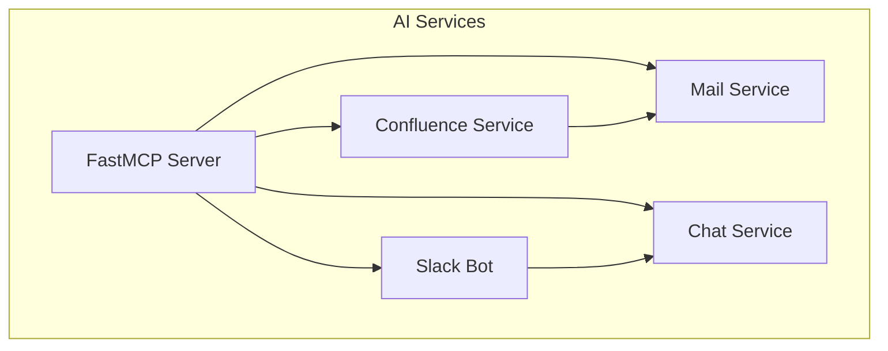
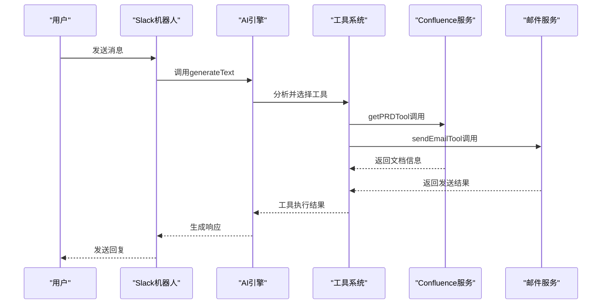
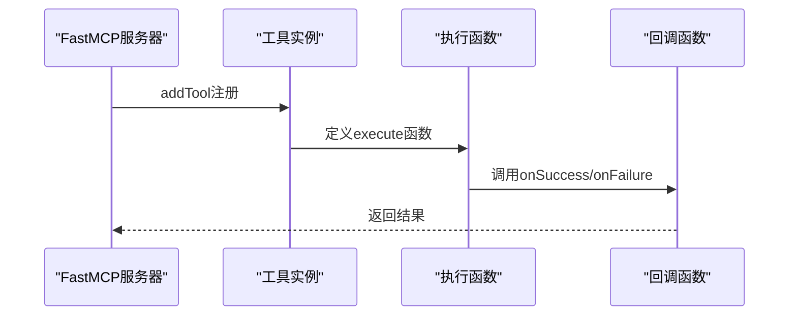
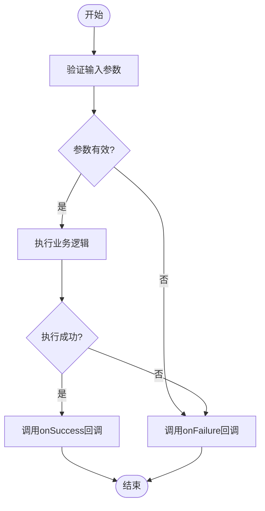
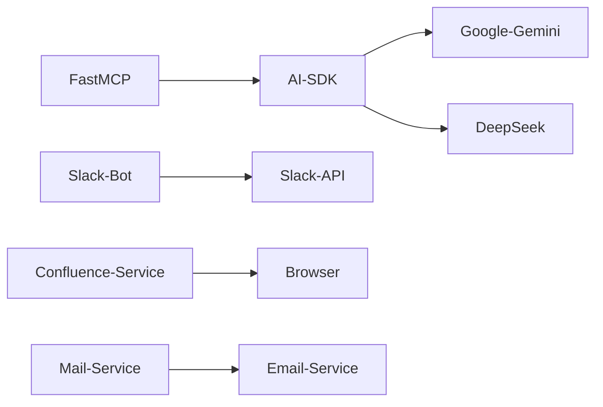

# 上下文管理机制

<cite>
**本文档中引用的文件**  
- [mcp.ts](file://packages/ai/src/services/confluence/mcp.ts)
- [mcp.ts](file://packages/ai/src/services/mails/mcp.ts)
- [index.ts](file://packages/ai/src/index.ts)
- [chat/index.ts](file://packages/ai/src/services/chat/index.ts)
- [bot.ts](file://packages/ai/src/services/slack/bot.ts)
- [tools/index.ts](file://packages/ai/src/services/slack/tools/index.ts)
- [getPRD.ts](file://packages/ai/src/services/slack/tools/getPRD.ts)
- [sendEmail.ts](file://packages/ai/src/services/slack/tools/sendEmail.ts)
- [data-factories.md](file://_bmad/bmm/testarch/knowledge/data-factories.md)
- [email-auth.md](file://_bmad/bmm/testarch/knowledge/email-auth.md)
</cite>

## 目录
1. [引言](#引言)
2. [项目结构](#项目结构)
3. [核心组件](#核心组件)
4. [架构概述](#架构概述)
5. [详细组件分析](#详细组件分析)
6. [依赖分析](#依赖分析)
7. [性能考虑](#性能考虑)
8. [故障排除指南](#故障排除指南)
9. [结论](#结论)

## 引言
本文档详细说明了MCP协议中的上下文管理功能，重点描述会话状态的存储结构（SessionContext），包括对话历史、用户偏好和环境变量等数据的管理方式。同时解释上下文生命周期管理机制，如何在多轮对话中保持状态一致性，以及超时和清理策略。此外，还描述了上下文如何在不同AI服务调用之间传递和继承，以支持跨服务的连贯交互，并讨论上下文序列化和持久化的潜在扩展点。

## 项目结构
本项目的上下文管理功能主要分布在AI服务包中，特别是与MCP协议集成的部分。核心上下文管理逻辑位于`packages/ai/src`目录下，涉及多个服务模块之间的协作。

**Diagram sources**
- [index.ts](file://packages/ai/src/index.ts)
- [mcp.ts](file://packages/ai/src/services/confluence/mcp.ts)

**Section sources**
- [index.ts](file://packages/ai/src/index.ts)
- [mcp.ts](file://packages/ai/src/services/confluence/mcp.ts)

## 核心组件
系统的核心组件包括FastMCP服务器、Confluence服务、邮件服务、聊天服务和Slack机器人。这些组件通过定义良好的工具接口进行通信，上下文信息在调用链中传递。

**Section sources**
- [index.ts](file://packages/ai/src/index.ts)
- [mcp.ts](file://packages/ai/src/services/confluence/mcp.ts)
- [mcp.ts](file://packages/ai/src/services/mails/mcp.ts)

## 架构概述
系统采用基于工具调用的架构模式，其中FastMCP作为核心服务器管理各种AI工具。上下文管理主要通过函数参数和回调机制实现，在不同服务间传递状态信息。

**Diagram sources**
- [bot.ts](file://packages/ai/src/services/slack/bot.ts)
- [tools/index.ts](file://packages/ai/src/services/slack/tools/index.ts)

## 详细组件分析

### MCP服务组件分析
MCP服务组件通过FastMCP框架提供工具注册机制，每个工具都有明确的输入输出模式和执行逻辑。上下文信息通过工具执行时的参数传递。

#### 对于API/服务组件：

**Diagram sources**
- [mcp.ts](file://packages/ai/src/services/confluence/mcp.ts)
- [mcp.ts](file://packages/ai/src/services/mails/mcp.ts)

### Slack工具组件分析
Slack工具组件实现了具体的业务功能，如获取PRD文档和发送邮件。这些工具通过回调函数机制与Slack机器人通信，实现了上下文的传递和状态管理。

#### 对于复杂逻辑组件：

**Diagram sources**
- [getPRD.ts](file://packages/ai/src/services/slack/tools/getPRD.ts)
- [sendEmail.ts](file://packages/ai/src/services/slack/tools/sendEmail.ts)

**Section sources**
- [getPRD.ts](file://packages/ai/src/services/slack/tools/getPRD.ts)
- [sendEmail.ts](file://packages/ai/src/services/slack/tools/sendEmail.ts)

## 依赖分析
系统各组件之间存在明确的依赖关系，上下文管理依赖于AI SDK提供的工具调用机制和FastMCP的服务器框架。

**Diagram sources**
- [index.ts](file://packages/ai/src/index.ts)
- [bot.ts](file://packages/ai/src/services/slack/bot.ts)

**Section sources**
- [index.ts](file://packages/ai/src/index.ts)
- [bot.ts](file://packages/ai/src/services/slack/bot.ts)

## 性能考虑
上下文管理的性能主要受网络延迟和API调用次数的影响。建议合理使用缓存机制减少重复调用，并优化工具选择算法以提高响应速度。

## 故障排除指南
当遇到上下文管理问题时，可以检查以下方面：
- 确认FastMCP服务器正常运行
- 检查环境变量配置是否正确
- 验证API密钥的有效性
- 查看日志输出以定位具体错误

**Section sources**
- [data-factories.md](file://_bmad/bmm/testarch/knowledge/data-factories.md)
- [email-auth.md](file://_bmad/bmm/testarch/knowledge/email-auth.md)

## 结论
本系统通过FastMCP框架和AI SDK的工具调用机制实现了有效的上下文管理。虽然没有显式的SessionContext对象，但通过函数参数、回调机制和状态传递实现了类似的功能。未来可以考虑引入更正式的会话管理机制来增强系统的可维护性和扩展性。