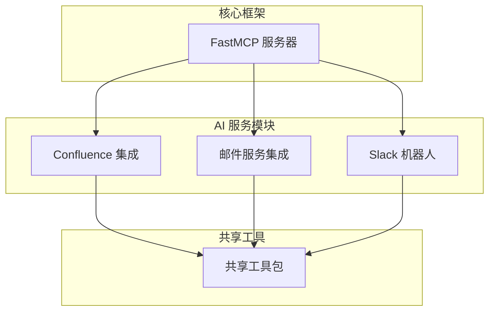
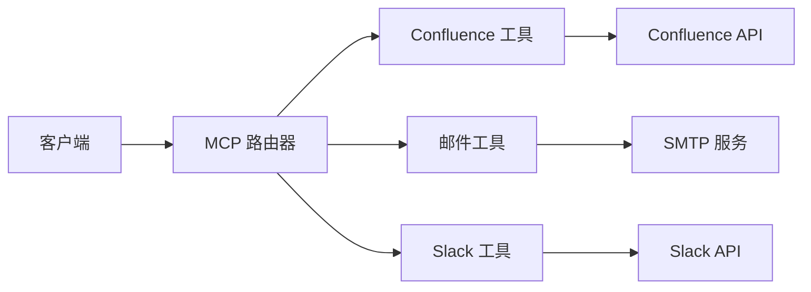
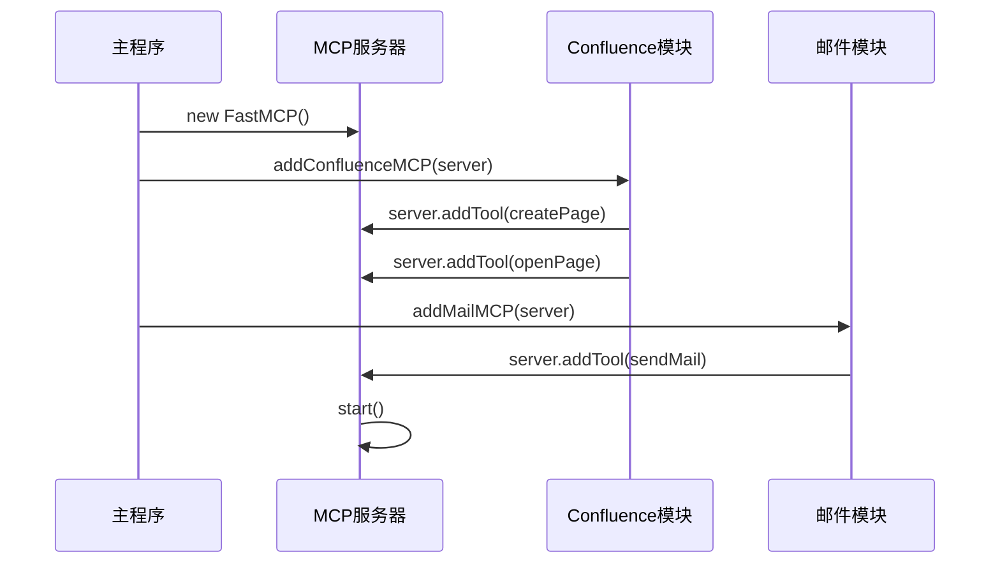
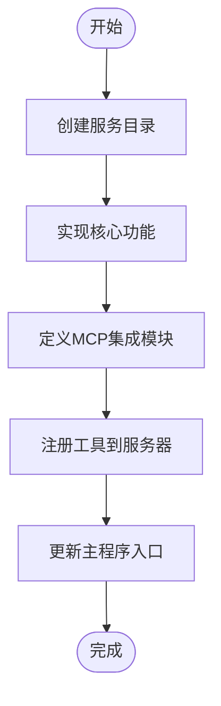
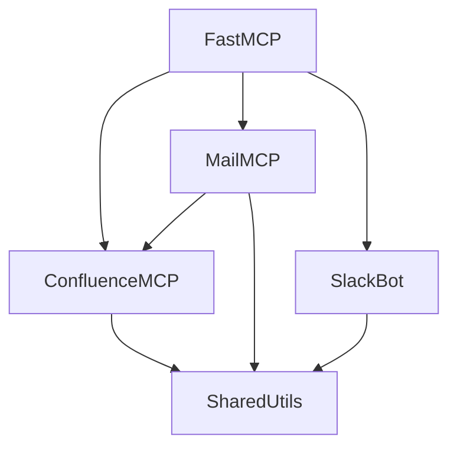

# 扩展性设计

<cite>
**本文档中引用的文件**  
- [index.ts](file://packages/ai/src/index.ts)
- [mcp.ts](file://packages/ai/src/services/confluence/mcp.ts)
- [mcp.ts](file://packages/ai/src/services/mails/mcp.ts)
- [confluence/index.ts](file://packages/ai/src/services/confluence/index.ts)
- [mails/mcp.ts](file://packages/ai/src/services/mails/mcp.ts)
- [slack/bot.ts](file://packages/ai/src/services/slack/bot.ts)
- [tools/index.ts](file://packages/ai/src/services/slack/tools/index.ts)
- [createContent.ts](file://packages/ai/src/services/confluence/createContent.ts)
- [getContent.ts](file://packages/ai/src/services/confluence/getContent.ts)
</cite>

## 目录
1. [引言](#引言)
2. [项目结构](#项目结构)
3. [核心组件](#核心组件)
4. [架构概述](#架构概述)
5. [详细组件分析](#详细组件分析)
6. [依赖分析](#依赖分析)
7. [性能考虑](#性能考虑)
8. [故障排除指南](#故障排除指南)
9. [结论](#结论)

## 引言
本文档详细说明了MCP协议的扩展性设计，重点介绍其插件化架构如何通过注册新的处理器（Handler）来支持额外的AI服务或工具。文档将解释扩展接口的契约要求，包括必须实现的方法和事件，并提供分步指南，演示如何添加一个新的AI服务集成，从接口定义、实现类编写到注册到MCP路由器的完整流程。同时讨论配置管理机制，以及如何通过配置文件启用或禁用特定扩展，确保向后兼容性，保证新扩展不影响现有功能的稳定性。

## 项目结构
该项目采用模块化设计，核心AI功能位于`packages/ai`目录下，通过FastMCP框架实现MCP协议的扩展能力。不同服务（如Confluence、邮件、Slack）作为独立模块实现，并通过统一的接口注册到MCP服务器。配置和工具分布在各个子包中，支持灵活的集成和扩展。

**图示来源**  
- [index.ts](file://packages/ai/src/index.ts#L7-L17)
- [mcp.ts](file://packages/ai/src/services/confluence/mcp.ts#L8-L39)
- [mcp.ts](file://packages/ai/src/services/mails/mcp.ts#L18-L27)

**节来源**  
- [index.ts](file://packages/ai/src/index.ts)
- [mcp.ts](file://packages/ai/src/services/confluence/mcp.ts)
- [mcp.ts](file://packages/ai/src/services/mails/mcp.ts)

## 核心组件
MCP协议的核心扩展机制基于`FastMCP`类，通过`addTool`方法注册新的功能工具。每个工具包含名称、描述、参数定义和执行逻辑，实现了松耦合的插件架构。服务模块通过导出`addXXXMCP`函数来封装注册逻辑，确保一致性和可维护性。

**节来源**  
- [index.ts](file://packages/ai/src/index.ts#L7-L17)
- [mcp.ts](file://packages/ai/src/services/confluence/mcp.ts#L8-L39)

## 架构概述
MCP协议采用基于工具（Tool）的插件架构，允许动态注册和管理AI服务。核心服务器负责路由请求，而各个服务模块独立实现具体功能并通过标准化接口注册。这种设计实现了关注点分离，使得新服务的集成变得简单且安全。

**图示来源**  
- [index.ts](file://packages/ai/src/index.ts#L7-L17)
- [mcp.ts](file://packages/ai/src/services/confluence/mcp.ts#L8-L39)
- [mcp.ts](file://packages/ai/src/services/mails/mcp.ts#L18-L27)

## 详细组件分析

### MCP扩展机制分析
MCP协议的扩展性通过函数式注册模式实现，每个服务模块提供一个注册函数，将工具添加到MCP服务器实例中。这种设计模式确保了低耦合和高内聚。

#### 对于服务组件：

**图示来源**  
- [index.ts](file://packages/ai/src/index.ts#L7-L17)
- [mcp.ts](file://packages/ai/src/services/confluence/mcp.ts#L8-L39)
- [mcp.ts](file://packages/ai/src/services/mails/mcp.ts#L18-L27)

**节来源**  
- [index.ts](file://packages/ai/src/index.ts#L1-L20)
- [mcp.ts](file://packages/ai/src/services/confluence/mcp.ts#L1-L40)
- [mcp.ts](file://packages/ai/src/services/mails/mcp.ts#L1-L28)

### 扩展接口契约
要创建新的MCP扩展，必须遵循以下契约要求：
- 实现一个注册函数，接受`FastMCP`实例作为参数
- 使用`server.addTool`方法注册至少一个工具
- 每个工具必须包含：名称（name）、描述（description）、参数模式（parameters）和执行函数（execute）
- 参数模式使用Zod库定义，确保类型安全和输入验证

**节来源**  
- [mcp.ts](file://packages/ai/src/services/confluence/mcp.ts#L8-L39)
- [mcp.ts](file://packages/ai/src/services/mails/mcp.ts#L18-L27)

### 添加新AI服务集成的分步指南
以下是添加新AI服务集成的标准流程：

1. **创建服务目录**：在`packages/ai/src/services/`下创建新服务目录
2. **实现核心功能**：编写服务的主要逻辑函数
3. **定义MCP集成模块**：创建`mcp.ts`文件，导出注册函数
4. **注册工具**：在注册函数中使用`server.addTool`添加功能
5. **更新主程序**：在`index.ts`中导入并调用新注册函数

**图示来源**  
- [index.ts](file://packages/ai/src/index.ts#L7-L17)
- [mcp.ts](file://packages/ai/src/services/confluence/mcp.ts#L8-L39)

**节来源**  
- [index.ts](file://packages/ai/src/index.ts#L1-L20)
- [mcp.ts](file://packages/ai/src/services/confluence/mcp.ts#L1-L40)

## 依赖分析
MCP扩展架构的依赖关系清晰且层次分明，核心框架依赖于具体服务实现，而服务实现可以共享通用工具。

**图示来源**  
- [index.ts](file://packages/ai/src/index.ts#L7-L17)
- [mcp.ts](file://packages/ai/src/services/confluence/mcp.ts#L8-L39)
- [mcp.ts](file://packages/ai/src/services/mails/mcp.ts#L18-L27)
- [bot.ts](file://packages/ai/src/services/slack/bot.ts#L7-L12)

**节来源**  
- [index.ts](file://packages/ai/src/index.ts#L3-L5)
- [mcp.ts](file://packages/ai/src/services/confluence/mcp.ts#L4)
- [mcp.ts](file://packages/ai/src/services/mails/mcp.ts#L4)
- [bot.ts](file://packages/ai/src/services/slack/bot.ts#L3)

## 性能考虑
MCP扩展架构在设计时考虑了性能因素：
- 懒加载模式：服务模块仅在需要时导入
- 异步执行：所有工具执行都是异步的，避免阻塞主线程
- 缓存机制：共享工具包提供了基础的缓存支持
- 错误隔离：每个工具独立执行，错误不会影响其他功能

## 故障排除指南
当MCP扩展出现问题时，可参考以下常见问题的解决方案：

**节来源**  
- [mcp.ts](file://packages/ai/src/services/confluence/mcp.ts#L15-L18)
- [mcp.ts](file://packages/ai/src/services/mails/mcp.ts#L7-L15)

## 结论
MCP协议的扩展性设计通过清晰的插件化架构实现了高度的灵活性和可维护性。基于`FastMCP`框架的工具注册机制，结合函数式编程模式，使得新AI服务的集成变得简单而可靠。通过遵循定义良好的扩展接口契约，开发者可以轻松地添加新功能，同时确保向后兼容性和系统稳定性。这种设计不仅支持当前的需求，也为未来的功能扩展奠定了坚实的基础。