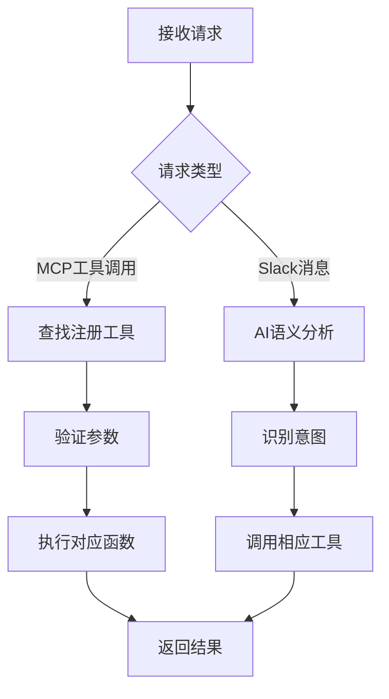
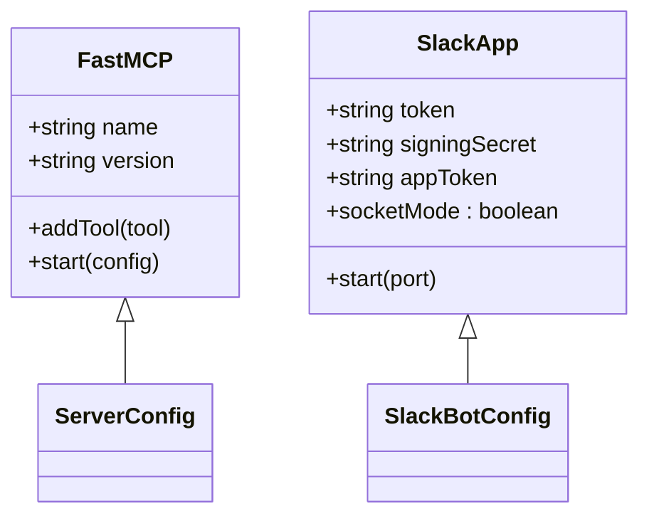
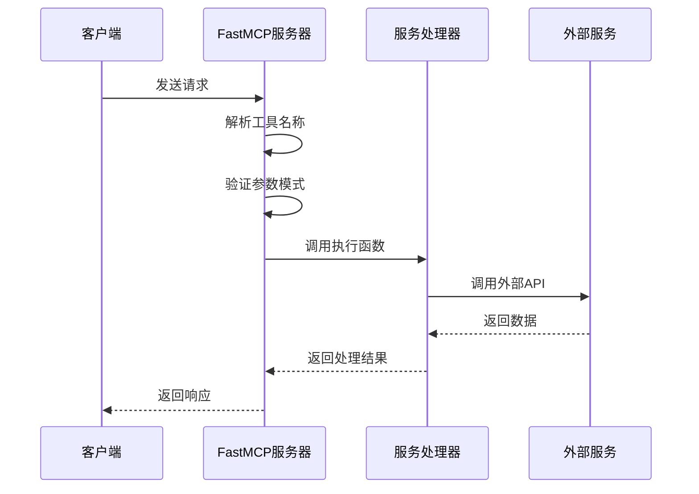

# 请求路由机制

<cite>
**本文档中引用的文件**  
- [index.ts](file://packages/ai/src/index.ts)
- [mcp.ts](file://packages/ai/src/services/confluence/mcp.ts)
- [mcp.ts](file://packages/ai/src/services/mails/mcp.ts)
- [mcp.ts](file://packages/ai/src/services/swagger/mcp.ts)
- [bot.ts](file://packages/ai/src/services/slack/bot.ts)
- [index.ts](file://packages/ai/src/services/slack/tools/index.ts)
- [createContent.ts](file://packages/ai/src/services/confluence/createContent.ts)
- [getContent.ts](file://packages/ai/src/services/confluence/getContent.ts)
- [index.ts](file://packages/ai/src/services/confluence/index.ts)
- [index.ts](file://packages/ai/src/services/swagger/index.ts)
</cite>

## 目录
1. [引言](#引言)
2. [路由决策逻辑](#路由决策逻辑)
3. [路由表注册机制](#路由表注册机制)
4. [服务发现流程](#服务发现流程)
5. [默认处理器配置](#默认处理器配置)
6. [参数转换与适配策略](#参数转换与适配策略)
7. [请求处理完整流程](#请求处理完整流程)
8. [路由性能优化](#路由性能优化)
9. [结论](#结论)

## 引言
本文档详细描述了MCP协议的请求路由机制，涵盖路由决策逻辑、服务注册与发现、参数适配以及性能优化策略。系统通过FastMCP框架实现多服务集成，支持Confluence、邮件、Swagger和Slack等多种请求类型，根据请求内容智能路由到相应的AI服务处理器。

## 路由决策逻辑
MCP协议的路由决策基于请求类型和参数进行智能匹配。系统通过`FastMCP`服务器实例接收请求，并根据注册的工具名称和参数模式进行路由。当请求到达时，系统会解析其工具名称（如`createReleasePage`、`sendReleaseMail`、`getSwaggerJson`等），并将其映射到对应的执行函数。

对于Slack消息，系统采用自然语言处理方式分析用户输入内容，通过Gemini模型识别意图，并动态调用相应的工具。这种基于语义理解的路由方式使得系统能够处理非结构化输入，提高了灵活性和用户体验。

**中文(中文)**
- **路由决策逻辑**

**Section sources**
- [index.ts](file://packages/ai/src/index.ts#L7-L20)
- [bot.ts](file://packages/ai/src/services/slack/bot.ts#L72-L78)

## 路由表注册机制
路由表通过模块化方式注册，每个服务模块提供一个注册函数，将自身工具添加到FastMCP服务器实例中。这种设计实现了关注点分离，便于扩展和维护。

Confluence服务通过`addConfluenceMCP`函数注册两个工具：`createReleasePage`用于创建发布页面，`openConfluence`用于打开指定ID的Confluence页面。邮件服务通过`addMailMCP`函数注册`sendReleaseMail`工具，用于发送发布邮件。Swagger服务通过`addSwaggerMCP`函数注册`getSwaggerJson`工具，用于获取Swagger JSON数据。

所有服务注册均在主入口文件`index.ts`中完成，通过导入各服务的注册函数并传入服务器实例来完成注册过程。

**中文(中文)**
- **路由表注册机制**

**Section sources**
- [mcp.ts](file://packages/ai/src/services/confluence/mcp.ts#L8-L39)
- [mcp.ts](file://packages/ai/src/services/mails/mcp.ts#L18-L27)
- [mcp.ts](file://packages/ai/src/services/swagger/mcp.ts#L6-L19)
- [index.ts](file://packages/ai/src/index.ts#L3-L13)

## 服务发现流程
服务发现流程采用静态注册与动态执行相结合的方式。在应用启动时，所有服务通过调用`server.addTool`方法向FastMCP服务器注册自己的工具，包括工具名称、描述、参数模式和执行函数。

当请求到达时，FastMCP框架根据请求中的工具名称查找已注册的工具，并验证请求参数是否符合预定义的Zod模式。验证通过后，框架调用对应的执行函数处理请求。

对于Slack集成，服务发现更加动态。系统监听所有消息事件，使用AI模型分析消息内容，自动识别用户意图并调用相应的工具函数。这种方式实现了基于语义的服务发现，无需用户精确指定工具名称。

**Diagram sources**
- [index.ts](file://packages/ai/src/index.ts#L7-L20)
- [bot.ts](file://packages/ai/src/services/slack/bot.ts#L72-L78)

**中文(中文)**
- **服务发现流程**

**Section sources**
- [mcp.ts](file://packages/ai/src/services/confluence/mcp.ts#L9-L38)
- [mcp.ts](file://packages/ai/src/services/mails/mcp.ts#L19-L26)
- [bot.ts](file://packages/ai/src/services/slack/bot.ts#L72-L78)

## 默认处理器配置
系统通过在`index.ts`文件中创建`FastMCP`服务器实例来配置默认行为。服务器配置包括名称"Prime Workflow"和版本号"0.0.1"，并通过`transportType: 'stdio'`设置标准输入输出传输类型。

对于Slack集成，系统配置了Bot Token、Signing Secret和App Token等认证信息，并通过Socket Mode实现实时通信。错误处理机制通过创建spinner指示器来可视化启动过程，成功时显示"Slack Bot started"，失败时显示"Slack Bot failed to start"并输出错误详情。

**Diagram sources**
- [index.ts](file://packages/ai/src/index.ts#L7-L17)
- [bot.ts](file://packages/ai/src/services/slack/bot.ts#L7-L12)

**中文(中文)**
- **默认处理器配置**

**Section sources**
- [index.ts](file://packages/ai/src/index.ts#L7-L17)
- [bot.ts](file://packages/ai/src/services/slack/bot.ts#L7-L12)

## 参数转换与适配策略
系统采用Zod库进行参数验证和类型安全检查，确保不同后端服务的输入格式兼容性。每个注册工具都定义了明确的参数模式，如Confluence服务要求`id`为数字类型，Swagger服务要求`APIUrl`为字符串类型。

在服务间调用时，系统实现了参数适配逻辑。例如，邮件服务`sendReleaseMail`在执行前会先调用Confluence服务的`fuzzySearchContent`函数，将ID参数转换为实际内容对象，然后再进行邮件发送操作。

对于Swagger服务，系统实现了URL到JSON Schema的映射适配。`getJsonURL`函数根据输入URL的路径前缀自动选择对应的Swagger JSON端点，实现了请求参数到服务端点的智能映射。

**中文(中文)**
- **参数转换与适配策略**

**Section sources**
- [mcp.ts](file://packages/ai/src/services/confluence/mcp.ts#L12-L14)
- [mcp.ts](file://packages/ai/src/services/mails/mcp.ts#L22-L24)
- [mcp.ts](file://packages/ai/src/services/swagger/mcp.ts#L11-L12)
- [index.ts](file://packages/ai/src/services/swagger/index.ts#L7-L11)

## 请求处理完整流程
从请求接收到服务调用的完整路径包括多个阶段：请求接收、路由匹配、参数验证、服务调用和结果返回。系统通过FastMCP框架和Slack Bolt框架分别处理MCP协议请求和Slack消息。

对于MCP工具调用，流程为：接收JSON-RPC格式请求 → 解析工具名称 → 查找注册工具 → 验证参数 → 执行函数 → 返回结果。对于Slack消息，流程为：接收消息事件 → AI语义分析 → 工具选择 → 参数提取 → 执行工具 → 发送响应。

**Diagram sources**
- [index.ts](file://packages/ai/src/index.ts#L15-L17)
- [mcp.ts](file://packages/ai/src/services/confluence/mcp.ts#L15-L17)
- [mcp.ts](file://packages/ai/src/services/mails/mcp.ts#L12-L15)

**中文(中文)**
- **请求处理完整流程**

**Section sources**
- [index.ts](file://packages/ai/src/index.ts#L15-L17)
- [mcp.ts](file://packages/ai/src/services/confluence/mcp.ts#L15-L17)
- [mcp.ts](file://packages/ai/src/services/mails/mcp.ts#L12-L15)

## 路由性能优化
系统通过多种策略优化路由性能。首先，采用模块化注册机制，避免运行时服务发现开销，所有工具在启动时一次性注册完成。其次，使用轻量级Zod库进行参数验证，提供高效的类型检查。

对于频繁访问的服务，系统实现了隐式缓存。例如，Confluence客户端实例在模块加载时创建并复用，避免了重复的认证开销。Swagger服务通过预定义的URL映射表快速定位JSON端点，减少了网络探测时间。

错误处理机制也经过优化，采用快速失败策略。在参数验证阶段即进行严格检查，避免无效请求进入执行流程。同时，所有外部API调用都包含适当的错误处理，确保单个服务故障不会影响整体系统稳定性。

**中文(中文)**
- **路由性能优化**

**Section sources**
- [index.ts](file://packages/ai/src/index.ts#L7-L20)
- [mcp.ts](file://packages/ai/src/services/confluence/mcp.ts#L1-L39)
- [index.ts](file://packages/ai/src/services/confluence/index.ts#L13-L22)

## 结论
MCP协议的请求路由机制采用模块化、可扩展的设计，通过FastMCP框架实现了多服务集成。系统支持基于工具名称的精确路由和基于AI语义的智能路由两种模式，能够处理结构化和非结构化请求。

路由表注册机制清晰分离了服务定义和注册过程，便于维护和扩展。参数验证使用Zod库确保类型安全，而服务间调用通过适配器模式实现无缝集成。性能优化策略包括启动时注册、连接复用和快速失败，确保了系统的高效稳定运行。

该路由机制为AI驱动的工作流自动化提供了坚实基础，能够灵活应对多种业务场景需求。

**中文(中文)**
- **结论**