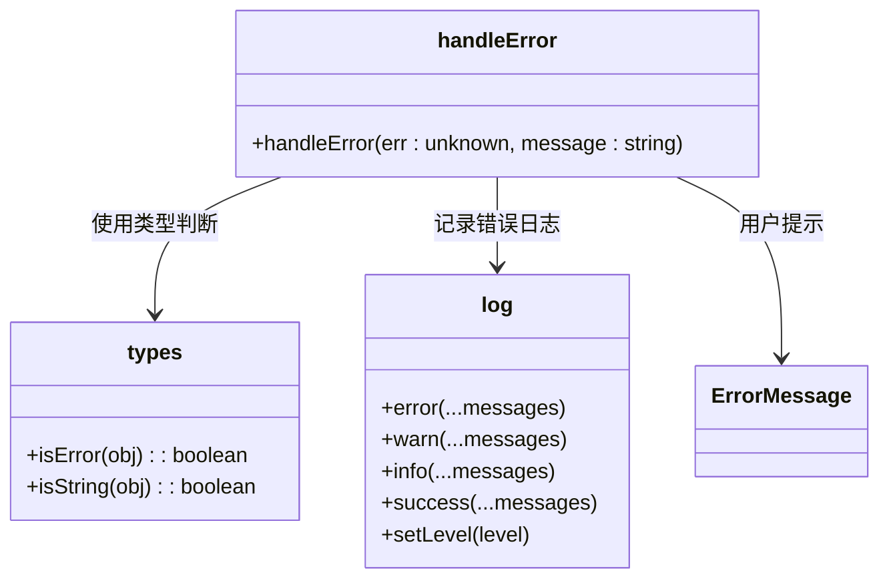

# 错误处理与容错

<cite>
**本文档引用的文件**  
- [error.ts](file://packages/shared/src/utils/error.ts)
- [log.ts](file://packages/shared/src/utils/log.ts)
- [types.ts](file://packages/shared/src/utils/types.ts)
- [mcp.ts](file://packages/ai/src/services/confluence/mcp.ts)
- [mcp.ts](file://packages/ai/src/services/mails/mcp.ts)
- [mcp.ts](file://packages/ai/src/services/swagger/mcp.ts)
- [error.ts](file://aicommits/src/utils/error.ts)
</cite>

## 目录
1. [引言](#引言)
2. [错误分类与标准化](#错误分类与标准化)
3. [MCP协议中的错误处理策略](#mcp协议中的错误处理策略)
4. [重试机制与容错设计](#重试机制与容错设计)
5. [错误封装与日志记录](#错误封装与日志记录)
6. [监控与追踪](#监控与追踪)
7. [总结](#总结)

## 引言
本项目构建于MCP（Modular Command Protocol）协议之上，支持多个AI服务（如Confluence、邮件、Swagger等）的集成与调用。在分布式系统中，网络错误、服务不可用、认证失败等异常情况不可避免。因此，建立统一、健壮的错误处理机制是保障系统稳定性的关键。本文档系统阐述了MCP协议下的错误处理体系，涵盖错误捕获、分类、标准化、重试、降级及监控等核心方面。

## 错误分类与标准化

在MCP协议中，不同AI服务返回的错误信息格式各异，需通过统一的错误处理机制将其映射为标准化的错误码和消息格式，以便上层应用一致处理。

### 错误类型识别
系统通过工具函数对错误类型进行判断，主要分为：
- **Error实例**：JavaScript原生Error对象或其子类
- **字符串错误**：直接返回的错误描述信息
- **其他类型**：如null、undefined或自定义对象

该逻辑在`packages/shared/src/utils/types.ts`中通过`isError`和`isString`函数实现，确保能够准确识别不同类型的错误输入。

### 统一错误响应格式
无论底层服务返回何种形式的错误，系统均通过`handleError`函数将其封装为统一格式的用户提示信息。例如：
- 当接收到Error实例时，提取其`message`字段并附加上下文信息
- 当接收到字符串时，直接拼接为可读性更强的错误消息
- 对于未知类型，则使用日志系统输出详细信息

这种标准化处理提升了用户体验的一致性，并简化了前端错误展示逻辑。

**Section sources**
- [types.ts](file://packages/shared/src/utils/types.ts#L15-L16)
- [error.ts](file://packages/shared/src/utils/error.ts#L5-L13)

## MCP协议中的错误处理策略

MCP协议通过工具注册机制将外部服务功能暴露给AI代理。每个工具在执行过程中都需具备完善的错误处理能力。

### 网络请求错误处理
以邮件服务为例，在调用`sendReleaseMail`发送发布邮件时，首先尝试从Confluence获取内容。若未找到对应页面，则返回预定义的错误消息：

```text
"Not Found Confluence Page, Please Check the ID or Create the Release Confluence Page"
```

若邮件发送失败，则捕获底层错误并返回结构化信息：

```text
"Failed to send mail, Message: ${error.message}"
```

这种方式既提供了明确的操作指引，又保留了原始错误细节用于调试。

### 服务不可用与认证失败
在Swagger服务中，调用`getSwaggerJson`获取API文档时，若网络请求失败或返回非预期数据，Promise链会自动捕获异常并向上抛出。虽然当前实现未显式处理HTTP状态码，但可通过扩展`getJSON`函数增加对401（未授权）、503（服务不可用）等状态的识别，并映射为特定错误码。

类似地，Confluence服务在打开页面前先执行模糊搜索，避免因ID错误导致的无效跳转。

**Section sources**
- [mcp.ts](file://packages/ai/src/services/mails/mcp.ts#L7-L15)
- [mcp.ts](file://packages/ai/src/services/swagger/mcp.ts#L14-L16)
- [mcp.ts](file://packages/ai/src/services/confluence/mcp.ts#L27-L28)

## 重试机制与容错设计

当前代码库中尚未显式实现重试机制或熔断器模式，但已具备构建此类功能的基础条件。

### 潜在重试场景
以下操作适合引入指数退避重试策略：
- 网络请求（如获取Swagger JSON、发送邮件）
- 外部API调用（如Confluence内容创建）
- 数据库读写操作

可通过封装`promise`工具函数，结合`isError`类型判断，实现通用的重试逻辑。例如定义`withRetry(fn, maxAttempts, delay)`函数，在调用失败时自动重试直至成功或达到最大次数。

### 降级策略建议
当关键服务（如邮件通知）不可用时，可采取以下降级措施：
- 记录待发送邮件至本地队列，待服务恢复后补发
- 使用备用通信渠道（如Slack消息）替代
- 返回成功状态但标记“非实时送达”，保证主流程不中断

这些策略可通过在`executeSendReleaseMail`等函数中引入条件判断和备用路径来实现。

```mermaid
flowchart TD
A[开始发送邮件] --> B{Confluence内容是否存在?}
B --> |否| C[返回错误: 页面未找到]
B --> |是| D[调用邮件服务]
D --> E{发送成功?}
E --> |是| F[返回成功]
E --> |否| G[记录到本地队列]
G --> H[返回"已入队，稍后重试"]
```

**Diagram sources**
- [mcp.ts](file://packages/ai/src/services/mails/mcp.ts#L7-L15)

**Section sources**
- [mcp.ts](file://packages/ai/src/services/mails/mcp.ts#L7-L15)

## 错误封装与日志记录

系统采用分层的日志与错误封装机制，兼顾开发调试与用户提示需求。

### 错误处理函数
`handleError`函数位于`packages/shared/src/utils/error.ts`，作为统一的错误处理入口。它接收原始错误和上下文消息，根据类型选择合适的展示方式：
- 使用`ErrorMessage`组件向用户展示友好提示
- 调用`log.error`记录详细错误信息至控制台

该函数屏蔽了底层差异，使各模块可一致地处理异常。

### 日志级别与输出
日志系统基于Winston构建，定义了多个自定义级别：error、warn、success、info、verbose、silly、timing。通过`log`对象暴露统一接口，支持：
- 彩色输出（通过Chalk）
- 结构化日志（JSON.stringify非字符串值）
- 控制台交互（清屏、蜂鸣等）

日志级别可通过`setLevel`动态调整，便于生产环境与调试模式切换。



**Diagram sources**
- [error.ts](file://packages/shared/src/utils/error.ts#L5-L13)
- [log.ts](file://packages/shared/src/utils/log.ts#L121-L129)
- [types.ts](file://packages/shared/src/utils/types.ts#L15-L16)

**Section sources**
- [error.ts](file://packages/shared/src/utils/error.ts#L5-L13)
- [log.ts](file://packages/shared/src/utils/log.ts#L121-L129)

## 监控与追踪

虽然当前系统未集成集中式监控平台，但已具备良好的本地追踪能力。

### 错误位置追踪
通过结构化的日志输出，可快速定位错误发生的位置。例如：
- 在MCP工具执行函数中添加`log.info("Starting mail send process")`
- 在关键分支点记录状态变化
- 捕获异常时输出调用栈（如`aicommits`包中的错误处理器）

### 错误频率统计
可通过日志文件分析工具（如grep、awk）统计特定错误消息的出现频率。例如：
```bash
grep "Failed to send mail" logs/app.log | wc -l
```

未来可引入Sentry、Datadog等监控服务，实现错误聚合、报警和趋势分析。

### 建议的监控增强
1. **唯一请求ID**：为每次MCP调用分配唯一ID，贯穿整个调用链
2. **性能指标采集**：记录各工具执行时间，识别慢操作
3. **错误码分类统计**：按错误类型聚合，识别高频问题
4. **用户行为关联**：将错误与用户操作序列关联，辅助复现问题

**Section sources**
- [log.ts](file://packages/shared/src/utils/log.ts#L96-L148)
- [error.ts](file://aicommits/src/utils/error.ts#L8-L21)

## 总结
本项目通过`handleError`和`log`等工具建立了基础的错误处理框架，实现了错误的统一捕获与标准化输出。在MCP协议层面，各服务模块已具备基本的错误判断与反馈能力。然而，在重试机制、熔断器、降级策略等高级容错模式上仍有待完善。建议后续引入通用重试库、集成监控平台，并建立错误码体系，以进一步提升系统的健壮性与可观测性。