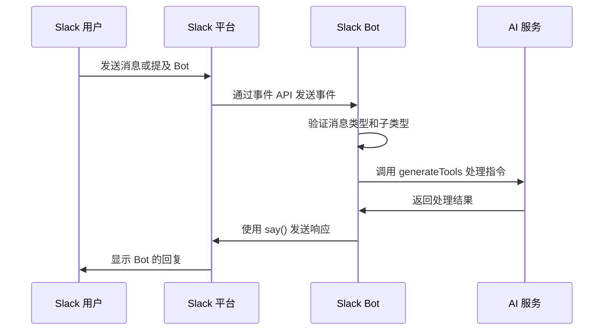
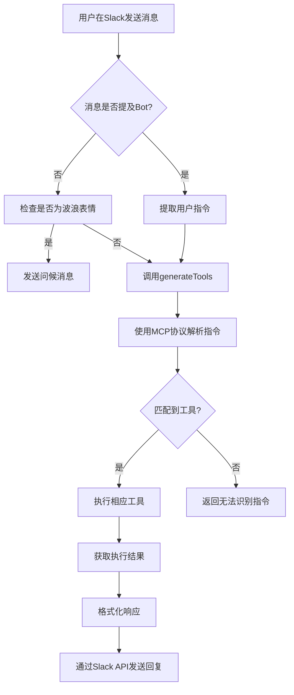
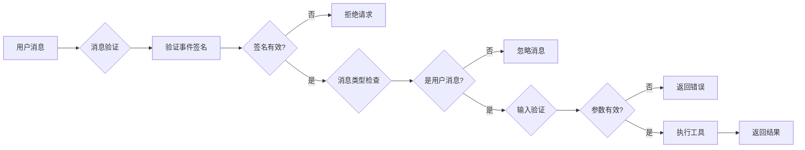

# Slack 集成

<cite>
**本文档中引用的文件**  
- [bot.ts](file://packages/ai/src/services/slack/bot.ts)
- [tools/index.ts](file://packages/ai/src/services/slack/tools/index.ts)
- [tools/getPRD.ts](file://packages/ai/src/services/slack/tools/getPRD.ts)
- [tools/sendEmail.ts](file://packages/ai/src/services/slack/tools/sendEmail.ts)
- [index.ts](file://packages/ai/src/index.ts)
- [mcp.ts](file://packages/ai/src/services/mails/mcp.ts)
- [getContent.ts](file://packages/ai/src/services/confluence/getContent.ts)
- [.env.example](file://packages/ai/.env.example)
</cite>

## 目录
1. [简介](#简介)
2. [Slack Bot 实现机制](#slack-bot-实现机制)
3. [MCP 协议在消息处理中的应用](#mcp-协议在消息处理中的应用)
4. [Slack 工具集成机制](#slack-工具集成机制)
5. [实际使用场景示例](#实际使用场景示例)
6. [安全性考虑](#安全性考虑)
7. [结论](#结论)

## 简介

nemo-cli 通过集成 Slack 平台，实现了在 Slack 中直接调用 AI 命令的功能。该集成基于 `@slack/bolt` 框架构建 Slack Bot，允许用户在 Slack 频道中通过自然语言指令触发 AI 服务。系统利用 MCP（Model Control Protocol）协议协调不同 AI 工具的调用，并通过结构化工具注册机制支持扩展功能，如生成 PRD 文档和发送邮件。本文档详细说明了这一集成的技术实现、工作流程和安全机制。

**Section sources**
- [index.ts](file://packages/ai/src/index.ts#L1-L20)
- [bot.ts](file://packages/ai/src/services/slack/bot.ts#L1-L112)

## Slack Bot 实现机制

nemo-cli 的 Slack 集成核心是基于 `@slack/bolt` 框架实现的 Slack 应用程序。该应用程序通过环境变量配置 Slack Bot 的认证信息，包括 `SLACK_BOT_TOKEN`、`SLACK_SIGNING_SECRET` 和 `SLACK_APP_TOKEN`，并采用 Socket Mode 进行实时事件监听。

Slack Bot 的主要事件处理器包括：
- `app.message(':wave:')`：响应用户发送的波浪表情，发送问候消息
- `app.action(ACTION_ID)`：处理按钮点击等交互动作
- `app.message()`：处理普通消息，调用 AI 工具进行响应
- `app.event('app_mention')`：处理对 Bot 的提及事件，提取用户指令并回复

当 Bot 启动时，会监听指定端口（默认 3000），并通过命令行 spinner 显示启动状态。整个流程由 `run()` 函数控制，确保了启动过程的可视化反馈。



**Diagram sources**
- [bot.ts](file://packages/ai/src/services/slack/bot.ts#L1-L112)

**Section sources**
- [bot.ts](file://packages/ai/src/services/slack/bot.ts#L1-L112)

## MCP 协议在消息处理中的应用

MCP（Model Control Protocol）协议在 nemo-cli 的 Slack 集成中扮演着核心角色，负责协调 AI 模型与各种工具之间的交互。当用户在 Slack 中发送消息时，系统通过 MCP 协议解析用户指令，并将其路由到相应的 AI 服务进行处理。

消息处理流程如下：
1. 用户消息被捕获并传递给 `generateTools` 函数
2. 系统使用 Google Generative AI 模型（gemini-2.5-flash）分析消息内容
3. MCP 协议根据消息内容决定调用哪些注册的工具
4. 工具执行结果通过 MCP 协议返回给 Slack Bot
5. Bot 将结果格式化后发送回 Slack 频道

这种基于 MCP 的架构实现了指令解析与工具执行的解耦，使得系统能够灵活地扩展新的 AI 服务和工具。



**Diagram sources**
- [index.ts](file://packages/ai/src/index.ts#L1-L20)
- [tools/index.ts](file://packages/ai/src/services/slack/tools/index.ts#L1-L72)

**Section sources**
- [tools/index.ts](file://packages/ai/src/services/slack/tools/index.ts#L1-L72)
- [index.ts](file://packages/ai/src/index.ts#L1-L20)

## Slack 工具集成机制

nemo-cli 通过模块化的工具注册机制实现了 Slack 中的 AI 功能扩展。所有工具都定义在 `packages/ai/src/services/slack/tools/` 目录下，并通过统一的接口进行注册和调用。

### 工具注册流程

工具集成的核心是 `tools/index.ts` 文件，它负责：
1. 导入所有可用的工具（如 getPRD 和 sendEmail）
2. 创建 Google Generative AI 客户端
3. 定义 `generateTools` 函数，将工具集成到 AI 模型中

每个工具都遵循相同的注册模式：
- 使用 `tool` 函数定义工具
- 提供清晰的描述和输入/输出模式
- 实现 `execute` 方法处理具体逻辑
- 支持成功和失败的回调函数

### getPRD 工具

`getPRDTool` 用于获取需求文档地址。该工具接受一个上线工单 ID 作为输入参数，通过调用 Confluence API 搜索相关文档。实现细节包括：
- 输入验证：确保提供了有效的工单 ID
- 内容搜索：使用 `fuzzySearchContent` 函数在 Confluence 中搜索文档
- 结果处理：返回文档标题和 Web UI 链接
- 错误处理：在未找到内容时提供适当的反馈

### sendEmail 工具

`sendEmailTool` 用于发送上线邮件。该工具同样需要上线工单 ID 作为输入，其工作流程包括：
- 验证输入参数
- 通过 `fuzzySearchContent` 获取相关 Confluence 页面内容
- 调用 `executeSendReleaseMail` 发送邮件
- 处理成功和失败的情况

```mermaid
classDiagram
class SlackBot {
+token : string
+signingSecret : string
+appToken : string
+start() : Promise
+message() : void
+action() : void
+event() : void
}
class Tool {
<<interface>>
+description : string
+inputSchema : ZodSchema
+outputSchema : ZodSchema
+execute() : Promise
}
class getPRDTool {
+description : "获取需求文档地址"
+inputSchema : {id : number}
+outputSchema : {webui : string}
+execute(id) : Promise
+onSuccess(content) : void
+onFailure(error) : void
}
class sendEmailTool {
+description : "发送上线邮件"
+inputSchema : {id : number}
+execute(id) : Promise
+onSuccess(result) : void
+onFailure() : void
}
class MCPProtocol {
+addTool(tool) : void
+parseCommand(command) : Tool
+executeTool(tool, params) : Promise
}
SlackBot --> MCPProtocol : "使用"
MCPProtocol --> Tool : "管理"
Tool <|-- getPRDTool
Tool <|-- sendEmailTool
getPRDTool --> ConfluenceAPI : "调用"
sendEmailTool --> MailService : "调用"
```

**Diagram sources**
- [tools/index.ts](file://packages/ai/src/services/slack/tools/index.ts#L1-L72)
- [tools/getPRD.ts](file://packages/ai/src/services/slack/tools/getPRD.ts#L1-L36)
- [tools/sendEmail.ts](file://packages/ai/src/services/slack/tools/sendEmail.ts#L1-L29)

**Section sources**
- [tools/index.ts](file://packages/ai/src/services/slack/tools/index.ts#L1-L72)
- [tools/getPRD.ts](file://packages/ai/src/services/slack/tools/getPRD.ts#L1-L36)
- [tools/sendEmail.ts](file://packages/ai/src/services/slack/tools/sendEmail.ts#L1-L29)

## 实际使用场景示例

### 生成 PRD 文档

用户可以在 Slack 频道中通过提及 Bot 并提供工单 ID 来请求生成 PRD 文档：

```
@nemo-bot getPRD 12345
```

Bot 将执行以下操作：
1. 解析用户指令，识别 `getPRD` 命令和工单 ID 12345
2. 调用 `getPRDTool` 工具
3. 在 Confluence 中搜索标题包含 "PRIME-12345" 的页面
4. 找到最匹配的文档并获取其链接
5. 在 Slack 中回复用户，包含文档标题和一个"查看页面"按钮

### 发送上线邮件

类似地，用户可以请求发送上线邮件：

```
@nemo-bot sendEmail 12345
```

处理流程包括：
1. 解析指令并验证工单 ID
2. 调用 `sendEmailTool` 工具
3. 在 Confluence 中查找与工单 12345 相关的上线文档
4. 使用获取的内容生成并发送邮件
5. 向用户反馈操作结果（成功或失败）

这些场景展示了如何通过自然语言指令在 Slack 中完成复杂的开发运维任务，极大地提高了团队的工作效率。

**Section sources**
- [tools/getPRD.ts](file://packages/ai/src/services/slack/tools/getPRD.ts#L1-L36)
- [tools/sendEmail.ts](file://packages/ai/src/services/slack/tools/sendEmail.ts#L1-L29)
- [mcp.ts](file://packages/ai/src/services/mails/mcp.ts#L1-L28)

## 安全性考虑

nemo-cli 的 Slack 集成在设计时充分考虑了安全性，采用了多层次的安全措施：

### OAuth 认证

系统通过 Slack 提供的 OAuth 机制进行认证，使用以下环境变量配置认证信息：
- `SLACK_BOT_TOKEN`：Bot 的访问令牌
- `SLACK_SIGNING_SECRET`：用于验证事件签名的密钥
- `SLACK_APP_TOKEN`：用于 Socket Mode 连接的应用令牌

这些敏感信息通过环境变量管理，避免硬编码在源代码中。

### 权限控制

权限控制通过以下方式实现：
- Slack 应用权限：在 Slack 应用配置中明确声明所需的最小权限集
- 工具级权限：每个工具都有明确的职责范围，避免权限过度分配
- 输入验证：所有用户输入都经过严格验证，防止注入攻击

### 消息验证

系统实现了多层消息验证机制：
- 事件签名验证：使用 `SLACK_SIGNING_SECRET` 验证所有传入事件的真实性
- 消息类型检查：通过 `message.subtype` 过滤机器人消息、文件分享等非用户消息
- 内容过滤：在处理提及事件时，使用正则表达式 `/&lt;@.*?&gt;/` 移除 Bot 提及，防止循环引用

### 环境安全

敏感配置通过 `.env.example` 文件提供模板，实际的 `.env` 文件被添加到 `.gitignore` 中，防止意外提交到版本控制系统。关键服务如 Confluence 和邮件服务的认证信息也通过环境变量管理。



**Diagram sources**
- [bot.ts](file://packages/ai/src/services/slack/bot.ts#L1-L112)
- [.env.example](file://packages/ai/.env.example#L1-L6)

**Section sources**
- [bot.ts](file://packages/ai/src/services/slack/bot.ts#L1-L112)
- [.env.example](file://packages/ai/.env.example#L1-L6)

## 结论

nemo-cli 的 Slack 集成通过 `@slack/bolt` 框架实现了强大的 Bot 功能，使团队能够在 Slack 中直接调用 AI 服务。系统采用 MCP 协议作为核心协调机制，实现了指令解析与工具执行的解耦。通过模块化的工具注册机制，可以轻松扩展新的功能，如获取 PRD 文档和发送邮件。整个系统在设计时充分考虑了安全性，通过 OAuth 认证、权限控制和消息验证等多层次措施确保了系统的安全可靠。这种集成方式不仅提高了开发效率，还促进了团队协作，为现代软件开发工作流提供了智能化的支持。