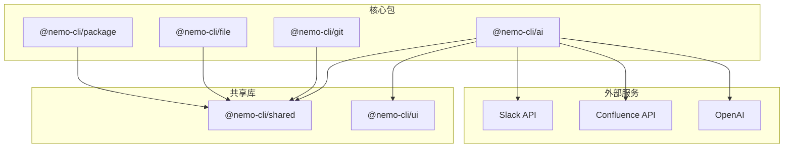
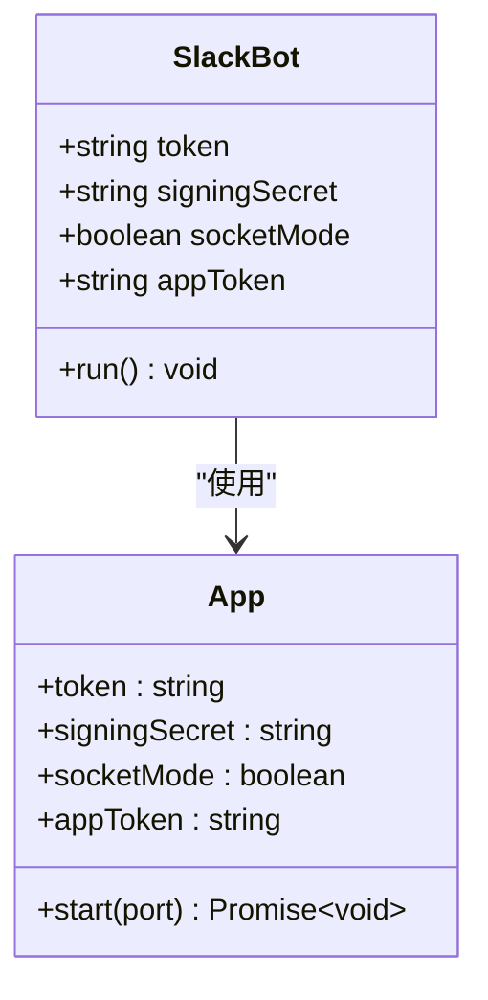
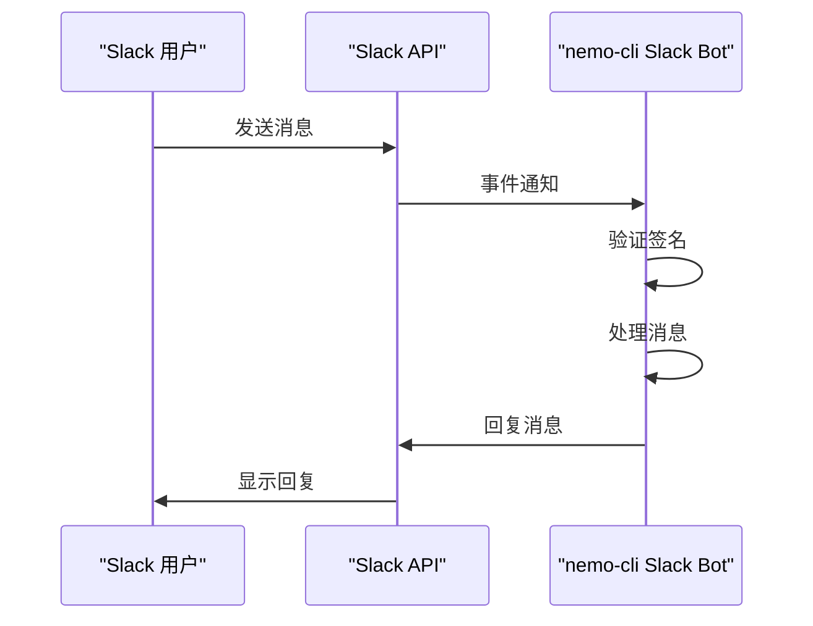
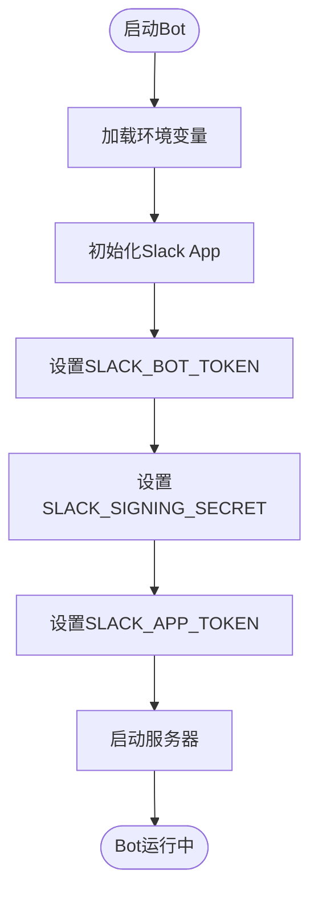

# OAuth 2.0 认证流程

<cite>
**本文档引用的文件**   
- [bot.ts](file://packages/ai/src/services/slack/bot.ts)
- [architecture.md](file://docs/architecture.md)
- [development-guide.md](file://docs/development-guide.md)
- [index.md](file://docs/packages-ai/index.md)
- [rolldown.config.ts](file://packages/ai/rolldown.config.ts)
- [tools/index.ts](file://packages/ai/src/services/slack/tools/index.ts)
</cite>

## 目录
1. [简介](#简介)
2. [项目结构](#项目结构)
3. [核心组件](#核心组件)
4. [架构概述](#架构概述)
5. [详细组件分析](#详细组件分析)
6. [依赖分析](#依赖分析)
7. [性能考虑](#性能考虑)
8. [故障排除指南](#故障排除指南)
9. [结论](#结论)

## 简介
本文档详细阐述了 nemo-cli 项目中 Slack OAuth 2.0 认证的实现机制。文档涵盖 Slack 应用注册、重定向 URI 配置、作用域权限定义、环境变量配置、用户授权流程、令牌刷新机制以及防止 CSRF 攻击的最佳实践。

## 项目结构
nemo-cli 是一个 TypeScript CLI 工具集 monorepo，采用 pnpm workspaces 管理多个独立发布的包。Slack OAuth 2.0 认证功能主要在 `@nemo-cli/ai` 包中实现，该包负责 AI 功能集成和 MCP 服务器。



**图示来源**
- [architecture.md](file://docs/architecture.md#L26-L65)

**本节来源**
- [architecture.md](file://docs/architecture.md#L1-L355)
- [project_structure](file://project_structure)

## 核心组件
nemo-cli 的核心组件包括 `@nemo-cli/git`、`@nemo-cli/ai`、`@nemo-cli/file`、`@nemo-cli/package`、`@nemo-cli/shared` 和 `@nemo-cli/ui`。其中，`@nemo-cli/ai` 包中的 Slack Bot 组件负责处理 Slack OAuth 2.0 认证。

**本节来源**
- [architecture.md](file://docs/architecture.md#L70-L157)

## 架构概述
nemo-cli 采用分层架构，CLI 命令层调用服务层，服务层使用工具层提供的功能。`@nemo-cli/ai` 包通过 MCP 协议与 AI Agent 通信，同时集成 Slack Bot 功能，监听频道消息并执行工作流工具。

```mermaid
graph LR
A[AI Agent] --> B[MCP Protocol]
B --> C[@nemo-cli/ai MCP Server]
C --> D[Confluence API]
C --> E[Mail SMTP]
C --> F[Slack API]
```

**图示来源**
- [architecture.md](file://docs/architecture.md#L248-L270)

**本节来源**
- [architecture.md](file://docs/architecture.md#L14-L65)

## 详细组件分析
### Slack Bot 分析
`@nemo-cli/ai` 包中的 Slack Bot 使用 @slack/bolt 框架实现，通过环境变量配置 SLACK_BOT_TOKEN 和 SLACK_APP_TOKEN，实现与 Slack 的安全通信。

#### 对象导向组件


**图示来源**
- [bot.ts](file://packages/ai/src/services/slack/bot.ts#L7-L11)
- [development-guide.md](file://docs/development-guide.md#L78-L80)

#### API/服务组件


**图示来源**
- [bot.ts](file://packages/ai/src/services/slack/bot.ts#L44-L54)
- [tools/index.ts](file://packages/ai/src/services/slack/tools/index.ts#L14-L71)

#### 复杂逻辑组件


**图示来源**
- [bot.ts](file://packages/ai/src/services/slack/bot.ts#L7-L11)
- [rolldown.config.ts](file://packages/ai/rolldown.config.ts#L11-L18)

**本节来源**
- [bot.ts](file://packages/ai/src/services/slack/bot.ts#L1-L112)
- [tools/index.ts](file://packages/ai/src/services/slack/tools/index.ts#L1-L72)

## 依赖分析
nemo-cli 项目使用 pnpm workspaces 管理依赖，`@nemo-cli/ai` 包依赖于 `@nemo-cli/shared` 和 `@nemo-cli/ui`，同时使用 @slack/bolt 框架与 Slack API 通信。

```mermaid
graph TD
A[@nemo-cli/ai] --> B[@nemo-cli/shared]
A --> C[@nemo-cli/ui]
A --> D[@slack/bolt]
D --> E[Slack API]
B --> F[Commander.js]
B --> G[Ink]
C --> H[React]
```

**图示来源**
- [package.json](file://packages/ai/package.json)
- [architecture.md](file://docs/architecture.md#L191)

**本节来源**
- [package.json](file://packages/ai/package.json)
- [architecture.md](file://docs/architecture.md#L191)

## 性能考虑
nemo-cli 使用 Rolldown 作为构建工具，提供快速的构建速度。项目采用 ESM 模块系统，支持更好的 tree-shaking，减少最终包的大小。

## 故障排除指南
在配置 Slack OAuth 2.0 认证时，常见的问题包括环境变量未正确设置、Slack 应用权限不足、重定向 URI 配置错误等。确保在 `.env` 文件中正确配置 SLACK_BOT_TOKEN 和 SLACK_APP_TOKEN，并在 Slack 应用管理界面中正确设置重定向 URI 和作用域权限。

**本节来源**
- [development-guide.md](file://docs/development-guide.md#L353-L372)
- [architecture.md](file://docs/architecture.md#L292-L295)

## 结论
nemo-cli 通过 `@nemo-cli/ai` 包实现了 Slack OAuth 2.0 认证，使用 @slack/bolt 框架简化了与 Slack API 的交互。通过环境变量安全地存储敏感信息，确保了认证过程的安全性。项目结构清晰，依赖管理严格，为开发者提供了高效的开发体验。