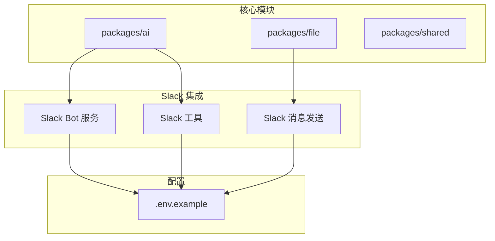
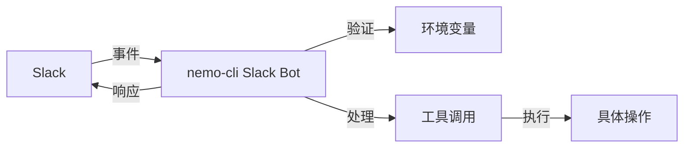
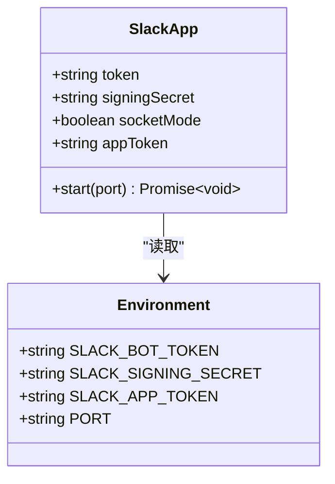

# 安全认证与权限控制

<cite>
**本文档中引用的文件**  
- [bot.ts](file://packages/ai/src/services/slack/bot.ts)
- [index.ts](file://packages/ai/src/index.ts)
- [.env.example](file://.env.example)
- [slack.ts](file://packages/file/src/commands/ast/slack.ts)
- [getPRD.ts](file://packages/ai/src/services/slack/tools/getPRD.ts)
- [sendEmail.ts](file://packages/ai/src/services/slack/tools/sendEmail.ts)
</cite>

## 目录
1. [引言](#引言)
2. [项目结构](#项目结构)
3. [核心组件](#核心组件)
4. [架构概述](#架构概述)
5. [详细组件分析](#详细组件分析)
6. [依赖分析](#依赖分析)
7. [性能考虑](#性能考虑)
8. [故障排除指南](#故障排除指南)
9. [结论](#结论)

## 引言
本文档详细阐述了 `nemo-cli` 如何实现 Slack 应用的安全接入机制，涵盖 OAuth 2.0 认证流程的配置与实现、环境变量在安全配置中的作用、消息验证机制、权限分级控制策略以及安全最佳实践建议。

## 项目结构
`nemo-cli` 项目采用模块化设计，其核心功能分布在多个包中。Slack 集成主要位于 `packages/ai` 模块中，而与 Slack 消息发送相关的工具则位于 `packages/file` 模块。安全认证的关键配置通过环境变量进行管理。



**Diagram sources**
- [bot.ts](file://packages/ai/src/services/slack/bot.ts#L1-L112)
- [.env.example](file://.env.example#L1-L13)

**Section sources**
- [bot.ts](file://packages/ai/src/services/slack/bot.ts#L1-L112)
- [.env.example](file://.env.example#L1-L13)

## 核心组件
`nemo-cli` 的 Slack 安全认证核心组件包括 Slack Bolt 框架的初始化、环境变量的使用、消息事件处理以及工具调用机制。这些组件共同确保了与 Slack 平台的安全、可靠交互。

**Section sources**
- [bot.ts](file://packages/ai/src/services/slack/bot.ts#L1-L112)
- [index.ts](file://packages/ai/src/index.ts#L4)

## 架构概述
`nemo-cli` 的 Slack 集成架构基于 Slack Bolt SDK 构建，采用事件驱动模型。应用通过 WebSocket (Socket Mode) 或 HTTP 请求接收来自 Slack 的事件，并通过预定义的令牌和密钥进行身份验证和消息签名验证。



**Diagram sources**
- [bot.ts](file://packages/ai/src/services/slack/bot.ts#L7-L11)
- [bot.ts](file://packages/ai/src/services/slack/bot.ts#L71-L78)

## 详细组件分析

### Slack 应用初始化与认证
`nemo-cli` 使用 Slack Bolt SDK 的 `App` 类来初始化 Slack 应用。该过程是安全认证的基础，它依赖于从环境变量中读取的关键凭证。



**Diagram sources**
- [bot.ts](file://packages/ai/src/services/slack/bot.ts#L7-L12)

#### 认证流程与环境变量
`nemo-cli` 的 Slack 安全认证主要依赖于以下环境变量：

- **SLACK_BOT_TOKEN**: 用于代表 Bot 用户进行 API 调用的 OAuth 令牌。它在 `bot.ts` 文件中通过 `process.env.SLACK_BOT_TOKEN` 被注入到 Bolt 应用实例中，作为 `token` 参数。
- **SLACK_SIGNING_SECRET**: 一个用于验证所有传入请求真实性的密钥。Bolt SDK 会自动使用此密钥来计算并验证请求签名，防止伪造请求。它在 `bot.ts` 中作为 `signingSecret` 参数。
- **SLACK_APP_TOKEN**: 用于建立 WebSocket 连接 (Socket Mode) 的应用级令牌。当 `socketMode` 设置为 `true` 时，此令牌是必需的。

这些凭证在 `.env.example` 文件中被定义，开发者需要在实际部署时提供具体的值。

**Section sources**
- [bot.ts](file://packages/ai/src/services/slack/bot.ts#L8-L11)
- [.env.example](file://.env.example#L1-L4)

#### 消息验证机制
`nemo-cli` 的消息验证机制主要由 Slack Bolt SDK 自动处理。当 Slack 向应用发送事件（如消息、提及）时，它会使用 `SLACK_SIGNING_SECRET` 生成一个签名（`X-Slack-Signature` 头）。Bolt SDK 在接收到请求后，会使用相同的算法和密钥重新计算签名，并与请求头中的签名进行比对。如果两者不匹配，请求将被拒绝，从而有效防止了跨站请求伪造（CSRF）和伪造请求。

此外，代码中还包含了一些应用层面的验证，例如在 `app.message` 事件处理器中，通过检查 `message.subtype` 来过滤掉非用户直接发送的消息（如 `bot_message`, `file_share`），确保只处理预期的用户输入。

**Section sources**
- [bot.ts](file://packages/ai/src/services/slack/bot.ts#L9)
- [bot.ts](file://packages/ai/src/services/slack/bot.ts#L72-L73)

### 权限分级控制策略
`nemo-cli` 的权限控制目前主要体现在其功能设计上，而非复杂的用户角色系统。其权限控制策略是隐式的：

1.  **功能即权限**: 每个工具（如 `getPRDTool`, `sendEmailTool`）都代表了一项特定的操作权限。只有当用户触发了与该工具相关的指令时，相应的操作才会被执行。
2.  **上下文感知**: 工具的执行依赖于用户提供的输入（如工单 ID）。如果输入无效或缺失，工具会调用 `onFailure` 回调，拒绝执行操作，这可以看作是一种输入验证层面的权限检查。
3.  **操作范围限制**: 每个工具的功能范围是固定的。例如，`sendEmailTool` 只能发送上线邮件，而不能执行其他无关操作。这种设计本身就限制了潜在的滥用。

虽然代码中没有显式的角色定义（如管理员、普通用户），但通过限制工具的可用性和功能，实现了基本的权限分级。

**Section sources**
- [getPRD.ts](file://packages/ai/src/services/slack/tools/getPRD.ts#L1-L36)
- [sendEmail.ts](file://packages/ai/src/services/slack/tools/sendEmail.ts#L1-L29)

## 依赖分析
`nemo-cli` 的 Slack 安全认证功能依赖于几个关键的外部库和内部模块。

```mermaid
graph TD
nemoCli[Slack Bot] --> Bolt[@slack/bolt]
nemoCli --> WebApi[@slack/web-api]
nemoCli --> Shared[@nemo-cli/shared]
Bolt --> WebApi
Bolt --> Crypto[Node.js crypto]
```

**Diagram sources**
- [bot.ts](file://packages/ai/src/services/slack/bot.ts#L1)
- [slack.ts](file://packages/file/src/commands/ast/slack.ts#L1)

- **@slack/bolt**: 这是核心依赖，提供了应用初始化、事件处理、中间件和自动签名验证等功能。
- **@slack/web-api**: 用于直接调用 Slack Web API，例如在 `packages/file` 模块中发送消息。
- **@nemo-cli/shared**: 提供了共享的工具函数，如 `createSpinner`，用于提升用户体验。

**Section sources**
- [bot.ts](file://packages/ai/src/services/slack/bot.ts#L1)
- [slack.ts](file://packages/file/src/commands/ast/slack.ts#L1)

## 性能考虑
Slack Bot 的性能主要受网络延迟和工具执行逻辑的影响。使用 Socket Mode 可以减少 HTTP 请求的开销，提供更低的延迟。工具的执行（如调用 Confluence API 或发送邮件）是潜在的性能瓶颈，应确保这些操作是异步且高效的。

## 故障排除指南
- **Bot 无法启动**: 检查 `SLACK_BOT_TOKEN`, `SLACK_SIGNING_SECRET`, `SLACK_APP_TOKEN` 是否正确配置，以及端口是否被占用。
- **无法接收消息**: 确认应用已在 Slack 中正确安装并授权，且事件订阅已启用。
- **消息验证失败**: 确保 `SLACK_SIGNING_SECRET` 与 Slack 应用设置中的值完全一致。

**Section sources**
- [bot.ts](file://packages/ai/src/services/slack/bot.ts#L102-L111)

## 结论
`nemo-cli` 通过集成 Slack Bolt SDK，实现了安全、可靠的 Slack 应用接入。其安全认证机制依赖于 OAuth 2.0 令牌（`SLACK_BOT_TOKEN`）和消息签名验证（`SLACK_SIGNING_SECRET`），并通过环境变量进行安全配置。虽然权限控制较为基础，但通过功能模块化和输入验证，有效地管理了操作权限。遵循安全最佳实践，如妥善保管令牌、使用 IP 白名单（需在 Slack 应用设置中配置）和记录操作日志，可以进一步提升系统的安全性。