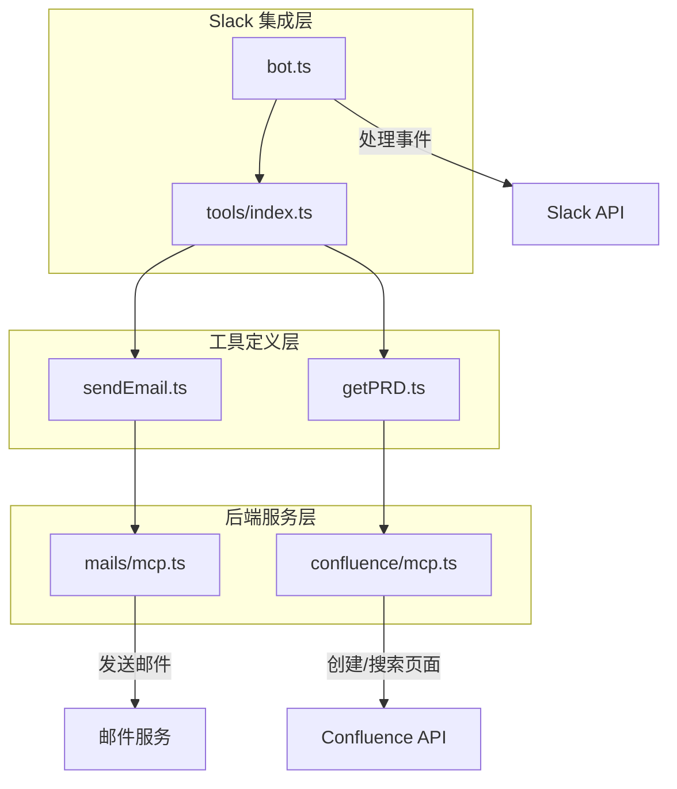
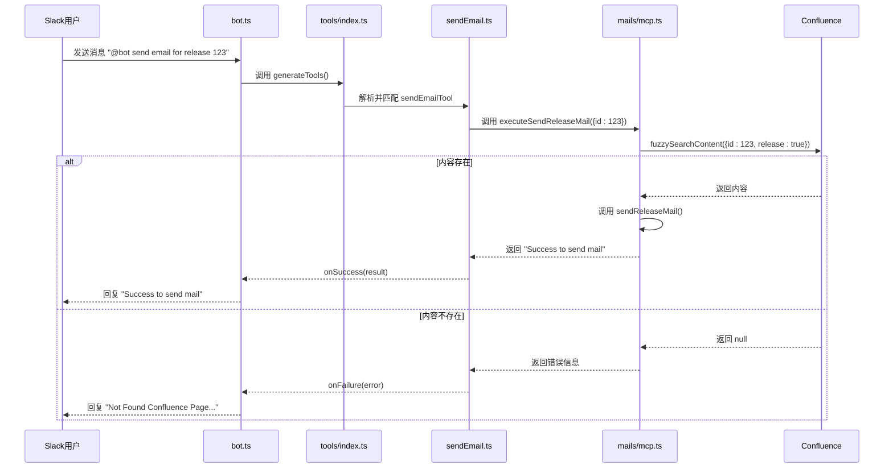
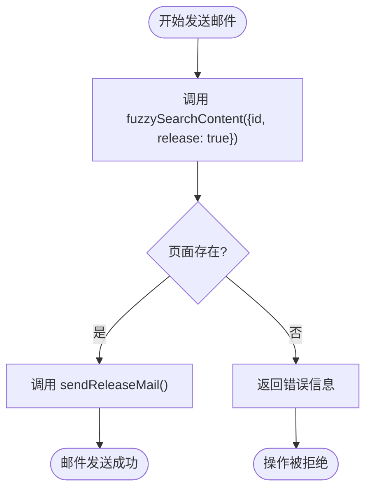
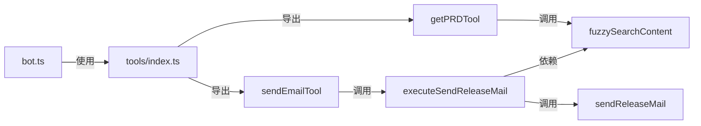

# 权限分级与访问控制

<cite>
**本文档中引用的文件**
- [bot.ts](file://packages/ai/src/services/slack/bot.ts)
- [sendEmail.ts](file://packages/ai/src/services/slack/tools/sendEmail.ts)
- [getPRD.ts](file://packages/ai/src/services/slack/tools/getPRD.ts)
- [index.ts](file://packages/ai/src/services/slack/tools/index.ts)
- [mcp.ts](file://packages/ai/src/services/mails/mcp.ts)
- [confluence/mcp.ts](file://packages/ai/src/services/confluence/mcp.ts)
</cite>

## 目录
1. [简介](#简介)
2. [项目结构](#项目结构)
3. [核心组件](#核心组件)
4. [架构概述](#架构概述)
5. [详细组件分析](#详细组件分析)
6. [依赖分析](#依赖分析)
7. [性能考虑](#性能考虑)
8. [故障排除指南](#故障排除指南)
9. [结论](#结论)

## 简介
本文档详细阐述了 `nemo-cli` 项目中基于角色的访问控制（RBAC）机制，重点分析其在 Slack 平台上的权限管理实现。文档将深入探讨系统如何通过 `bot.ts` 中的命令处理器和 `mcp.ts` 中的 AI 代理调用来执行权限检查，确保敏感操作的安全性。核心内容包括：基于用户身份和频道上下文的权限验证流程、对 Git 提交和邮件发送等敏感操作的保护机制、以及权限审计和最小权限原则的应用建议。

## 项目结构
`nemo-cli` 是一个模块化的 CLI 工具集，其权限控制逻辑主要集中在 `packages/ai` 包中，特别是与 Slack 集成的部分。项目采用分层设计，将 Slack 事件处理、工具定义和后端服务调用分离，确保了权限控制逻辑的清晰和可维护性。

**Diagram sources**
- [bot.ts](file://packages/ai/src/services/slack/bot.ts#L1-L112)
- [index.ts](file://packages/ai/src/services/slack/tools/index.ts#L1-L72)
- [sendEmail.ts](file://packages/ai/src/services/slack/tools/sendEmail.ts#L1-L29)
- [mcp.ts](file://packages/ai/src/services/mails/mcp.ts#L1-L28)

**Section sources**
- [bot.ts](file://packages/ai/src/services/slack/bot.ts#L1-L112)
- [index.ts](file://packages/ai/src/services/slack/tools/index.ts#L1-L72)

## 核心组件
系统的核心权限控制由两个主要部分构成：Slack 事件处理器和工具执行代理。`bot.ts` 文件负责监听和响应 Slack 中的消息事件，而 `tools` 目录下的模块则定义了具体的可执行操作。权限检查逻辑被巧妙地嵌入到这些工具的执行流程中，通过在调用后端服务（如邮件发送）前进行验证，实现了对敏感操作的有效保护。

**Section sources**
- [bot.ts](file://packages/ai/src/services/slack/bot.ts#L1-L112)
- [sendEmail.ts](file://packages/ai/src/services/slack/tools/sendEmail.ts#L1-L29)

## 架构概述
系统的整体架构遵循事件驱动模式。当用户在 Slack 中提及机器人或发送特定消息时，`bot.ts` 中的事件监听器会被触发。系统随后调用 `generateTools` 函数，该函数会根据用户输入的自然语言，利用 AI 模型选择并执行相应的工具。关键的权限控制发生在工具的 `execute` 函数内部，例如在发送邮件前，`executeSendReleaseMail` 函数会验证 Confluence 页面是否存在，从而间接实现了对操作权限的控制。

**Diagram sources**
- [bot.ts](file://packages/ai/src/services/slack/bot.ts#L72-L78)
- [index.ts](file://packages/ai/src/services/slack/tools/index.ts#L14-L71)
- [sendEmail.ts](file://packages/ai/src/services/slack/tools/sendEmail.ts#L17-L24)
- [mcp.ts](file://packages/ai/src/services/mails/mcp.ts#L7-L15)

## 详细组件分析
本节将深入分析实现权限控制的关键代码组件。

### 命令处理器与权限检查
在 `bot.ts` 文件中，系统通过 `app.message` 和 `app.event('app_mention')` 监听器来捕获用户输入。虽然基础的监听器本身不包含复杂的权限逻辑，但它为上层的工具调用提供了上下文（如 `message.user`）。真正的权限检查被委托给了具体的工具实现。例如，`generateTools` 函数是权限控制的入口点，它将用户请求路由到相应的工具。

**Section sources**
- [bot.ts](file://packages/ai/src/services/slack/bot.ts#L72-L78)

### 敏感操作的权限验证流程
`mcp.ts` 文件中的 `executeSendReleaseMail` 函数是权限验证的核心。在执行敏感的邮件发送操作前，该函数会先调用 `fuzzySearchContent` 来验证指定 ID 的 Confluence 发布页面是否存在（`release: true` 参数）。这是一个关键的权限控制点：**只有当关联的发布文档存在时，才允许发送上线邮件**。这确保了操作的合法性和可追溯性，防止了未经授权的发布行为。

**Diagram sources**
- [mcp.ts](file://packages/ai/src/services/mails/mcp.ts#L8-L15)

**Section sources**
- [mcp.ts](file://packages/ai/src/services/mails/mcp.ts#L7-L15)

### 权限策略实现示例
以下代码片段展示了权限策略的具体实现：

1.  **输入验证**：在 `sendEmail.ts` 的 `execute` 函数中，首先检查 `id` 是否提供，这是最基础的输入验证。
2.  **上下文验证**：在 `mcp.ts` 中，通过查询 Confluence 系统来验证操作的上下文（发布文档）是否有效，这是更高级的权限检查。
3.  **失败处理**：所有验证失败的情况都会通过 `onFailure` 回调清晰地通知用户，确保了操作的透明性。

**Section sources**
- [sendEmail.ts](file://packages/ai/src/services/slack/tools/sendEmail.ts#L18-L21)
- [mcp.ts](file://packages/ai/src/services/mails/mcp.ts#L8-L10)

## 依赖分析
系统各组件之间存在清晰的依赖关系，这些依赖关系是权限控制得以实施的基础。

**Diagram sources**
- [bot.ts](file://packages/ai/src/services/slack/bot.ts#L4-L5)
- [index.ts](file://packages/ai/src/services/slack/tools/index.ts#L5-L6)
- [sendEmail.ts](file://packages/ai/src/services/slack/tools/sendEmail.ts#L4)
- [mcp.ts](file://packages/ai/src/services/mails/mcp.ts#L5)

**Section sources**
- [bot.ts](file://packages/ai/src/services/slack/bot.ts#L1-L112)
- [index.ts](file://packages/ai/src/services/slack/tools/index.ts#L1-L72)

## 性能考虑
当前的权限控制机制将验证逻辑（如查询 Confluence）放在了操作执行路径上，这可能会引入延迟。建议对频繁查询的资源（如发布文档状态）进行缓存，以减少对外部 API 的调用次数，从而提升响应速度和系统整体性能。

## 故障排除指南
当用户报告权限相关问题（如“未找到内容”或“发送上线邮件失败”）时，请按以下步骤排查：

1.  **检查输入参数**：确认用户提供的 ID 是否正确无误。
2.  **验证资源状态**：检查 Confluence 中是否存在对应 ID 的发布文档，并确认其状态。
3.  **审查日志**：查看 `mcp.ts` 中 `fuzzySearchContent` 的返回结果，确认查询逻辑是否正常。
4.  **检查网络和认证**：确保服务有权限访问 Confluence 和邮件服务。

**Section sources**
- [mcp.ts](file://packages/ai/src/services/mails/mcp.ts#L8-L10)
- [sendEmail.ts](file://packages/ai/src/services/slack/tools/sendEmail.ts#L19-L21)

## 结论
`nemo-cli` 通过将权限检查逻辑嵌入到工具执行流程中，实现了一种有效且灵活的基于上下文的访问控制。系统通过验证操作的前置条件（如发布文档的存在）来间接控制权限，这比简单的角色检查更能适应复杂的业务场景。未来可进一步强化此机制，例如引入显式的用户角色系统，并对所有敏感操作实施二次确认机制，以更好地遵循最小权限原则。