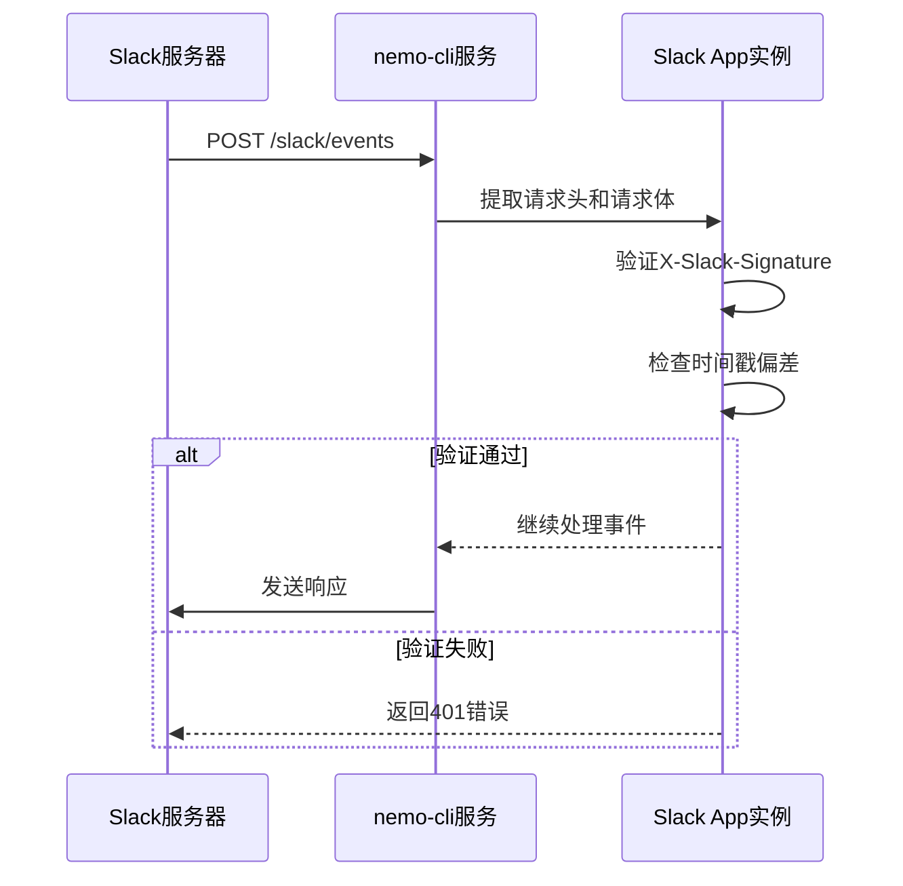
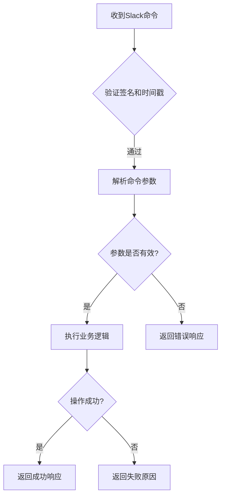

# 消息验证与请求防护

<cite>
**本文档引用文件**   
- [bot.ts](file://packages/ai/src/services/slack/bot.ts)
- [mcp.ts](file://packages/ai/src/services/mails/mcp.ts)
- [architecture.md](file://docs/architecture.md)
- [development-guide.md](file://docs/development-guide.md)
</cite>

## 目录
1. [引言](#引言)
2. [Slack消息验证机制](#slack消息验证机制)
3. [请求签名生成与验证流程](#请求签名生成与验证流程)
4. [Bot中间件实现分析](#bot中间件实现分析)
5. [命令处理安全过滤逻辑](#命令处理安全过滤逻辑)
6. [防御重放攻击与伪造请求](#防御重放攻击与伪造请求)
7. [日志记录与异常告警集成](#日志记录与异常告警集成)
8. [结论](#结论)

## 引言
nemo-cli 是一个集成了AI功能的CLI工具集，其中包含与Slack平台的深度集成。为确保系统安全性，防止未经授权的请求访问，nemo-cli 实现了完整的Slack消息验证机制。本文档详细说明了通过 SLACK_SIGNING_SECRET 验证 Incoming Webhook 和 Event Subscription 请求真实性的技术实现，涵盖签名算法、时间戳检查、中间件拦截等关键安全措施。

## Slack消息验证机制
nemo-cli 使用 @slack/bolt 框架来处理 Slack 的事件订阅和交互请求。该框架内置了基于 SLACK_SIGNING_SECRET 的请求验证机制，确保所有传入的Webhook请求均来自合法的Slack服务器。

在初始化 Slack 应用时，`signingSecret` 被设置为环境变量 `SLACK_SIGNING_SECRET` 的值，这是验证请求来源真实性的核心密钥。当 Slack 发送事件（如消息、按钮点击等）到应用的事件接收端点时，会附带一个包含请求签名的 HTTP 头 `X-Slack-Signature`，同时提供时间戳 `X-Slack-Request-Timestamp`。

**Section sources**
- [bot.ts](file://packages/ai/src/services/slack/bot.ts#L7-L12)

## 请求签名生成与验证流程
Slack 请求签名的生成和验证遵循以下算法：

1. **签名生成（Slack服务器端）**：
   - 构造字符串：`v0:` + 时间戳 + `:` + 请求体（原始字符串）
   - 使用 HMAC SHA256 算法，以 `SLACK_SIGNING_SECRET` 作为密钥对上述字符串进行哈希
   - 将哈希结果转换为十六进制字符串，并添加前缀 `v0=`，形成最终签名

2. **签名验证（nemo-cli服务端）**：
   - 从请求头中提取 `X-Slack-Request-Timestamp` 和 `X-Slack-Signature`
   - 重新构造与Slack服务器相同的字符串：`v0:` + 时间戳 + `:` + 请求体
   - 使用相同的 HMAC SHA256 算法和 `SLACK_SIGNING_SECRET` 计算本地签名
   - 比较本地计算的签名与请求头中的签名是否一致

此外，系统还会进行时间戳检查，确保请求时间戳与服务器当前时间的偏差不超过5分钟，以防止重放攻击。

**Section sources**
- [bot.ts](file://packages/ai/src/services/slack/bot.ts#L9)
- [architecture.md](file://docs/architecture.md#L293-L294)

## Bot中间件实现分析
在 `bot.ts` 文件中，通过 `@slack/bolt` 框架的 `App` 类初始化Slack应用实例。该实例自动配置了基于 `signingSecret` 的签名验证中间件。

**Diagram sources**
- [bot.ts](file://packages/ai/src/services/slack/bot.ts#L7-L12)

**Section sources**
- [bot.ts](file://packages/ai/src/services/slack/bot.ts#L7-L112)

## 命令处理安全过滤逻辑
在处理Slack命令时，nemo-cli通过MCP（Modular Command Protocol）服务器进行安全过滤。以邮件发送功能为例，`mcp.ts` 文件中的 `executeSendReleaseMail` 函数实现了输入验证和错误处理机制。

该函数首先通过 `fuzzySearchContent` 查询Confluence内容，验证工单ID的有效性。如果未找到对应内容，则返回错误信息，阻止无效或恶意请求的执行。这种基于业务逻辑的二次验证增强了系统的安全性。

**Diagram sources**
- [mcp.ts](file://packages/ai/src/services/mails/mcp.ts#L7-L15)

**Section sources**
- [mcp.ts](file://packages/ai/src/services/mails/mcp.ts#L7-L28)
- [sendEmail.ts](file://packages/ai/src/services/slack/tools/sendEmail.ts#L4)

## 防御重放攻击与伪造请求
nemo-cli通过以下机制防御重放攻击和伪造请求：

1. **时间戳检查**：验证请求时间戳与服务器时间的偏差不超过300秒（5分钟），防止旧请求被重复使用。
2. **签名验证**：使用HMAC-SHA256算法确保请求完整性，任何对请求体或时间戳的篡改都会导致签名验证失败。
3. **密钥保密**：`SLACK_SIGNING_SECRET` 通过环境变量配置，不硬编码在代码中，避免泄露。
4. **输入验证**：在业务逻辑层对命令参数进行有效性检查，如验证工单ID是否存在。

这些多层次的安全措施共同构成了一个健壮的防护体系，有效抵御了常见的网络攻击。

**Section sources**
- [bot.ts](file://packages/ai/src/services/slack/bot.ts#L9)
- [mcp.ts](file://packages/ai/src/services/mails/mcp.ts#L8-L10)

## 日志记录与异常告警集成
为增强系统的可观测性和安全性，建议集成日志记录和异常告警机制：

1. **日志记录**：在签名验证失败或时间戳检查异常时，记录详细的错误日志，包括请求IP、时间戳、签名值等信息。
2. **异常告警**：配置监控系统，当短时间内出现大量验证失败的请求时，触发告警通知管理员。
3. **审计追踪**：记录所有成功的Slack命令执行日志，便于后续审计和问题排查。

虽然当前代码中已有基础的 `console.error` 错误输出，但建议使用结构化日志库（如Winston或Pino）进行更专业的日志管理。

**Section sources**
- [bot.ts](file://packages/ai/src/services/slack/bot.ts#L97-L99)
- [mcp.ts](file://packages/ai/src/services/mails/mcp.ts#L14)

## 结论
nemo-cli通过集成 @slack/bolt 框架的内置安全机制，实现了对Slack请求的完整验证。系统利用 SLACK_SIGNING_SECRET 进行HMAC签名验证，并结合时间戳检查有效防御了伪造请求和重放攻击。在业务逻辑层，通过参数验证和错误处理进一步增强了安全性。建议未来加强日志记录和监控告警能力，以提升系统的整体安全性和可维护性。