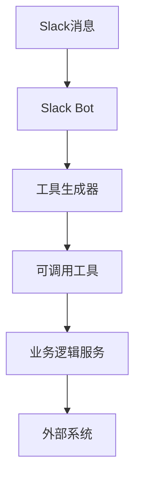
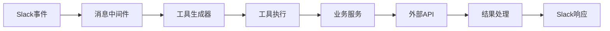
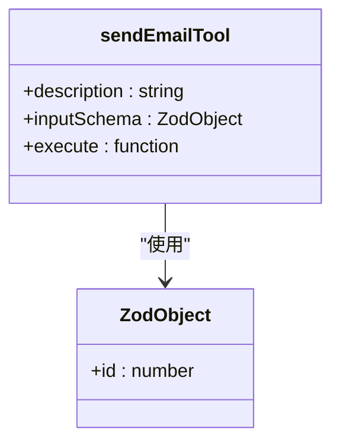
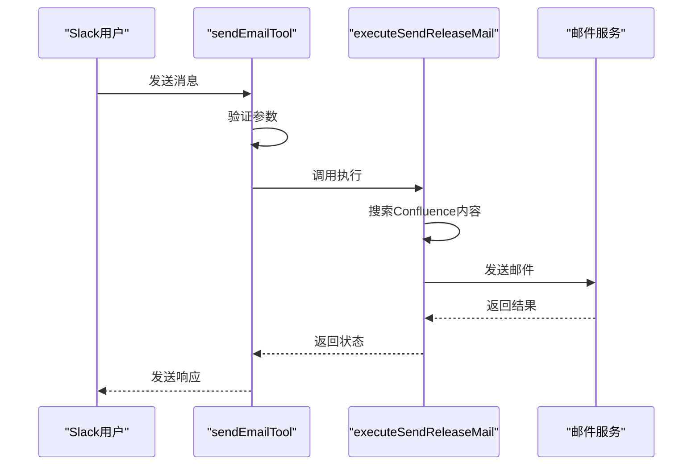
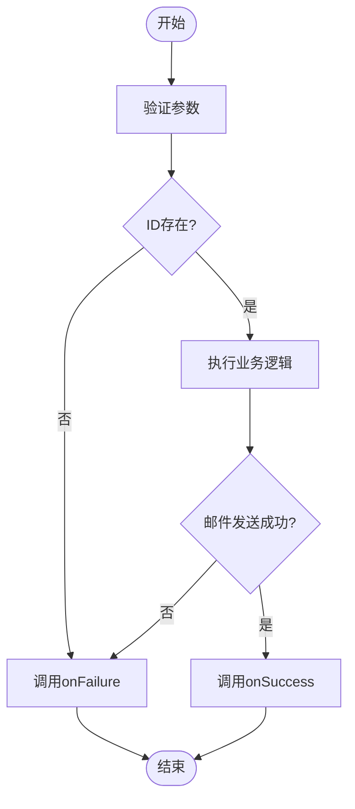

# 工具扩展指南

<cite>
**本文档中引用的文件**  
- [sendEmail.ts](file://packages/ai/src/services/slack/tools/sendEmail.ts)
- [index.ts](file://packages/ai/src/services/slack/tools/index.ts)
- [bot.ts](file://packages/ai/src/services/slack/bot.ts)
- [mcp.ts](file://packages/ai/src/services/mails/mcp.ts)
- [getPRD.ts](file://packages/ai/src/services/slack/tools/getPRD.ts)
- [error.ts](file://packages/shared/src/utils/error.ts)
</cite>

## 目录
1. [简介](#简介)
2. [项目结构](#项目结构)
3. [核心组件](#核心组件)
4. [架构概述](#架构概述)
5. [详细组件分析](#详细组件分析)
6. [依赖分析](#依赖分析)
7. [性能考虑](#性能考虑)
8. [故障排除指南](#故障排除指南)
9. [结论](#结论)

## 简介
本指南提供在nemo-cli系统中添加新的可调用Slack工具的完整开发流程。重点介绍如何通过类型安全的方式创建工具、定义参数模式、实现业务逻辑并在系统中注册。以`sendEmail.ts`为例，展示一个完整工具的结构与实现细节，并指导开发者进行本地测试、部署验证和版本兼容性管理。

## 项目结构
nemo-cli采用模块化架构，Slack工具扩展主要位于`packages/ai/src/services/slack/tools/`目录下。工具通过AI框架与Slack事件系统集成，实现智能化的自动化功能。



**Diagram sources**
- [bot.ts](file://packages/ai/src/services/slack/bot.ts#L72-L78)
- [index.ts](file://packages/ai/src/services/slack/tools/index.ts#L14-L71)

**Section sources**
- [bot.ts](file://packages/ai/src/services/slack/bot.ts#L1-L112)
- [index.ts](file://packages/ai/src/services/slack/tools/index.ts#L1-L72)

## 核心组件
Slack工具扩展的核心组件包括工具定义、参数验证、错误处理和结果回调机制。每个工具都通过类型安全的接口与系统集成，确保数据流动的可靠性和可预测性。

**Section sources**
- [sendEmail.ts](file://packages/ai/src/services/slack/tools/sendEmail.ts#L1-L29)
- [getPRD.ts](file://packages/ai/src/services/slack/tools/getPRD.ts#L1-L36)

## 架构概述
nemo-cli的Slack工具架构采用分层设计，将消息处理、工具调用和业务逻辑分离。工具通过AI框架的`tool`函数定义，使用Zod进行参数验证，并通过回调函数处理成功和失败情况。



**Diagram sources**
- [bot.ts](file://packages/ai/src/services/slack/bot.ts#L72-L78)
- [index.ts](file://packages/ai/src/services/slack/tools/index.ts#L14-L71)

## 详细组件分析

### sendEmail工具分析
`sendEmailTool`是一个典型的Slack可调用工具，展示了完整的工具实现模式。它通过参数验证、业务逻辑调用和结果处理三个阶段完成邮件发送功能。

#### 工具定义与参数模式


**Diagram sources**
- [sendEmail.ts](file://packages/ai/src/services/slack/tools/sendEmail.ts#L12-L26)
- [mcp.ts](file://packages/ai/src/services/mails/mcp.ts#L22-L24)

#### 工具执行流程


**Diagram sources**
- [sendEmail.ts](file://packages/ai/src/services/slack/tools/sendEmail.ts#L17-L24)
- [mcp.ts](file://packages/ai/src/services/mails/mcp.ts#L7-L15)

#### 错误处理机制


**Diagram sources**
- [sendEmail.ts](file://packages/ai/src/services/slack/tools/sendEmail.ts#L18-L23)
- [error.ts](file://packages/shared/src/utils/error.ts#L5-L13)

**Section sources**
- [sendEmail.ts](file://packages/ai/src/services/slack/tools/sendEmail.ts#L1-L29)
- [mcp.ts](file://packages/ai/src/services/mails/mcp.ts#L7-L15)

## 依赖分析
Slack工具扩展依赖于多个核心模块，包括AI框架、Slack Bolt SDK、共享工具库和邮件服务。这些依赖通过TypeScript的模块系统进行管理，确保类型安全和代码可维护性。

```mermaid
graph TD
A[sendEmailTool] --> B[ai/tool]
A --> C[zod/v4]
A --> D[mails/mcp]
D --> E[@nemo-cli/mail]
D --> F[confluence/getContent]
A --> G[shared/utils]
```

**Diagram sources**
- [sendEmail.ts](file://packages/ai/src/services/slack/tools/sendEmail.ts#L1-L4)
- [mcp.ts](file://packages/ai/src/services/mails/mcp.ts#L1-L5)

**Section sources**
- [sendEmail.ts](file://packages/ai/src/services/slack/tools/sendEmail.ts#L1-L29)
- [mcp.ts](file://packages/ai/src/services/mails/mcp.ts#L1-L28)

## 性能考虑
在设计Slack工具时，需要考虑响应时间和资源消耗。建议对频繁调用的操作实施缓存机制，对耗时操作提供进度反馈，并对错误情况进行优雅降级。

## 故障排除指南
当Slack工具无法正常工作时，可以按照以下步骤进行排查：
1. 检查环境变量配置是否正确
2. 验证参数模式与实际输入是否匹配
3. 检查外部服务连接状态
4. 查看日志输出中的错误信息

**Section sources**
- [error.ts](file://packages/shared/src/utils/error.ts#L5-L13)
- [bot.ts](file://packages/ai/src/services/slack/bot.ts#L97-L99)

## 结论
通过本指南，开发者可以了解如何在nemo-cli系统中创建和集成新的Slack工具。关键要点包括使用类型安全的参数验证、实现清晰的错误处理机制、遵循模块化设计原则以及确保与现有系统的兼容性。建议在开发新工具时以`sendEmail.ts`为参考，保持代码风格和架构模式的一致性。