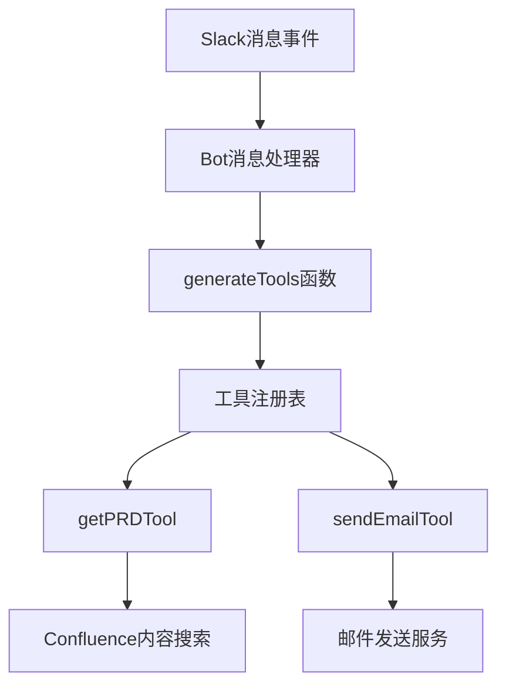
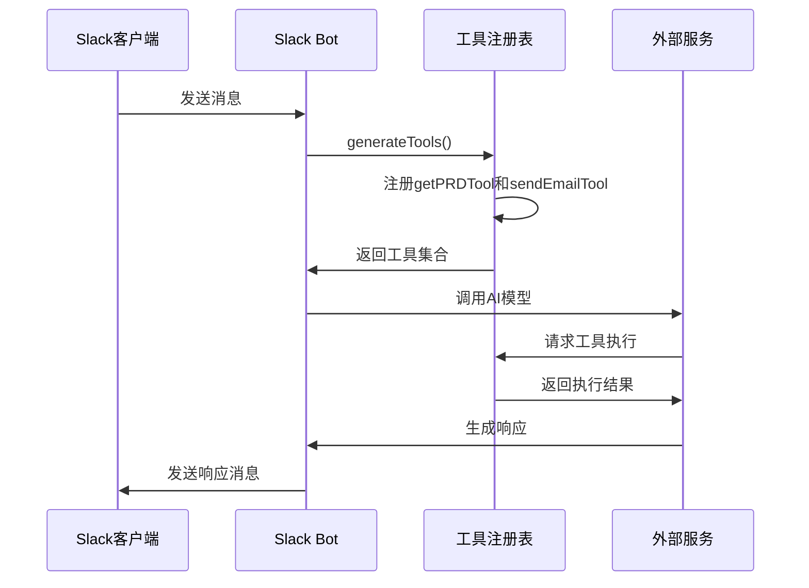
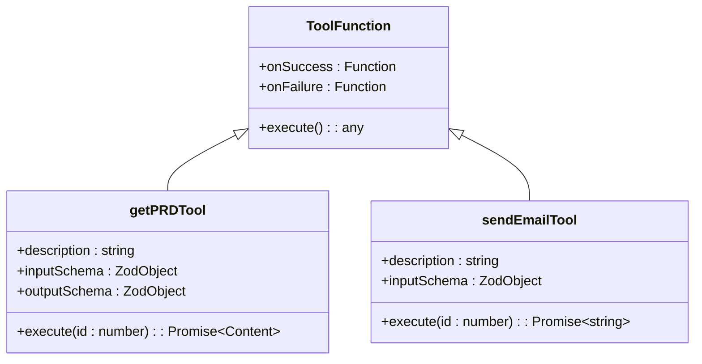
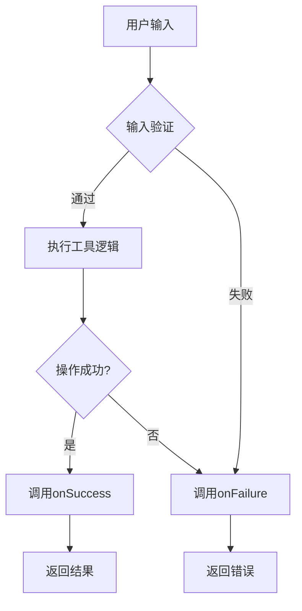

# 工具注册机制

<cite>
**本文档中引用的文件**  
- [index.ts](file://packages/ai/src/services/slack/tools/index.ts)
- [getPRD.ts](file://packages/ai/src/services/slack/tools/getPRD.ts)
- [sendEmail.ts](file://packages/ai/src/services/slack/tools/sendEmail.ts)
- [bot.ts](file://packages/ai/src/services/slack/bot.ts)
- [getContent.ts](file://packages/ai/src/services/confluence/getContent.ts)
- [mcp.ts](file://packages/ai/src/services/mails/mcp.ts)
</cite>

## 目录
1. [引言](#引言)
2. [项目结构](#项目结构)
3. [核心组件](#核心组件)
4. [架构概述](#架构概述)
5. [详细组件分析](#详细组件分析)
6. [依赖分析](#依赖分析)
7. [性能考虑](#性能考虑)
8. [故障排除指南](#故障排除指南)
9. [结论](#结论)

## 引言
本文档详细阐述了nemo-cli在Slack环境中动态注册可调用工具的机制。重点介绍工具元数据（名称、描述、参数模式）的定义方式，工具注册表的实现结构，以及类型安全的工具接口设计。同时说明错误处理机制如何集成到注册过程中，确保参数验证与运行时检查的一致性。

## 项目结构
nemo-cli的工具注册机制主要集中在`packages/ai/src/services/slack/tools/`目录下，通过统一的index.ts文件管理所有工具的导入与暴露。该机制与Slack Bot集成，实现基于消息事件的动态工具调用。



**Diagram sources**
- [bot.ts](file://packages/ai/src/services/slack/bot.ts#L72-L78)
- [index.ts](file://packages/ai/src/services/slack/tools/index.ts#L14-L70)

**Section sources**
- [bot.ts](file://packages/ai/src/services/slack/bot.ts#L1-L112)
- [index.ts](file://packages/ai/src/services/slack/tools/index.ts#L1-L72)

## 核心组件
工具注册机制的核心组件包括工具定义、工具注册表和执行上下文。每个工具通过高阶函数封装，接受成功和失败回调，返回符合AI平台要求的工具对象。工具元数据包含描述、输入模式和执行逻辑，确保类型安全和运行时验证。

**Section sources**
- [getPRD.ts](file://packages/ai/src/services/slack/tools/getPRD.ts#L1-L36)
- [sendEmail.ts](file://packages/ai/src/services/slack/tools/sendEmail.ts#L1-L29)

## 架构概述
nemo-cli的Slack工具注册机制采用模块化设计，通过`generateTools`函数动态生成工具集合并集成到AI模型调用中。当接收到Slack消息时，系统会根据消息内容动态选择并执行相应的工具。



**Diagram sources**
- [bot.ts](file://packages/ai/src/services/slack/bot.ts#L72-L78)
- [index.ts](file://packages/ai/src/services/slack/tools/index.ts#L14-L70)

## 详细组件分析

### 工具定义与注册
nemo-cli通过高阶函数模式定义工具，每个工具函数接受成功和失败回调，返回一个包含工具元数据和执行逻辑的对象。这种设计实现了关注点分离，使工具定义与消息响应逻辑解耦。



**Diagram sources**
- [getPRD.ts](file://packages/ai/src/services/slack/tools/getPRD.ts#L6-L35)
- [sendEmail.ts](file://packages/ai/src/services/slack/tools/sendEmail.ts#L6-L28)

**Section sources**
- [getPRD.ts](file://packages/ai/src/services/slack/tools/getPRD.ts#L1-L36)
- [sendEmail.ts](file://packages/ai/src/services/slack/tools/sendEmail.ts#L1-L29)

### 类型安全的工具接口
系统采用Zod库定义工具的输入输出模式，确保参数验证的类型安全。通过泛型和异步返回类型，实现了编译时类型检查与运行时验证的一致性。



**Diagram sources**
- [getPRD.ts](file://packages/ai/src/services/slack/tools/getPRD.ts#L14-L16)
- [sendEmail.ts](file://packages/ai/src/services/slack/tools/sendEmail.ts#L14-L15)

**Section sources**
- [getPRD.ts](file://packages/ai/src/services/slack/tools/getPRD.ts#L1-L36)
- [sendEmail.ts](file://packages/ai/src/services/slack/tools/sendEmail.ts#L1-L29)

## 依赖分析
工具注册机制依赖多个核心模块，包括Slack Bolt框架、AI SDK、Zod验证库以及Confluence和邮件服务客户端。这些依赖通过清晰的接口契约进行集成，确保系统的可维护性和可扩展性。

```mermaid
graph LR
A[Slack工具注册] --> B[@slack/bolt]
A --> C[ai SDK]
A --> D[zod/v4]
A --> E[Confluence服务]
A --> F[邮件服务]
E --> G[@nemo-cli/confluence]
F --> H[@nemo-cli/mail]
```

**Diagram sources**
- [index.ts](file://packages/ai/src/services/slack/tools/index.ts#L1-L7)
- [getPRD.ts](file://packages/ai/src/services/slack/tools/getPRD.ts#L1-L4)
- [sendEmail.ts](file://packages/ai/src/services/slack/tools/sendEmail.ts#L1-L4)

**Section sources**
- [index.ts](file://packages/ai/src/services/slack/tools/index.ts#L1-L72)
- [getPRD.ts](file://packages/ai/src/services/slack/tools/getPRD.ts#L1-L36)
- [sendEmail.ts](file://packages/ai/src/services/slack/tools/sendEmail.ts#L1-L29)

## 性能考虑
工具注册机制在设计时考虑了性能优化，通过惰性初始化和缓存策略减少重复计算。工具函数在消息处理时动态生成，避免了不必要的内存占用。同时，异步执行模式确保了非阻塞的事件处理。

## 故障排除指南
当工具注册或执行出现问题时，系统提供详细的错误处理机制。每个工具都包含明确的失败回调，能够捕获并处理各种异常情况，如缺少必要参数、外部服务不可用等。

**Section sources**
- [getPRD.ts](file://packages/ai/src/services/slack/tools/getPRD.ts#L21-L28)
- [sendEmail.ts](file://packages/ai/src/services/slack/tools/sendEmail.ts#L18-L20)

## 结论
nemo-cli的Slack工具注册机制通过模块化设计和类型安全的接口，实现了灵活且可靠的工具管理。该机制不仅支持动态工具注册和执行，还通过完善的错误处理确保了系统的稳定性。未来可扩展更多工具类型，进一步增强系统的功能性和可用性。