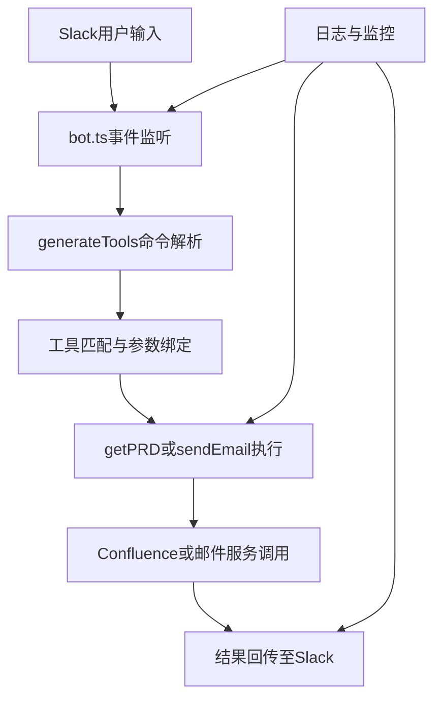
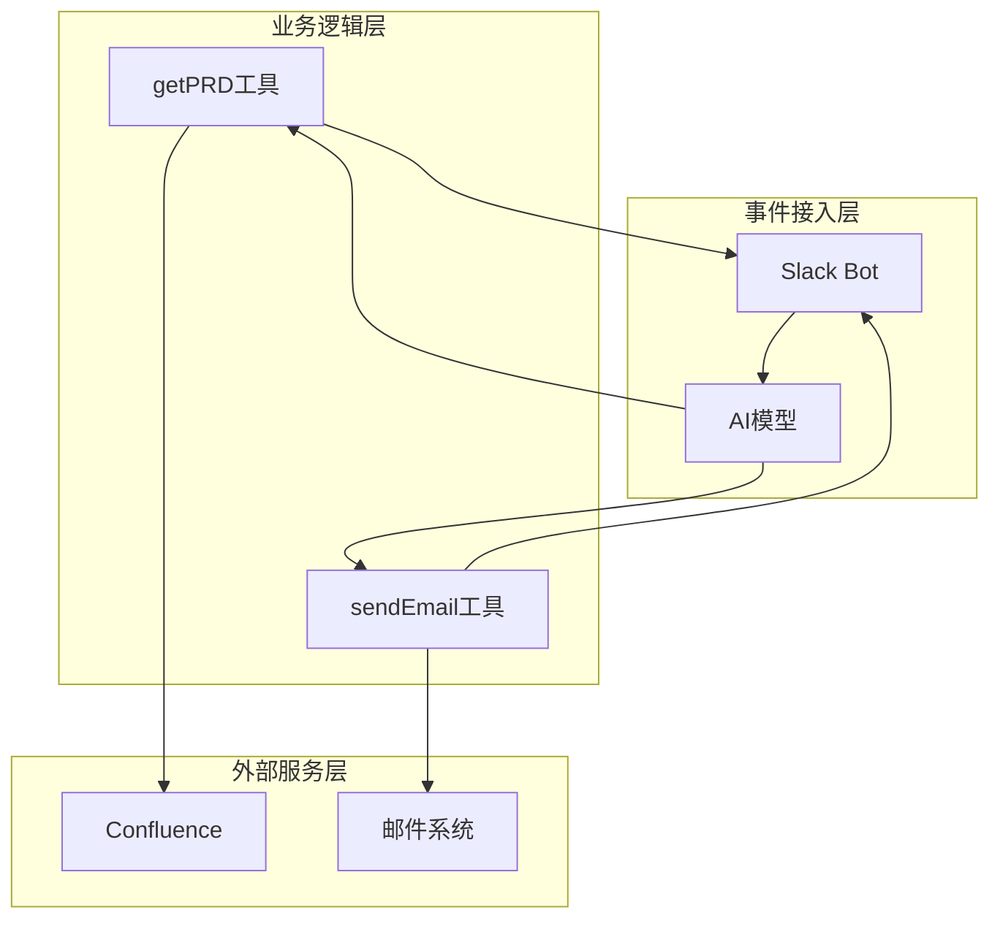
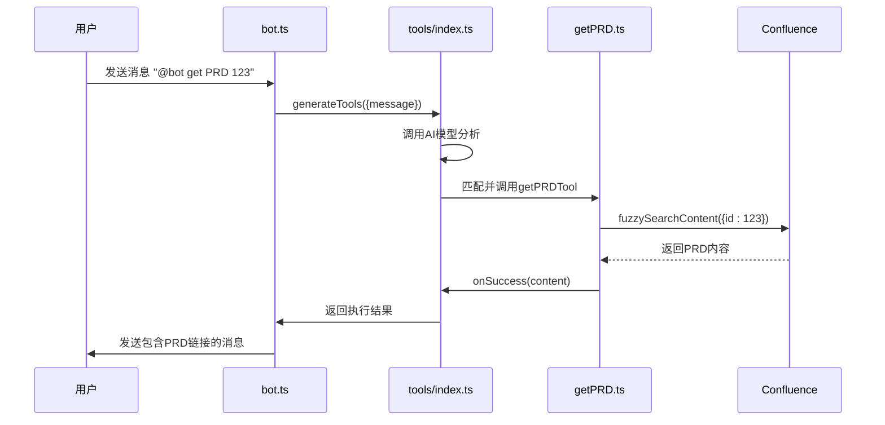
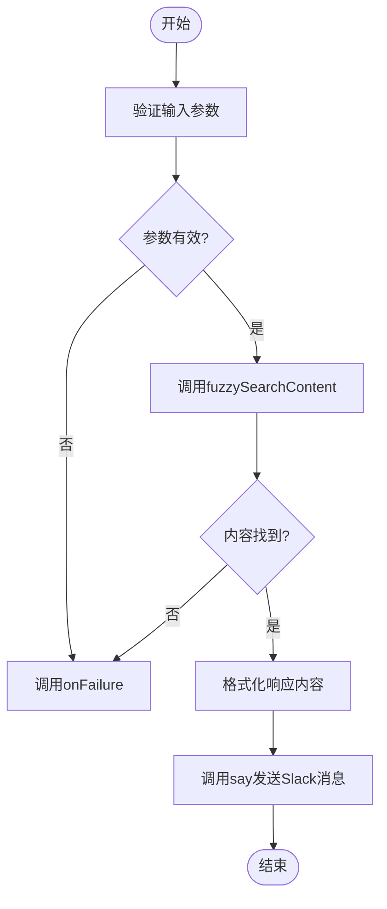
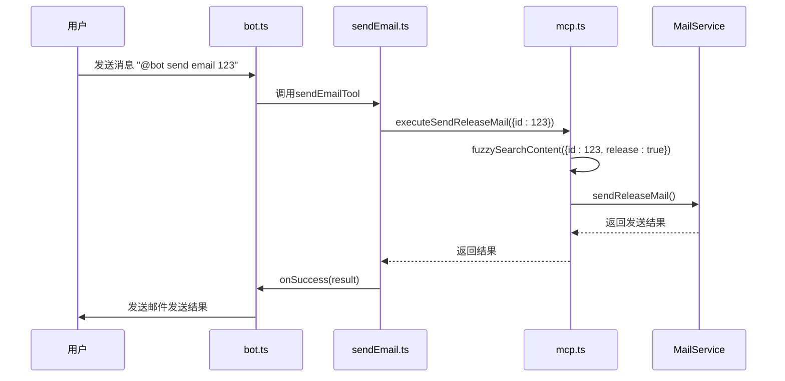
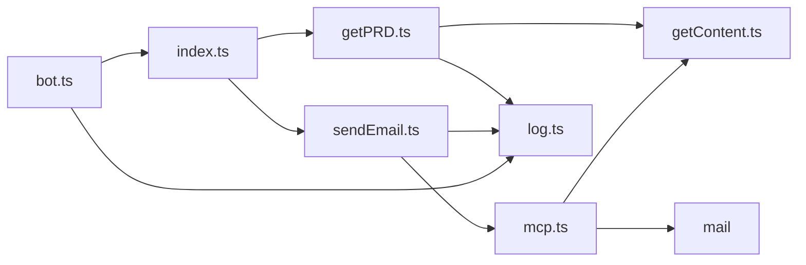

# 工具调用流程

<cite>
**本文档中引用的文件**  
- [bot.ts](file://packages/ai/src/services/slack/bot.ts)
- [getPRD.ts](file://packages/ai/src/services/slack/tools/getPRD.ts)
- [sendEmail.ts](file://packages/ai/src/services/slack/tools/sendEmail.ts)
- [index.ts](file://packages/ai/src/services/slack/tools/index.ts)
- [getContent.ts](file://packages/ai/src/services/confluence/getContent.ts)
- [mcp.ts](file://packages/ai/src/services/mails/mcp.ts)
- [log.ts](file://packages/shared/src/utils/log.ts)
</cite>

## 目录
1. [简介](#简介)
2. [项目结构](#项目结构)
3. [核心组件](#核心组件)
4. [架构概述](#架构概述)
5. [详细组件分析](#详细组件分析)
6. [依赖分析](#依赖分析)
7. [性能考虑](#性能考虑)
8. [故障排除指南](#故障排除指南)
9. [结论](#结论)

## 简介
本文档详细阐述了在Slack环境中工具调用的完整执行流程。从用户在Slack中输入命令开始，系统通过事件监听、命令解析、工具匹配与参数绑定等机制进行处理。`bot.ts`作为核心协调器，负责管理工具调用过程中的执行上下文注入、异步调用调度以及结果回传。整个调用链路包含中间件处理，如日志记录、性能监控和错误捕获。通过`getPRD`和`sendEmail`两个具体示例，展示了端到端的数据流动与交互时序。

## 项目结构
Slack工具调用系统位于`packages/ai/src/services/slack/`目录下，主要由`bot.ts`作为入口点，`tools/`子目录包含具体的工具实现（如`getPRD.ts`和`sendEmail.ts`），并通过`tools/index.ts`统一注册和管理。工具调用过程中依赖于Confluence内容检索和邮件发送服务，分别由`confluence/getContent.ts`和`mails/mcp.ts`提供支持。日志记录功能由`shared/utils/log.ts`统一提供。

**Diagram sources**
- [bot.ts](file://packages/ai/src/services/slack/bot.ts#L1-L112)
- [index.ts](file://packages/ai/src/services/slack/tools/index.ts#L1-L72)

**Section sources**
- [bot.ts](file://packages/ai/src/services/slack/bot.ts#L1-L112)
- [getPRD.ts](file://packages/ai/src/services/slack/tools/getPRD.ts#L1-L36)
- [sendEmail.ts](file://packages/ai/src/services/slack/tools/sendEmail.ts#L1-L29)

## 核心组件
系统的核心组件包括Slack机器人应用实例、工具定义模块、工具执行协调器以及外部服务接口。`bot.ts`中创建的`App`实例负责监听Slack事件，`tools/index.ts`中的`generateTools`函数负责协调AI模型与具体工具的集成，而各个工具文件（如`getPRD.ts`和`sendEmail.ts`）则定义了具体的业务逻辑和执行流程。

**Section sources**
- [bot.ts](file://packages/ai/src/services/slack/bot.ts#L1-L112)
- [index.ts](file://packages/ai/src/services/slack/tools/index.ts#L1-L72)

## 架构概述
系统采用事件驱动架构，Slack机器人监听用户消息事件，通过AI模型解析用户意图并匹配相应的工具。工具执行过程中采用回调机制处理成功与失败情况，并将结果通过Slack API回传给用户。整个架构分为三层：事件接入层（Slack Bolt框架）、业务逻辑层（工具实现）和外部服务层（Confluence、邮件系统）。

**Diagram sources**
- [bot.ts](file://packages/ai/src/services/slack/bot.ts#L1-L112)
- [getPRD.ts](file://packages/ai/src/services/slack/tools/getPRD.ts#L1-L36)
- [sendEmail.ts](file://packages/ai/src/services/slack/tools/sendEmail.ts#L1-L29)

## 详细组件分析

### 工具调用协调器分析
`bot.ts`文件中的`app.message`事件处理器是整个工具调用流程的起点。它接收用户消息，并调用`generateTools`函数进行处理。该函数利用AI模型分析用户输入，自动选择并执行合适的工具。

#### 对于API/Service组件：

**Diagram sources**
- [bot.ts](file://packages/ai/src/services/slack/bot.ts#L72-L78)
- [index.ts](file://packages/ai/src/services/slack/tools/index.ts#L14-L72)
- [getPRD.ts](file://packages/ai/src/services/slack/tools/getPRD.ts#L10-L35)

### getPRD工具执行流程
`getPRDTool`工具用于根据工单ID获取需求文档地址。它首先验证输入参数，然后调用Confluence服务进行模糊搜索，最后将结果通过Slack消息回传给用户。

#### 对于复杂逻辑组件：

**Diagram sources**
- [getPRD.ts](file://packages/ai/src/services/slack/tools/getPRD.ts#L10-L35)
- [getContent.ts](file://packages/ai/src/services/confluence/getContent.ts#L12-L38)

### sendEmail工具执行流程
`sendEmailTool`工具用于发送上线邮件。它接收工单ID，获取相关Confluence页面内容，然后调用邮件服务发送邮件。

#### 对于API/Service组件：

**Diagram sources**
- [sendEmail.ts](file://packages/ai/src/services/slack/tools/sendEmail.ts#L10-L28)
- [mcp.ts](file://packages/ai/src/services/mails/mcp.ts#L7-L15)

## 依赖分析
系统各组件之间存在明确的依赖关系。`bot.ts`依赖于`tools/index.ts`提供的工具生成函数，而各个工具文件又依赖于外部服务模块。日志系统被所有组件共享使用，提供统一的日志记录功能。

**Diagram sources**
- [bot.ts](file://packages/ai/src/services/slack/bot.ts#L1-L112)
- [index.ts](file://packages/ai/src/services/slack/tools/index.ts#L1-L72)
- [getPRD.ts](file://packages/ai/src/services/slack/tools/getPRD.ts#L1-L36)
- [sendEmail.ts](file://packages/ai/src/services/slack/tools/sendEmail.ts#L1-L29)
- [getContent.ts](file://packages/ai/src/services/confluence/getContent.ts#L1-L39)
- [mcp.ts](file://packages/ai/src/services/mails/mcp.ts#L1-L28)
- [log.ts](file://packages/shared/src/utils/log.ts#L1-L169)

**Section sources**
- [bot.ts](file://packages/ai/src/services/slack/bot.ts#L1-L112)
- [index.ts](file://packages/ai/src/services/slack/tools/index.ts#L1-L72)

## 性能考虑
系统在性能方面主要考虑异步调用和错误处理。所有外部服务调用均为异步操作，避免阻塞主线程。通过AI模型的温度参数设置为0，确保工具选择的确定性。日志系统提供了详细的执行时间记录，便于性能监控和问题排查。

## 故障排除指南
当工具调用失败时，系统会通过预定义的`onFailure`回调函数向用户返回错误信息。常见问题包括：缺少必要的环境变量（如SLACK_BOT_TOKEN）、无效的工单ID、Confluence页面不存在、邮件服务不可用等。日志系统会记录详细的错误信息，便于开发人员排查问题。

**Section sources**
- [bot.ts](file://packages/ai/src/services/slack/bot.ts#L97-L99)
- [getPRD.ts](file://packages/ai/src/services/slack/tools/getPRD.ts#L21-L28)
- [sendEmail.ts](file://packages/ai/src/services/slack/tools/sendEmail.ts#L18-L20)
- [mcp.ts](file://packages/ai/src/services/mails/mcp.ts#L10-L14)

## 结论
本文档详细分析了Slack工具调用系统的完整执行流程。系统通过事件驱动架构实现了灵活的工具调用机制，利用AI模型进行智能命令解析，并通过清晰的组件划分和依赖管理确保了系统的可维护性。通过`getPRD`和`sendEmail`两个实例，展示了从用户输入到服务调用再到结果回传的完整数据流动过程。该架构设计合理，具有良好的扩展性和错误处理能力。