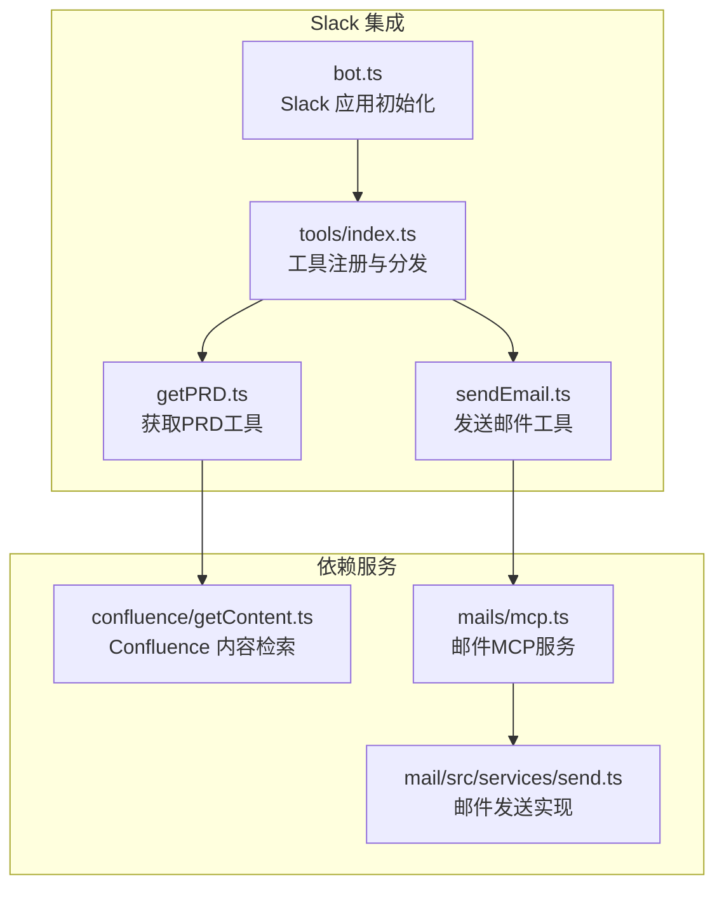
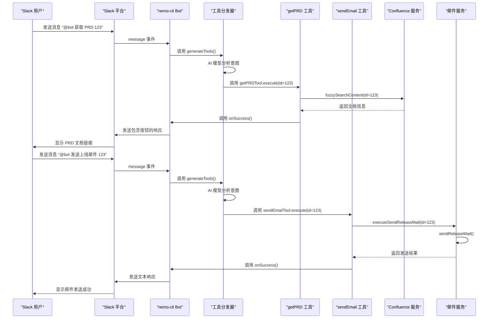
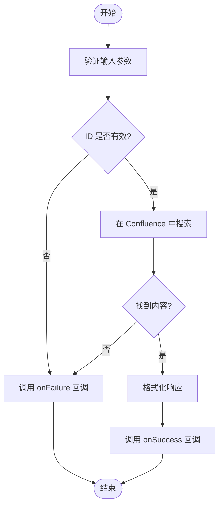
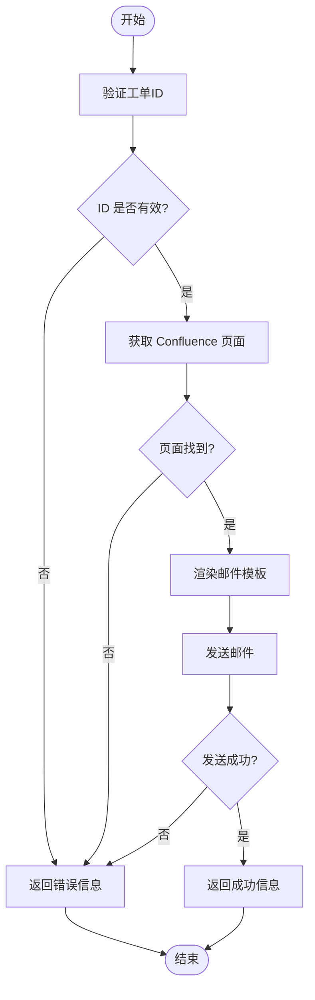

# 工具集成与调用

<cite>
**本文档中引用的文件**  
- [bot.ts](file://packages/ai/src/services/slack/bot.ts)
- [index.ts](file://packages/ai/src/services/slack/tools/index.ts)
- [getPRD.ts](file://packages/ai/src/services/slack/tools/getPRD.ts)
- [sendEmail.ts](file://packages/ai/src/services/slack/tools/sendEmail.ts)
- [getContent.ts](file://packages/ai/src/services/confluence/getContent.ts)
- [mcp.ts](file://packages/ai/src/services/mails/mcp.ts)
- [send.ts](file://packages/mail/src/services/send.ts)
- [index.ts](file://packages/ai/src/index.ts)
- [.env.example](file://packages/ai/.env.example)
</cite>

## 目录
1. [简介](#简介)
2. [项目结构](#项目结构)
3. [核心组件](#核心组件)
4. [架构概述](#架构概述)
5. [详细组件分析](#详细组件分析)
6. [依赖分析](#依赖分析)
7. [性能考虑](#性能考虑)
8. [故障排除指南](#故障排除指南)
9. [结论](#结论)

## 简介
本文档详细说明了nemo-cli如何在Slack环境中注册和管理可调用工具，如getPRD和sendEmail。文档涵盖了工具注册机制的实现，包括工具元数据定义、参数验证和执行上下文注入。同时描述了用户在Slack中触发工具调用的完整流程，从命令输入到结果返回的交互过程。此外，还提供了扩展新Slack可用工具的指南，并包含权限控制、执行限制和错误反馈的实现细节。

## 项目结构
nemo-cli项目的Slack工具集成主要位于`packages/ai/src/services/slack/`目录下，其结构清晰地分离了Slack机器人核心逻辑与具体工具实现。工具定义位于`tools/`子目录中，每个工具都有独立的模块文件。相关的服务依赖（如Confluence内容检索和邮件发送）则分布在其他服务目录中，通过模块化方式被工具调用。



**图示来源**
- [bot.ts](file://packages/ai/src/services/slack/bot.ts#L1-L112)
- [index.ts](file://packages/ai/src/services/slack/tools/index.ts#L1-L72)
- [getPRD.ts](file://packages/ai/src/services/slack/tools/getPRD.ts#L1-L36)
- [sendEmail.ts](file://packages/ai/src/services/slack/tools/sendEmail.ts#L1-L29)
- [getContent.ts](file://packages/ai/src/services/confluence/getContent.ts#L1-L39)
- [mcp.ts](file://packages/ai/src/services/mails/mcp.ts#L1-L28)
- [send.ts](file://packages/mail/src/services/send.ts#L1-L45)

**节来源**
- [bot.ts](file://packages/ai/src/services/slack/bot.ts#L1-L112)
- [index.ts](file://packages/ai/src/services/slack/tools/index.ts#L1-L72)

## 核心组件
nemo-cli的Slack工具集成核心由Slack Bolt框架驱动，通过AI SDK的`tool`机制定义可调用函数。系统在启动时注册所有可用工具，并通过自然语言处理将用户请求路由到相应的工具执行函数。每个工具都包含输入验证、业务逻辑执行和结果回调处理，确保了交互的健壮性和用户体验。

**节来源**
- [bot.ts](file://packages/ai/src/services/slack/bot.ts#L1-L112)
- [index.ts](file://packages/ai/src/services/slack/tools/index.ts#L1-L72)
- [getPRD.ts](file://packages/ai/src/services/slack/tools/getPRD.ts#L1-L36)
- [sendEmail.ts](file://packages/ai/src/services/slack/tools/sendEmail.ts#L1-L29)

## 架构概述
nemo-cli的Slack工具集成采用分层架构，从下到上分别为：Slack事件监听层、工具分发层、工具实现层和外部服务调用层。当用户在Slack中发送消息时，事件被Bolt框架捕获，经过初步过滤后传递给工具分发器。分发器利用AI模型分析用户意图，并选择合适的工具进行执行。工具执行过程中可能调用Confluence、邮件系统等外部服务，最终将结果通过Slack API返回给用户。



**图示来源**
- [bot.ts](file://packages/ai/src/services/slack/bot.ts#L71-L78)
- [index.ts](file://packages/ai/src/services/slack/tools/index.ts#L14-L70)
- [getPRD.ts](file://packages/ai/src/services/slack/tools/getPRD.ts#L20-L31)
- [sendEmail.ts](file://packages/ai/src/services/slack/tools/sendEmail.ts#L17-L24)
- [getContent.ts](file://packages/ai/src/services/confluence/getContent.ts#L12-L34)
- [mcp.ts](file://packages/ai/src/services/mails/mcp.ts#L7-L15)
- [send.ts](file://packages/mail/src/services/send.ts#L22-L43)

## 详细组件分析
### getPRD 工具分析
getPRD工具用于根据工单ID在Confluence中搜索并返回产品需求文档（PRD）的链接。该工具通过`inputSchema`严格定义了输入参数，要求提供一个数字类型的ID。执行时，工具首先验证ID的有效性，然后调用`fuzzySearchContent`函数在Confluence中进行模糊搜索。搜索结果按ID排序后返回第一个匹配项，并通过`onSuccess`回调将包含文档链接的Slack消息块发送给用户。

#### 工具元数据与执行流程


**图示来源**
- [getPRD.ts](file://packages/ai/src/services/slack/tools/getPRD.ts#L10-L35)
- [getContent.ts](file://packages/ai/src/services/confluence/getContent.ts#L12-L34)

**节来源**
- [getPRD.ts](file://packages/ai/src/services/slack/tools/getPRD.ts#L1-L36)
- [getContent.ts](file://packages/ai/src/services/confluence/getContent.ts#L1-L39)

### sendEmail 工具分析
sendEmail工具用于根据工单ID发送上线邮件。该工具同样要求提供一个数字类型的ID作为输入。执行时，工具调用`executeSendReleaseMail`函数，该函数首先在Confluence中查找对应的上线工单页面，然后使用`sendReleaseMail`函数通过Gmail SMTP发送格式化的邮件。邮件内容基于React组件`ReleaseEmail`生成，收件人和抄送人列表在代码中硬编码定义。

#### 邮件发送流程


**图示来源**
- [sendEmail.ts](file://packages/ai/src/services/slack/tools/sendEmail.ts#L10-L28)
- [mcp.ts](file://packages/ai/src/services/mails/mcp.ts#L7-L15)
- [send.ts](file://packages/mail/src/services/send.ts#L22-L43)

**节来源**
- [sendEmail.ts](file://packages/ai/src/services/slack/tools/sendEmail.ts#L1-L29)
- [mcp.ts](file://packages/ai/src/services/mails/mcp.ts#L1-L28)
- [send.ts](file://packages/mail/src/services/send.ts#L1-L45)

## 依赖分析
nemo-cli的Slack工具集成了多个外部依赖和服务，形成了一个完整的工具链。核心依赖包括Slack Bolt框架用于处理Slack事件，AI SDK用于工具定义和意图识别，Zod用于运行时类型检查和输入验证。服务依赖方面，系统通过Confluence REST API客户端访问知识库，使用Nodemailer通过Gmail SMTP发送邮件。这些依赖通过清晰的模块边界进行封装，确保了系统的可维护性和可扩展性。

```mermaid
graph TD
A[nemo-cli Slack 工具] --> B[@slack/bolt]
A --> C[ai SDK]
A --> D[zod]
A --> E[@nemo-cli/shared]
A --> F[@nemo-cli/mail]
B --> G[Slack API]
C --> H[Google Gemini]
E --> I[Confluence API]
F --> J[Gmail SMTP]
```

**图示来源**
- [bot.ts](file://packages/ai/src/services/slack/bot.ts#L1-L4)
- [getPRD.ts](file://packages/ai/src/services/slack/tools/getPRD.ts#L1-L2)
- [sendEmail.ts](file://packages/ai/src/services/slack/tools/sendEmail.ts#L1-L2)
- [getContent.ts](file://packages/ai/src/services/confluence/getContent.ts#L1-L2)
- [send.ts](file://packages/mail/src/services/send.ts#L1-L2)

**节来源**
- [bot.ts](file://packages/ai/src/services/slack/bot.ts#L1-L112)
- [getPRD.ts](file://packages/ai/src/services/slack/tools/getPRD.ts#L1-L36)
- [sendEmail.ts](file://packages/ai/src/services/slack/tools/sendEmail.ts#L1-L29)
- [getContent.ts](file://packages/ai/src/services/confluence/getContent.ts#L1-L39)
- [send.ts](file://packages/mail/src/services/send.ts#L1-L45)

## 性能考虑
系统的性能主要受外部服务调用的影响，特别是Confluence搜索和邮件发送操作。Confluence的模糊搜索可能因数据量大而产生延迟，建议在生产环境中实现缓存机制以减少重复查询。邮件发送依赖于外部SMTP服务的响应速度，网络延迟和认证过程都可能影响整体性能。此外，AI模型的推理时间也是关键因素，选择轻量级模型（如gemini-2.5-flash）有助于降低响应延迟。系统应监控各服务的响应时间，并在必要时实施超时和重试策略。

## 故障排除指南
当Slack工具无法正常工作时，应按照以下步骤进行排查：首先检查环境变量配置，确保`SLACK_BOT_TOKEN`、`SLACK_SIGNING_SECRET`、`GOOGLE_API_KEY`等关键凭证正确设置。其次查看应用日志，重点关注`Slack Bot failed to start`等错误信息。对于getPRD工具，验证Confluence的API凭证和空间密钥是否正确。对于sendEmail工具，确认Gmail的APP密码已正确生成并配置。最后，检查用户输入是否符合工具的参数要求，例如ID是否为有效数字。

**节来源**
- [bot.ts](file://packages/ai/src/services/slack/bot.ts#L108-L109)
- [getPRD.ts](file://packages/ai/src/services/slack/tools/getPRD.ts#L22-L23)
- [sendEmail.ts](file://packages/ai/src/services/slack/tools/sendEmail.ts#L19-L20)
- [send.ts](file://packages/mail/src/services/send.ts#L23-L24)
- [.env.example](file://packages/ai/.env.example#L1-L6)

## 结论
nemo-cli的Slack工具集成提供了一个灵活且可扩展的框架，用于在Slack环境中自动化常见任务。通过清晰的工具定义、严格的输入验证和优雅的错误处理，系统为用户提供了可靠的服务。架构设计充分考虑了模块化和可维护性，使得添加新工具变得简单直接。未来可以通过引入缓存、优化AI提示词和增强错误恢复机制来进一步提升系统的性能和用户体验。