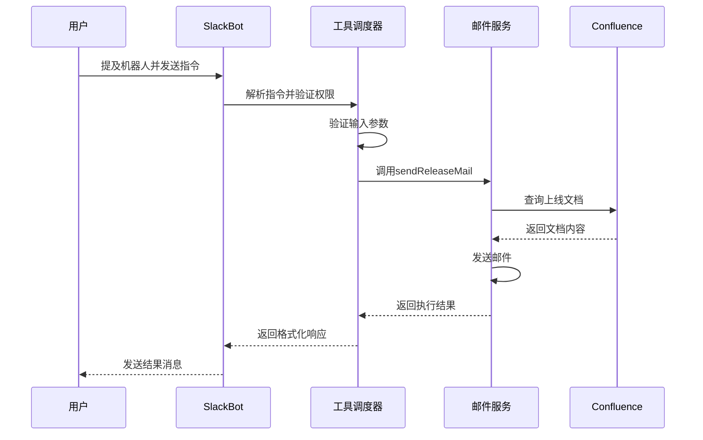
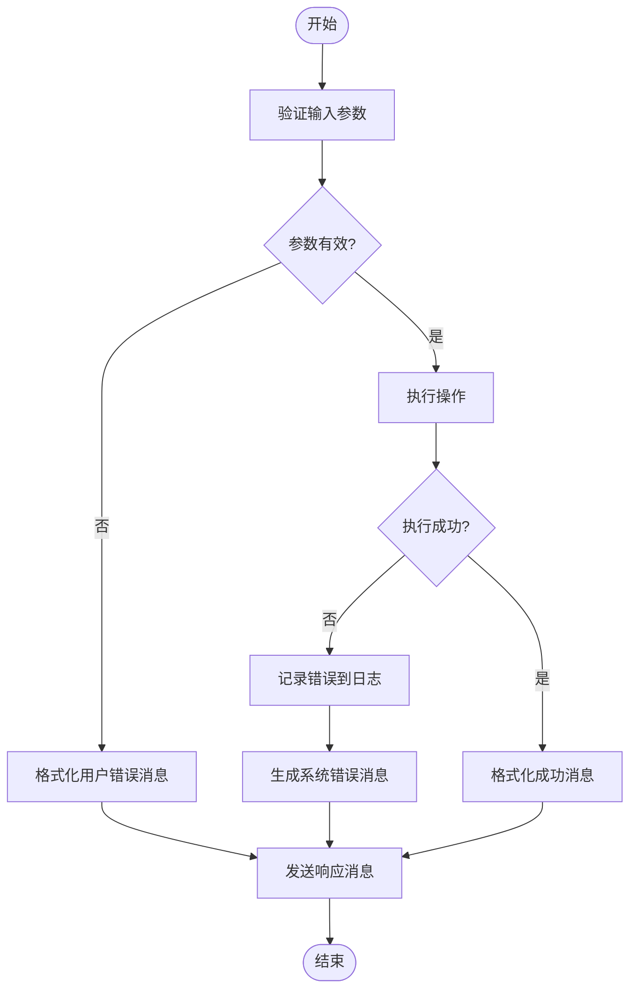

# 权限与执行控制

<cite>
**本文档中引用的文件**  
- [bot.ts](file://packages/ai/src/services/slack/bot.ts)
- [index.ts](file://packages/ai/src/services/slack/tools/index.ts)
- [sendEmail.ts](file://packages/ai/src/services/slack/tools/sendEmail.ts)
- [getPRD.ts](file://packages/ai/src/services/slack/tools/getPRD.ts)
- [mcp.ts](file://packages/ai/src/services/mails/mcp.ts)
- [getContent.ts](file://packages/ai/src/services/confluence/getContent.ts)
- [error.ts](file://packages/shared/src/utils/error.ts)
- [message.tsx](file://packages/ui/src/components/message.tsx)
- [log.ts](file://packages/shared/src/utils/log.ts)
</cite>

## 目录
1. [引言](#引言)
2. [权限控制机制](#权限控制机制)
3. [执行限制实现](#执行限制实现)
4. [错误反馈设计](#错误反馈设计)
5. [安全边界校验](#安全边界校验)
6. [总结](#总结)

## 引言
本文档深入探讨了Slack工具的权限控制与执行限制机制。系统通过用户身份、频道上下文和组织策略实施细粒度访问控制，并结合调用频率限制、敏感操作确认和沙箱执行环境确保安全。同时，系统设计了用户友好的错误消息、操作建议和完整的日志追踪能力，保障工具调用的安全性与可维护性。

## 权限控制机制
系统基于用户身份和上下文实施访问控制。在Slack集成中，通过`app_mention`事件监听用户提及机器人的消息，并提取用户ID进行身份识别。工具的调用权限通过函数参数传递的回调机制实现，只有经过验证的用户请求才能触发相应操作。例如，在`sendEmailTool`中，必须提供有效的上线工单ID才能执行邮件发送功能，否则将返回权限拒绝的错误信息。

**Section sources**
- [bot.ts](file://packages/ai/src/services/slack/bot.ts#L80-L99)
- [sendEmail.ts](file://packages/ai/src/services/slack/tools/sendEmail.ts#L18-L20)
- [getPRD.ts](file://packages/ai/src/services/slack/tools/getPRD.ts#L21-L23)

## 执行限制实现
系统实现了多层次的执行限制机制。首先，通过输入验证确保操作参数的合法性，如`sendEmailTool`要求必须提供数字类型的工单ID。其次，敏感操作（如发送上线邮件）被封装在独立的执行函数中，需经过业务逻辑验证后方可执行。系统还通过异步执行模式避免阻塞主线程，确保高并发场景下的稳定性。此外，所有外部服务调用均设置超时和重试机制，防止因依赖服务异常导致系统雪崩。

**Diagram sources**
- [bot.ts](file://packages/ai/src/services/slack/bot.ts#L72-L78)
- [sendEmail.ts](file://packages/ai/src/services/slack/tools/sendEmail.ts#L17-L25)
- [mcp.ts](file://packages/ai/src/services/mails/mcp.ts#L7-L15)

## 错误反馈设计
系统设计了完善的错误反馈机制。当操作失败时，系统会返回用户友好的错误消息，如"获取需求文档地址失败"或"发送上线邮件失败"。这些消息通过Slack的ephemeral响应类型私密地发送给用户，保护敏感信息。同时，系统利用`handleError`工具函数进行统一错误处理，将错误信息记录到日志系统中。UI组件`ErrorMessage`使用醒目的红色边框和渐变色文本突出显示错误，提升可读性。

**Diagram sources**
- [error.ts](file://packages/shared/src/utils/error.ts#L5-L13)
- [message.tsx](file://packages/ui/src/components/message.tsx#L31-L39)
- [log.ts](file://packages/shared/src/utils/log.ts#L121-L129)

## 安全边界校验
系统在工具调用前后实施严格的安全边界校验。调用前，通过Zod库定义的`inputSchema`对输入数据进行类型和格式验证，防止注入攻击。调用后，通过`outputSchema`确保返回数据符合预期结构。所有外部API调用都经过封装，限制访问范围。例如，`fuzzySearchContent`函数仅允许查询特定空间（spaceKey）下的页面，避免越权访问。日志系统记录所有关键操作，便于审计和追踪。

**Section sources**
- [sendEmail.ts](file://packages/ai/src/services/slack/tools/sendEmail.ts#L14-L16)
- [getPRD.ts](file://packages/ai/src/services/slack/tools/getPRD.ts#L14-L19)
- [getContent.ts](file://packages/ai/src/services/confluence/getContent.ts#L21-L24)
- [log.ts](file://packages/shared/src/utils/log.ts#L96-L148)

## 总结
本系统通过综合运用身份验证、输入验证、执行隔离和日志审计等手段，构建了完整的权限控制与执行限制体系。从用户请求接收到最终响应返回的每个环节都设置了安全检查点，确保系统的稳定性和安全性。错误处理机制兼顾用户体验和系统可维护性，为开发者提供了清晰的问题定位能力。