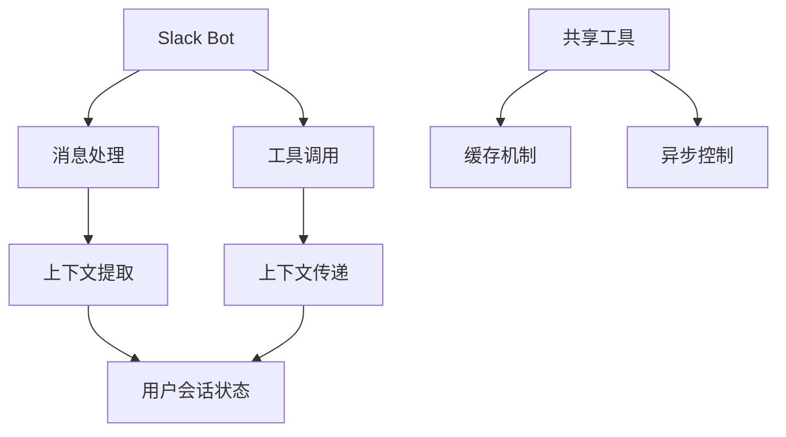
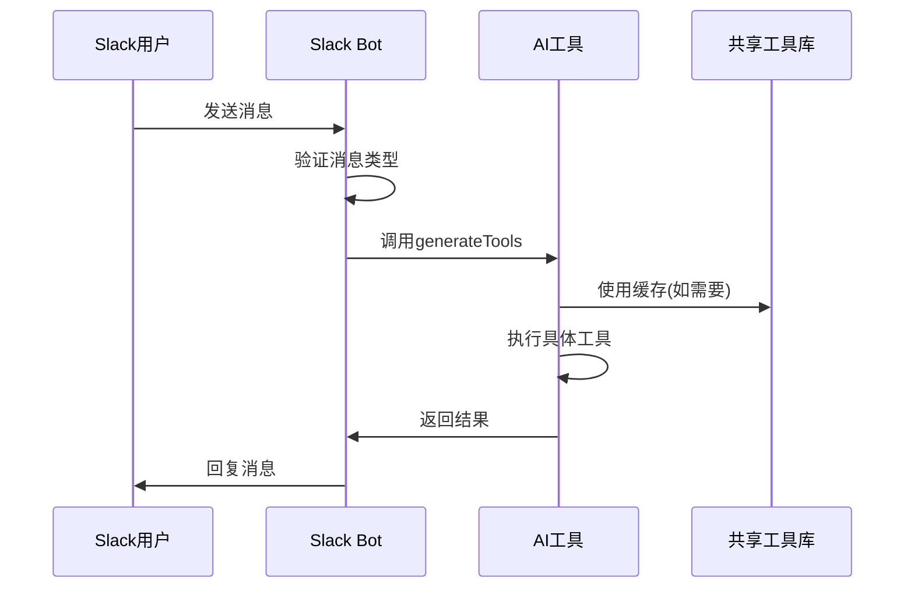
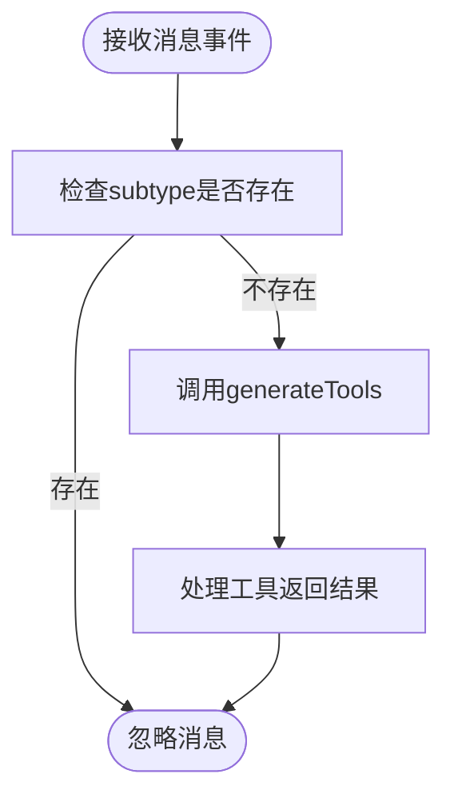
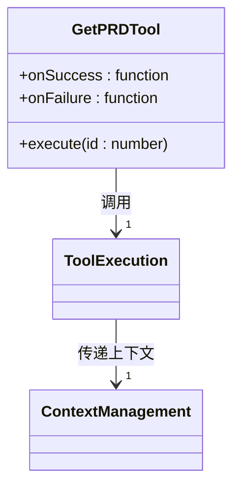
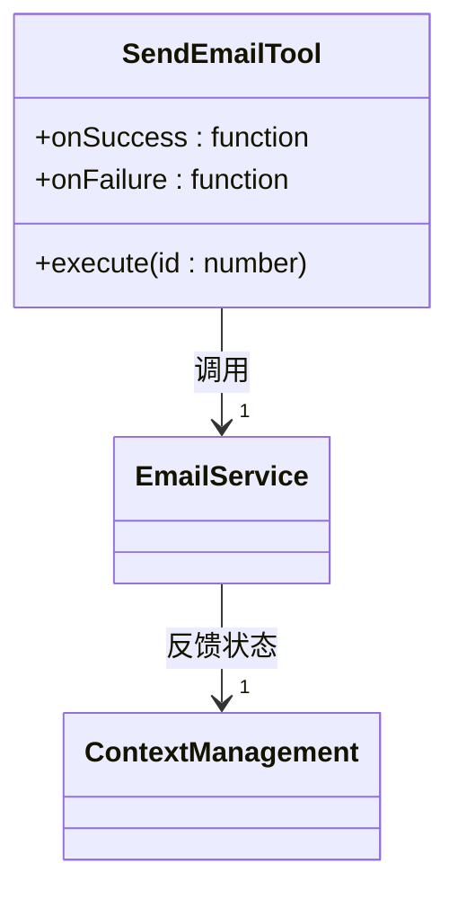
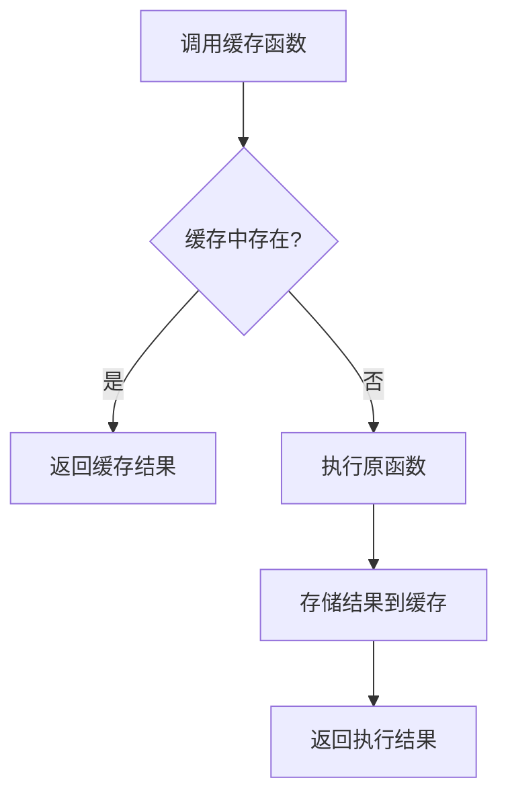
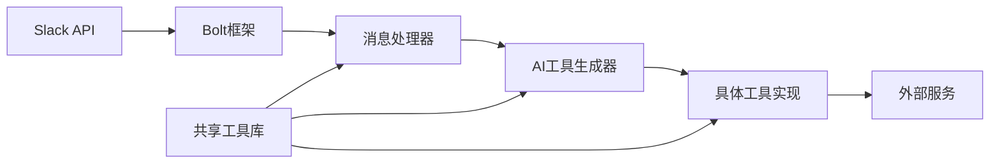

# 上下文管理

<cite>
**本文档中引用的文件**  
- [bot.ts](file://packages/ai/src/services/slack/bot.ts)
- [index.ts](file://packages/ai/src/services/slack/tools/index.ts)
- [getPRD.ts](file://packages/ai/src/services/slack/tools/getPRD.ts)
- [sendEmail.ts](file://packages/ai/src/services/slack/tools/sendEmail.ts)
- [slack.ts](file://packages/file/src/commands/ast/slack.ts)
- [common.ts](file://packages/shared/src/utils/common.ts)
</cite>

## 目录
1. [简介](#简介)
2. [项目结构](#项目结构)
3. [核心组件](#核心组件)
4. [架构概述](#架构概述)
5. [详细组件分析](#详细组件分析)
6. [依赖分析](#依赖分析)
7. [性能考虑](#性能考虑)
8. [故障排除指南](#故障排除指南)
9. [结论](#结论)

## 简介
本文档详细描述了nemo-cli如何在Slack环境中管理用户会话上下文。重点包括对话历史存储、上下文生命周期管理、跨命令数据共享机制，以及基于用户ID和会话ID的上下文隔离策略。同时涵盖内存与持久化存储的选择逻辑、上下文过期策略、容量限制和清理机制，并通过实际代码路径说明状态一致性维护方法。

## 项目结构
nemo-cli的Slack上下文管理功能主要分布在`packages/ai/src/services/slack`目录下，包含机器人核心逻辑、工具集成和消息处理。上下文相关的辅助函数则位于共享包`packages/shared`中，提供缓存和异步处理支持。

**Diagram sources**
- [bot.ts](file://packages/ai/src/services/slack/bot.ts#L72-L78)
- [common.ts](file://packages/shared/src/utils/common.ts#L1-L8)

**Section sources**
- [bot.ts](file://packages/ai/src/services/slack/bot.ts)
- [common.ts](file://packages/shared/src/utils/common.ts)

## 核心组件
系统通过Slack Bolt框架接收消息事件，并结合AI工具调用机制实现上下文感知的交互。核心组件包括消息处理器、工具执行器和共享工具库，共同维护用户会话状态。

**Section sources**
- [bot.ts](file://packages/ai/src/services/slack/bot.ts#L72-L78)
- [index.ts](file://packages/ai/src/services/slack/tools/index.ts#L14-L71)

## 架构概述
系统采用事件驱动架构，当用户在Slack中发送消息时，Bolt框架触发消息处理中间件。系统解析用户意图，调用相应工具，并在工具执行过程中维护上下文状态。上下文通过闭包和回调函数在不同组件间传递。

**Diagram sources**
- [bot.ts](file://packages/ai/src/services/slack/bot.ts#L72-L78)
- [index.ts](file://packages/ai/src/services/slack/tools/index.ts#L14-L71)

## 详细组件分析

### 消息处理组件分析
消息处理组件负责接收和初步处理Slack消息事件。它过滤子消息类型，并将纯文本消息传递给AI工具生成器进行上下文处理。

**Diagram sources**
- [bot.ts](file://packages/ai/src/services/slack/bot.ts#L72-L78)

**Section sources**
- [bot.ts](file://packages/ai/src/services/slack/bot.ts#L72-L78)

### 工具执行组件分析
工具执行组件实现具体的业务逻辑，如获取PRD文档或发送邮件。这些工具通过回调函数维护上下文状态，在成功或失败时执行相应的上下文更新操作。

#### 获取PRD工具

**Diagram sources**
- [getPRD.ts](file://packages/ai/src/services/slack/tools/getPRD.ts#L10-L35)

#### 发送邮件工具

**Diagram sources**
- [sendEmail.ts](file://packages/ai/src/services/slack/tools/sendEmail.ts#L10-L28)

**Section sources**
- [getPRD.ts](file://packages/ai/src/services/slack/tools/getPRD.ts)
- [sendEmail.ts](file://packages/ai/src/services/slack/tools/sendEmail.ts)

### 缓存管理组件分析
共享工具库提供简单的内存缓存机制，用于优化重复请求的处理性能。该机制通过Map对象存储函数调用结果，实现基于参数的内容缓存。

**Diagram sources**
- [common.ts](file://packages/shared/src/utils/common.ts#L1-L8)

**Section sources**
- [common.ts](file://packages/shared/src/utils/common.ts#L1-L8)

## 依赖分析
系统依赖Slack Bolt框架处理消息事件，依赖AI SDK进行工具调用，并通过共享包提供通用工具函数。各组件通过清晰的接口契约进行交互，确保上下文信息的正确传递。

**Diagram sources**
- [bot.ts](file://packages/ai/src/services/slack/bot.ts)
- [index.ts](file://packages/ai/src/services/slack/tools/index.ts)
- [common.ts](file://packages/shared/src/utils/common.ts)

**Section sources**
- [bot.ts](file://packages/ai/src/services/slack/bot.ts)
- [index.ts](file://packages/ai/src/services/slack/tools/index.ts)
- [common.ts](file://packages/shared/src/utils/common.ts)

## 性能考虑
系统通过内存缓存机制减少重复计算，提高响应速度。异步处理确保消息响应不会阻塞主线程。对于大量数据处理，建议实施分页和流式传输策略以优化内存使用。

## 故障排除指南
当遇到上下文管理问题时，应首先检查消息事件的subtype属性过滤逻辑，确保正确处理消息类型。对于工具执行失败，应验证回调函数的上下文传递是否正确，并检查外部服务的连接状态。

**Section sources**
- [bot.ts](file://packages/ai/src/services/slack/bot.ts#L72-L78)
- [getPRD.ts](file://packages/ai/src/services/slack/tools/getPRD.ts#L20-L31)
- [sendEmail.ts](file://packages/ai/src/services/slack/tools/sendEmail.ts#L17-L23)

## 结论
nemo-cli通过事件驱动架构和回调机制有效管理Slack用户会话上下文。系统利用内存缓存优化性能，通过清晰的组件分离确保上下文信息的正确传递。未来可考虑引入更复杂的上下文存储策略，如Redis持久化存储，以支持更长的会话生命周期和跨实例上下文共享。