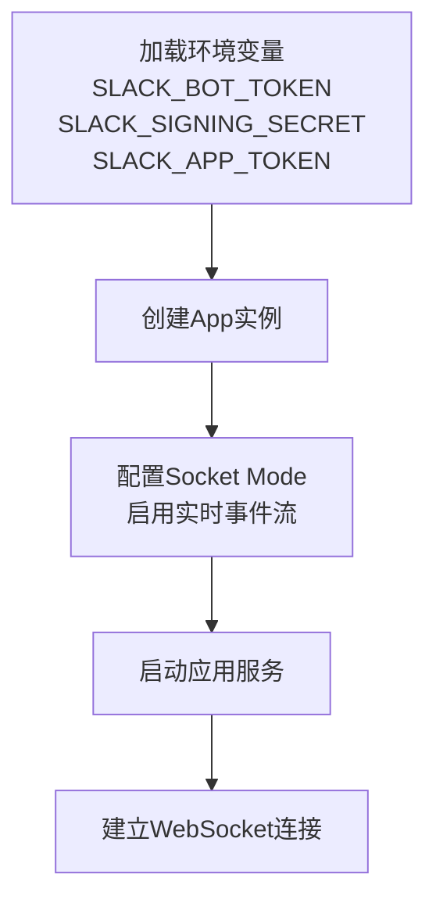
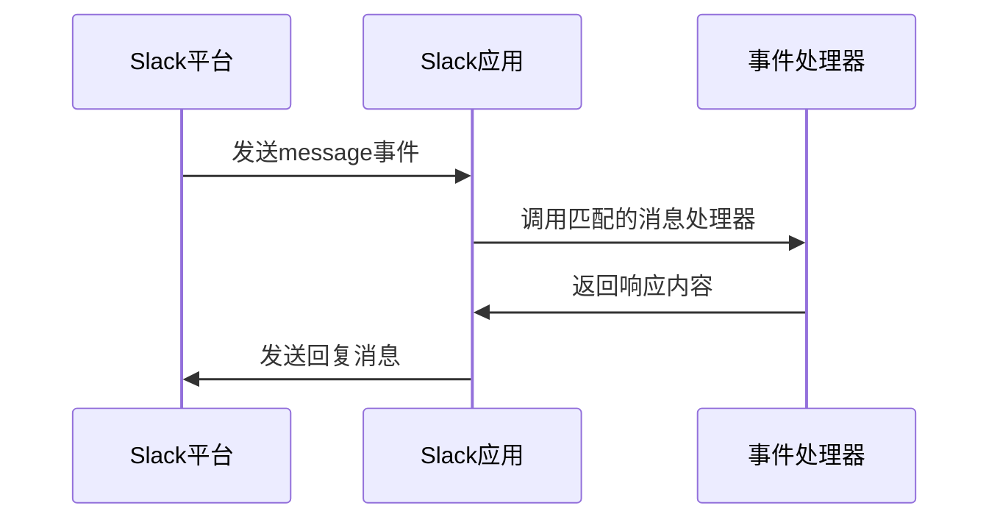
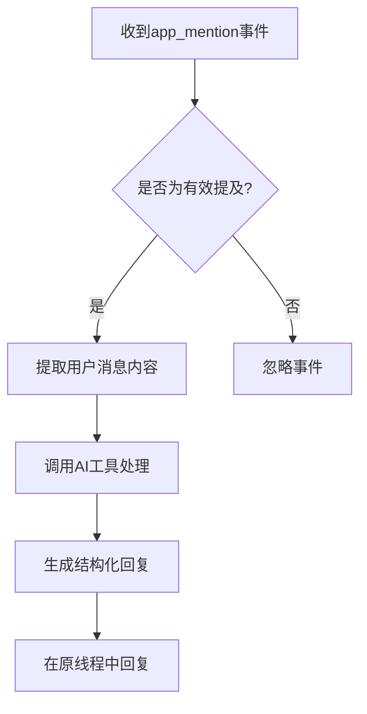
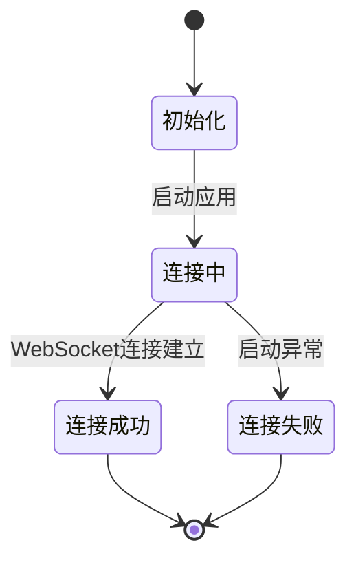
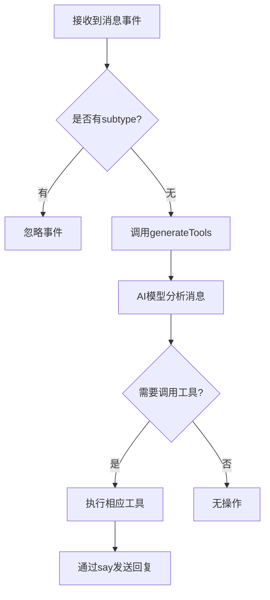

# 事件监听机制

<cite>
**本文档中引用的文件**  
- [bot.ts](file://packages/ai/src/services/slack/bot.ts)
- [index.ts](file://packages/ai/src/index.ts)
- [tools/index.ts](file://packages/ai/src/services/slack/tools/index.ts)
- [getPRD.ts](file://packages/ai/src/services/slack/tools/getPRD.ts)
- [sendEmail.ts](file://packages/ai/src/services/slack/tools/sendEmail.ts)
- [manifest.json](file://packages/ai/manifest.json)
- [package.json](file://package.json)
</cite>

## 目录
1. [简介](#简介)
2. [Slack应用初始化](#slack应用初始化)
3. [事件监听器注册](#事件监听器注册)
4. [事件过滤与正则匹配](#事件过滤与正则匹配)
5. [WebSocket连接管理](#websocket连接管理)
6. [事件订阅与权限配置](#事件订阅与权限配置)
7. [错误处理与日志策略](#错误处理与日志策略)
8. [事件处理器生命周期](#事件处理器生命周期)

## 简介
本文档详细说明nemo-cli项目中基于@slack/bolt框架的Slack事件监听机制。该机制实现了机器人对Slack平台各类事件的响应能力，包括消息监听、用户提及处理、交互操作响应等功能。系统通过WebSocket连接实现低延迟通信，并具备完善的错误恢复机制。

## Slack应用初始化

nemo-cli使用@slack/bolt框架初始化Slack应用实例，通过环境变量注入认证凭据。应用配置启用了Socket Mode，实现双向通信通道。



**图示来源**  
- [bot.ts](file://packages/ai/src/services/slack/bot.ts#L7-L12)
- [manifest.json](file://packages/ai/manifest.json#L31)

**本节来源**  
- [bot.ts](file://packages/ai/src/services/slack/bot.ts#L1-L12)
- [index.ts](file://packages/ai/src/index.ts#L5)
- [package.json](file://package.json#L50)

## 事件监听器注册

系统通过`app.message()`和`app.event()`方法注册事件监听器，支持多种事件类型和触发条件。

### 消息事件监听
使用`app.message()`方法监听频道消息事件，可设置文本匹配条件：



### 特定事件监听
使用`app.event()`监听特定事件类型，如`app_mention`：



**图示来源**  
- [bot.ts](file://packages/ai/src/services/slack/bot.ts#L44-L54)
- [bot.ts](file://packages/ai/src/services/slack/bot.ts#L81-L96)

**本节来源**  
- [bot.ts](file://packages/ai/src/services/slack/bot.ts#L44-L96)

## 事件过滤与正则匹配

事件处理器支持多种过滤机制，确保只处理相关事件。

### 子类型过滤
通过检查`message.subtype`字段过滤消息类型，避免重复响应：

```typescript
if (message.subtype) return
```

### 文本模式匹配
支持正则表达式和文本匹配，如监听挥手表情：

```typescript
app.message(':wave:', async ({ message, say }) => {
  await say(`Hello, <@${message.user}>`)
})
```

### 提及事件处理
使用正则表达式清理提及内容：

```typescript
const REPLACE_BOT_EXPRESSION = /<@.*?>/
const userMessage = event.text.replace(REPLACE_BOT_EXPRESSION, '').trim()
```

**本节来源**  
- [bot.ts](file://packages/ai/src/services/slack/bot.ts#L73)
- [bot.ts](file://packages/ai/src/services/slack/bot.ts#L80-L83)

## WebSocket连接管理

系统采用Socket Mode实现持久化连接，具备心跳检测和自动重连能力。

### 连接初始化
应用启动时自动建立WebSocket连接：

```typescript
await app.start(process.env.PORT || 3000)
```

### 连接状态监控
通过spinner组件提供可视化启动状态反馈：



**图示来源**  
- [bot.ts](file://packages/ai/src/services/slack/bot.ts#L102-L111)

**本节来源**  
- [bot.ts](file://packages/ai/src/services/slack/bot.ts#L102-L111)
- [manifest.json](file://packages/ai/manifest.json#L31)

## 事件订阅与权限配置

通过manifest.json文件声明事件订阅和权限范围。

### 事件订阅配置
订阅消息频道事件：

```json
"event_subscriptions": {
  "bot_events": ["message.channels"]
}
```

### 权限范围设置
定义机器人所需权限：

```json
"oauth_config": {
  "scopes": {
    "bot": ["channels:history", "chat:write"]
  }
}
```

这些权限允许机器人读取频道历史消息和发送消息。

**本节来源**  
- [manifest.json](file://packages/ai/manifest.json#L19-L26)

## 错误处理与日志策略

系统实现了全面的错误处理和日志记录机制。

### 异常捕获
在关键操作中使用try-catch捕获异常：

```typescript
try {
  await app.start()
} catch (error) {
  console.error('Error starting Slack Bot:', error)
}
```

### 事件处理错误
在事件处理器中捕获并记录错误：

```typescript
app.event('app_mention', async ({ event, say }) => {
  try {
    // 处理逻辑
  } catch (error) {
    console.error('Error responding to mention:', error)
  }
})
```

### 工具执行错误
通过回调函数处理工具执行失败：

```typescript
onFailure: () => {
  say({
    blocks: [{ type: 'section', text: { type: 'mrkdwn', text: '获取需求文档地址失败' } }],
    text: '获取需求文档地址失败',
  })
}
```

**本节来源**  
- [bot.ts](file://packages/ai/src/services/slack/bot.ts#L97-L99)
- [bot.ts](file://packages/ai/src/services/slack/bot.ts#L107-L109)
- [getPRD.ts](file://packages/ai/src/services/slack/tools/getPRD.ts#L22)
- [sendEmail.ts](file://packages/ai/src/services/slack/tools/sendEmail.ts#L19)

## 事件处理器生命周期

事件处理器具有明确的执行生命周期和调用顺序。

### 主消息处理器
通用消息处理器调用AI工具系统：



### 工具回调机制
工具执行完成后通过回调函数发送回复：

```typescript
onSuccess: (content) => {
  say({
    blocks: [...],
    text: `<@${message.user}>`,
  })
}
```

**图示来源**  
- [tools/index.ts](file://packages/ai/src/services/slack/tools/index.ts#L14-L71)

**本节来源**  
- [bot.ts](file://packages/ai/src/services/slack/bot.ts#L72-L78)
- [tools/index.ts](file://packages/ai/src/services/slack/tools/index.ts#L14-L71)
- [getPRD.ts](file://packages/ai/src/services/slack/tools/getPRD.ts#L21-L31)
- [sendEmail.ts](file://packages/ai/src/services/slack/tools/sendEmail.ts#L18-L23)