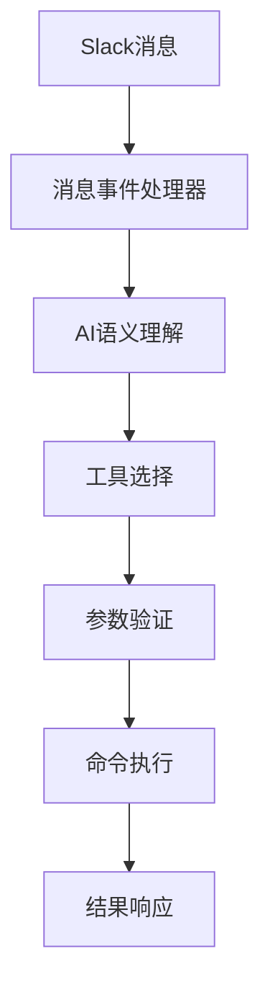
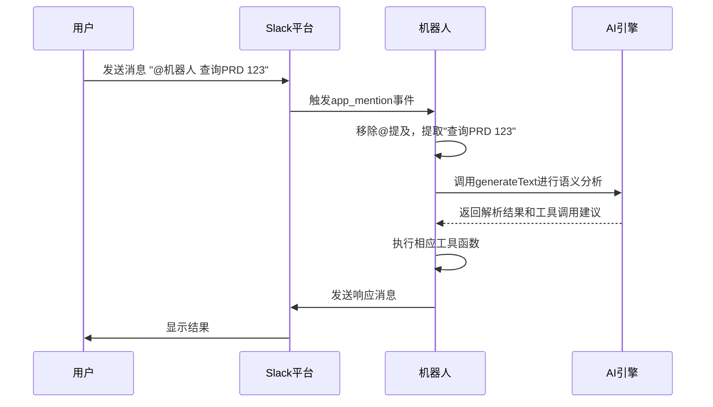
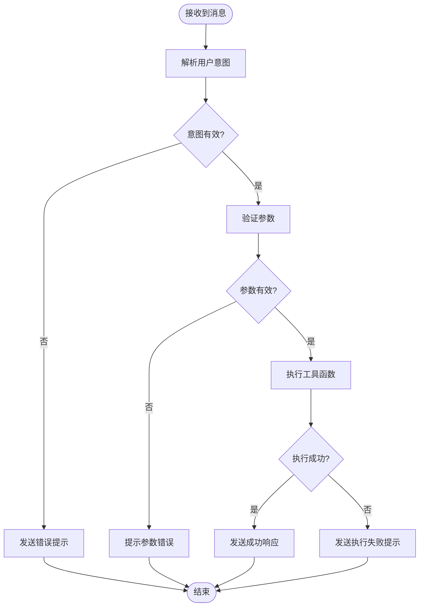

# 命令解析流程

<cite>
**本文档引用的文件**  
- [slack.ts](file://packages/file/src/commands/ast/slack.ts)
- [command.ts](file://packages/shared/src/utils/command.ts)
- [bot.ts](file://packages/ai/src/services/slack/bot.ts)
- [index.ts](file://packages/ai/src/services/slack/tools/index.ts)
- [getPRD.ts](file://packages/ai/src/services/slack/tools/getPRD.ts)
- [sendEmail.ts](file://packages/ai/src/services/slack/tools/sendEmail.ts)
</cite>

## 目录
1. [简介](#简介)
2. [命令解析架构](#命令解析架构)
3. [Slack消息处理流程](#slack消息处理流程)
4. [命令路由与工具集成](#命令路由与工具集成)
5. [参数提取与验证机制](#参数提取与验证机制)
6. [MCP协议在命令序列化中的作用](#mcp协议在命令序列化中的作用)
7. [上下文感知解析实现](#上下文感知解析实现)
8. [错误处理与帮助信息生成](#错误处理与帮助信息生成)
9. [多步交互解析机制](#多步交互解析机制)
10. [总结](#总结)

## 简介
本项目实现了一套基于Slack的智能命令解析系统，能够将用户的自然语言输入转换为可执行的机器指令。系统采用AI驱动的方式，通过语义理解将用户意图映射到具体的工具函数调用。该流程涵盖了从消息接收、意图识别、参数解析到命令执行的完整链条，支持复杂的上下文感知和多轮交互。

**Section sources**
- [bot.ts](file://packages/ai/src/services/slack/bot.ts#L1-L112)

## 命令解析架构
系统采用分层架构设计，包含消息接收层、语义理解层、命令路由层和执行层。消息接收层负责监听Slack事件，语义理解层使用AI模型解析用户意图，命令路由层将意图映射到具体工具，执行层负责调用相应的业务逻辑。



**Diagram sources**
- [bot.ts](file://packages/ai/src/services/slack/bot.ts#L72-L78)
- [index.ts](file://packages/ai/src/services/slack/tools/index.ts#L14-L71)

## Slack消息处理流程
系统通过Slack Bolt框架监听消息事件。当用户在Slack中发送消息时，系统会触发消息处理函数。对于@提及机器人的消息，系统会移除提及部分并提取纯文本内容进行后续处理。消息处理器会过滤掉系统消息、机器人消息等非用户直接输入的消息类型。



**Diagram sources**
- [bot.ts](file://packages/ai/src/services/slack/bot.ts#L80-L99)
- [slack.ts](file://packages/file/src/commands/ast/slack.ts#L84-L95)

## 命令路由与工具集成
系统通过工具注册机制实现命令路由。每个可执行功能都被定义为一个工具，包含描述、输入模式和执行函数。当AI模型识别出用户意图时，会匹配相应的工具进行调用。工具通过高阶函数接收成功和失败回调，实现异步结果处理。

```mermaid
classDiagram
class Tool {
+description : string
+inputSchema : ZodSchema
+execute(input) : Promise<any>
}
class GetPRDTool {
+execute({id}) : Promise<PRDContent>
}
class SendEmailTool {
+execute({id}) : Promise<EmailResult>
}
class ToolRegistry {
+tools : Tool[]
+register(tool) : void
+findByName(name) : Tool
}
Tool <|-- GetPRDTool
Tool <|-- SendEmailTool
ToolRegistry --> Tool : 包含
```

**Diagram sources**
- [getPRD.ts](file://packages/ai/src/services/slack/tools/getPRD.ts#L10-L35)
- [sendEmail.ts](file://packages/ai/src/services/slack/tools/sendEmail.ts#L10-L28)
- [index.ts](file://packages/ai/src/services/slack/tools/index.ts#L12-L13)

## 参数提取与验证机制
系统使用Zod库定义严格的输入模式验证规则。每个工具都配置了输入模式，系统会在执行前自动验证参数的完整性和类型正确性。如果参数缺失或格式错误，系统会通过预设的失败回调返回友好的错误提示，而不是直接抛出异常。

**Section sources**
- [getPRD.ts](file://packages/ai/src/services/slack/tools/getPRD.ts#L14-L19)
- [sendEmail.ts](file://packages/ai/src/services/slack/tools/sendEmail.ts#L14-L16)

## MCP协议在命令序列化中的作用
虽然代码中未直接体现MCP协议的具体实现，但从`executeSendReleaseMail`函数引用可以看出，系统通过MCP协议标准化邮件发送流程。该协议可能定义了命令序列化的格式规范，确保不同系统间的命令交互具有一致的数据结构和通信协议。

**Section sources**
- [sendEmail.ts](file://packages/ai/src/services/slack/tools/sendEmail.ts#L4-L5)

## 上下文感知解析实现
系统具备基本的上下文感知能力，主要体现在对话上下文的保持上。当用户在消息线程中回复时，系统会将响应发送到同一消息线程，保持对话的连贯性。此外，通过AI模型的上下文理解能力，系统能够识别与之前对话相关的后续指令。

**Section sources**
- [bot.ts](file://packages/ai/src/services/slack/bot.ts#L95-L96)

## 错误处理与帮助信息生成
系统采用结构化的错误处理机制。每个工具都配置了明确的成功和失败回调函数，确保异常情况能够被优雅处理。当参数验证失败或业务逻辑执行出错时，系统会返回预定义的错误消息，而不是暴露技术细节给最终用户，提升了用户体验。



**Diagram sources**
- [getPRD.ts](file://packages/ai/src/services/slack/tools/getPRD.ts#L21-L28)
- [sendEmail.ts](file://packages/ai/src/services/slack/tools/sendEmail.ts#L18-L20)

## 多步交互解析机制
当前实现主要支持单步命令执行，但通过Slack的消息线程功能为多步交互提供了基础支持。系统可以基于前序对话的上下文处理后续指令，虽然没有实现复杂的多轮对话状态管理，但为未来扩展提供了良好的架构基础。

**Section sources**
- [bot.ts](file://packages/ai/src/services/slack/bot.ts#L95-L96)

## 总结
本命令解析系统通过AI驱动的方式实现了从自然语言到机器指令的转换。系统架构清晰，各组件职责分明，通过工具化设计实现了良好的扩展性。未来可进一步增强多轮对话管理能力，引入更复杂的上下文状态跟踪，支持需要多步确认和交互的复杂命令场景。