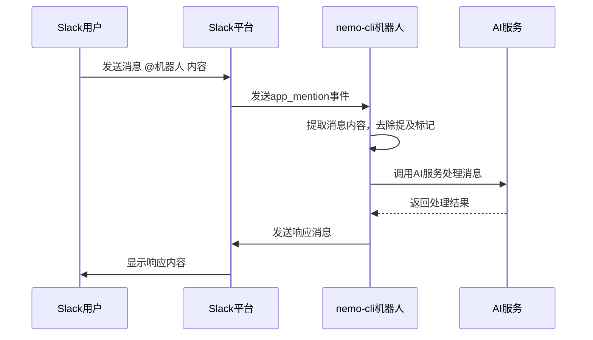
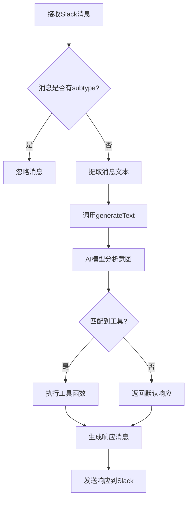
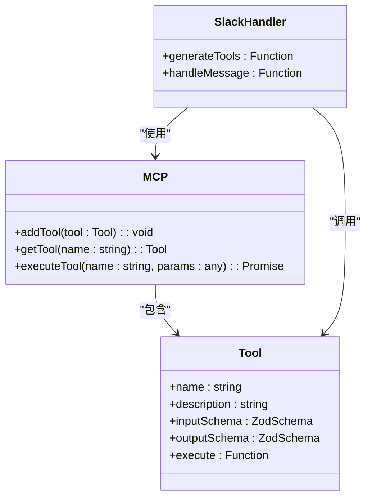
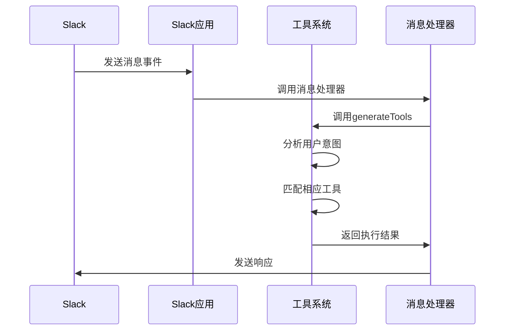

# 消息处理机制

<cite>
**本文档中引用的文件**  
- [bot.ts](file://packages/ai/src/services/slack/bot.ts)
- [index.ts](file://packages/ai/src/services/slack/tools/index.ts)
- [getPRD.ts](file://packages/ai/src/services/slack/tools/getPRD.ts)
- [sendEmail.ts](file://packages/ai/src/services/slack/tools/sendEmail.ts)
- [mcp.ts](file://packages/ai/src/services/mails/mcp.ts)
- [confluence/mcp.ts](file://packages/ai/src/services/confluence/mcp.ts)
- [index.ts](file://packages/ai/src/index.ts)
</cite>

## 目录
1. [简介](#简介)
2. [Slack事件监听与响应机制](#slack事件监听与响应机制)
3. [事件处理管道流程](#事件处理管道流程)
4. [MCP协议在消息处理中的作用](#mcp协议在消息处理中的作用)
5. [中间件注册与事件过滤](#中间件注册与事件过滤)
6. [错误处理实现](#错误处理实现)
7. [消息处理器注册与上下文管理](#消息处理器注册与上下文管理)
8. [总结](#总结)

## 简介
nemo-cli通过集成@slack/bolt框架实现了强大的Slack消息处理能力。该系统能够监听和响应多种Slack事件，包括消息、交互和事件订阅。本系统结合MCP（Modular Command Protocol）协议，实现了命令的序列化与反序列化，支持复杂的业务逻辑处理。整个消息处理机制构建了一个从接收消息到解析用户意图的完整管道。

**Section sources**
- [bot.ts](file://packages/ai/src/services/slack/bot.ts#L1-L112)
- [index.ts](file://packages/ai/src/index.ts#L1-L20)

## Slack事件监听与响应机制
nemo-cli使用@slack/bolt框架初始化Slack应用，通过配置token、signingSecret和socketMode等参数建立与Slack平台的连接。系统注册了多种事件监听器来处理不同类型的消息和交互。

核心事件监听包括：
- `app.message(':wave:')`：响应用户发送的波浪表情，自动回复问候语
- `app.action()`：处理按钮点击等交互事件
- `app.event('app_mention')`：监听应用被提及的事件，提取用户消息内容并进行响应

当用户在Slack中提及机器人时，系统会提取消息内容，去除机器人提及标记，然后构造响应消息。响应消息支持Markdown格式和交互式组件，如按钮，可以引导用户进行进一步操作。

**Diagram sources**
- [bot.ts](file://packages/ai/src/services/slack/bot.ts#L80-L99)

**Section sources**
- [bot.ts](file://packages/ai/src/services/slack/bot.ts#L1-L112)

## 事件处理管道流程
nemo-cli的消息处理管道从接收Slack事件开始，经过一系列处理步骤，最终生成响应。管道的核心是`generateTools`函数，它负责解析用户意图并调用相应的工具。

处理流程如下：
1. 接收Slack消息事件
2. 验证消息类型，过滤子消息类型（subtype）
3. 提取纯文本内容
4. 调用AI模型分析用户意图
5. 匹配并执行相应的工具函数
6. 生成响应消息并发送

系统通过AI模型的`generateText`功能，将用户消息作为提示（prompt）输入，模型根据预定义的工具集判断需要调用哪个工具。这种设计使得系统能够智能地理解用户意图并执行相应操作。

**Diagram sources**
- [bot.ts](file://packages/ai/src/services/slack/bot.ts#L72-L78)
- [index.ts](file://packages/ai/src/services/slack/tools/index.ts#L14-L71)

**Section sources**
- [bot.ts](file://packages/ai/src/services/slack/bot.ts#L72-L78)
- [index.ts](file://packages/ai/src/services/slack/tools/index.ts#L14-L71)

## MCP协议在消息处理中的作用
MCP（Modular Command Protocol）协议在nemo-cli的消息处理中扮演着核心角色，实现了命令的序列化与反序列化，以及模块间的标准化通信。

MCP协议的主要作用包括：
- **工具注册**：通过`server.addTool`方法注册可调用的工具
- **参数验证**：使用zod库定义严格的输入输出模式
- **命令执行**：提供统一的执行接口，确保工具调用的一致性

在Slack消息处理中，MCP协议通过AI工具系统实现。每个工具都定义了`inputSchema`和`outputSchema`，确保输入参数的正确性和输出结果的规范性。当AI模型识别出需要调用某个工具时，会按照MCP协议的规范进行序列化调用。

**Diagram sources**
- [mcp.ts](file://packages/ai/src/services/confluence/mcp.ts#L8-L39)
- [mcp.ts](file://packages/ai/src/services/mails/mcp.ts#L18-L27)

**Section sources**
- [mcp.ts](file://packages/ai/src/services/confluence/mcp.ts#L8-L39)
- [mcp.ts](file://packages/ai/src/services/mails/mcp.ts#L18-L27)

## 中间件注册与事件过滤
nemo-cli通过@slack/bolt框架的中间件机制实现了灵活的事件处理和过滤。系统在事件处理管道中注册了多个中间件，用于处理不同类型的事件。

事件过滤主要通过检查消息的`subtype`属性实现。系统会忽略`bot_message`、`file_share`等子类型的消息，只处理用户直接发送的新消息。这种过滤机制避免了对机器人自身消息或其他系统消息的重复响应。

中间件注册示例如下：
- 消息中间件：处理普通消息，调用AI工具
- 交互中间件：处理按钮点击等交互事件
- 事件中间件：处理应用提及等特定事件

系统还实现了自定义的事件处理逻辑，如波浪表情响应，展示了如何通过简单的模式匹配实现特定的用户交互。

**Section sources**
- [bot.ts](file://packages/ai/src/services/slack/bot.ts#L44-L54)
- [bot.ts](file://packages/ai/src/services/slack/bot.ts#L72-L78)

## 错误处理实现
nemo-cli实现了多层次的错误处理机制，确保系统的稳定性和用户体验。

主要错误处理策略包括：
- **异步错误捕获**：使用try-catch块捕获异步操作中的错误
- **具体错误类型处理**：针对不同错误类型（如平台错误）进行专门处理
- **用户友好反馈**：向用户返回有意义的错误信息，而不是技术细节

在Slack事件处理中，系统对每个关键操作都进行了错误捕获。例如，在响应应用提及事件时，整个处理流程被包裹在try-catch块中，确保即使处理失败也不会导致机器人崩溃。

对于外部API调用，系统还实现了特定的错误处理逻辑。如在发送Slack消息时，会检查错误代码，区分平台错误和其他未知错误，进行相应的处理。

**Section sources**
- [bot.ts](file://packages/ai/src/services/slack/bot.ts#L97-L109)
- [slack.ts](file://packages/file/src/commands/ast/slack.ts#L103-L109)

## 消息处理器注册与上下文管理
nemo-cli的消息处理器注册机制基于@slack/bolt框架的事件监听模式。系统通过`app.message()`、`app.action()`等方法注册不同类型的处理器。

上下文管理通过Slack Bolt框架提供的上下文对象实现，包括：
- `say`：用于发送消息的函数
- `ack`：用于确认交互事件的函数
- `respond`：用于发送临时响应的函数
- `client`：Slack客户端实例，用于调用API

在工具函数中，系统通过闭包捕获上下文信息，如`onSuccess`和`onFailure`回调函数，这些函数在工具执行成功或失败时被调用，实现对Slack消息的响应。

消息处理器的注册与AI工具系统紧密结合，形成了一个智能的消息处理管道，能够根据用户意图动态调用不同的业务逻辑。

**Diagram sources**
- [bot.ts](file://packages/ai/src/services/slack/bot.ts#L72-L78)
- [index.ts](file://packages/ai/src/services/slack/tools/index.ts#L14-L71)

**Section sources**
- [bot.ts](file://packages/ai/src/services/slack/bot.ts#L72-L78)
- [index.ts](file://packages/ai/src/services/slack/tools/index.ts#L14-L71)

## 总结
nemo-cli的Slack消息处理机制是一个完整的事件驱动系统，通过@slack/bolt框架实现了高效的消息监听和响应。系统结合MCP协议，构建了一个智能的命令处理管道，能够解析用户意图并执行相应的业务逻辑。通过中间件、事件过滤和错误处理机制，确保了系统的稳定性和用户体验。整个架构设计体现了模块化、可扩展和高可用的特点，为复杂的Slack机器人应用提供了坚实的基础。