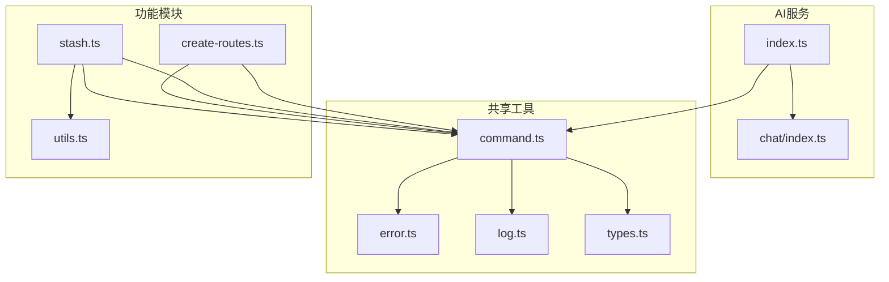
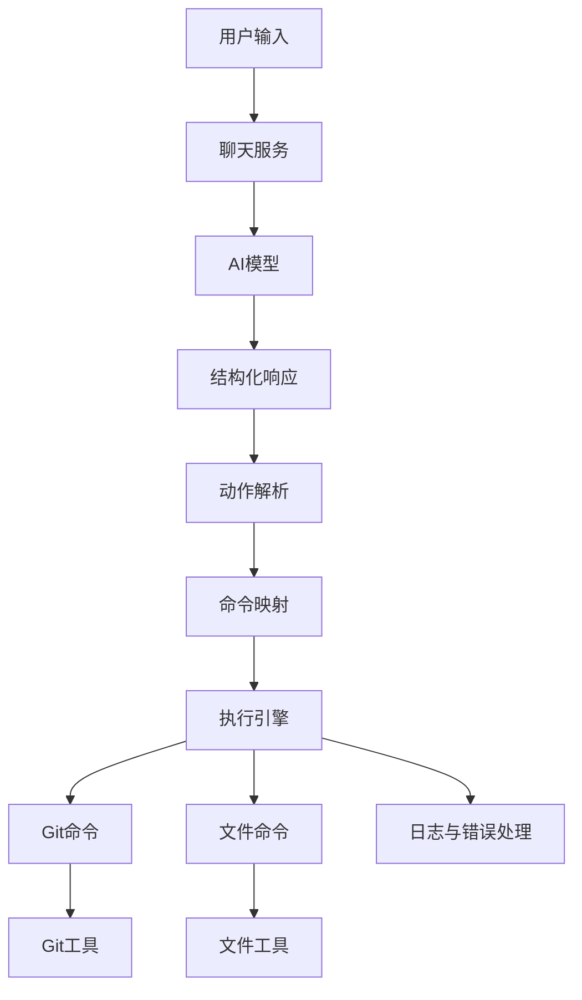
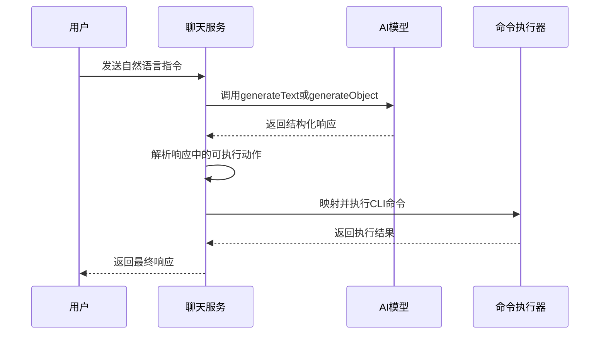
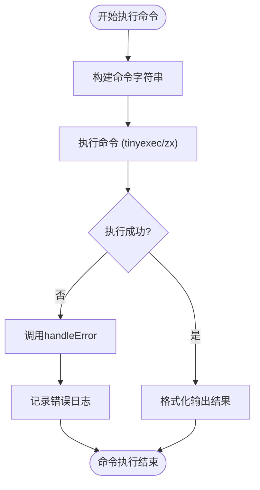
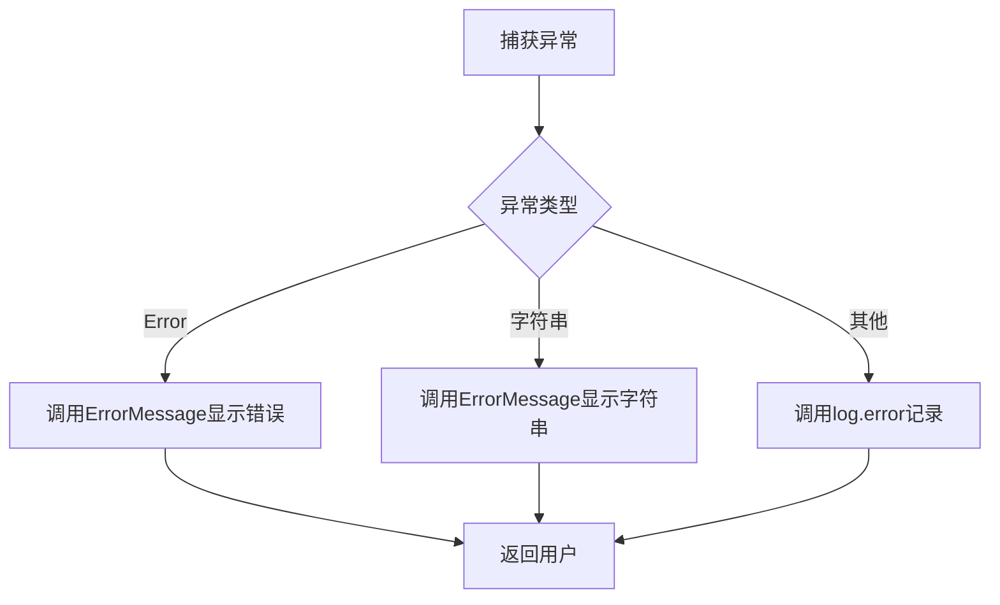
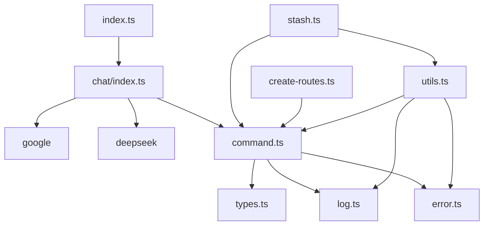

# 响应处理与后执行

<cite>
**本文档中引用的文件**  
- [index.ts](file://packages/ai/src/index.ts)
- [chat/index.ts](file://packages/ai/src/services/chat/index.ts)
- [command.ts](file://packages/shared/src/utils/command.ts)
- [error.ts](file://packages/shared/src/utils/error.ts)
- [log.ts](file://packages/shared/src/utils/log.ts)
- [types.ts](file://packages/shared/src/utils/types.ts)
- [stash.ts](file://packages/git/src/commands/stash.ts)
- [create-routes.ts](file://packages/file/src/commands/create-routes.ts)
- [utils.ts](file://packages/git/src/utils.ts)
</cite>

## 目录
1. [简介](#简介)
2. [项目结构](#项目结构)
3. [核心组件](#核心组件)
4. [架构概述](#架构概述)
5. [详细组件分析](#详细组件分析)
6. [依赖分析](#依赖分析)
7. [性能考虑](#性能考虑)
8. [故障排除指南](#故障排除指南)
9. [结论](#结论)

## 简介
本文档详细阐述了聊天服务中响应处理与后执行机制的设计与实现。系统通过AI模型解析用户自然语言指令，识别其中包含的代码生成、命令调用等可执行动作，并将其映射为具体的CLI命令。文档将解释从“帮我创建路由”到`nf create-routes`的解析逻辑，展示命令的安全执行与输出捕获机制，以及AI生成无效命令时的错误回退策略。最后通过实际案例演示完整工作流：用户提问 → AI生成代码建议 → 自动创建文件 → 调用git stash保存更改。

## 项目结构
本项目采用模块化设计，主要功能分散在多个包中。AI相关功能集中在`packages/ai`目录，共享工具类位于`packages/shared`，而具体的文件操作和Git操作则分别由`packages/file`和`packages/git`提供。

**图示来源**  
- [index.ts](file://packages/ai/src/index.ts)
- [chat/index.ts](file://packages/ai/src/services/chat/index.ts)
- [command.ts](file://packages/shared/src/utils/command.ts)
- [stash.ts](file://packages/git/src/commands/stash.ts)
- [create-routes.ts](file://packages/file/src/commands/create-routes.ts)

**本节来源**  
- [index.ts](file://packages/ai/src/index.ts)
- [command.ts](file://packages/shared/src/utils/command.ts)

## 核心组件
系统的核心组件包括聊天服务、命令执行引擎、错误处理机制和日志系统。聊天服务负责与AI模型交互，生成对象和流式文本；命令执行引擎基于`tinyexec`和`zx`库实现安全的CLI命令执行；错误处理机制确保异常被妥善捕获和报告；日志系统提供结构化的输出和调试信息。

**本节来源**  
- [chat/index.ts](file://packages/ai/src/services/chat/index.ts)
- [command.ts](file://packages/shared/src/utils/command.ts)
- [error.ts](file://packages/shared/src/utils/error.ts)
- [log.ts](file://packages/shared/src/utils/log.ts)

## 架构概述
系统采用分层架构，从上至下分为：用户交互层、AI处理层、命令解析层、执行引擎层和工具服务层。用户输入通过聊天服务传递给AI模型，AI返回结构化响应后，系统解析出可执行动作，通过共享的命令执行工具调用底层Git和文件操作命令。

**图示来源**  
- [chat/index.ts](file://packages/ai/src/services/chat/index.ts)
- [command.ts](file://packages/shared/src/utils/command.ts)
- [stash.ts](file://packages/git/src/commands/stash.ts)
- [create-routes.ts](file://packages/file/src/commands/create-routes.ts)

## 详细组件分析

### 聊天服务分析
聊天服务是系统的核心，负责与AI模型进行交互。它使用`generateObject`和`streamText`等函数从AI模型获取结构化输出或流式文本响应。

#### 对于API服务组件：

**图示来源**  
- [chat/index.ts](file://packages/ai/src/services/chat/index.ts)
- [command.ts](file://packages/shared/src/utils/command.ts)

**本节来源**  
- [chat/index.ts](file://packages/ai/src/services/chat/index.ts)

### 命令执行分析
命令执行机制基于`tinyexec`和`zx`库构建，提供了同步和异步的命令执行能力，并集成了错误处理和日志记录。

#### 对于复杂逻辑组件：

**图示来源**  
- [command.ts](file://packages/shared/src/utils/command.ts)
- [error.ts](file://packages/shared/src/utils/error.ts)
- [log.ts](file://packages/shared/src/utils/log.ts)

**本节来源**  
- [command.ts](file://packages/shared/src/utils/command.ts)

### 错误处理分析
错误处理机制确保系统在遇到异常时能够优雅降级，提供有意义的错误信息，并防止程序崩溃。

**图示来源**  
- [error.ts](file://packages/shared/src/utils/error.ts)
- [log.ts](file://packages/shared/src/utils/log.ts)

**本节来源**  
- [error.ts](file://packages/shared/src/utils/error.ts)

## 依赖分析
系统各组件之间存在清晰的依赖关系，遵循高内聚低耦合的设计原则。

**图示来源**  
- [index.ts](file://packages/ai/src/index.ts)
- [chat/index.ts](file://packages/ai/src/services/chat/index.ts)
- [command.ts](file://packages/shared/src/utils/command.ts)
- [stash.ts](file://packages/git/src/commands/stash.ts)
- [create-routes.ts](file://packages/file/src/commands/create-routes.ts)
- [utils.ts](file://packages/git/src/utils.ts)

**本节来源**  
- [index.ts](file://packages/ai/src/index.ts)
- [command.ts](file://packages/shared/src/utils/command.ts)
- [utils.ts](file://packages/git/src/utils.ts)

## 性能考虑
系统在设计时考虑了性能因素，如使用流式响应避免长时间等待，通过`xASync`函数实现非阻塞命令执行，以及合理的错误处理避免资源泄漏。

## 故障排除指南
当系统出现异常时，应首先检查日志输出，确认错误类型。对于命令执行失败，检查相关CLI工具是否安装；对于AI响应异常，检查API密钥和网络连接。

**本节来源**  
- [error.ts](file://packages/shared/src/utils/error.ts)
- [log.ts](file://packages/shared/src/utils/log.ts)

## 结论
本系统通过集成AI模型与CLI工具，实现了从自然语言到可执行命令的智能转换。其模块化设计和清晰的依赖关系使得系统易于维护和扩展。通过完善的错误处理和日志机制，确保了系统的稳定性和可调试性。