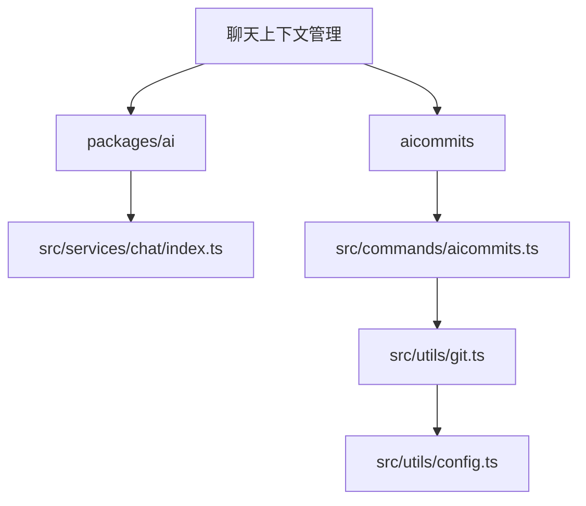
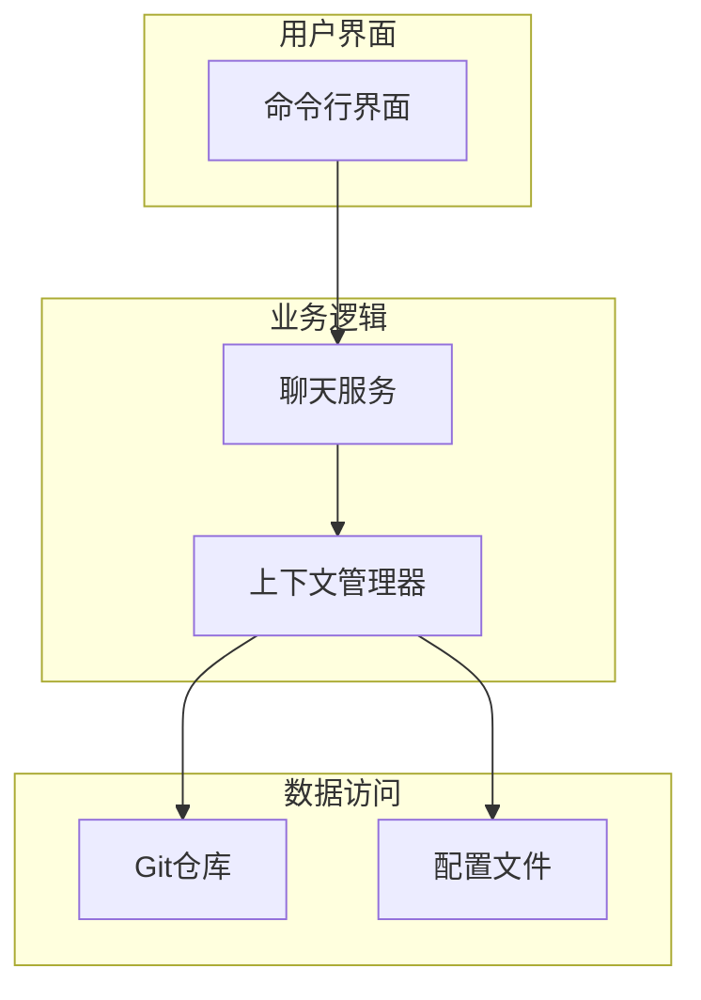
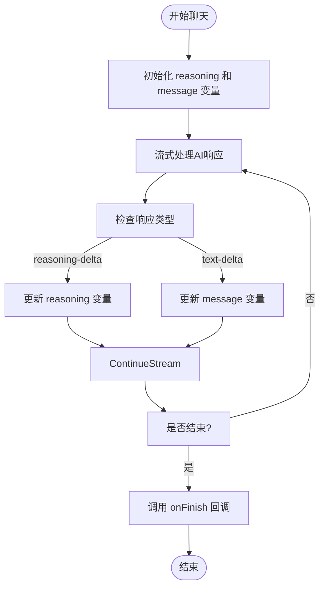
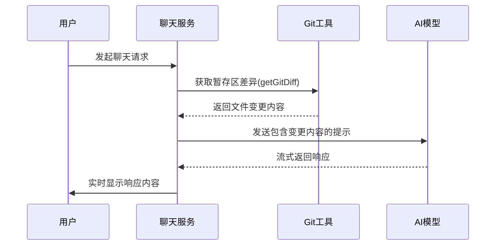
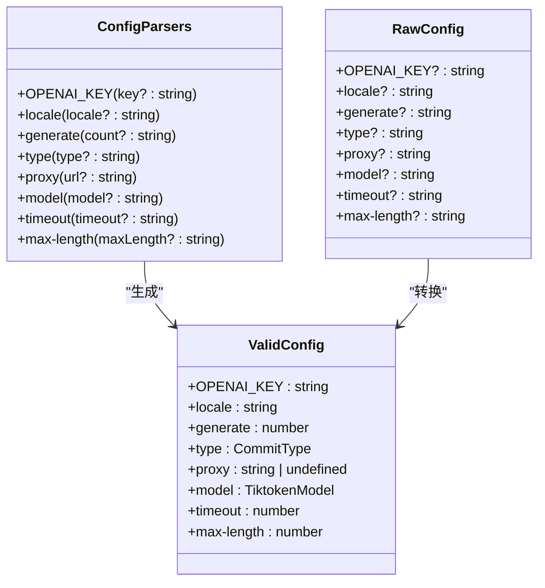

# 聊天上下文管理

<cite>
**本文档中引用的文件**
- [index.ts](file://packages/ai/src/services/chat/index.ts)
- [common.ts](file://packages/shared/src/utils/common.ts)
- [config.ts](file://aicommits/src/utils/config.ts)
- [git.ts](file://aicommits/src/utils/git.ts)
- [aicommits.ts](file://aicommits/src/commands/aicommits.ts)
- [cli.ts](file://aicommits/src/cli.ts)
</cite>

## 目录
1. [简介](#简介)
2. [项目结构](#项目结构)
3. [核心组件](#核心组件)
4. [架构概述](#架构概述)
5. [详细组件分析](#详细组件分析)
6. [依赖分析](#依赖分析)
7. [性能考虑](#性能考虑)
8. [故障排除指南](#故障排除指南)
9. [结论](#结论)

## 简介
本文件详细说明了 `na chat` 命令中聊天上下文管理的实现机制。重点阐述了多轮对话状态的维护方式，包括会话历史记录的存储结构、上下文窗口大小控制、长期记忆机制以及上下文截断策略。同时描述了如何通过 `shared` 模块的工具函数处理上下文序列化与反序列化，讨论上下文泄露风险及隔离机制，并提供性能优化建议。

## 项目结构
项目中的聊天上下文管理功能主要分布在 `packages/ai` 和 `aicommits` 两个模块中。`packages/ai/src/services/chat/index.ts` 文件实现了核心的聊天服务，而 `aicommits` 模块提供了命令行接口和相关工具函数。



**图示来源**
- [index.ts](file://packages/ai/src/services/chat/index.ts)
- [aicommits.ts](file://aicommits/src/commands/aicommits.ts)
- [git.ts](file://aicommits/src/utils/git.ts)
- [config.ts](file://aicommits/src/utils/config.ts)

**本节来源**
- [index.ts](file://packages/ai/src/services/chat/index.ts)
- [aicommits.ts](file://aicommits/src/commands/aicommits.ts)

## 核心组件
系统通过 `useChat` 函数实现聊天上下文管理，该函数利用流式文本生成技术处理用户交互。上下文管理的关键在于维护对话历史记录并根据模型的token限制进行适当截断。

**本节来源**
- [index.ts](file://packages/ai/src/services/chat/index.ts#L64-L99)

## 架构概述
聊天上下文管理采用分层架构，包括用户界面层、业务逻辑层和数据访问层。系统通过 `streamText` API 与AI模型交互，同时利用本地Git状态作为上下文信息源。



**图示来源**
- [index.ts](file://packages/ai/src/services/chat/index.ts)
- [git.ts](file://aicommits/src/utils/git.ts)
- [config.ts](file://aicommits/src/utils/config.ts)

## 详细组件分析

### 上下文存储与管理
系统通过内存中的对象结构存储会话历史记录，使用 `reasoning` 和 `message` 变量分别跟踪AI的推理过程和最终响应。



**图示来源**
- [index.ts](file://packages/ai/src/services/chat/index.ts#L81-L99)

**本节来源**
- [index.ts](file://packages/ai/src/services/chat/index.ts#L64-L99)

### 上下文截断策略
系统通过获取Git差异来控制上下文大小，只包含有变更的文件内容，有效避免超出模型的token限制。



**图示来源**
- [index.ts](file://packages/ai/src/services/chat/index.ts#L13-L57)
- [git.ts](file://aicommits/src/utils/git.ts#L28-L50)

### 配置管理
系统通过配置文件管理上下文相关的参数，如模型选择、超时设置和最大长度限制。



**图示来源**
- [config.ts](file://aicommits/src/utils/config.ts#L23-L118)

**本节来源**
- [config.ts](file://aicommits/src/utils/config.ts)

## 依赖分析
系统依赖于多个外部库和内部模块来实现完整的上下文管理功能。

```mermaid
graph TD
A[聊天上下文管理] --> B[@ai-sdk/google]
A --> C[ai]
A --> D[zod/v4]
A --> E[execa]
A --> F[@clack/prompts]
A --> G[ini]
A --> H[shared模块]
H --> I[common.ts]
H --> J[file.ts]
```

**图示来源**
- [index.ts](file://packages/ai/src/services/chat/index.ts#L2-L5)
- [aicommits.ts](file://aicommits/src/commands/aicommits.ts#L1-L10)
- [config.ts](file://aicommits/src/utils/config.ts#L1-L5)

**本节来源**
- [index.ts](file://packages/ai/src/services/chat/index.ts)
- [aicommits.ts](file://aicommits/src/commands/aicommits.ts)
- [config.ts](file://aicommits/src/utils/config.ts)

## 性能考虑
系统通过多种机制优化上下文管理的性能：

1. **懒加载**：只在需要时获取Git差异
2. **流式处理**：使用 `streamText` 而非 `generateText` 实现实时响应
3. **缓存机制**：在 `common.ts` 中定义了 `cached` 函数用于结果缓存
4. **异步操作**：所有I/O操作均采用异步方式执行

**本节来源**
- [index.ts](file://packages/ai/src/services/chat/index.ts)
- [common.ts](file://packages/shared/src/utils/common.ts)

## 故障排除指南
常见问题及解决方案：

1. **上下文过大导致超时**：检查 `.aicommits` 配置文件中的 `max-length` 设置
2. **Git差异获取失败**：确保在Git仓库中执行命令
3. **API密钥错误**：通过 `aicommits config set OPENAI_KEY=<your token>` 设置有效密钥
4. **代理配置问题**：检查 `https_proxy` 环境变量或配置文件中的代理设置

**本节来源**
- [config.ts](file://aicommits/src/utils/config.ts)
- [error.ts](file://aicommits/src/utils/error.ts)
- [git.ts](file://aicommits/src/utils/git.ts)

## 结论
`na chat` 命令的上下文管理机制通过结合Git状态、配置管理和流式AI响应，实现了高效的多轮对话支持。系统通过合理的上下文截断策略和性能优化措施，确保了在不同场景下的稳定性和响应速度。未来可进一步增强长期记忆机制和跨项目上下文隔离能力。