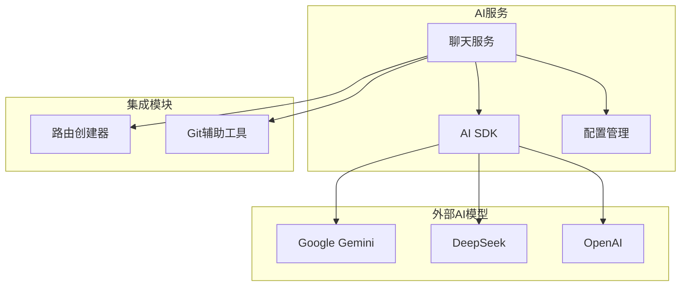
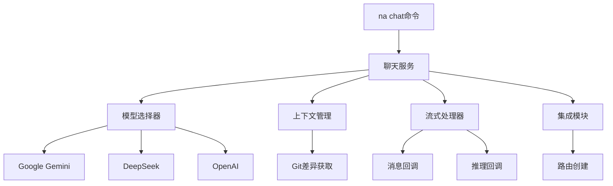
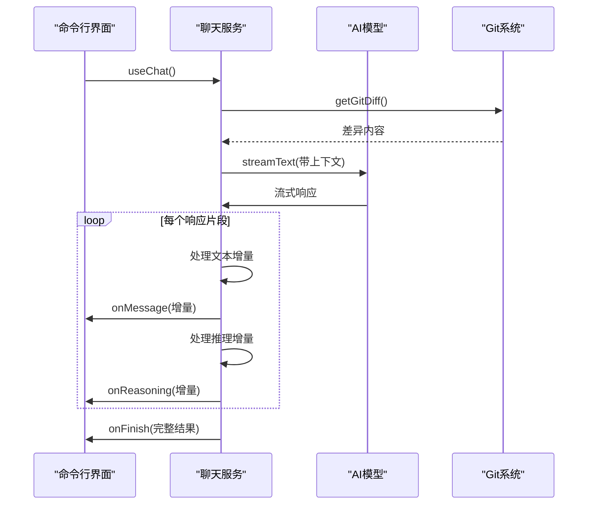

# 聊天服务

<cite>
**本文档中引用的文件**  
- [index.ts](file://packages/ai/src/index.ts)
- [chat/index.ts](file://packages/ai/src/services/chat/index.ts)
- [create-routes.ts](file://packages/file/src/commands/create-routes.ts)
- [package.json](file://packages/ai/package.json)
- [.env.example](file://packages/ai/.env.example)
</cite>

## 目录
1. [介绍](#介绍)
2. [项目结构](#项目结构)
3. [核心组件](#核心组件)
4. [架构概述](#架构概述)
5. [详细组件分析](#详细组件分析)
6. [依赖分析](#依赖分析)
7. [性能考虑](#性能考虑)
8. [故障排除指南](#故障排除指南)
9. [结论](#结论)

## 介绍
本项目实现了一个基于AI的聊天服务，通过`na chat`命令与多种AI模型（包括Google Gemini、DeepSeek等）进行交互。该服务集成了AI SDK，支持多轮对话、上下文管理和历史记录维护，并能与其他模块（如代码生成后自动创建路由）无缝集成。系统通过环境变量配置模型参数，具备完善的错误处理机制。

## 项目结构
聊天服务主要位于`packages/ai`包中，其核心功能实现在`src/services/chat/index.ts`文件中。该服务通过AI SDK与外部模型通信，并通过事件回调机制处理流式响应。与其他模块的集成通过共享的工具包实现。



**Diagram sources**
- [chat/index.ts](file://packages/ai/src/services/chat/index.ts)
- [index.ts](file://packages/ai/src/index.ts)

**Section sources**
- [chat/index.ts](file://packages/ai/src/services/chat/index.ts)
- [index.ts](file://packages/ai/src/index.ts)

## 核心组件
聊天服务的核心组件包括：AI模型适配器、对话管理器、流式响应处理器和集成接口。系统通过`useChat`函数实现流式对话，支持实时消息和推理过程的回调处理。`translateChat`函数提供翻译功能，`getGitDiff`函数获取当前Git变更以提供上下文。

**Section sources**
- [chat/index.ts](file://packages/ai/src/services/chat/index.ts)
- [create-routes.ts](file://packages/file/src/commands/create-routes.ts)

## 架构概述
系统采用模块化架构，通过AI SDK统一接口与不同AI提供商交互。聊天服务作为核心，协调模型调用、上下文管理和外部集成。配置通过环境变量注入，确保安全性。流式响应通过异步迭代器处理，支持实时更新。



**Diagram sources**
- [chat/index.ts](file://packages/ai/src/services/chat/index.ts)
- [create-routes.ts](file://packages/file/src/commands/create-routes.ts)

## 详细组件分析

### 聊天服务分析
聊天服务实现了与AI模型的完整交互流程，包括请求发送、流式响应处理和结果回调。系统通过`streamText`函数实现流式通信，能够实时处理模型的输出。

#### 对象导向组件：
```mermaid
classDiagram
class ChatService {
+useChat(params : ChatParams) Promise~void~
+translateChat(message : string) Promise~Response~
+get() Promise~Result~
}
class ChatParams {
+onMessage(message : string) void
+onReasoning(reasoning : string) void
+onFinish(result : {message, reasoning}) void
}
class ModelAdapter {
+google : GoogleGenerativeAI
+deepseek : DeepSeek
}
ChatService --> ModelAdapter : "使用"
ChatService --> ChatParams : "依赖"
```

**Diagram sources**
- [chat/index.ts](file://packages/ai/src/services/chat/index.ts)

#### API/服务组件：


**Diagram sources**
- [chat/index.ts](file://packages/ai/src/services/chat/index.ts)

**Section sources**
- [chat/index.ts](file://packages/ai/src/services/chat/index.ts)

## 依赖分析
系统依赖于多个AI SDK包和内部共享工具包。主要依赖包括`@ai-sdk/google`、`@ai-sdk/deepseek`、`@ai-sdk/openai`和`ai`核心库。这些依赖通过pnpm workspace机制与项目其他部分集成。

```mermaid
graph TD
ChatService[聊天服务] --> AISDKGoogle[@ai-sdk/google]
ChatService --> AISDKDeepSeek[@ai-sdk/deepseek]
ChatService --> AISDKOpenAI[@ai-sdk/openai]
ChatService --> AICore[ai]
ChatService --> Shared[@nemo-cli/shared]
ChatService --> Git[@nemo-cli/git]
ChatService --> UI[@nemo-cli/ui]
```

**Diagram sources**
- [package.json](file://packages/ai/package.json)

**Section sources**
- [package.json](file://packages/ai/package.json)

## 性能考虑
聊天服务采用流式响应处理，避免了等待完整响应的延迟。通过`streamText`API，系统能够实时显示模型输出，提升用户体验。Git差异获取通过缓存和过滤优化，减少不必要的文件处理。建议配置合理的超时和重试策略以应对网络波动。

## 故障排除指南
常见问题包括API密钥无效、网络连接超时和模型配额耗尽。确保`.env`文件中正确配置了`GOOGLE_API_KEY`等环境变量。对于速率限制，系统应实现指数退避重试机制。调试时可启用详细日志记录以追踪请求流程。

**Section sources**
- [.env.example](file://packages/ai/.env.example)
- [chat/index.ts](file://packages/ai/src/services/chat/index.ts)

## 结论
该聊天服务成功实现了与多种AI模型的集成，提供了流畅的对话体验和强大的上下文管理能力。通过模块化设计和清晰的接口定义，系统易于扩展和维护。与其他开发工具的集成进一步提升了开发效率，形成了完整的AI辅助开发工作流。