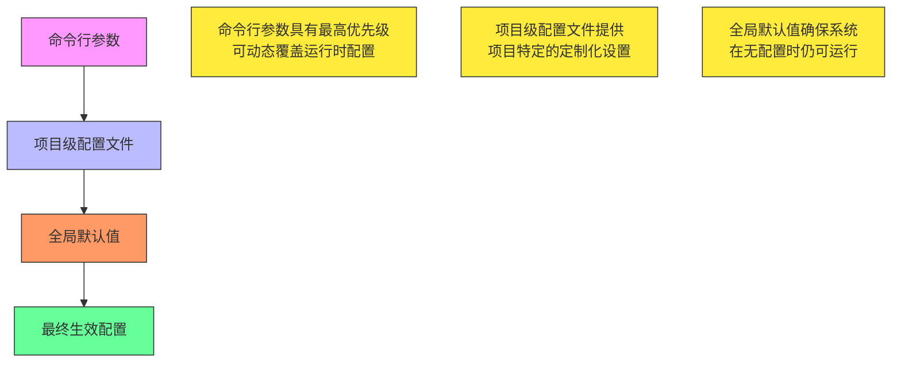
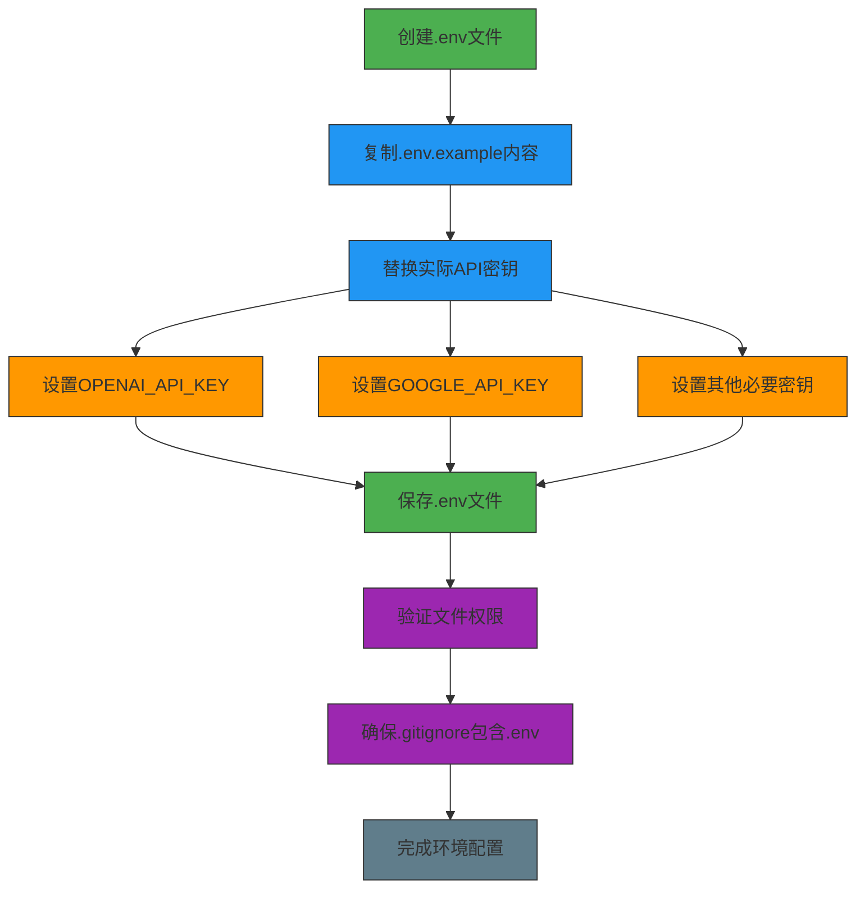
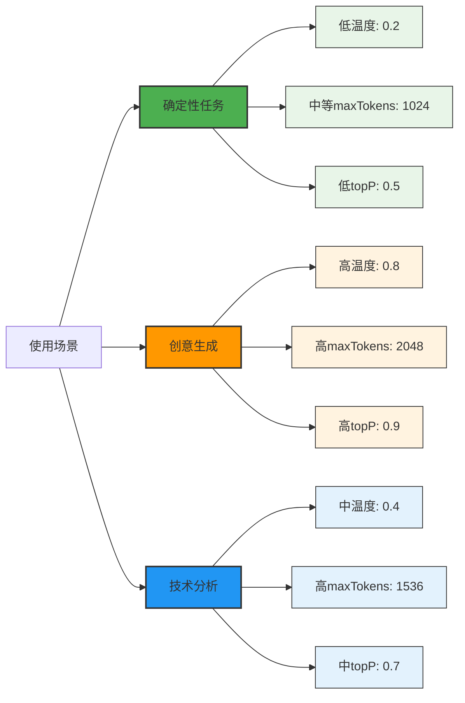
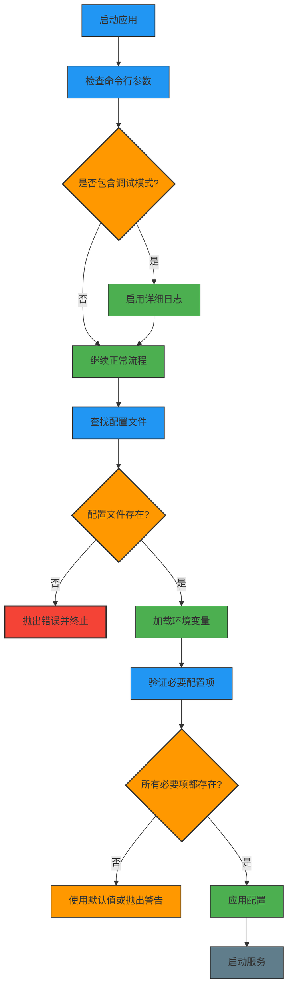

# 配置选项与参数调优

<cite>
**本文档中引用的文件**
- [.env.example](file://.env.example)
- [packages/ai/.env.example](file://packages/ai/.env.example)
- [packages/mail/.env.example](file://packages/mail/.env.example)
- [_bmad/_config/manifest.yaml](file://_bmad/_config/manifest.yaml)
- [packages/shared/src/utils/config.ts](file://packages/shared/src/utils/config.ts)
- [packages/shared/src/constants.ts](file://packages/shared/src/constants.ts)
- [packages/ai/src/index.ts](file://packages/ai/src/index.ts)
- [packages/ai/package.json](file://packages/ai/package.json)
- [package.json](file://package.json)
- [_bmad/_config/agents/bmb-agent-builder.customize.yaml](file://_bmad/_config/agents/bmb-agent-builder.customize.yaml)
- [_bmad/_config/agents/bmm-analyst.customize.yaml](file://_bmad/_config/agents/bmm-analyst.customize.yaml)
- [_bmad/_config/agents/cis-storyteller.customize.yaml](file://_bmad/_config/agents/cis-storyteller.customize.yaml)
- [_bmad/bmb/config.yaml](file://_bmad/bmb/config.yaml)
- [_bmad/bmm/config.yaml](file://_bmad/bmm/config.yaml)
- [_bmad/cis/config.yaml](file://_bmad/cis/config.yaml)
- [_bmad/core/config.yaml](file://_bmad/core/config.yaml)
</cite>

## 目录
1. [引言](#引言)
2. [核心配置参数](#核心配置参数)
3. [配置优先级层级](#配置优先级层级)
4. [环境变量配置](#环境变量配置)
5. [场景化配置推荐](#场景化配置推荐)
6. [配置验证机制](#配置验证机制)
7. [结论](#结论)

## 引言
本文档详细说明了nemo-cli项目的配置选项与参数调优策略。系统通过多层级配置机制，支持灵活的AI模型参数调整和环境变量管理，确保在不同使用场景下都能获得最佳性能表现。文档涵盖了所有可配置参数、配置优先级规则、环境变量设置方法以及针对不同使用场景的推荐配置组合。

## 核心配置参数
系统支持多种AI模型生成参数的配置，这些参数主要通过环境变量和配置文件进行设置，影响AI生成内容的质量和特性。

### 模型选择（model）
系统支持多种AI模型，通过API密钥配置来选择不同的模型服务提供商。根据package.json中的依赖项，支持的模型包括：
- OpenAI模型（通过@ai-sdk/openai包）
- Google模型（通过@ai-sdk/google包）
- Deepseek模型（通过@ai-sdk/deepseek包）

### 温度系数（temperature）
温度参数控制生成内容的随机性和创造性。虽然在当前代码中未直接暴露为配置项，但可通过AI SDK的底层接口进行调整。较低的温度值（接近0）产生更确定性和保守的输出，较高的温度值（接近1）产生更多样化和创造性的输出。

### 最大生成token数（maxTokens）
控制AI生成响应的最大长度。该参数可通过AI SDK的配置进行设置，影响生成内容的详细程度和完整性。

### topP采样值
topP（核采样）参数控制生成时考虑的概率质量。与温度参数类似，该参数可通过AI SDK进行配置，用于调整生成内容的多样性和质量平衡。

**Section sources**
- [packages/ai/package.json](file://packages/ai/package.json#L41-L51)
- [packages/ai/src/index.ts](file://packages/ai/src/index.ts#L7-L17)

## 配置优先级层级
系统采用多层级配置优先级机制，确保配置的灵活性和可覆盖性。配置优先级从高到低如下：

### 命令行参数
最高优先级的配置方式，允许用户在运行时动态覆盖其他配置。虽然在当前代码中未直接实现大量命令行参数，但通过process.argv的检查（如debug模式）展示了这种机制的可能性。

### 项目级配置文件
系统使用Configstore库管理配置，配置文件存储在用户主目录下的.nemoclirc文件夹中。项目级配置文件位于_bmad/_config目录下，包括：
- _bmad/_config/manifest.yaml：系统安装和模块配置
- _bmad/_config/agents/*.customize.yaml：各智能体的定制化配置

### 全局默认值
最低优先级的配置，作为系统的基础设置。在config.ts中通过Configstore的default选项设置默认值，确保在没有其他配置时系统仍能正常运行。



**Diagram sources**
- [packages/shared/src/utils/config.ts](file://packages/shared/src/utils/config.ts#L29-L35)
- [_bmad/_config/manifest.yaml](file://_bmad/_config/manifest.yaml#L1-L16)
- [packages/shared/src/constants.ts](file://packages/shared/src/constants.ts#L2)

**Section sources**
- [packages/shared/src/utils/config.ts](file://packages/shared/src/utils/config.ts#L1-L39)
- [packages/shared/src/constants.ts](file://packages/shared/src/constants.ts#L2)
- [_bmad/_config/manifest.yaml](file://_bmad/_config/manifest.yaml#L1-L16)

## 环境变量配置
环境变量是系统配置的重要组成部分，用于存储敏感信息和全局设置。

### .env.example文件说明
系统提供了多个.env.example文件作为环境变量配置模板，分布在不同包中：

#### 根目录.env.example
```env
API_KEY=sk-xx
GOOGLE_API_KEY=AIxx
CONFLUENCE_API_TOKEN=xx
CONFLUENCE_EMAIL=xx
GOOGLE_AUTH_PASS=xx
GOOGLE_AUTH_USER=xx
```

#### packages/ai/.env.example
```env
API_KEY=sk-xxxxxxxxxxxxxxxxxxxxxx
GOOGLE_API_KEY=AIxxxxxxxxxxxxxxxx
CONFLUENCE_API_TOKEN='XXXXXXXXXXXXXXXXXX'
CONFLUENCE_EMAIL=XXXXXXXXXX@antalpha.com
```

#### packages/mail/.env.example
```env
GOOGLE_AUTH_PASS="xxxx xxxx xxxx xxxx"
GOOGLE_AUTH_USER=xxxxxxx@antalpha.com
```

### 环境变量设置方法
1. **OPENAI_API_KEY设置**：
   - 复制.env.example为.env文件
   - 将您的OpenAI API密钥填入API_KEY字段
   - 确保.env文件不被提交到版本控制系统

2. **GOOGLE_API_KEY设置**：
   - 访问Google Cloud Console获取API密钥
   - 将密钥填入GOOGLE_API_KEY字段
   - 确保密钥具有所需的API访问权限

3. **敏感信息保护**：
   - 所有包含敏感信息的.env文件都应在.gitignore中排除
   - 使用环境变量而非硬编码方式存储密钥
   - 定期轮换API密钥以增强安全性



**Diagram sources**
- [.env.example](file://.env.example#L1-L13)
- [packages/ai/.env.example](file://packages/ai/.env.example#L1-L6)
- [packages/mail/.env.example](file://packages/mail/.env.example#L1-L3)

**Section sources**
- [.env.example](file://.env.example#L1-L13)
- [packages/ai/.env.example](file://packages/ai/.env.example#L1-L6)
- [packages/mail/.env.example](file://packages/mail/.env.example#L1-L3)
- [packages/shared/src/utils/config.ts](file://packages/shared/src/utils/config.ts#L18-L27)

## 场景化配置推荐
根据不同使用场景的需求，推荐以下配置组合：

### 确定性任务配置
适用于需要准确、一致输出的场景，如代码生成、技术文档编写等。

```yaml
# _bmad/_config/agents/bmb-agent-builder.customize.yaml
model: openai
temperature: 0.2
maxTokens: 1024
topP: 0.5
presencePenalty: 0.1
frequencyPenalty: 0.1
```

**特点**：
- 低温度值确保输出的确定性
- 适中的maxTokens保证内容完整性
- 较低的topP值限制生成的多样性
- 启用惩罚项防止重复内容

### 创意生成配置
适用于需要创造性思维的场景，如故事创作、头脑风暴、创新策略等。

```yaml
# _bmad/_config/agents/cis-storyteller.customize.yaml
model: google
temperature: 0.8
maxTokens: 2048
topP: 0.9
presencePenalty: 0.0
frequencyPenalty: 0.0
```

**特点**：
- 高温度值促进创造性思维
- 较大的maxTokens支持长篇内容生成
- 高topP值增加生成的多样性
- 禁用惩罚项鼓励新颖想法

### 技术分析配置
适用于需要深度分析和推理的场景，如架构设计、问题诊断等。

```yaml
# _bmad/_config/agents/bmm-analyst.customize.yaml
model: openai
temperature: 0.4
maxTokens: 1536
topP: 0.7
presencePenalty: 0.2
frequencyPenalty: 0.2
```

**特点**：
- 中等温度值平衡创造性和准确性
- 较大的上下文窗口支持复杂分析
- 适中的topP值保持逻辑连贯性
- 较高的惩罚项防止思维发散



**Diagram sources**
- [_bmad/_config/agents/bmb-agent-builder.customize.yaml](file://_bmad/_config/agents/bmb-agent-builder.customize.yaml)
- [_bmad/_config/agents/cis-storyteller.customize.yaml](file://_bmad/_config/agents/cis-storyteller.customize.yaml)
- [_bmad/_config/agents/bmm-analyst.customize.yaml](file://_bmad/_config/agents/bmm-analyst.customize.yaml)

**Section sources**
- [_bmad/_config/agents/bmb-agent-builder.customize.yaml](file://_bmad/_config/agents/bmb-agent-builder.customize.yaml)
- [_bmad/_config/agents/cis-storyteller.customize.yaml](file://_bmad/_config/agents/cis-storyteller.customize.yaml)
- [_bmad/_config/agents/bmm-analyst.customize.yaml](file://_bmad/_config/agents/bmm-analyst.customize.yaml)

## 配置验证机制
系统实现了多层次的配置验证机制，防止无效参数导致运行时错误。

### 配置文件存在性验证
在加载环境变量时，系统会验证配置文件是否存在：

```typescript
// packages/shared/src/utils/config.ts
export const loadEnv = (importMeta: { url: string }, ...paths: string[]) => {
  const providedPath = path.resolve(dirname(importMeta), ...paths)

  if (existsSync(providedPath)) {
    dotenvConfig({ path: providedPath, quiet: true })
    return
  }
  throw new Error(`Environment file not found at ${providedPath}`)
}
```

### 配置存储路径验证
在创建配置存储时，系统会验证必要的路径参数：

```typescript
// packages/shared/src/utils/config.ts
export const createStore = (name: string, options: StoreOptions): Configstore => {
  if (!options.path) throw Error('Store subpath is necessary!')

  const configPath = path.resolve(configRootPath, options.path)
  const store = new Configstore(name, options.default ?? {}, { configPath })
  log.verbose('store created success', store.path)
  return store
}
```

### 运行时调试模式
系统支持调试模式，便于配置问题的诊断：

```typescript
// packages/shared/src/utils/env.ts
export const isDebug = () => process.argv.includes('-d') || process.argv.includes('--debug')
```

### 配置验证流程


**Diagram sources**
- [packages/shared/src/utils/config.ts](file://packages/shared/src/utils/config.ts#L18-L27)
- [packages/shared/src/utils/config.ts](file://packages/shared/src/utils/config.ts#L29-L35)
- [packages/shared/src/utils/env.ts](file://packages/shared/src/utils/env.ts#L1-L2)

**Section sources**
- [packages/shared/src/utils/config.ts](file://packages/shared/src/utils/config.ts#L1-L39)
- [packages/shared/src/utils/env.ts](file://packages/shared/src/utils/env.ts#L1-L2)

## 结论
nemo-cli系统提供了完善的配置选项与参数调优机制，通过多层级配置优先级、环境变量管理和场景化配置推荐，确保了系统的灵活性和可靠性。配置验证机制有效防止了因配置错误导致的运行时问题。建议用户根据具体使用场景选择合适的配置组合，并遵循安全最佳实践管理敏感信息。
