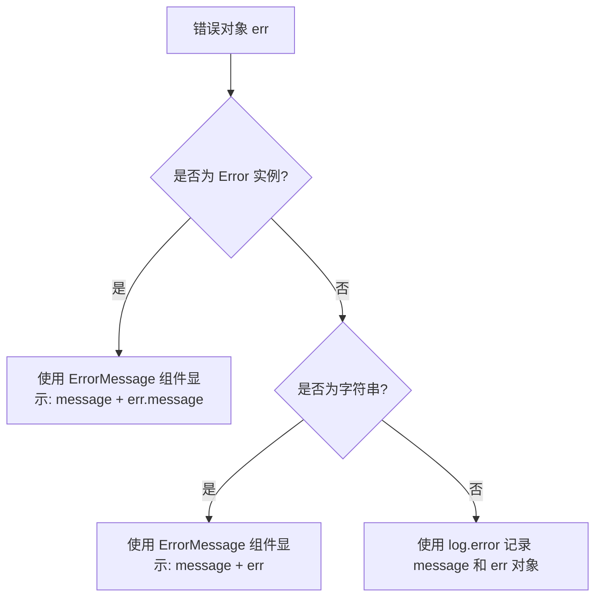
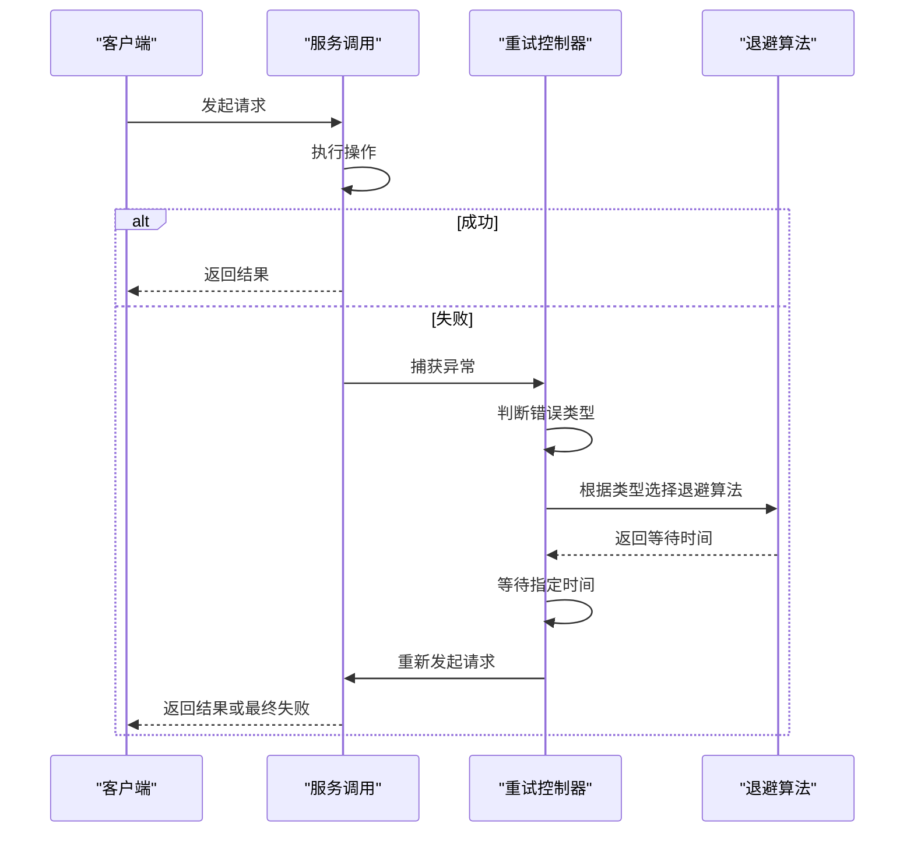
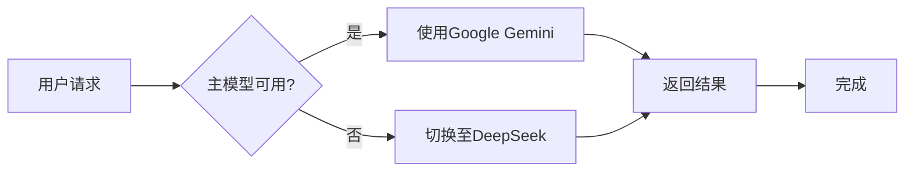
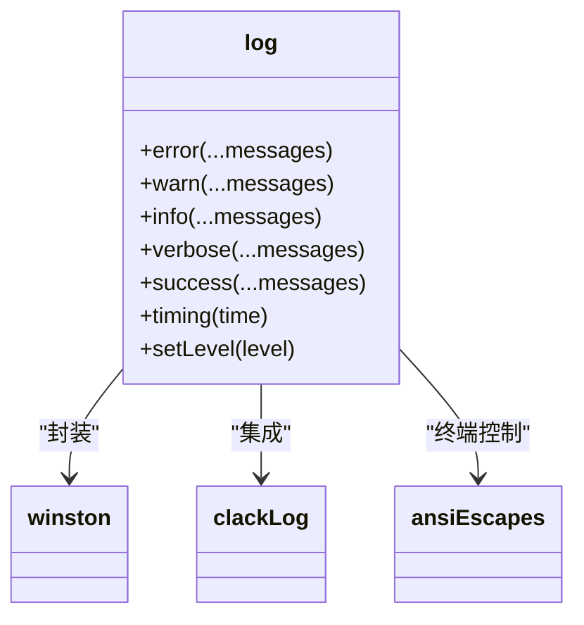

# 错误处理与容错机制

<cite>
**本文档中引用的文件**  
- [error.ts](file://packages/shared/src/utils/error.ts)
- [log.ts](file://packages/shared/src/utils/log.ts)
- [types.ts](file://packages/shared/src/utils/types.ts)
- [chat/index.ts](file://packages/ai/src/services/chat/index.ts)
- [confluence/index.ts](file://packages/ai/src/services/confluence/index.ts)
- [promise.ts](file://packages/shared/src/utils/promise.ts)
- [message.tsx](file://packages/ui/src/components/message.tsx)
- [common.ts](file://packages/shared/src/utils/common.ts)
</cite>

## 目录
1. [引言](#引言)
2. [异常类型分析](#异常类型分析)
3. [错误处理工具与分类](#错误处理工具与分类)
4. [重试策略与退避算法](#重试策略与退避算法)
5. [用户友好的错误消息呈现](#用户友好的错误消息呈现)
6. [故障转移机制](#故障转移机制)
7. [日志记录与调试支持](#日志记录与调试支持)
8. [监控与告警建议](#监控与告警建议)
9. [总结](#总结)

## 引言
本系统在与外部服务（如AI模型、Confluence、Slack等）交互过程中，可能遭遇多种异常情况。为确保系统的稳定性与用户体验，必须建立完善的错误处理与容错机制。本文档系统梳理了可能的异常类型，并详细描述了基于`shared`模块的错误处理工具、分级重试策略、用户反馈机制、故障转移方案及监控建议。

## 异常类型分析
系统在运行过程中可能遇到以下几类主要异常：

- **网络连接超时**：与AI服务（如Gemini、DeepSeek）或Confluence等外部API通信时，因网络不稳定导致请求超时。
- **API认证失败**：环境变量中缺失或错误的API密钥（如`GOOGLE_API_KEY`、`CONFLUENCE_API_TOKEN`），导致服务端返回401或403错误。
- **速率限制（429错误）**：短时间内向AI服务发送过多请求，触发服务端的速率限制策略。
- **模型服务不可用**：AI模型服务（如Gemini、DeepSeek）暂时宕机或维护，导致HTTP 5xx错误或连接拒绝。
- **本地环境错误**：如Git命令执行失败、文件读取错误等本地操作异常。

**Section sources**
- [chat/index.ts](file://packages/ai/src/services/chat/index.ts#L33-L57)
- [confluence/index.ts](file://packages/ai/src/services/confluence/index.ts#L9-L11)

## 错误处理工具与分类
系统通过`shared`模块提供的`handleError`函数统一处理异常，该函数能够智能分类错误类型并进行相应处理。



**Diagram sources**
- [error.ts](file://packages/shared/src/utils/error.ts#L5-L13)
- [types.ts](file://packages/shared/src/utils/types.ts#L15)
- [message.tsx](file://packages/ui/src/components/message.tsx#L31-L39)
- [log.ts](file://packages/shared/src/utils/log.ts#L121-L129)

该机制确保了：
- 对于可读的错误（Error实例或字符串），通过UI组件向用户展示友好的错误消息。
- 对于复杂对象或未知类型错误，通过日志系统记录详细信息，便于调试。

## 重试策略与退避算法
虽然当前代码中未显式实现重试逻辑，但已具备实现分级重试策略的基础组件。



**Diagram sources**
- [common.ts](file://packages/shared/src/utils/common.ts#L11-L17)
- [promise.ts](file://packages/shared/src/utils/promise.ts#L13-L25)

建议实现的分级重试策略如下：
- **网络超时/5xx错误**：采用指数退避（exponential backoff），初始延迟1秒，每次重试延迟翻倍，最多重试3次。
- **429速率限制**：采用固定延迟或基于`Retry-After`头的动态延迟，避免加剧服务压力。
- **认证失败**：不重试，立即向用户提示配置错误。

## 用户友好的错误消息呈现
系统通过`@nemo-cli/ui`包中的`ErrorMessage`组件向用户展示错误，确保消息清晰醒目。

```mermaid
classDiagram
class ErrorMessage {
+text : string
+colors : string[]
+render() : JSX.Element
}
class Message {
+text : string
+type : 'success' | 'error' | 'warning' | 'info'
+render() : JSX.Element
}
ErrorMessage --> Message : "继承"
ErrorMessage ..> "Gradient" : "使用渐变色"
ErrorMessage ..> "Box" : "使用边框"
```

**Diagram sources**
- [message.tsx](file://packages/ui/src/components/message.tsx#L31-L40)
- [message.tsx](file://packages/ui/src/components/message.tsx#L5-L10)

错误消息以红色边框和渐变色文本呈现，视觉上与成功消息（绿色）形成鲜明对比，帮助用户快速识别问题。

## 故障转移机制
当前系统已集成多个AI模型服务（Gemini和DeepSeek），为实现故障转移提供了基础。



**Diagram sources**
- [chat/index.ts](file://packages/ai/src/services/chat/index.ts#L7-L9)
- [chat/index.ts](file://packages/ai/src/services/chat/index.ts#L124-L131)

当主模型（Gemini）因认证失败或服务不可用时，系统可自动降级使用备用模型（DeepSeek），确保核心功能（如生成commit消息）仍可继续使用。

## 日志记录与调试支持
系统采用`winston`日志库进行多级别日志记录，支持详细的调试信息输出。



**Diagram sources**
- [log.ts](file://packages/shared/src/utils/log.ts#L64-L168)

日志系统支持以下级别：
- `error`：记录错误信息，红色高亮
- `warn`：记录警告信息
- `info`：记录一般信息
- `verbose`：记录详细调试信息
- `success`：记录成功信息，绿色高亮
- `timing`：记录性能时间

通过`log.setLevel()`可动态调整日志级别，便于在生产环境和调试模式间切换。

## 监控与告警建议
为保障系统稳定性，建议实施以下监控措施：

1. **错误率监控**：统计单位时间内各类错误的发生频率，设置告警阈值（如每分钟超过5次错误）。
2. **服务可用性监控**：定期探测AI服务（Gemini、DeepSeek）和Confluence的连通性。
3. **性能监控**：记录关键操作（如`getGitDiff`、AI请求）的执行时间，设置超时告警。
4. **认证状态监控**：检查关键环境变量（`GOOGLE_API_KEY`等）是否存在且有效。

可通过集成外部监控工具或在日志中添加结构化字段（如`service=ai, type=timeout`）来实现上述监控。

## 总结
本系统通过`shared`模块的`handleError`和`log`工具，建立了统一的错误处理框架。结合UI组件实现了用户友好的错误呈现，并通过日志系统保留了详细的调试信息。系统已具备多AI模型集成，为故障转移提供了基础。建议进一步实现基于错误类型的分级重试策略，并建立完善的监控告警体系，以全面提升系统的健壮性和可观测性。