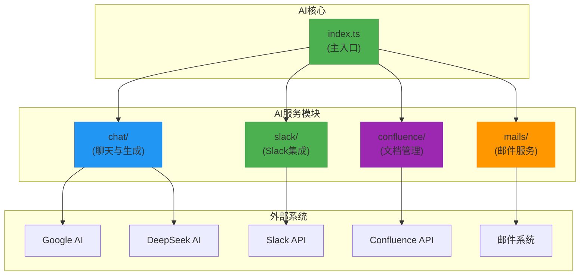
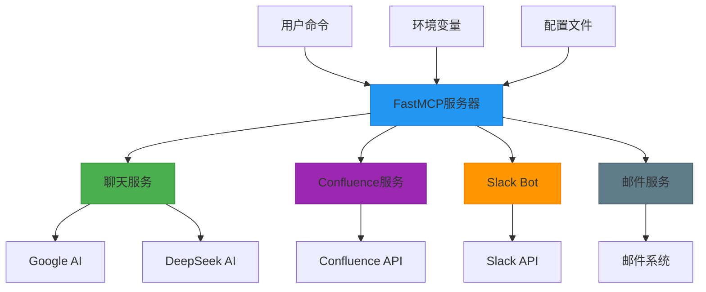
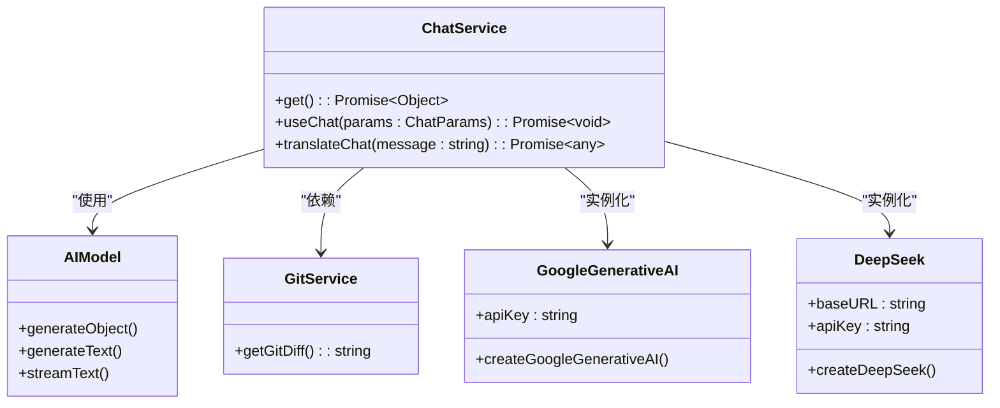
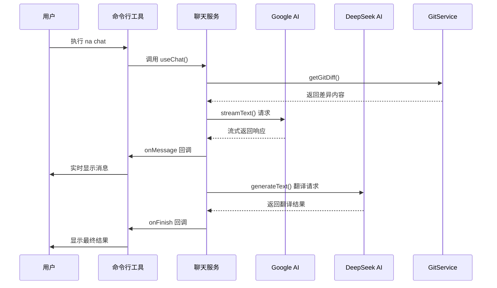
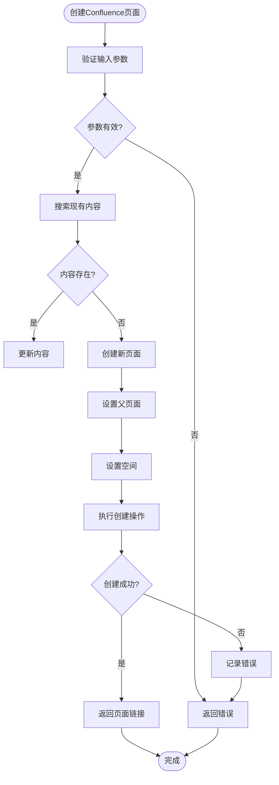

# AI 工具 (na)

<cite>
**本文档中引用的文件**  
- [index.ts](file://packages/ai/src/index.ts)
- [chat/index.ts](file://packages/ai/src/services/chat/index.ts)
- [confluence/mcp.ts](file://packages/ai/src/services/confluence/mcp.ts)
- [slack/bot.ts](file://packages/ai/src/services/slack/bot.ts)
- [confluence/createContent.ts](file://packages/ai/src/services/confluence/createContent.ts)
- [confluence/getContent.ts](file://packages/ai/src/services/confluence/getContent.ts)
- [slack/tools/index.ts](file://packages/ai/src/services/slack/tools/index.ts)
- [slack/tools/getPRD.ts](file://packages/ai/src/services/slack/tools/getPRD.ts)
- [slack/tools/sendEmail.ts](file://packages/ai/src/services/slack/tools/sendEmail.ts)
- [mails/mcp.ts](file://packages/ai/src/services/mails/mcp.ts)
- [confluence/index.ts](file://packages/ai/src/services/confluence/index.ts)
</cite>

## 目录
1. [简介](#简介)
2. [项目结构](#项目结构)
3. [核心组件](#核心组件)
4. [架构概述](#架构概述)
5. [详细组件分析](#详细组件分析)
6. [依赖分析](#依赖分析)
7. [性能考虑](#性能考虑)
8. [故障排除指南](#故障排除指南)
9. [结论](#结论)

## 简介
本项目是一个集成多种AI服务和外部系统的命令行工具，通过`na`命令实现与OpenAI、Google、DeepSeek等AI模型的交互。系统采用MCP（Model Control Protocol）协议管理AI上下文和工具调用，支持Slack Bot集成和Confluence文档自动生成。该工具旨在提升开发效率，实现自动化工作流，包括代码提交消息生成、需求文档获取、上线邮件发送等功能。

## 项目结构
项目采用模块化设计，主要功能集中在`packages/ai`目录下，通过`src/services`组织不同服务模块。核心架构基于FastMCP协议，实现AI模型与外部系统的集成。



**图示来源**
- [index.ts](file://packages/ai/src/index.ts#L1-L20)
- [chat/index.ts](file://packages/ai/src/services/chat/index.ts#L1-L149)
- [confluence/mcp.ts](file://packages/ai/src/services/confluence/mcp.ts#L1-L40)
- [slack/bot.ts](file://packages/ai/src/services/slack/bot.ts#L1-L112)

## 核心组件
系统核心组件包括聊天服务、Confluence集成、Slack Bot和邮件服务。聊天服务通过ai-sdk与Google和DeepSeek模型交互，实现文本生成和翻译功能。MCP协议用于管理工具调用和上下文控制，确保AI服务与外部系统的安全通信。

**组件来源**
- [chat/index.ts](file://packages/ai/src/services/chat/index.ts#L1-L149)
- [confluence/mcp.ts](file://packages/ai/src/services/confluence/mcp.ts#L1-L40)
- [slack/bot.ts](file://packages/ai/src/services/slack/bot.ts#L1-L112)

## 架构概述
系统采用分层架构，顶层为FastMCP服务器，负责协调各个服务模块。各服务模块通过标准化接口注册工具，实现功能扩展。AI模型通过流式响应提供实时交互，外部系统通过API进行数据交换。



**图示来源**
- [index.ts](file://packages/ai/src/index.ts#L1-L20)
- [chat/index.ts](file://packages/ai/src/services/chat/index.ts#L1-L149)
- [confluence/mcp.ts](file://packages/ai/src/services/confluence/mcp.ts#L1-L40)
- [slack/bot.ts](file://packages/ai/src/services/slack/bot.ts#L1-L112)

## 详细组件分析

### 聊天服务分析
聊天服务是系统的核心功能模块，负责与AI模型的交互和内容生成。

#### 聊天服务类图


**图示来源**
- [chat/index.ts](file://packages/ai/src/services/chat/index.ts#L1-L149)

#### 聊天交互序列图


**图示来源**
- [chat/index.ts](file://packages/ai/src/services/chat/index.ts#L64-L100)

### Confluence集成分析
Confluence服务模块负责与Atlassian Confluence系统的集成，实现文档的创建和检索。

#### Confluence服务流程图


**图示来源**
- [confluence/createContent.ts](file://packages/ai/src/services/confluence/createContent.ts#L1-L35)
- [confluence/getContent.ts](file://packages/ai/src/services/confluence/getContent.ts#L1-L39)

### Slack Bot集成分析
Slack Bot模块实现了与Slack平台的深度集成，支持消息监听和工具调用。

#### Slack Bot工作流
```mermaid
flowchart TD
A[Slack事件] --> B{事件类型}
B --> |消息| C[处理普通消息]
B --> |提及| D[处理@提及]
B --> |动作| E[处理按钮点击]
C --> F[调用generateTools]
F --> G[分析消息内容]
G --> H{需要工具调用?}
H --> |是| I[执行相应工具]
H --> |否| J[普通回复]
I --> K[getPRDTool]
I --> L[sendEmailTool]
K --> M[搜索Confluence]
M --> N{找到文档?}
N --> |是| O[发送文档链接]
N --> |否| P[发送错误消息]
L --> Q[发送上线邮件]
Q --> R{发送成功?}
R --> |是| S[发送成功消息]
R --> |否| T[发送失败消息]
D --> U[提取用户消息]
U --> V[格式化回复]
V --> W[发送回复]
E --> X[确认动作]
X --> Y[发送临时响应]
```

**图示来源**
- [slack/bot.ts](file://packages/ai/src/services/slack/bot.ts#L1-L112)
- [slack/tools/index.ts](file://packages/ai/src/services/slack/tools/index.ts#L1-L72)

## 依赖分析
系统依赖关系清晰，采用松耦合设计，各模块通过标准化接口通信。

```mermaid
graph TD
A[index.ts] --> B[chat/index.ts]
A --> C[confluence/mcp.ts]
A --> D[slack/bot.ts]
A --> E[mails/mcp.ts]
B --> F[@ai-sdk/google]
B --> G[@ai-sdk/deepseek]
B --> H[node:child_process]
C --> I[confluence.js]
C --> J[@nemo-cli/shared]
C --> K[createContent.ts]
C --> L[getContent.ts]
D --> M[@slack/bolt]
D --> N[@nemo-cli/shared]
D --> O[tools/index.ts]
O --> P[getPRD.ts]
O --> Q[sendEmail.ts]
P --> R[confluence/getContent.ts]
Q --> S[mails/mcp.ts]
S --> T[@nemo-cli/mail]
S --> U[confluence/getContent.ts]
style A fill:#2196F3,stroke:#1976D2
style B fill:#4CAF50,stroke:#388E3C
style C fill:#9C27B0,stroke:#7B1FA2
style D fill:#FF9800,stroke:#F57C00
style E fill:#607D8B,stroke:#455A64
```

**图示来源**
- [index.ts](file://packages/ai/src/index.ts#L1-L20)
- [chat/index.ts](file://packages/ai/src/services/chat/index.ts#L1-L149)
- [confluence/mcp.ts](file://packages/ai/src/services/confluence/mcp.ts#L1-L40)
- [slack/bot.ts](file://packages/ai/src/services/slack/bot.ts#L1-L112)

## 性能考虑
系统在性能方面进行了多项优化，包括流式响应处理、缓存机制和错误恢复。聊天服务采用流式API，实现低延迟的实时交互。对于频繁访问的Confluence内容，系统可通过扩展实现缓存机制。错误处理机制完善，确保在API调用失败时能够优雅降级。

## 故障排除指南
常见问题及解决方案：

1. **AI模型调用失败**：检查环境变量中的API密钥是否正确配置
2. **Confluence连接问题**：验证CONFLUENCE_API_TOKEN和CONFLUENCE_EMAIL环境变量
3. **Slack Bot无法启动**：确认SLACK_BOT_TOKEN、SLACK_SIGNING_SECRET和SLACK_APP_TOKEN已设置
4. **Git差异获取失败**：确保在git仓库中执行命令
5. **邮件发送失败**：检查邮件服务配置和网络连接

**故障排除来源**
- [chat/index.ts](file://packages/ai/src/services/chat/index.ts#L52-L56)
- [confluence/index.ts](file://packages/ai/src/services/confluence/index.ts#L9-L11)
- [slack/bot.ts](file://packages/ai/src/services/slack/bot.ts#L107-L109)

## 结论
该AI集成工具通过`na`命令实现了强大的功能集成，包括多AI模型支持、Confluence文档管理和Slack Bot交互。系统架构清晰，模块化设计良好，易于扩展和维护。MCP协议的使用确保了AI服务与外部系统的安全通信。未来可考虑增加更多AI模型支持、增强错误处理机制和优化性能表现。