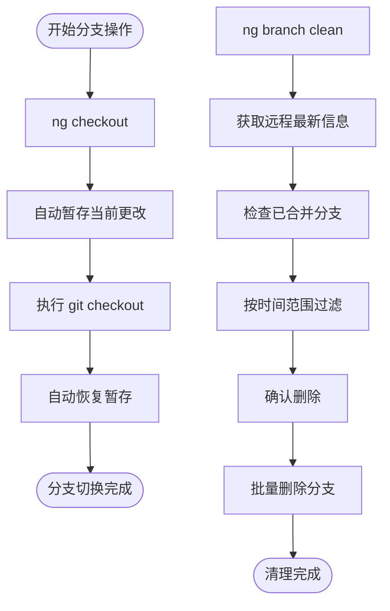
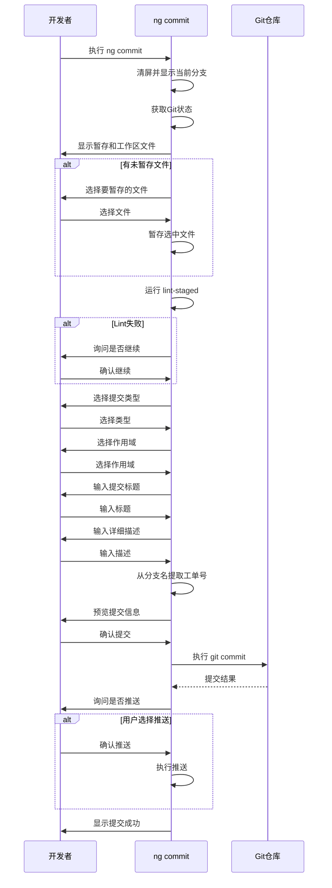
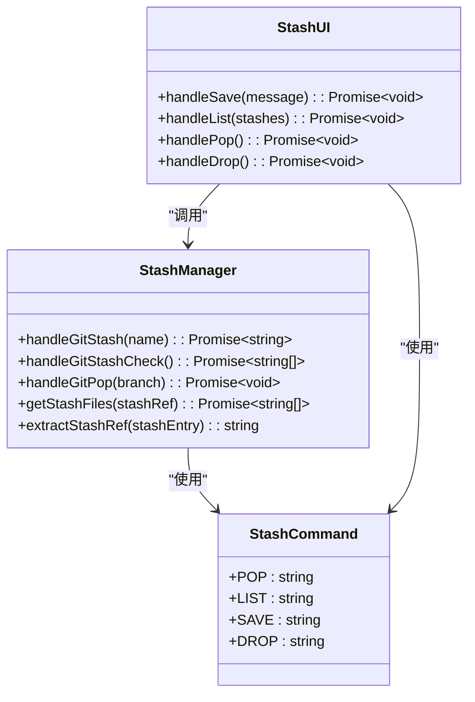
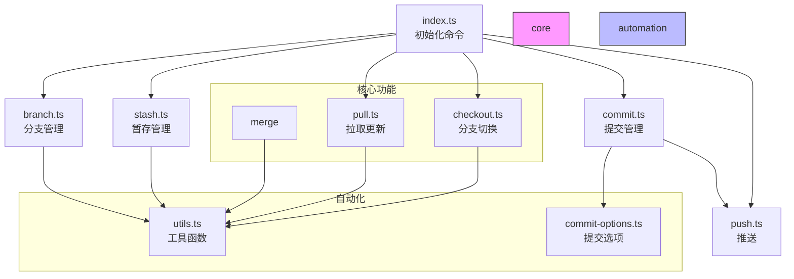

# Git 工具 (ng)

<cite>
**本文档中引用的文件**   
- [index.ts](file://packages/git/src/index.ts)
- [checkout.ts](file://packages/git/src/commands/checkout.ts)
- [branch.ts](file://packages/git/src/commands/branch.ts)
- [commit.ts](file://packages/git/src/commands/commit.ts)
- [pull.ts](file://packages/git/src/commands/pull.ts)
- [push.ts](file://packages/git/src/commands/push.ts)
- [stash.ts](file://packages/git/src/commands/stash.ts)
- [utils.ts](file://packages/git/src/utils.ts)
- [commit-options.ts](file://packages/git/src/commands/commit-options.ts)
</cite>

## 目录
1. [简介](#简介)
2. [核心命令详解](#核心命令详解)
3. [智能分支管理](#智能分支管理)
4. [智能提交流程](#智能提交流程)
5. [暂存管理](#暂存管理)
6. [命令调用关系与数据流](#命令调用关系与数据流)
7. [常见使用场景与最佳实践](#常见使用场景与最佳实践)
8. [问题排查与解决方案](#问题排查与解决方案)
9. [总结](#总结)

## 简介
nemo-cli 提供了通过 'ng' 命令实现的 Git 工作流自动化功能，旨在简化和增强开发者的日常 Git 操作。该工具封装了底层 Git 命令，并添加了智能交互、自动暂存/恢复、分支清理等增强功能，为开发者提供了一套高效、安全的 Git 操作体验。

**Section sources**
- [index.ts](file://packages/git/src/index.ts#L1-L47)

## 核心命令详解

### checkout 命令
`ng checkout`（或 `ng co`）命令用于切换分支，支持本地分支和远程分支的切换，并在切换前自动保存当前更改，在切换后自动恢复。

- **语法结构**:
  - `ng checkout` - 交互式选择分支
  - `ng checkout -l` - 切换本地分支
  - `ng checkout -r` - 切换远程分支
  - `ng checkout -b <branch>` - 创建并切换到新分支

- **参数选项**:
  - `-l, --local`: 切换本地分支
  - `-r, --remote`: 切换远程分支
  - `-b, --branch [branch]`: 创建并切换新分支

当使用 `ng co -b` 创建新分支时，系统会提示选择分支前缀（如 `feature/PRIME-`, `feature/`, `bugfix/`）并输入分支名称，然后自动创建并切换到该分支。

**Section sources**
- [checkout.ts](file://packages/git/src/commands/checkout.ts#L16-L115)

### branch 命令
`ng branch` 命令提供了强大的分支管理功能，包括分支清理和删除。

- **branch clean 子命令**: 清理已合并到主分支的旧分支。用户可以选择时间范围（全部、1个月、1年、3个月），系统会自动识别已合并的分支并提供删除确认。
- **branch delete 子命令**: 删除指定分支，支持本地和远程分支删除。系统会显示分支的最后提交时间和合并状态，帮助用户做出删除决策。

**Section sources**
- [branch.ts](file://packages/git/src/commands/branch.ts#L23-L167)

### commit 命令
`ng commit` 命令实现了智能提交流程，引导用户完成规范化的提交。

- **工作流程**:
  1. 显示当前分支和变更文件
  2. 允许用户选择工作区文件进行暂存
  3. 运行 lint-staged 进行代码检查
  4. 选择提交类型（feat, fix, docs 等）
  5. 选择作用域（app, shared, server 等）
  6. 输入提交标题和详细描述
  7. 自动生成包含分支中提取的工单号的提交信息
  8. 确认提交并选择是否推送

**Section sources**
- [commit.ts](file://packages/git/src/commands/commit.ts#L38-L177)

### pull 命令
`ng pull`（或 `ng pl`）命令用于从远程仓库拉取更新。

- 支持 merge 和 rebase 两种模式
- 在拉取前自动暂存当前更改，在拉取后自动恢复
- 如果未指定模式，会交互式询问用户选择拉取模式

**Section sources**
- [pull.ts](file://packages/git/src/commands/pull.ts#L4-L50)

### push 命令
`ng push`（或 `ng ps`）命令用于将本地提交推送到远程仓库。

- 默认推送当前分支
- 如果用户取消推送当前分支，会提供其他分支选择
- 提供推送进度指示器和成功/失败反馈

**Section sources**
- [push.ts](file://packages/git/src/commands/push.ts#L6-L59)

### stash 命令
`ng stash` 命令提供了完整的暂存管理功能。

- **子命令**:
  - `ng stash save [message]` - 保存当前更改到暂存
  - `ng stash list` - 列出所有暂存
  - `ng stash pop` - 恢复最近的暂存
  - `ng stash drop` - 删除暂存

**Section sources**
- [stash.ts](file://packages/git/src/commands/stash.ts#L6-L158)

## 智能分支管理
nemo-cli 的分支管理功能体现了"智能分支管理"的理念，通过自动化和智能化的方式简化分支操作。



**Diagram sources **
- [checkout.ts](file://packages/git/src/commands/checkout.ts#L16-L49)
- [branch.ts](file://packages/git/src/commands/branch.ts#L64-L111)
- [utils.ts](file://packages/git/src/utils.ts#L274-L303)

**Section sources**
- [checkout.ts](file://packages/git/src/commands/checkout.ts#L16-L115)
- [branch.ts](file://packages/git/src/commands/branch.ts#L23-L167)

## 智能提交流程
`ng commit` 命令实现了完整的智能提交流程，确保提交符合规范。



**Diagram sources **
- [commit.ts](file://packages/git/src/commands/commit.ts#L38-L177)
- [commit-options.ts](file://packages/git/src/commands/commit-options.ts#L1-L220)

**Section sources**
- [commit.ts](file://packages/git/src/commands/commit.ts#L38-L177)

## 暂存管理
nemo-cli 的暂存管理功能提供了对 Git stash 的完整封装和增强。



**Diagram sources **
- [stash.ts](file://packages/git/src/commands/stash.ts#L6-L158)
- [utils.ts](file://packages/git/src/utils.ts#L274-L310)

**Section sources**
- [stash.ts](file://packages/git/src/commands/stash.ts#L6-L158)

## 命令调用关系与数据流
nemo-cli 的各个命令之间存在复杂的调用关系和数据流，体现了模块化和复用的设计理念。



**Diagram sources **
- [index.ts](file://packages/git/src/index.ts#L4-L32)
- [utils.ts](file://packages/git/src/utils.ts#L1-L389)
- [commit-options.ts](file://packages/git/src/commands/commit-options.ts#L1-L220)

**Section sources**
- [index.ts](file://packages/git/src/index.ts#L1-L47)
- [utils.ts](file://packages/git/src/utils.ts#L1-L389)

## 常见使用场景与最佳实践

### 场景一：创建新功能分支
```bash
# 创建并切换到新的功能分支
ng co -b
# 系统会提示选择分支类型和输入分支名称
```

### 场景二：日常开发提交
```bash
# 开始智能提交流程
ng commit
# 系统会引导完成整个提交过程，包括代码检查、信息填写等
```

### 场景三：清理已合并分支
```bash
# 清理一个月前已合并的分支
ng branch clean
# 系统会列出符合条件的分支并要求确认删除
```

### 最佳实践
1. 使用 `ng commit` 而不是直接 `git commit`，确保提交规范
2. 在切换分支前，确保使用 `ng co` 而不是直接 `git checkout`，以利用自动暂存功能
3. 定期使用 `ng branch clean` 清理旧分支，保持仓库整洁
4. 使用 `ng pull` 而不是直接 `git pull`，避免因未暂存更改而导致的冲突

**Section sources**
- [checkout.ts](file://packages/git/src/commands/checkout.ts#L16-L115)
- [commit.ts](file://packages/git/src/commands/commit.ts#L38-L177)
- [branch.ts](file://packages/git/src/commands/branch.ts#L64-L111)

## 问题排查与解决方案

### 问题一：切换分支时丢失更改
**现象**: 使用 `git checkout` 直接切换分支时，未暂存的更改可能导致冲突或丢失。
**解决方案**: 始终使用 `ng co` 命令，它会在切换前自动暂存更改，在切换后自动恢复。

### 问题二：提交信息不符合规范
**现象**: 提交信息缺少类型、作用域等必要信息。
**解决方案**: 使用 `ng commit` 命令，它会强制要求选择提交类型和作用域，并提供预览功能。

### 问题三：远程分支列表不更新
**现象**: 新创建的远程分支在 `ng co -r` 中不可见。
**解决方案**: 执行 `git fetch` 更新远程分支信息，或使用 `ng pull` 命令，它会自动执行 fetch 操作。

### 问题四：暂存恢复失败
**现象**: `ng stash pop` 无法恢复特定分支的暂存。
**解决方案**: 确保暂存名称与分支名称匹配，或使用 `ng stash list` 查看所有暂存并手动选择。

**Section sources**
- [checkout.ts](file://packages/git/src/commands/checkout.ts#L32-L48)
- [commit.ts](file://packages/git/src/commands/commit.ts#L110-L118)
- [pull.ts](file://packages/git/src/commands/pull.ts#L12-L13)
- [stash.ts](file://packages/git/src/commands/stash.ts#L294-L310)

## 总结
nemo-cli 的 'ng' 命令为 Git 工作流提供了全面的自动化和智能化支持。通过封装底层 Git 操作并添加增强功能，如自动暂存/恢复、智能提交流程、分支清理等，显著提高了开发效率和代码质量。其模块化的设计和清晰的命令结构使得学习和使用变得简单直观。建议开发者充分利用这些功能，遵循最佳实践，以获得最佳的开发体验。