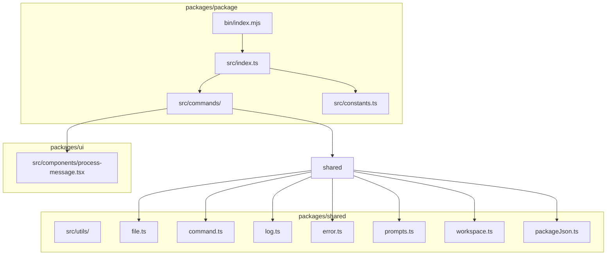
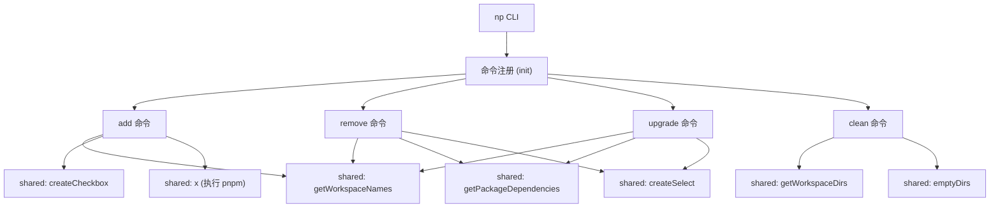
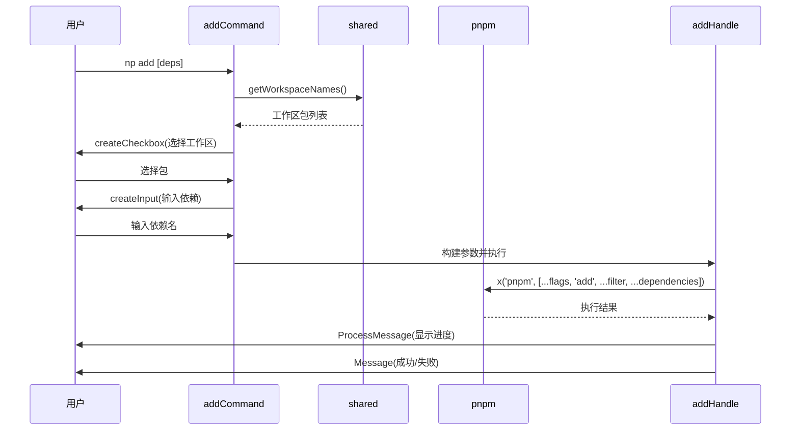
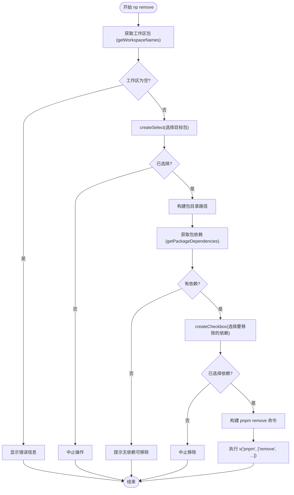
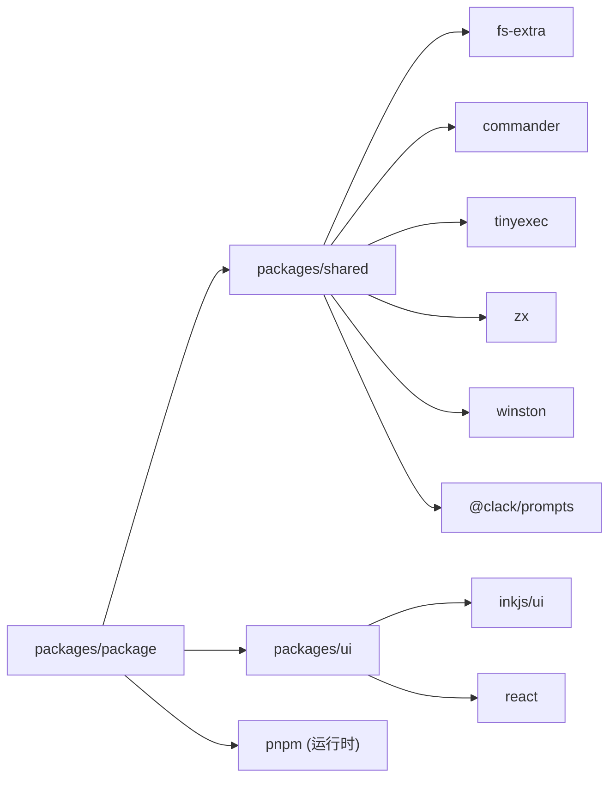

# 包管理 (np)

<cite>
**本文档中引用的文件**  
- [index.mjs](file://packages/package/bin/index.mjs)
- [index.ts](file://packages/package/src/index.ts)
- [add.ts](file://packages/package/src/commands/add.ts)
- [remove.ts](file://packages/package/src/commands/remove.ts)
- [upgrade.ts](file://packages/package/src/commands/upgrade.ts)
- [clean.ts](file://packages/package/src/commands/clean.ts)
- [constants.ts](file://packages/package/src/constants.ts)
- [packageJson.ts](file://packages/shared/src/utils/packageJson.ts)
- [command.ts](file://packages/shared/src/utils/command.ts)
- [log.ts](file://packages/shared/src/utils/log.ts)
- [error.ts](file://packages/shared/src/utils/error.ts)
- [prompts.ts](file://packages/shared/src/utils/prompts.ts)
- [workspace.ts](file://packages/shared/src/utils/workspace.ts)
- [process-message.tsx](file://packages/ui/src/components/process-message.tsx)
- [file.ts](file://packages/shared/src/utils/file.ts)
</cite>

## 目录
1. [简介](#简介)
2. [项目结构](#项目结构)
3. [核心组件](#核心组件)
4. [架构概述](#架构概述)
5. [详细组件分析](#详细组件分析)
6. [依赖分析](#依赖分析)
7. [性能考虑](#性能考虑)
8. [故障排除指南](#故障排除指南)
9. [结论](#结论)

## 简介
`np` 是一个基于 pnpm 的包管理工具封装，旨在为 pnpm 工作区提供更友好的命令行交互体验。它通过 `np` 命令提供了一系列增强功能，如 `add`、`remove`、`upgrade` 和 `clean`，这些命令不仅封装了底层 pnpm 的功能，还增加了交互式界面、错误处理和日志记录等特性。该工具特别适用于多包（monorepo）项目，能够简化依赖管理流程，提高开发效率。

## 项目结构
`np` 命令行工具的代码结构清晰，主要分为 `packages/package` 和 `packages/shared` 两个核心包。`packages/package` 包含了所有与包管理相关的命令实现，而 `packages/shared` 提供了跨包共享的工具函数和实用程序。

**图源**
- [index.mjs](file://packages/package/bin/index.mjs#L1-L6)
- [index.ts](file://packages/package/src/index.ts#L1-L31)
- [add.ts](file://packages/package/src/commands/add.ts#L1-L103)
- [remove.ts](file://packages/package/src/commands/remove.ts#L1-L104)
- [upgrade.ts](file://packages/package/src/commands/upgrade.ts#L1-L114)
- [clean.ts](file://packages/package/src/commands/clean.ts#L1-L27)
- [packageJson.ts](file://packages/shared/src/utils/packageJson.ts#L1-L45)
- [command.ts](file://packages/shared/src/utils/command.ts#L1-L169)
- [log.ts](file://packages/shared/src/utils/log.ts#L1-L169)
- [error.ts](file://packages/shared/src/utils/error.ts#L1-L14)
- [prompts.ts](file://packages/shared/src/utils/prompts.ts#L1-L155)
- [workspace.ts](file://packages/shared/src/utils/workspace.ts#L1-L89)
- [process-message.tsx](file://packages/ui/src/components/process-message.tsx#L1-L65)
- [file.ts](file://packages/shared/src/utils/file.ts#L1-L124)

**节源**
- [index.mjs](file://packages/package/bin/index.mjs#L1-L6)
- [index.ts](file://packages/package/src/index.ts#L1-L31)

## 核心组件
`np` 工具的核心组件包括命令注册、工作区管理、依赖解析和用户交互。`src/index.ts` 文件负责初始化命令行程序并注册所有子命令。每个命令（如 `add`、`remove`）都通过 `createCommand` 函数创建，并利用 `shared` 包中的工具函数来实现具体功能。例如，`addCommand` 会提示用户选择工作区包，并调用 `pnpm add` 命令来安装依赖。

**节源**
- [index.ts](file://packages/package/src/index.ts#L1-L31)
- [add.ts](file://packages/package/src/commands/add.ts#L1-L103)
- [remove.ts](file://packages/package/src/commands/remove.ts#L1-L104)
- [upgrade.ts](file://packages/package/src/commands/upgrade.ts#L1-L114)
- [clean.ts](file://packages/package/src/commands/clean.ts#L1-L27)

## 架构概述
`np` 的架构设计遵循模块化原则，将命令逻辑与通用工具分离。主入口 `bin/index.mjs` 启动程序，`src/index.ts` 初始化命令行界面，各个 `commands` 模块处理具体的包管理操作。这些命令依赖于 `shared` 包提供的功能，如工作区目录查找、包依赖读取、命令执行和用户提示。`ui` 包则用于提供更丰富的终端用户界面。

**图源**
- [index.ts](file://packages/package/src/index.ts#L1-L31)
- [add.ts](file://packages/package/src/commands/add.ts#L1-L103)
- [remove.ts](file://packages/package/src/commands/remove.ts#L1-L104)
- [upgrade.ts](file://packages/package/src/commands/upgrade.ts#L1-L114)
- [clean.ts](file://packages/package/src/commands/clean.ts#L1-L27)
- [workspace.ts](file://packages/shared/src/utils/workspace.ts#L1-L89)
- [packageJson.ts](file://packages/shared/src/utils/packageJson.ts#L1-L45)
- [command.ts](file://packages/shared/src/utils/command.ts#L1-L169)
- [file.ts](file://packages/shared/src/utils/file.ts#L1-L124)

## 详细组件分析

### add 命令分析
`add` 命令允许用户向特定的工作区包添加依赖。它首先通过 `getWorkspaceNames` 获取所有工作区包，然后使用 `createCheckbox` 提示用户选择目标包。用户可以输入依赖名称，或通过交互式输入来指定。命令最终构建 `pnpm add` 的参数并执行。

**图源**
- [add.ts](file://packages/package/src/commands/add.ts#L1-L103)
- [workspace.ts](file://packages/shared/src/utils/workspace.ts#L66-L89)
- [prompts.ts](file://packages/shared/src/utils/prompts.ts#L81-L89)
- [command.ts](file://packages/shared/src/utils/command.ts#L55-L67)
- [process-message.tsx](file://packages/ui/src/components/process-message.tsx#L1-L65)

### remove 命令分析
`remove` 命令用于从工作区包中移除依赖。它首先获取工作区包列表，让用户选择目标包，然后读取该包的 `package.json` 文件以获取当前依赖列表。用户可以通过复选框选择要移除的依赖，命令最终调用 `pnpm remove` 执行操作。

**图源**
- [remove.ts](file://packages/package/src/commands/remove.ts#L1-L104)
- [workspace.ts](file://packages/shared/src/utils/workspace.ts#L66-L89)
- [packageJson.ts](file://packages/shared/src/utils/packageJson.ts#L18-L45)
- [prompts.ts](file://packages/shared/src/utils/prompts.ts#L105-L113)
- [command.ts](file://packages/shared/src/utils/command.ts#L145-L166)

### upgrade 命令分析
`upgrade` 命令用于升级工作区包中的依赖到最新版本。其流程与 `remove` 命令类似，先选择目标包，再列出其依赖，然后让用户选择要升级的依赖。对于每个选中的依赖，它会执行 `pnpm add <dep>@latest --filter <package>` 命令。

**节源**
- [upgrade.ts](file://packages/package/src/commands/upgrade.ts#L1-L114)

### clean 命令分析
`clean` 命令用于清理工作区中所有包的指定构建目录（如 `dist` 或 `build`）。它通过 `getWorkspaceDirs` 获取所有包的目录，然后提示用户输入要清理的文件夹名称，最后调用 `emptyDirs` 清空这些目录。

**节源**
- [clean.ts](file://packages/package/src/commands/clean.ts#L1-L27)

## 依赖分析
`np` 工具的依赖关系清晰，`packages/package` 依赖于 `packages/shared` 和 `packages/ui`。`shared` 包是核心工具库，被多个包所依赖。`ui` 包提供了终端用户界面组件。`package` 包本身不直接依赖 pnpm，而是通过 `x` 函数动态执行 `pnpm` 命令。

**图源**
- [package.json](file://packages/package/package.json)
- [shared/package.json](file://packages/shared/package.json)
- [ui/package.json](file://packages/ui/package.json)

## 性能考虑
`np` 工具的性能主要取决于底层 `pnpm` 命令的执行效率。由于它主要是对 `pnpm` 命令的封装，因此其性能开销相对较小。然而，交互式命令（如 `remove` 和 `upgrade`）需要多次读取文件系统（如 `package.json`），这可能会在大型工作区中引入轻微延迟。建议在执行批量操作时，尽量减少不必要的文件读取。

## 故障排除指南
当使用 `np` 命令遇到问题时，可以参考以下常见问题及解决方案：

- **问题：找不到工作区包**
  - **原因**：未在工作区根目录执行命令，或 `pnpm-workspace.yaml` 文件配置错误。
  - **解决方案**：确保在包含 `pnpm-workspace.yaml` 的目录下运行命令，并检查文件中的包路径配置。

- **问题：依赖安装失败**
  - **原因**：网络问题或包名称错误。
  - **解决方案**：检查网络连接，确认包名称拼写正确。查看 `pnpm` 输出的详细错误信息。

- **问题：命令无响应**
  - **原因**：可能卡在某个交互式提示上。
  - **解决方案**：尝试按 `Ctrl+C` 取消，然后重新运行命令。

**节源**
- [workspace.ts](file://packages/shared/src/utils/workspace.ts#L18-L89)
- [error.ts](file://packages/shared/src/utils/error.ts#L5-L14)
- [log.ts](file://packages/shared/src/utils/log.ts#L96-L148)

## 结论
`np` 是一个功能强大且用户友好的 pnpm 封装工具，它通过提供交互式界面和增强的错误处理，极大地简化了多包项目的依赖管理。其模块化的设计使得代码易于维护和扩展。通过深入分析其核心命令和依赖关系，我们可以更好地理解其工作原理，并有效地利用它来提升开发效率。