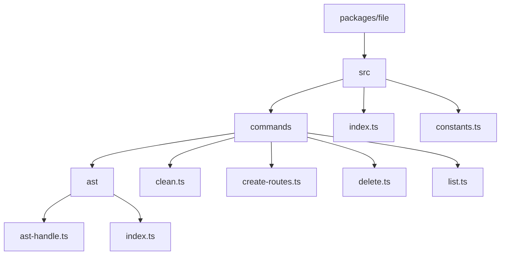
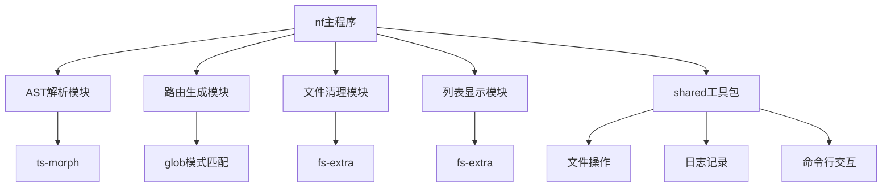
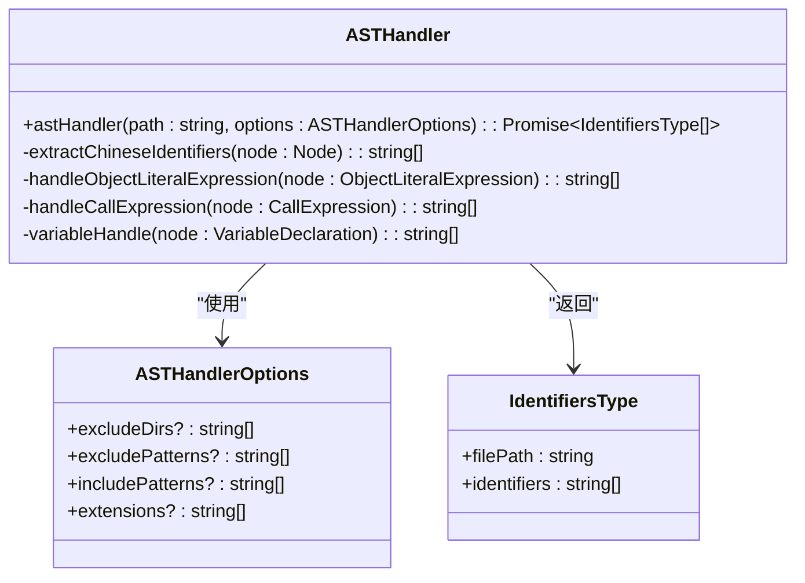
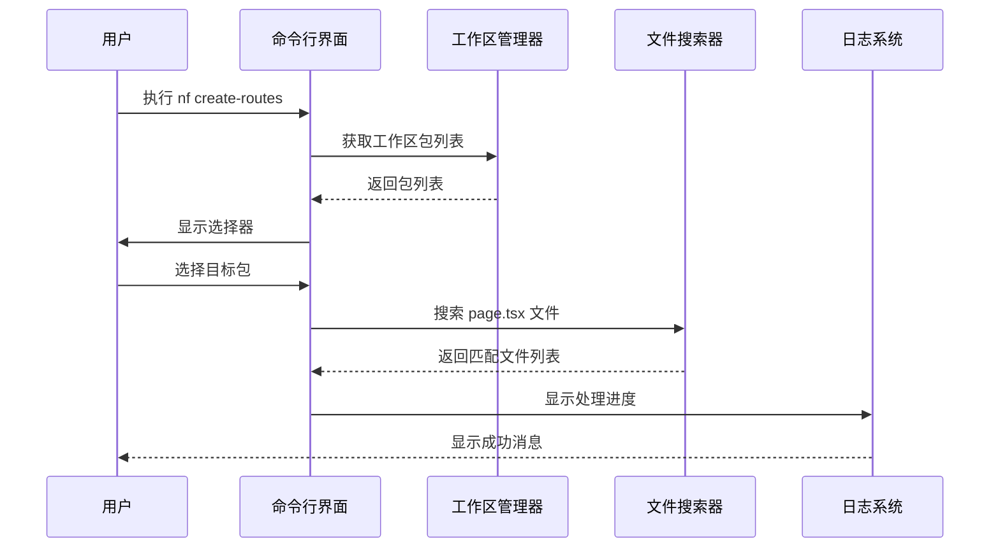
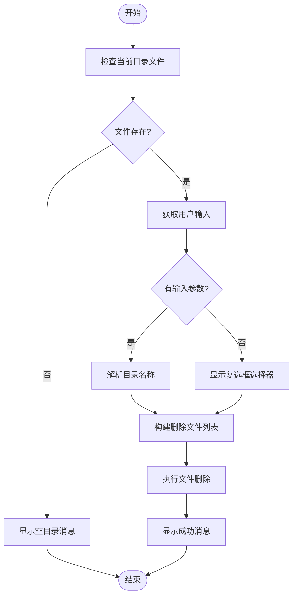
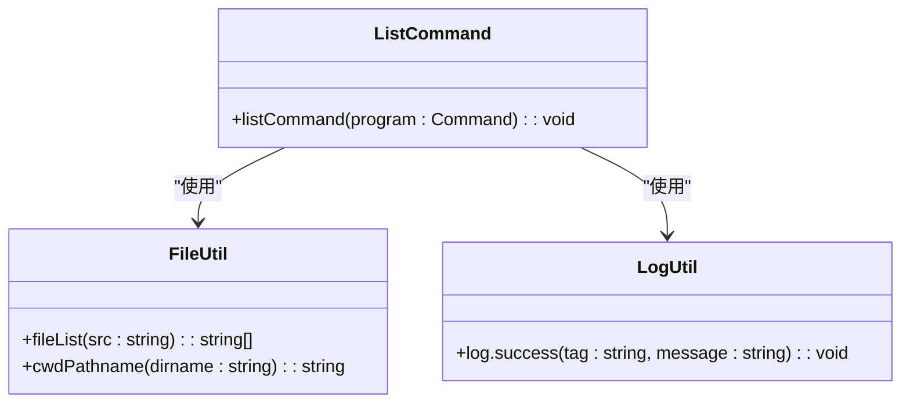
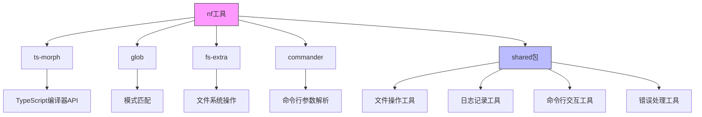

# 文件操作 (nf)

<cite>
**本文档中引用的文件**   
- [index.ts](file://packages/file/src/index.ts)
- [create-routes.ts](file://packages/file/src/commands/create-routes.ts)
- [ast-handle.ts](file://packages/file/src/commands/ast/ast-handle.ts)
- [ast/index.ts](file://packages/file/src/commands/ast/index.ts)
- [clean.ts](file://packages/file/src/commands/clean.ts)
- [list.ts](file://packages/file/src/commands/list.ts)
- [file.ts](file://packages/shared/src/utils/file.ts)
- [command.ts](file://packages/shared/src/utils/command.ts)
</cite>

## 目录
1. [简介](#简介)
2. [项目结构](#项目结构)
3. [核心组件](#核心组件)
4. [架构概述](#架构概述)
5. [详细组件分析](#详细组件分析)
6. [依赖分析](#依赖分析)
7. [性能考虑](#性能考虑)
8. [故障排除指南](#故障排除指南)
9. [结论](#结论)

## 简介
`nf` 是一个文件操作工具，提供了一系列命令来简化文件管理任务。该工具支持AST解析、路由生成、文件清理和列表显示等功能。通过`nf create-routes`命令，可以分析代码结构并自动生成路由配置。这些功能与shared包中的通用工具协同工作，为开发者提供高效的开发体验。

## 项目结构
`nf` 工具的项目结构清晰，主要功能集中在`packages/file/src/commands`目录下。每个命令都有独立的实现文件，并通过主入口文件进行注册。工具依赖于shared包提供的通用功能，如文件操作、日志记录和命令行交互。

**图示来源**
- [index.ts](file://packages/file/src/index.ts)
- [create-routes.ts](file://packages/file/src/commands/create-routes.ts)
- [ast-handle.ts](file://packages/file/src/commands/ast/ast-handle.ts)

**本节来源**
- [index.ts](file://packages/file/src/index.ts)
- [project_structure](file://project_structure)

## 核心组件
`nf` 工具的核心组件包括AST解析、路由生成、文件清理和列表显示四个主要功能模块。这些模块通过Commander库集成到统一的命令行界面中，每个模块都专注于特定的文件操作任务。

**本节来源**
- [index.ts](file://packages/file/src/index.ts)
- [create-routes.ts](file://packages/file/src/commands/create-routes.ts)
- [ast-handle.ts](file://packages/file/src/commands/ast/ast-handle.ts)

## 架构概述
`nf` 工具采用模块化架构设计，将不同的文件操作功能分解为独立的命令模块。主程序通过`createCommand`函数初始化命令行界面，并将各个功能模块注册为子命令。这种设计使得工具易于扩展和维护。

**图示来源**
- [index.ts](file://packages/file/src/index.ts)
- [command.ts](file://packages/shared/src/utils/command.ts)
- [file.ts](file://packages/shared/src/utils/file.ts)

## 详细组件分析

### AST解析功能分析
`nf ast` 命令提供了强大的AST（抽象语法树）解析功能，能够深入分析TypeScript/JavaScript代码文件，提取其中的中文文本内容。该功能基于`ts-morph`库实现，能够准确识别代码中的字符串字面量、对象属性值和函数调用参数中的中文内容。

**图示来源**
- [ast-handle.ts](file://packages/file/src/commands/ast/ast-handle.ts)
- [index.ts](file://packages/file/src/commands/ast/index.ts)

### 路由生成功能分析
`nf create-routes` 命令用于在React项目中自动生成路由配置。该命令通过glob模式匹配查找项目中的`page.tsx`文件，并基于文件路径生成相应的路由映射。用户可以通过交互式选择器选择要处理的项目包。

**图示来源**
- [create-routes.ts](file://packages/file/src/commands/create-routes.ts)
- [file.ts](file://packages/shared/src/utils/file.ts)

### 文件清理功能分析
`nf clean` 命令提供了交互式的文件清理功能。用户可以选择要删除的文件，或者指定要清理的目录名称。该命令使用fs-extra库进行文件系统操作，确保删除操作的安全性和可靠性。

**图示来源**
- [clean.ts](file://packages/file/src/commands/clean.ts)
- [file.ts](file://packages/shared/src/utils/file.ts)

### 列表显示功能分析
`nf list` 命令用于显示目录中的文件列表，支持显示隐藏文件和子目录文件。该功能基于fs-extra库的readdirSync方法实现，提供了简单而有效的文件浏览能力。

**图示来源**
- [list.ts](file://packages/file/src/commands/list.ts)
- [file.ts](file://packages/shared/src/utils/file.ts)

## 依赖分析
`nf` 工具依赖于多个外部库和内部共享包，这些依赖关系构成了工具的功能基础。通过分析依赖关系，可以更好地理解工具的架构和扩展方式。

**图示来源**
- [package.json](file://packages/file/package.json)
- [index.ts](file://packages/file/src/index.ts)
- [command.ts](file://packages/shared/src/utils/command.ts)

**本节来源**
- [package.json](file://packages/file/package.json)
- [tsconfig.json](file://tsconfig.json)

## 性能考虑
在使用`nf`工具时，需要考虑一些性能因素以确保最佳的使用体验。AST解析和文件搜索操作可能会消耗较多的系统资源，特别是在大型项目中。

1. **AST解析性能**：`ts-morph`库在处理大型代码库时可能会消耗较多内存。建议在处理大型项目时使用`--exclude`选项排除不必要的目录。

2. **文件搜索效率**：glob模式匹配的性能取决于搜索范围的大小。使用精确的路径和文件模式可以提高搜索效率。

3. **并发操作**：目前的实现是串行处理多个文件，未来可以考虑引入并发处理机制以提高性能。

4. **缓存机制**：对于频繁执行的命令，可以考虑引入结果缓存机制，避免重复的文件系统操作。

**本节来源**
- [ast-handle.ts](file://packages/file/src/commands/ast/ast-handle.ts)
- [create-routes.ts](file://packages/file/src/commands/create-routes.ts)

## 故障排除指南
当使用`nf`工具遇到问题时，可以参考以下常见问题的解决方案：

1. **命令未找到**：确保`nemo-cli`已正确安装并添加到系统PATH中。

2. **AST解析失败**：检查目标文件是否为有效的TypeScript/JavaScript文件，确保文件语法正确。

3. **文件清理失败**：确认有足够的文件系统权限，检查目标文件是否被其他进程占用。

4. **路由生成无结果**：验证项目中是否存在`page.tsx`文件，检查文件路径是否符合预期。

5. **性能问题**：对于大型项目，使用`--exclude`选项排除`node_modules`、`dist`等大型目录。

**本节来源**
- [ast-handle.ts](file://packages/file/src/commands/ast/ast-handle.ts)
- [clean.ts](file://packages/file/src/commands/clean.ts)
- [error.ts](file://packages/shared/src/utils/error.ts)

## 结论
`nf` 文件操作工具提供了一套完整的文件管理解决方案，涵盖了AST解析、路由生成、文件清理和列表显示等常用功能。通过与shared包的深度集成，工具实现了代码复用和功能一致性。AST解析功能基于`ts-morph`库，能够准确提取代码中的中文内容；路由生成功能通过glob模式匹配，为React项目提供了便捷的路由配置能力。工具的模块化设计使其易于扩展和维护，为开发者提供了高效的文件操作体验。