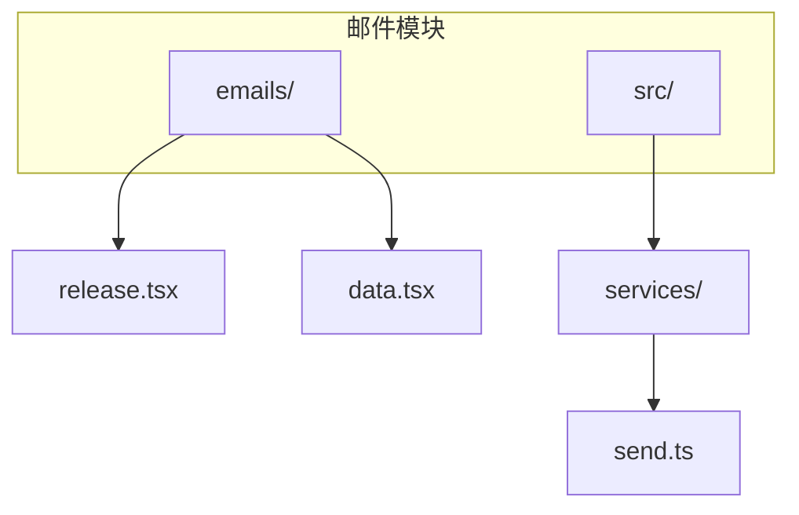
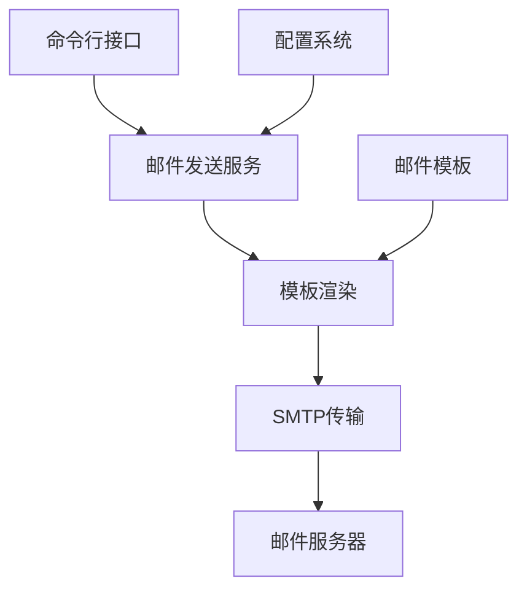
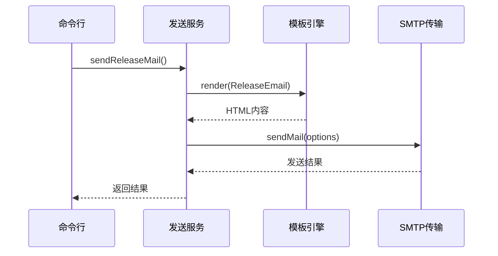
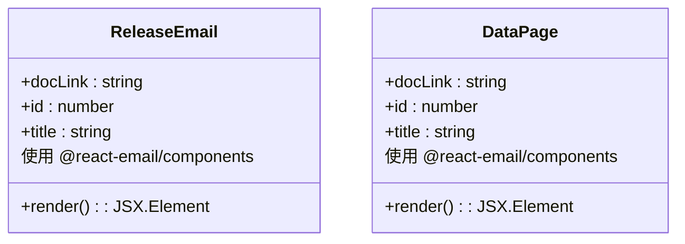
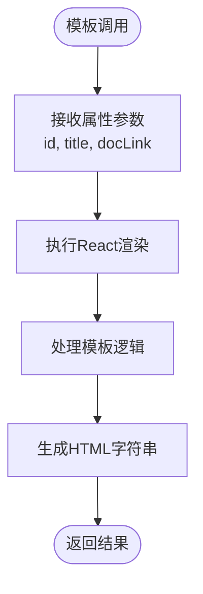
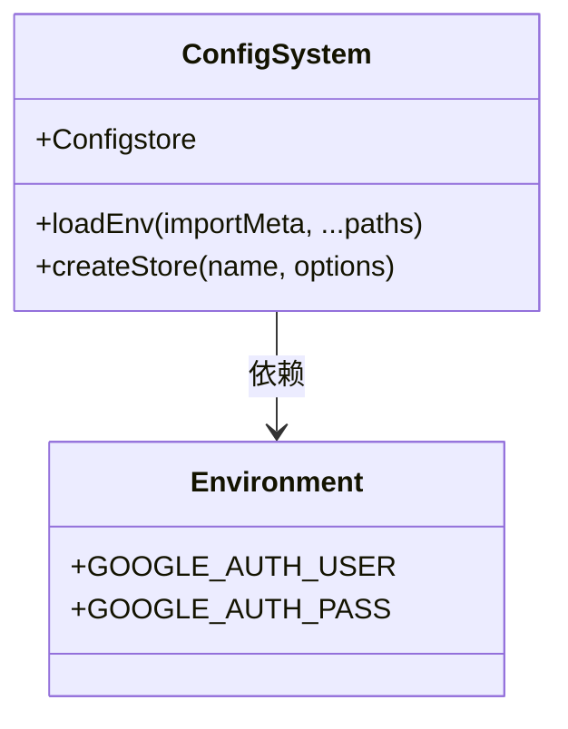
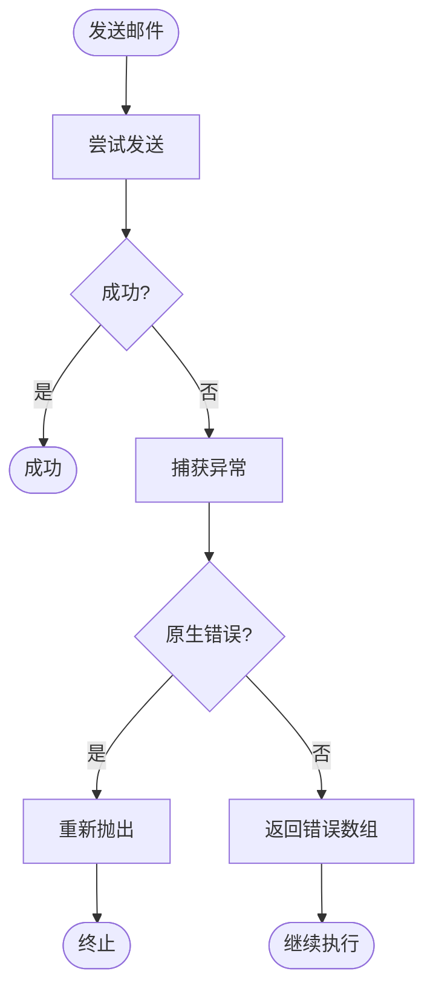

# 邮件工具 (nm)

<cite>
**本文档中引用的文件**   
- [send.ts](file://packages/mail/src/services/send.ts)
- [release.tsx](file://packages/mail/emails/release.tsx)
- [data.tsx](file://packages/mail/emails/data.tsx)
- [config.ts](file://packages/shared/src/utils/config.ts)
- [.env.example](file://packages/mail/.env.example)
- [index.md](file://docs/packages-mail/index.md)
- [promise.ts](file://packages/shared/src/utils/promise.ts)
</cite>

## 目录

1. [简介](#简介)
2. [项目结构](#项目结构)
3. [核心组件](#核心组件)
4. [架构概述](#架构概述)
5. [详细组件分析](#详细组件分析)
6. [依赖分析](#依赖分析)
7. [性能考虑](#性能考虑)
8. [故障排除指南](#故障排除指南)
9. [结论](#结论)

## 简介

本项目实现了一个基于命令行的邮件发送工具，通过`nm`命令支持模板化邮件发送功能。系统使用react-email构建可重用的邮件模板（如release.tsx），并通过nodemailer发送邮件。配置流程包括设置SMTP凭据和邮件服务提供商，支持使用`nm send --template release`发送版本发布通知等具体示例。邮件模板具有清晰的结构和变量注入机制，允许创建自定义模板。错误处理策略包含发送失败时的重试机制，并通过shared包中的配置系统管理邮件设置。

## 项目结构

邮件功能模块位于`packages/mail`目录下，主要包含邮件模板和发送服务。



**Diagram sources**
- [send.ts](file://packages/mail/src/services/send.ts)
- [release.tsx](file://packages/mail/emails/release.tsx)
- [data.tsx](file://packages/mail/emails/data.tsx)

**Section sources**
- [send.ts](file://packages/mail/src/services/send.ts)
- [release.tsx](file://packages/mail/emails/release.tsx)

## 核心组件

邮件系统的核心组件包括邮件模板（如release.tsx）、邮件发送服务（send.ts）以及共享配置系统。系统使用react-email构建响应式邮件模板，通过nodemailer与SMTP服务器通信发送邮件。配置系统基于shared包实现，支持环境变量和持久化配置管理。

**Section sources**
- [send.ts](file://packages/mail/src/services/send.ts)
- [release.tsx](file://packages/mail/emails/release.tsx)
- [config.ts](file://packages/shared/src/utils/config.ts)

## 架构概述

系统采用分层架构设计，从上到下分为命令接口层、服务逻辑层、模板渲染层和传输层。



**Diagram sources**
- [send.ts](file://packages/mail/src/services/send.ts)
- [release.tsx](file://packages/mail/emails/release.tsx)
- [config.ts](file://packages/shared/src/utils/config.ts)

## 详细组件分析

### 邮件发送服务分析

邮件发送服务是系统的核心，负责协调模板渲染和邮件传输过程。

#### 服务实现


**Diagram sources**
- [send.ts](file://packages/mail/src/services/send.ts)
- [release.tsx](file://packages/mail/emails/release.tsx)

### 邮件模板分析

邮件模板使用React组件构建，支持动态数据注入。

#### 模板结构


**Diagram sources**
- [release.tsx](file://packages/mail/emails/release.tsx)
- [data.tsx](file://packages/mail/emails/data.tsx)

#### 变量注入机制


**Diagram sources**
- [release.tsx](file://packages/mail/emails/release.tsx)

### 配置系统分析

配置系统管理邮件服务所需的凭证和设置。

#### 配置管理


**Diagram sources**
- [config.ts](file://packages/shared/src/utils/config.ts)
- [.env.example](file://packages/mail/.env.example)

### 错误处理分析

系统实现了健壮的错误处理机制，确保邮件发送的可靠性。

#### 错误处理流程


**Diagram sources**
- [send.ts](file://packages/mail/src/services/send.ts)
- [promise.ts](file://packages/shared/src/utils/promise.ts)

**Section sources**
- [send.ts](file://packages/mail/src/services/send.ts)
- [promise.ts](file://packages/shared/src/utils/promise.ts)

## 依赖分析

邮件系统依赖多个关键包来实现其功能。

```mermaid
graph LR
A[@nemo-cli/mail] --> B[@react-email/components]
A --> C[nodemailer]
A --> D[@nemo-cli/shared]
D --> E[configstore]
D --> F[dotenv]
B --> G[React]
C --> H[SMTP服务器]
```

**Diagram sources**
- [send.ts](file://packages/mail/src/services/send.ts)
- [config.ts](file://packages/shared/src/utils/config.ts)

**Section sources**
- [send.ts](file://packages/mail/src/services/send.ts)
- [config.ts](file://packages/shared/src/utils/config.ts)

## 性能考虑

邮件发送系统在设计时考虑了性能和可靠性因素。模板渲染使用React的高效虚拟DOM机制，确保快速生成HTML内容。异步操作通过Promise和async/await模式实现，避免阻塞主线程。错误处理机制采用safeAwait包装器，提供统一的错误处理接口，同时保留原生错误类型以便正确处理。对于大量邮件发送场景，建议实现批处理和队列机制以优化性能。

## 故障排除指南

当邮件发送出现问题时，可以按照以下步骤进行排查：

1. **检查环境变量配置**：确保`.env`文件存在且包含正确的SMTP凭据
2. **验证网络连接**：确认能够访问SMTP服务器（如smtp.gmail.com）
3. **检查模板数据**：确保传递给模板的必需参数不为空
4. **查看错误日志**：分析返回的错误信息以确定问题根源
5. **测试SMTP配置**：使用简单配置测试基本发送功能

**Section sources**
- [.env.example](file://packages/mail/.env.example)
- [send.ts](file://packages/mail/src/services/send.ts)
- [config.ts](file://packages/shared/src/utils/config.ts)

## 结论

邮件工具`nm`提供了一套完整的模板化邮件发送解决方案。系统通过react-email实现现代化的邮件模板开发体验，利用nodemailer确保可靠的邮件传输。配置系统基于shared包构建，支持灵活的环境管理和持久化存储。错误处理机制健壮，能够妥善处理各种异常情况。整体架构清晰，组件职责分明，便于维护和扩展。通过`nm send --template release`等命令，用户可以方便地发送预定义的邮件模板，如版本发布通知。