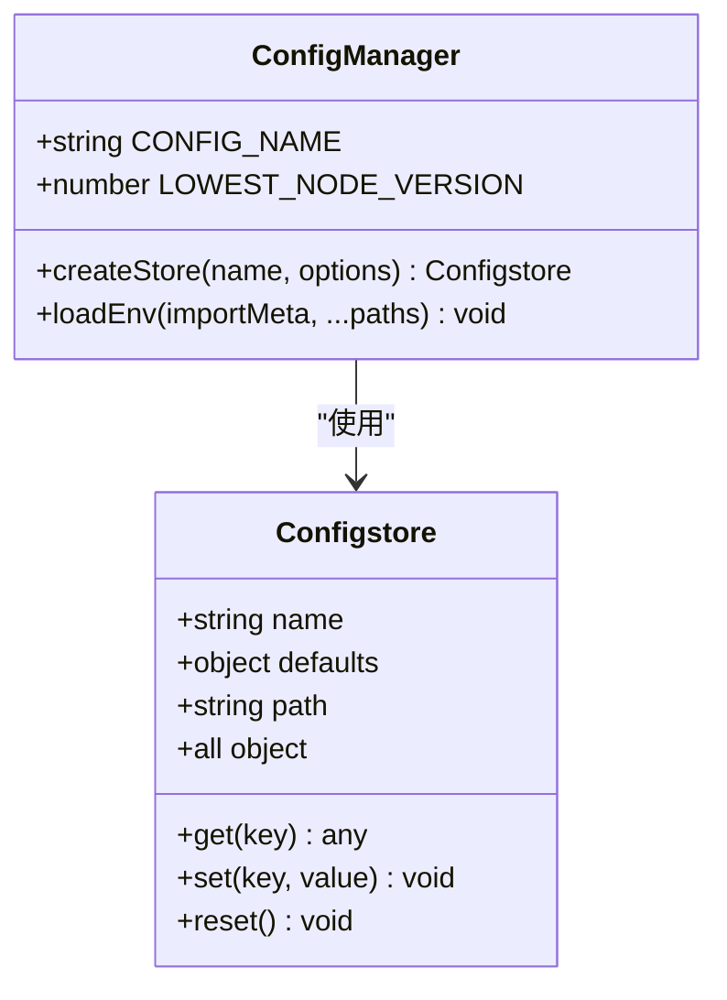

# 安装与配置

<cite>
**本文档中引用的文件**  
- [.env.example](file://.env.example)
- [packages/ai/.env.example](file://packages/ai/.env.example)
- [packages/mail/.env.example](file://packages/mail/.env.example)
- [package.json](file://package.json)
- [README.md](file://README.md)
- [packages/shared/src/utils/config.ts](file://packages/shared/src/utils/config.ts)
- [packages/shared/src/constants.ts](file://packages/shared/src/constants.ts)
- [packages/mail/src/services/send.ts](file://packages/mail/src/services/send.ts)
- [packages/ai/src/index.ts](file://packages/ai/src/index.ts)
- [packages/git/bin/index.mjs](file://packages/git/bin/index.mjs)
- [packages/file/bin/index.mjs](file://packages/file/bin/index.mjs)
- [packages/package/bin/index.mjs](file://packages/package/bin/index.mjs)
</cite>

## 目录
1. [简介](#简介)
2. [全局安装步骤](#全局安装步骤)
3. [配置流程](#配置流程)
4. [环境变量详解](#环境变量详解)
5. [配置存储机制](#配置存储机制)
6. [操作系统特定安装示例](#操作系统特定安装示例)
7. [常见问题与解决方案](#常见问题与解决方案)
8. [完整配置流程演示](#完整配置流程演示)
9. [高级配置与自动化建议](#高级配置与自动化建议)
10. [结论](#结论)

## 简介
nemo-cli 是一个功能强大的命令行工具，提供文件操作、Git 操作和 pnpm 包管理等功能。本指南将详细介绍如何安装和配置 nemo-cli，确保用户能够顺利使用该工具。

**Section sources**
- [README.md](file://README.md#L1-L64)

## 全局安装步骤
要全局安装 nemo-cli 工具，请按照以下步骤操作：

1. 克隆项目仓库：
```bash
git clone git@bitbucket.org:antalphadev/prime-cli.git
```

2. 安装所有依赖：
```bash
pnpm i -r
```

3. 构建项目：
```bash
pnpm build
```

4. 进入 git 包目录并全局链接：
```bash
cd ./packages/git
pnpm link -g
```

完成上述步骤后，您就可以使用 `ng` 命令来访问 nemo-cli 的各种功能。

**Section sources**
- [README.md](file://README.md#L8-L21)
- [package.json](file://package.json#L1-L66)

## 配置流程
nemo-cli 的配置流程主要包括环境变量设置和配置文件管理。首先需要创建环境变量文件，然后根据需要进行自定义配置。

**Section sources**
- [.env.example](file://.env.example#L1-L13)
- [packages/ai/.env.example](file://packages/ai/.env.example#L1-L6)
- [packages/mail/.env.example](file://packages/mail/.env.example#L1-L3)

## 环境变量详解
nemo-cli 使用多个环境变量来配置不同的服务。以下是主要的可配置项及其用途：

- **SLACK_BOT_TOKEN**: Slack 机器人的认证令牌
- **slack_team_id**: Slack 团队 ID
- **slack_channel_ids**: Slack 频道 ID 列表
- **API_KEY**: 主要 AI 服务的 API 密钥
- **GOOGLE_API_KEY**: Google 服务的 API 密钥
- **CONFLUENCE_API_TOKEN**: Confluence API 认证令牌
- **CONFLUENCE_EMAIL**: Confluence 账户邮箱
- **GOOGLE_AUTH_PASS**: Google 邮件服务的应用专用密码
- **GOOGLE_AUTH_USER**: Google 邮件服务的用户名

这些环境变量应在 `.env` 文件中设置，系统会自动加载这些配置。

**Section sources**
- [.env.example](file://.env.example#L1-L13)
- [packages/ai/.env.example](file://packages/ai/.env.example#L1-L6)
- [packages/mail/.env.example](file://packages/mail/.env.example#L1-L3)
- [packages/mail/src/services/send.ts](file://packages/mail/src/services/send.ts#L1-L45)

## 配置存储机制
nemo-cli 使用 `configstore` 库来管理本地配置。配置文件默认存储在用户主目录下的 `.nemoclirc` 目录中。

配置存储的关键特性包括：
- 使用 `Configstore` 类实现持久化存储
- 配置根路径为 `~/.nemoclirc`
- 支持创建多个命名的配置存储
- 提供默认值支持和自定义路径选项

这种机制确保了配置的安全性和可移植性。



**Diagram sources**
- [packages/shared/src/utils/config.ts](file://packages/shared/src/utils/config.ts#L1-L39)
- [packages/shared/src/constants.ts](file://packages/shared/src/constants.ts#L1-L3)

**Section sources**
- [packages/shared/src/utils/config.ts](file://packages/shared/src/utils/config.ts#L1-L39)
- [packages/shared/src/constants.ts](file://packages/shared/src/constants.ts#L1-L3)

## 操作系统特定安装示例
### macOS/Linux 安装示例
```bash
# 克隆仓库
git clone git@bitbucket.org:antalphadev/prime-cli.git
cd prime-cli

# 安装依赖并构建
pnpm i -r
pnpm build

# 全局链接 git 工具包
cd packages/git
pnpm link -g

# 验证安装
ng -h
```

### Windows 安装示例
```cmd
:: 克隆仓库
git clone git@bitbucket.org:antalphadev/prime-cli.git
cd prime-cli

:: 安装依赖并构建
pnpm i -r
pnpm build

:: 全局链接 git 工具包
cd packages\git
pnpm link -g

:: 验证安装
ng -h
```

**Section sources**
- [README.md](file://README.md#L8-L21)
- [packages/git/bin/index.mjs](file://packages/git/bin/index.mjs#L1-L6)

## 常见问题与解决方案
### 权限错误
如果在全局安装时遇到权限错误，可以尝试以下解决方案：

1. 使用 `sudo` 命令（不推荐）：
```bash
sudo pnpm link -g
```

2. 重新配置 npm/pnpm 的全局安装路径：
```bash
pnpm config set prefix ~/.pnpm-global
export PATH=~/.pnpm-global/bin:$PATH
```

### 依赖安装失败
当依赖安装失败时，请检查：

1. Node.js 版本是否满足最低要求（v18.0.0）
2. 网络连接是否正常
3. pnpm 版本是否为最新

可以尝试清除缓存后重新安装：
```bash
pnpm cache clean
pnpm i -r
```

### 环境变量未加载
确保：
1. `.env` 文件位于正确位置
2. 环境变量名称拼写正确
3. 重启终端以确保环境变量生效

**Section sources**
- [package.json](file://package.json#L27-L43)
- [packages/shared/src/constants.ts](file://packages/shared/src/constants.ts#L1)

## 完整配置流程演示
以下是新手从零开始的完整配置流程：

1. **克隆仓库**
```bash
git clone git@bitbucket.org:antalphadev/prime-cli.git
cd prime-cli
```

2. **创建环境变量文件**
```bash
cp .env.example .env
```

3. **编辑 .env 文件**
```bash
# 使用编辑器打开 .env 文件
# 填写实际的 API 密钥和认证信息
```

4. **安装依赖**
```bash
pnpm i -r
```

5. **构建项目**
```bash
pnpm build
```

6. **全局安装主命令**
```bash
cd packages/git
pnpm link -g
```

7. **验证安装**
```bash
ng -h
```

8. **测试基本功能**
```bash
ng branch -h
ng commit
```

此流程确保了新手能够顺利启动和使用 nemo-cli 工具。

**Section sources**
- [README.md](file://README.md#L8-L64)
- [.env.example](file://.env.example#L1-L13)

## 高级配置与自动化建议
对于高级用户，可以考虑以下配置扩展和自动化脚本建议：

### 配置扩展
1. **多环境配置**：为开发、测试和生产环境创建不同的 `.env` 文件
2. **配置继承**：使用 `configstore` 的层次结构实现配置继承
3. **加密存储**：对敏感信息如 API 密钥进行加密存储

### 自动化脚本
1. **安装脚本**：创建一键安装脚本
```bash
#!/bin/bash
git clone git@bitbucket.org:antalphadev/prime-cli.git
cd prime-cli
cp .env.example .env
echo "请编辑 .env 文件并填写配置信息"
pnpm i -r
pnpm build
cd packages/git
pnpm link -g
echo "安装完成！"
```

2. **配置验证脚本**：创建脚本验证所有必需的环境变量是否已设置

3. **更新脚本**：创建自动化更新脚本，拉取最新代码并重新构建

这些高级配置和自动化建议可以帮助团队提高效率并确保配置的一致性。

**Section sources**
- [packages/shared/src/utils/config.ts](file://packages/shared/src/utils/config.ts#L1-L39)
- [package.json](file://package.json#L9-L25)

## 结论
通过本指南，您已经了解了如何安装和配置 nemo-cli 工具。从基本的全局安装到复杂的环境变量配置，再到高级的自动化建议，本指南为不同层次的用户提供了全面的指导。记住始终保护好您的 API 密钥和认证信息，并定期更新工具以获得最新的功能和安全补丁。