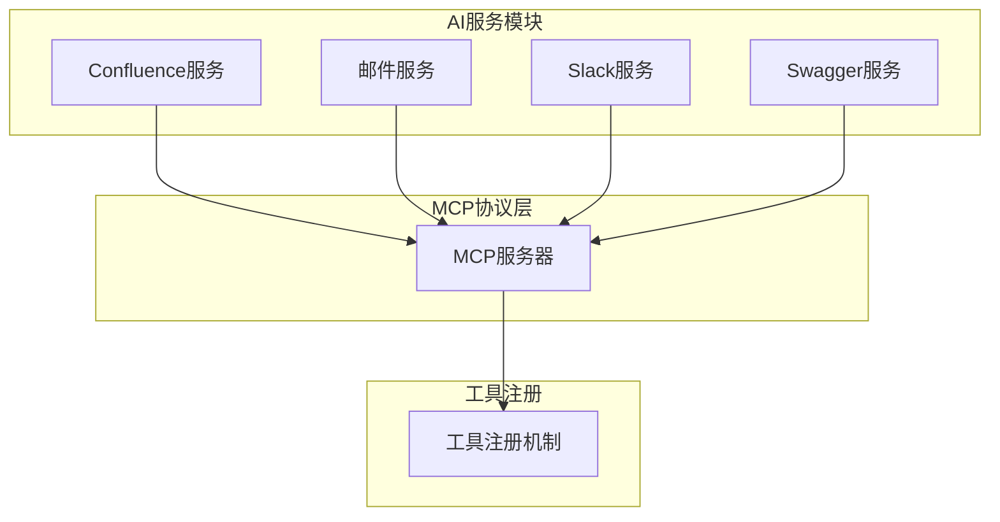
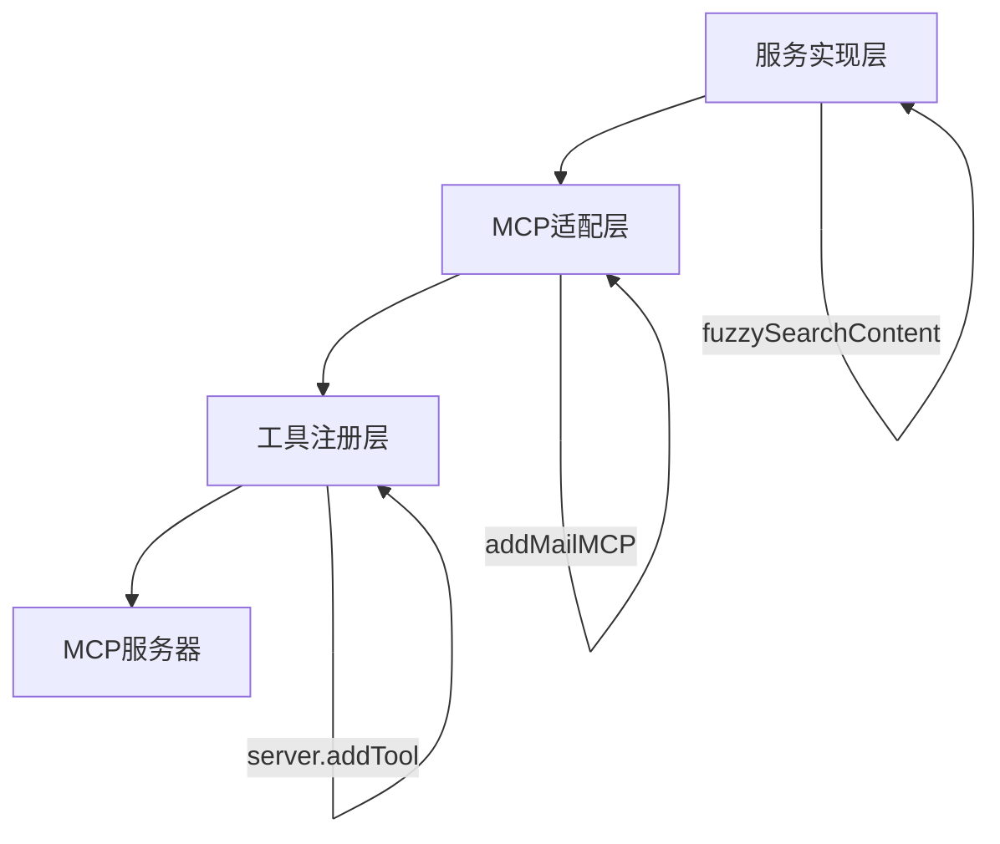
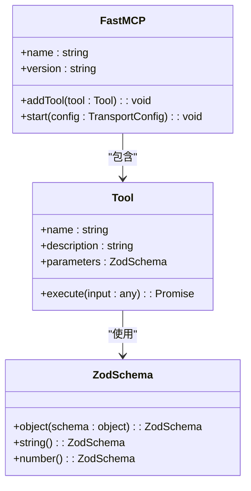
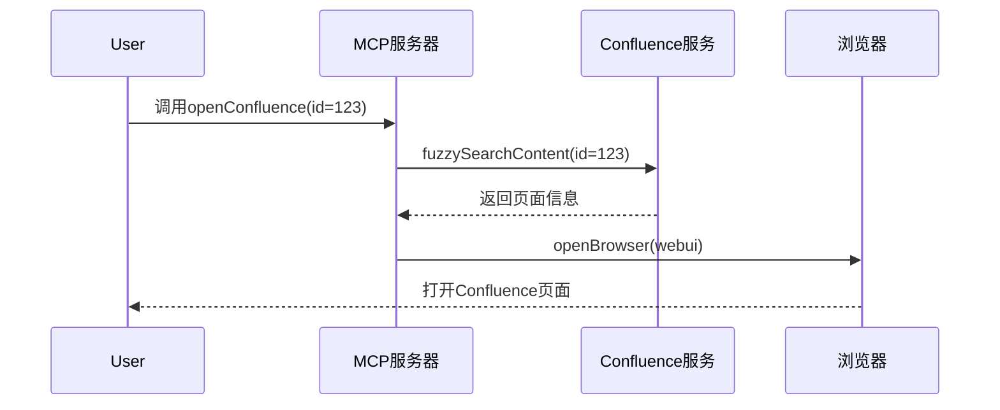

# 扩展AI工具

<cite>
**本文档中引用的文件**  
- [index.ts](file://packages/ai/src/index.ts)
- [mcp.ts](file://packages/ai/src/services/confluence/mcp.ts)
- [mcp.ts](file://packages/ai/src/services/mails/mcp.ts)
- [mcp.ts](file://packages/ai/src/services/swagger/mcp.ts)
- [getPRD.ts](file://packages/ai/src/services/slack/tools/getPRD.ts)
- [createContent.ts](file://packages/ai/src/services/confluence/createContent.ts)
- [getContent.ts](file://packages/ai/src/services/confluence/getContent.ts)
- [bot.ts](file://packages/ai/src/services/slack/bot.ts)
- [manifest.json](file://packages/ai/manifest.json)
</cite>

## 目录
1. [简介](#简介)
2. [项目结构](#项目结构)
3. [核心组件](#核心组件)
4. [架构概述](#架构概述)
5. [详细组件分析](#详细组件分析)
6. [依赖分析](#依赖分析)
7. [性能考虑](#性能考虑)
8. [故障排除指南](#故障排除指南)
9. [结论](#结论)

## 简介
本文档详细说明如何通过MCP（Model Context Protocol）协议扩展nemo-cli的AI能力。重点介绍MCP服务的注册机制、AI工具描述符的定义与实现、自定义AI服务的创建与注入方法。通过实现一个`code-review` MCP工具的示例，展示如何调用AI分析Git差异并生成评审意见。同时涵盖上下文管理、流式响应、错误恢复等关键技术点，以及与现有AI会话系统的集成方法，确保工具能够访问项目上下文（如PRD、架构文档）。最后讨论安全考虑，包括敏感信息过滤和调用频率限制。

## 项目结构
nemo-cli的项目结构采用模块化设计，将AI功能封装在独立的`packages/ai`包中。该包通过MCP协议与其他系统组件进行通信，实现了AI能力的可扩展性。核心AI服务位于`packages/ai/src/services/`目录下，包括Confluence、邮件、Slack和Swagger等集成服务。每个服务通过MCP工具注册机制暴露其功能，形成统一的AI工具集。



**图示来源**  
- [index.ts](file://packages/ai/src/index.ts#L7-L17)
- [mcp.ts](file://packages/ai/src/services/confluence/mcp.ts#L8-L39)
- [mcp.ts](file://packages/ai/src/services/mails/mcp.ts#L18-L27)

**本节来源**  
- [index.ts](file://packages/ai/src/index.ts#L1-L20)
- [manifest.json](file://packages/ai/manifest.json#L1-L35)

## 核心组件
nemo-cli的AI扩展能力基于MCP协议构建，核心组件包括MCP服务器、工具注册机制和AI服务实现。MCP服务器作为中心枢纽，负责管理所有AI工具的生命周期。工具注册机制允许动态添加新的AI功能，而无需修改核心代码。AI服务实现则封装了具体的业务逻辑，如创建Confluence页面、发送邮件等。

**本节来源**  
- [index.ts](file://packages/ai/src/index.ts#L7-L17)
- [mcp.ts](file://packages/ai/src/services/confluence/mcp.ts#L8-L39)

## 架构概述
nemo-cli的AI扩展架构采用分层设计，从下到上分别为服务实现层、MCP适配层和工具注册层。服务实现层包含具体的业务逻辑，如Confluence内容创建和检索。MCP适配层将这些服务包装成符合MCP协议的工具。工具注册层则负责将这些工具注册到MCP服务器，使其对外可见。



**图示来源**  
- [createContent.ts](file://packages/ai/src/services/confluence/createContent.ts#L18-L34)
- [getContent.ts](file://packages/ai/src/services/confluence/getContent.ts#L12-L38)
- [mcp.ts](file://packages/ai/src/services/confluence/mcp.ts#L8-L39)

## 详细组件分析

### MCP服务注册机制
MCP服务注册机制是nemo-cli扩展AI能力的核心。通过`FastMCP`类创建MCP服务器实例，并使用`addTool`方法注册新的AI工具。每个工具需要定义名称、描述、参数模式和执行函数。参数模式使用Zod库进行类型验证，确保输入数据的正确性。



**图示来源**  
- [index.ts](file://packages/ai/src/index.ts#L7-L17)
- [mcp.ts](file://packages/ai/src/services/confluence/mcp.ts#L9-L18)

### AI工具描述符定义
AI工具描述符通过Zod库定义参数模式，确保类型安全和数据验证。例如，`createReleasePage`工具接受一个数字类型的`id`参数，而`sendReleaseMail`工具也使用相同的参数模式。这种设计使得工具接口清晰且易于维护。

**本节来源**  
- [mcp.ts](file://packages/ai/src/services/confluence/mcp.ts#L12-L14)
- [mcp.ts](file://packages/ai/src/services/mails/mcp.ts#L22-L24)

### 自定义AI服务实现
自定义AI服务的实现遵循统一的模式：首先实现具体业务逻辑，然后通过MCP适配器将其包装成工具。例如，Confluence服务实现了`createPage`和`fuzzySearchContent`函数，然后在`addConfluenceMCP`函数中注册为MCP工具。这种分离关注点的设计提高了代码的可测试性和可维护性。



**图示来源**  
- [mcp.ts](file://packages/ai/src/services/confluence/mcp.ts#L20-L37)
- [getContent.ts](file://packages/ai/src/services/confluence/getContent.ts#L12-L38)
- [createContent.ts](file://packages/ai/src/services/confluence/createContent.ts#L18-L34)

### code-review工具示例
虽然代码库中未直接实现`code-review`工具，但可以基于现有模式进行扩展。该工具需要集成Git服务获取差异信息，然后调用AI模型进行分析。实现时需要考虑上下文管理，确保AI能够访问相关的PRD和架构文档。

**本节来源**  
- [mcp.ts](file://packages/ai/src/services/confluence/mcp.ts#L8-L39)
- [getPRD.ts](file://packages/ai/src/services/slack/tools/getPRD.ts#L6-L35)

## 依赖分析
nemo-cli的AI扩展功能依赖于多个外部库和内部模块。主要外部依赖包括`fastmcp`（MCP协议实现）、`zod`（数据验证）和`@slack/bolt`（Slack集成）。内部依赖则包括`@nemo-cli/shared`（共享工具）和`@nemo-cli/mail`（邮件服务）。

```mermaid
graph TD
A[packages/ai] --> B[fastmcp]
A --> C[zod]
A --> D[@slack/bolt]
A --> E[@nemo-cli/shared]
A --> F[@nemo-cli/mail]
B --> G[MCP协议]
C --> H[数据验证]
D --> I[Slack集成]
E --> J[共享工具]
F --> K[邮件服务]
```

**图示来源**  
- [index.ts](file://packages/ai/src/index.ts#L1-L5)
- [mcp.ts](file://packages/ai/src/services/confluence/mcp.ts#L1-L4)
- [bot.ts](file://packages/ai/src/services/slack/bot.ts#L1-L4)

**本节来源**  
- [package.json](file://packages/ai/package.json#L1-L35)
- [index.ts](file://packages/ai/src/index.ts#L1-L20)

## 性能考虑
在设计AI扩展功能时，需要考虑性能影响。MCP工具的执行应该是异步的，避免阻塞主线程。对于可能耗时的操作（如网络请求），应该实现适当的超时机制和错误处理。此外，可以考虑缓存频繁访问的数据，如Confluence页面内容，以提高响应速度。

## 故障排除指南
当AI工具无法正常工作时，可以按照以下步骤进行排查：
1. 检查MCP服务器是否正常启动
2. 验证工具是否已正确注册
3. 检查参数验证是否通过
4. 查看网络请求是否成功
5. 验证外部服务（如Confluence、Slack）的连接状态

**本节来源**  
- [bot.ts](file://packages/ai/src/services/slack/bot.ts#L102-L111)
- [mcp.ts](file://packages/ai/src/services/confluence/mcp.ts#L15-L18)

## 结论
nemo-cli通过MCP协议提供了一套灵活的AI扩展机制。开发者可以轻松地定义新的AI工具描述符并实现其逻辑，从而扩展系统的智能能力。通过合理的架构设计和依赖管理，确保了系统的可维护性和可扩展性。未来可以进一步完善`code-review`等高级AI工具，提升开发效率和代码质量。