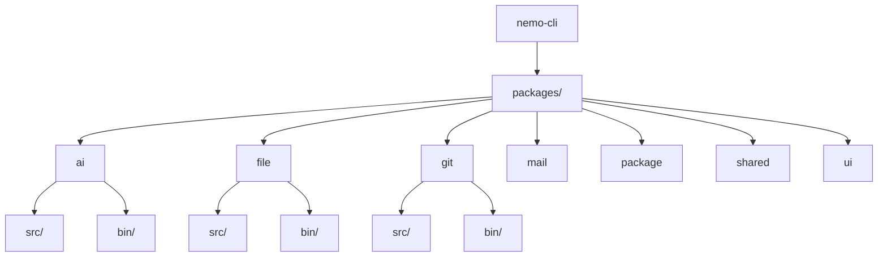
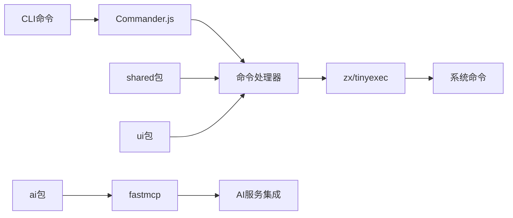

# 扩展开发指南

<cite>
**本文档中引用的文件**  
- [README.md](file://README.md)
- [package.json](file://package.json)
- [packages/shared/src/index.ts](file://packages/shared/src/index.ts)
- [packages/ui/src/index.ts](file://packages/ui/src/index.ts)
- [packages/ai/src/index.ts](file://packages/ai/src/index.ts)
- [packages/shared/src/utils/command.ts](file://packages/shared/src/utils/command.ts)
- [packages/ui/src/components/index.ts](file://packages/ui/src/components/index.ts)
- [packages/file/bin/index.mjs](file://packages/file/bin/index.mjs)
- [packages/git/bin/index.mjs](file://packages/git/bin/index.mjs)
- [packages/package/bin/index.mjs](file://packages/package/bin/index.mjs)
- [packages/file/src/index.ts](file://packages/file/src/index.ts)
- [packages/git/src/index.ts](file://packages/git/src/index.ts)
- [packages/package/src/index.ts](file://packages/package/src/index.ts)
- [packages/file/src/commands/list.ts](file://packages/file/src/commands/list.ts)
- [packages/git/src/commands/branch.ts](file://packages/git/src/commands/branch.ts)
</cite>

## 目录
1. [简介](#简介)
2. [项目结构概览](#项目结构概览)
3. [核心架构与依赖](#核心架构与依赖)
4. [添加新命令的标准流程](#添加新命令的标准流程)
5. [扩展AI工具与MCP协议集成](#扩展ai工具与mcp协议集成)
6. [创建自定义邮件模板和终端UI组件](#创建自定义邮件模板和终端ui组件)
7. [使用shared包和ui包](#使用shared包和ui包)
8. [从零开始添加新命令教程](#从零开始添加新命令教程)
9. [代码风格与架构规范](#代码风格与架构规范)
10. [结论](#结论)

## 简介
本指南旨在为开发者提供详细的说明，指导如何为nemo-cli项目添加新功能。nemo-cli是一个基于Node.js的命令行工具集合，通过pnpm工作区管理多个独立的CLI包。本指南将涵盖添加新命令、扩展AI服务、创建自定义UI组件等核心扩展功能。

**Section sources**
- [README.md](file://README.md)

## 项目结构概览
nemo-cli采用monorepo架构，使用pnpm工作区管理多个独立的CLI包。每个包位于`packages/`目录下，具有独立的`package.json`和源代码结构。主要包含以下核心包：
- `packages/ai`: AI服务集成
- `packages/file`: 文件操作工具
- `packages/git`: Git操作工具
- `packages/mail`: 邮件服务
- `packages/package`: pnpm包管理工具
- `packages/shared`: 共享工具函数
- `packages/ui`: 终端UI组件

每个包都遵循相同的结构模式：`src/`目录存放源代码，`bin/`目录存放CLI入口文件，通过`dist/`目录输出编译后的代码。



**Diagram sources**
- [package.json](file://package.json)
- [packages/file/bin/index.mjs](file://packages/file/bin/index.mjs)

**Section sources**
- [package.json](file://package.json)

## 核心架构与依赖
nemo-cli的核心架构基于Commander.js构建命令行界面，使用zx和tinyexec执行系统命令，通过es-toolkit进行数据处理。项目采用TypeScript编写，使用Rolldown进行打包。

关键依赖包括：
- `commander`: 命令行参数解析
- `zx`: Shell命令执行
- `es-toolkit`: 实用工具函数
- `fastmcp`: MCP协议实现
- `superjson`: 数据序列化
- `zod`: 数据验证

共享包`@nemo-cli/shared`提供了跨包复用的工具函数，而`@nemo-cli/ui`提供了统一的终端UI组件。



**Diagram sources**
- [packages/shared/src/index.ts](file://packages/shared/src/index.ts)
- [packages/ai/src/index.ts](file://packages/ai/src/index.ts)

**Section sources**
- [package.json](file://package.json)
- [packages/shared/src/index.ts](file://packages/shared/src/index.ts)

## 添加新命令的标准流程
为nemo-cli添加新命令需要遵循标准流程，确保代码结构的一致性和可维护性。

### 1. 在packages目录下创建新模块
首先，在`packages/`目录下创建新的包目录，例如`packages/new-feature`。每个包应包含以下基本文件结构：
```
packages/new-feature/
├── bin/
│   └── index.mjs
├── src/
│   ├── commands/
│   ├── constants.ts
│   └── index.ts
├── package.json
└── tsconfig.build.json
```

### 2. 定义bin入口
在`bin/index.mjs`文件中定义CLI入口，这是命令执行的起点：
```javascript
#!/usr/bin/env node
import { run } from '../dist/index.js'
run()
```

### 3. 注册命令
在`src/index.ts`中使用`createCommand`工厂函数创建命令实例，并注册具体命令：
```typescript
import { createCommand, readPackage } from '@nemo-cli/shared'
import { myCommand } from './commands/my-command'
import { HELP_MESSAGE } from './constants'

export const pkg = readPackage(import.meta, '..')

export const init = () => {
  const program = createCommand('nn') // 命令前缀
    .version(pkg.version)
    .description(`${pkg.name} 描述`)
    .addHelpText('after', HELP_MESSAGE.main)
  
  myCommand(program) // 注册具体命令
  
  return program
}

export const run = () => {
  const command = init()
  command.parse(process.argv)
}
```

### 4. 实现具体命令
在`src/commands/`目录下创建具体命令实现文件，每个命令函数接收Commander实例作为参数：
```typescript
import { type Command } from '@nemo-cli/shared'

export const myCommand = (program: Command) => {
  program
    .command('my-command')
    .description('命令描述')
    .action(() => {
      // 命令逻辑
    })
}
```

**Section sources**
- [packages/file/src/index.ts](file://packages/file/src/index.ts)
- [packages/git/src/index.ts](file://packages/git/src/index.ts)
- [packages/package/src/index.ts](file://packages/package/src/index.ts)
- [packages/file/bin/index.mjs](file://packages/file/bin/index.mjs)

## 扩展AI工具与MCP协议集成
nemo-cli通过MCP（Model Control Protocol）协议集成AI服务，允许开发者扩展新的AI工具。

### MCP协议集成流程
1. 在`packages/ai/src/services/`目录下创建新的服务目录
2. 实现MCP服务端点
3. 在`packages/ai/src/index.ts`中注册服务

```typescript
import { FastMCP } from 'fastmcp'
import { addMyServiceMCP } from './services/my-service/mcp'

const server = new FastMCP({
  name: 'Prime Workflow',
  version: '0.0.1',
})

addMyServiceMCP(server)

server.start({
  transportType: 'stdio',
})
```

### 服务实现示例
创建`packages/ai/src/services/my-service/mcp.ts`：
```typescript
import { FastMCP } from 'fastmcp'

export function addMyServiceMCP(server: FastMCP) {
  server.tool('my-tool', {
    description: '我的AI工具',
    parameters: {
      type: 'object',
      properties: {
        prompt: { type: 'string' }
      },
      required: ['prompt']
    }
  }, async ({ prompt }) => {
    // AI处理逻辑
    return { result: '处理结果' }
  })
}
```

**Section sources**
- [packages/ai/src/index.ts](file://packages/ai/src/index.ts)

## 创建自定义邮件模板和终端UI组件
### 邮件模板创建
邮件模板位于`packages/mail/emails/`目录下，使用TSX语法编写：
```tsx
// packages/mail/emails/my-template.tsx
import { Email, Content, Item } from '@nemo-cli/mail'

export function MyTemplate({ data }: { data: any }) {
  return (
    <Email title="我的邮件">
      <Content>
        <Item>{data.message}</Item>
      </Content>
    </Email>
  )
}
```

### 终端UI组件创建
UI组件位于`packages/ui/src/components/`目录下，使用React语法编写：
```tsx
// packages/ui/src/components/my-component.tsx
import { Box, Text } from 'ink'

export function MyComponent({ text }: { text: string }) {
  return (
    <Box>
      <Text color="green">{text}</Text>
    </Box>
  )
}
```

然后在`packages/ui/src/components/index.ts`中导出：
```typescript
export { MyComponent } from './my-component'
```

**Section sources**
- [packages/mail/emails/data.tsx](file://packages/mail/emails/data.tsx)
- [packages/ui/src/components/index.ts](file://packages/ui/src/components/index.ts)

## 使用shared包和ui包
### shared包工具函数
`@nemo-cli/shared`包提供了丰富的工具函数，可通过以下方式使用：

```typescript
import {
  createCommand,
  createConfirm,
  createSelect,
  createCheckbox,
  createSpinner,
  log,
  x,
  zx,
  cwdPathname,
  fileList
} from '@nemo-cli/shared'
```

常用工具包括：
- `createCommand`: 创建Commander实例
- `createConfirm/createSelect/createCheckbox`: 交互式用户输入
- `createSpinner`: 加载指示器
- `log`: 日志输出
- `x/zx`: 命令执行
- `cwdPathname/fileList`: 文件系统操作

### ui包React组件
`@nemo-cli/ui`包提供了预定义的终端UI组件：

```typescript
import { 
  BigText, 
  renderList, 
  Message, 
  ErrorMessage, 
  ProcessMessage 
} from '@nemo-cli/ui'
```

组件说明：
- `BigText`: 大字体文本显示
- `renderList`: 列表渲染
- `Message`: 普通消息显示
- `ErrorMessage`: 错误消息显示
- `ProcessMessage`: 进程消息显示

**Section sources**
- [packages/shared/src/index.ts](file://packages/shared/src/index.ts)
- [packages/ui/src/index.ts](file://packages/ui/src/index.ts)
- [packages/shared/src/utils/command.ts](file://packages/shared/src/utils/command.ts)

## 从零开始添加新命令教程
本教程将演示如何为nemo-cli添加一个名为"hello"的新命令。

### 步骤1: 创建新包
```bash
mkdir packages/hello
cd packages/hello
pnpm init
```

### 步骤2: 创建目录结构
```
packages/hello/
├── bin/
│   └── index.mjs
├── src/
│   ├── commands/
│   │   └── hello.ts
│   ├── constants.ts
│   └── index.ts
├── package.json
└── tsconfig.build.json
```

### 步骤3: 配置package.json
```json
{
  "name": "@nemo-cli/hello",
  "version": "0.0.1",
  "main": "dist/index.js",
  "types": "dist/index.d.ts",
  "bin": {
    "nh": "bin/index.mjs"
  },
  "scripts": {
    "build": "rolldown -c ../../rolldown.config.ts",
    "build-dts": "tsc -p tsconfig.build.json",
    "dev": "tsx src/index.ts"
  },
  "dependencies": {
    "@nemo-cli/shared": "*",
    "@nemo-cli/ui": "*"
  }
}
```

### 步骤4: 创建bin入口
`bin/index.mjs`:
```javascript
#!/usr/bin/env node
import { run } from '../dist/index.js'
run()
```

### 步骤5: 实现命令逻辑
`src/commands/hello.ts`:
```typescript
import { type Command, createInput, log } from '@nemo-cli/shared'
import { Message } from '@nemo-cli/ui'

export const helloCommand = (program: Command) => {
  program
    .command('hello [name]')
    .description('打印问候语')
    .action(async (name?: string) => {
      if (!name) {
        const input = await createInput({ message: '请输入您的姓名' })
        name = input
      }
      
      const spinner = createSpinner('正在处理...')
      await new Promise(resolve => setTimeout(resolve, 1000))
      spinner.stop('处理完成')
      
      Message({ text: `Hello, ${name}!` })
      log.success('问候完成')
    })
}
```

### 步骤6: 注册命令
`src/index.ts`:
```typescript
import { createCommand, readPackage } from '@nemo-cli/shared'
import { helloCommand } from './commands/hello'

export const pkg = readPackage(import.meta, '..')

export const init = () => {
  const program = createCommand('nh')
    .version(pkg.version)
    .description(`${pkg.name} 问候工具`)
  
  helloCommand(program)
  
  return program
}

export const run = () => {
  const command = init()
  command.parse(process.argv)
}
```

### 步骤7: 构建和链接
```bash
pnpm build
pnpm link -g
```

现在可以使用`nh hello`命令了！

**Section sources**
- [packages/file/src/index.ts](file://packages/file/src/index.ts)
- [packages/git/src/index.ts](file://packages/git/src/index.ts)
- [packages/shared/src/utils/command.ts](file://packages/shared/src/utils/command.ts)

## 代码风格与架构规范
为确保代码质量和一致性，所有贡献必须遵循以下规范：

### 1. 目录结构规范
每个包必须遵循标准目录结构：
```
packages/feature/
├── bin/              # CLI入口
├── src/              # 源代码
│   ├── commands/     # 命令实现
│   ├── constants.ts  # 常量定义
│   └── index.ts      # 模块入口
├── __tests__/        # 测试文件
└── types/            # 类型定义
```

### 2. 命令实现规范
- 每个命令实现为独立的函数
- 命令函数接收Commander实例作为参数
- 使用shared包提供的工具函数
- 遵循错误处理最佳实践

### 3. 代码风格
- 使用Prettier格式化代码
- 遵循TypeScript最佳实践
- 使用Zod进行数据验证
- 添加适当的JSDoc注释

### 4. 测试要求
- 为新功能添加单元测试
- 测试覆盖率不低于80%
- 使用Vitest作为测试框架

**Section sources**
- [biome.json](file://biome.json)
- [commitlint.config.mjs](file://commitlint.config.mjs)

## 结论
本指南详细介绍了如何为nemo-cli添加新功能，涵盖了从创建新模块到实现具体功能的完整流程。通过遵循本指南中的标准流程和架构规范，开发者可以高效地扩展nemo-cli的功能，同时保持代码的一致性和可维护性。

关键要点：
- 使用标准的包结构和命令注册流程
- 充分利用shared包和ui包提供的工具
- 遵循MCP协议集成AI服务
- 创建可复用的邮件模板和UI组件
- 严格遵守代码风格和架构规范

通过本指南，贡献者可以快速上手并为nemo-cli项目做出有价值的贡献。