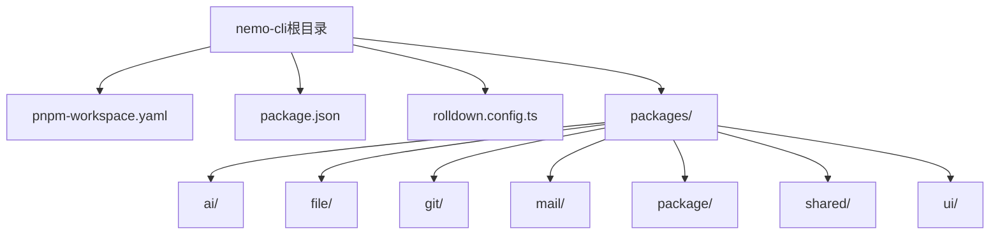
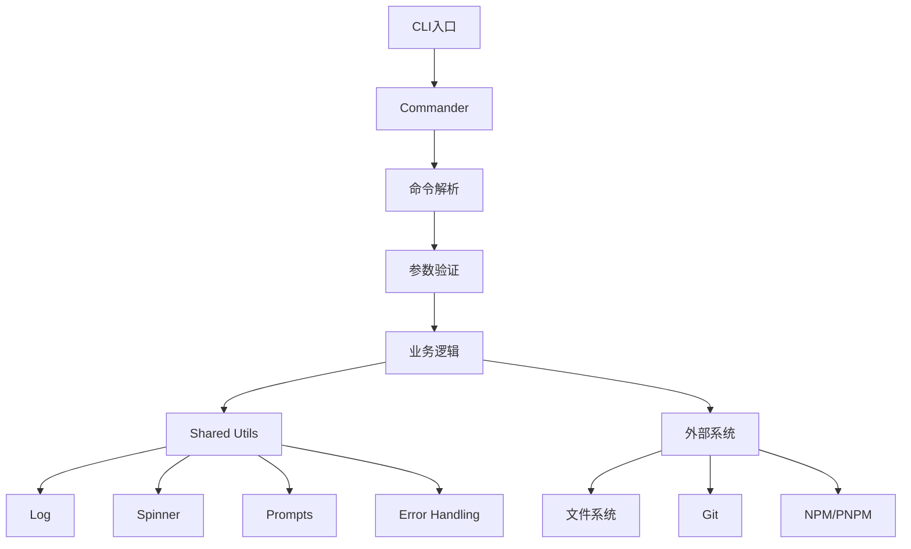
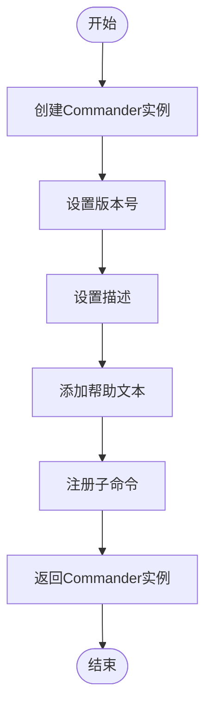
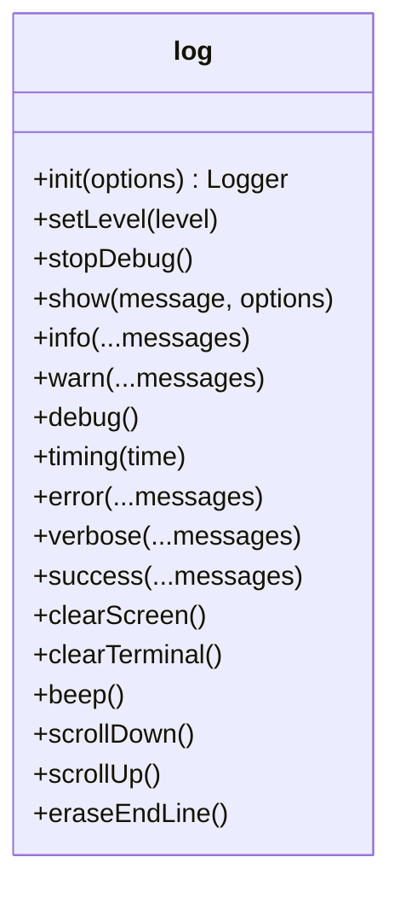
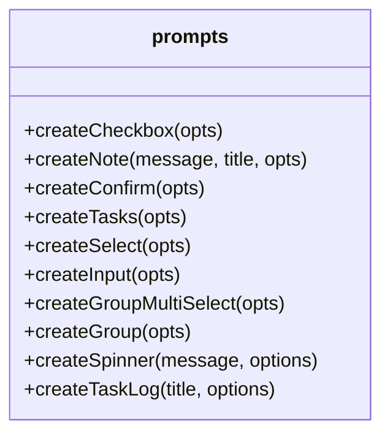
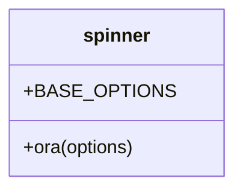
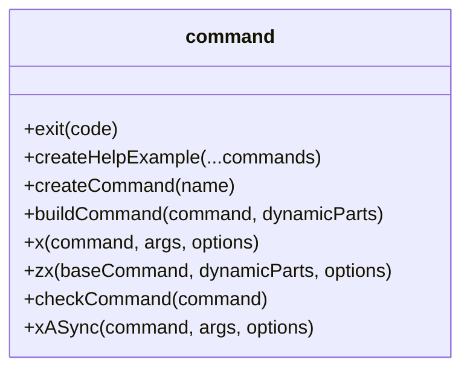

# 添加新命令

<cite>
**本文档中引用的文件**  
- [packages/shared/src/utils/command.ts](file://packages/shared/src/utils/command.ts)
- [packages/shared/src/utils/log.ts](file://packages/shared/src/utils/log.ts)
- [packages/shared/src/utils/spinner.ts](file://packages/shared/src/utils/spinner.ts)
- [packages/shared/src/utils/prompts.ts](file://packages/shared/src/utils/prompts.ts)
- [packages/file/src/index.ts](file://packages/file/src/index.ts)
- [packages/file/src/commands/clean.ts](file://packages/file/src/commands/clean.ts)
- [packages/git/src/index.ts](file://packages/git/src/index.ts)
- [packages/package/src/index.ts](file://packages/package/src/index.ts)
- [packages/file/package.json](file://packages/file/package.json)
- [packages/file/bin/index.mjs](file://packages/file/bin/index.mjs)
- [packages/file/rolldown.config.ts](file://packages/file/rolldown.config.ts)
- [packages/shared/package.json](file://packages/shared/package.json)
- [package.json](file://package.json)
</cite>

## 目录
1. [简介](#简介)
2. [项目结构](#项目结构)
3. [核心组件](#核心组件)
4. [架构概述](#架构概述)
5. [详细组件分析](#详细组件分析)
6. [依赖分析](#依赖分析)
7. [性能考虑](#性能考虑)
8. [故障排除指南](#故障排除指南)
9. [结论](#结论)

## 简介
本文档详细指导开发者如何为nemo-cli添加全新的CLI命令。通过分析现有代码库，我们将展示在`packages`目录下创建新模块的标准流程，包括初始化`package.json`、定义`bin`入口文件、配置rolldown构建系统。文档将解释如何使用commander注册命令、定义参数和选项，并展示如何利用shared包中的工具函数（如log、spinner、prompts）实现一致的用户体验。我们将提供一个完整的示例，从创建`packages/hello`模块开始，到实现`nh hello`命令的全过程。同时，文档强调遵循项目代码规范、错误处理模式和异步操作的最佳实践，并包含调试新命令的技巧和集成测试建议。

## 项目结构
nemo-cli采用monorepo架构，所有功能模块都位于`packages`目录下。每个模块都是一个独立的npm包，具有自己的`package.json`文件和构建配置。这种结构使得各个功能模块可以独立开发、测试和发布，同时又能通过workspace:*依赖共享代码。



**Diagram sources**
- [package.json](file://package.json)
- [pnpm-workspace.yaml](file://pnpm-workspace.yaml)

**Section sources**
- [package.json](file://package.json)
- [pnpm-workspace.yaml](file://pnpm-workspace.yaml)

## 核心组件
nemo-cli的核心功能由多个独立的包组成，每个包负责特定的功能领域。`shared`包提供了跨包共享的工具函数和实用程序，`file`、`git`和`package`包分别提供了文件操作、Git操作和包管理相关的CLI命令。这些包通过统一的架构模式实现命令注册和执行，确保了代码的一致性和可维护性。

**Section sources**
- [packages/file/src/index.ts](file://packages/file/src/index.ts)
- [packages/git/src/index.ts](file://packages/git/src/index.ts)
- [packages/package/src/index.ts](file://packages/package/src/index.ts)

## 架构概述
nemo-cli的架构基于模块化设计原则，每个功能模块都是一个独立的npm包，通过pnpm workspace进行依赖管理。命令行接口使用commander库实现，提供了强大的命令解析和选项处理能力。共享的工具函数被封装在`@nemo-cli/shared`包中，包括日志记录、用户交互、错误处理等功能，确保了整个CLI工具的一致用户体验。



**Diagram sources**
- [packages/shared/src/utils/command.ts](file://packages/shared/src/utils/command.ts)
- [packages/shared/src/utils/log.ts](file://packages/shared/src/utils/log.ts)
- [packages/shared/src/utils/spinner.ts](file://packages/shared/src/utils/spinner.ts)
- [packages/shared/src/utils/prompts.ts](file://packages/shared/src/utils/prompts.ts)

## 详细组件分析
### 命令注册与执行机制
nemo-cli使用commander库来管理命令行接口。每个功能包都有一个`init`函数，用于创建和配置commander实例，并注册该包提供的所有命令。`run`函数负责解析命令行参数并执行相应的命令。这种设计模式使得命令的注册和执行过程清晰分离，便于维护和扩展。

#### 命令注册流程


**Diagram sources**
- [packages/file/src/index.ts](file://packages/file/src/index.ts)
- [packages/git/src/index.ts](file://packages/git/src/index.ts)

**Section sources**
- [packages/file/src/index.ts](file://packages/file/src/index.ts)
- [packages/git/src/index.ts](file://packages/git/src/index.ts)

### Shared包工具函数分析
`@nemo-cli/shared`包提供了多个实用工具函数，这些函数在各个功能模块中被广泛使用，确保了代码的一致性和可重用性。

#### 日志记录工具


**Diagram sources**
- [packages/shared/src/utils/log.ts](file://packages/shared/src/utils/log.ts)

#### 用户交互工具


**Diagram sources**
- [packages/shared/src/utils/prompts.ts](file://packages/shared/src/utils/prompts.ts)

#### 加载指示器工具


**Diagram sources**
- [packages/shared/src/utils/spinner.ts](file://packages/shared/src/utils/spinner.ts)

#### 命令执行工具


**Diagram sources**
- [packages/shared/src/utils/command.ts](file://packages/shared/src/utils/command.ts)

## 依赖分析
nemo-cli的依赖关系清晰，采用分层架构设计。核心依赖包括commander（命令行解析）、winston（日志记录）、ora（加载指示器）和@clack/prompts（用户交互）。各个功能包通过workspace:*依赖引用shared包，实现了代码共享和版本同步。

```mermaid
graph TD
A[@nemo-cli/file] --> B[@nemo-cli/shared]
C[@nemo-cli/git] --> B[@nemo-cli/shared]
D[@nemo-cli/package] --> B[@nemo-cli/shared]
E[@nemo-cli/ai] --> B[@nemo-cli/shared]
F[@nemo-cli/mail] --> B[@nemo-cli/shared]
G[@nemo-cli/ui] --> B[@nemo-cli/shared]
B --> H[commander]
B --> I[winston]
B --> J[ora]
B --> K[@clack/prompts]
B --> L[@inquirer/prompts]
B --> M[fuse.js]
```

**Diagram sources**
- [packages/shared/package.json](file://packages/shared/package.json)
- [packages/file/package.json](file://packages/file/package.json)
- [packages/git/package.json](file://packages/git/package.json)
- [packages/package/package.json](file://packages/package/package.json)

**Section sources**
- [packages/shared/package.json](file://packages/shared/package.json)
- [package.json](file://package.json)

## 性能考虑
nemo-cli在性能方面做了多项优化。首先，使用rolldown进行代码打包，通过tree-shaking消除未使用的代码，减小最终包的体积。其次，采用异步编程模式，避免阻塞主线程，提高命令执行效率。最后，通过合理的缓存策略和错误处理机制，减少重复计算和异常开销。

## 故障排除指南
在开发和使用nemo-cli时，可能会遇到各种问题。以下是一些常见问题及其解决方案：

**Section sources**
- [packages/git/src/index.ts](file://packages/git/src/index.ts)
- [packages/shared/src/utils/error.ts](file://packages/shared/src/utils/error.ts)

### 命令未注册
如果新添加的命令无法识别，请检查以下几点：
1. 确保在`index.ts`的`init`函数中正确注册了命令
2. 检查`package.json`中的`bin`字段是否正确指向入口文件
3. 确认rolldown构建成功，生成了正确的`dist`文件

### 依赖问题
当出现依赖相关错误时：
1. 检查`package.json`中的依赖版本是否正确
2. 确认workspace:*依赖是否正确配置
3. 运行`pnpm install`重新安装所有依赖

### 构建失败
如果rolldown构建失败：
1. 检查`rolldown.config.ts`配置是否正确
2. 确认`external`字段是否包含了所有外部依赖
3. 查看错误日志，定位具体问题

## 结论
通过本文档的指导，开发者可以轻松地为nemo-cli添加新的CLI命令。关键步骤包括：在`packages`目录下创建新模块，初始化`package.json`文件，定义`bin`入口，配置rolldown构建，使用commander注册命令，并利用shared包中的工具函数实现一致的用户体验。遵循这些最佳实践，可以确保新命令与现有代码库保持一致的风格和质量标准。