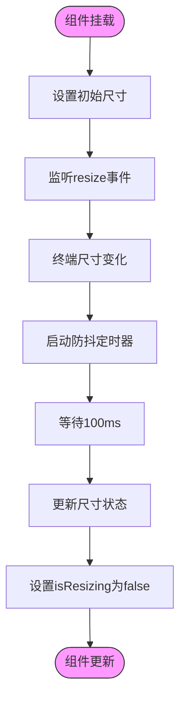

# 自定义UI组件

<cite>
**本文档中引用的文件**  
- [big-text.tsx](file://packages/ui/src/components/big-text.tsx)
- [list.tsx](file://packages/ui/src/components/list.tsx)
- [message.tsx](file://packages/ui/src/components/message.tsx)
- [process-message.tsx](file://packages/ui/src/components/process-message.tsx)
- [useTerminalSize.ts](file://packages/ui/src/hooks/useTerminalSize.ts)
- [provider/index.tsx](file://packages/ui/src/components/provider/index.tsx)
- [prompts.ts](file://packages/shared/src/utils/prompts.ts)
- [index.ts](file://packages/ui/src/index.ts)
- [components/index.ts](file://packages/ui/src/components/index.ts)
</cite>

## 目录
1. [简介](#简介)
2. [项目结构](#项目结构)
3. [核心组件](#核心组件)
4. [架构概述](#架构概述)
5. [详细组件分析](#详细组件分析)
6. [依赖分析](#依赖分析)
7. [性能考虑](#性能考虑)
8. [故障排除指南](#故障排除指南)
9. [结论](#结论)

## 简介
本文档旨在为开发者提供创建和集成自定义终端UI组件的详细指导。我们将深入探讨基于Ink和React的终端渲染机制，如何创建支持SSR（服务端渲染）的函数式组件，以及如何构建交互式组件如选择器、进度条和表格。文档还将涵盖跨平台兼容性、主题继承、终端尺寸变化处理、性能优化和无障碍设计原则。

## 项目结构
本项目的UI组件位于`packages/ui`目录下，采用模块化设计，将不同类型的UI组件分离到独立的文件中。核心逻辑和钩子函数分别存放在`components`和`hooks`目录中。共享工具函数则位于`packages/shared`包中，供整个项目使用。


**Diagram sources**
- [big-text.tsx](file://packages/ui/src/components/big-text.tsx)
- [list.tsx](file://packages/ui/src/components/list.tsx)
- [message.tsx](file://packages/ui/src/components/message.tsx)
- [process-message.tsx](file://packages/ui/src/components/process-message.tsx)
- [useTerminalSize.ts](file://packages/ui/src/hooks/useTerminalSize.ts)
- [prompts.ts](file://packages/shared/src/utils/prompts.ts)

**Section sources**
- [big-text.tsx](file://packages/ui/src/components/big-text.tsx)
- [list.tsx](file://packages/ui/src/components/list.tsx)
- [message.tsx](file://packages/ui/src/components/message.tsx)
- [process-message.tsx](file://packages/ui/src/components/process-message.tsx)
- [useTerminalSize.ts](file://packages/ui/src/hooks/useTerminalSize.ts)

## 核心组件
项目中的核心UI组件包括：`BigText`、`List`、`Message`、`ErrorMessage`和`ProcessMessage`。这些组件均基于React和Ink构建，支持服务端渲染，并通过函数式组件的方式提供简洁的API。

**Section sources**
- [big-text.tsx](file://packages/ui/src/components/big-text.tsx)
- [list.tsx](file://packages/ui/src/components/list.tsx)
- [message.tsx](file://packages/ui/src/components/message.tsx)
- [process-message.tsx](file://packages/ui/src/components/process-message.tsx)

## 架构概述
系统采用分层架构，UI层基于Ink框架构建，业务逻辑层通过`@nemo-cli/shared`包提供共享功能。组件通过Provider模式统一管理主题和上下文，确保一致的视觉体验。


**Diagram sources**
- [provider/index.tsx](file://packages/ui/src/components/provider/index.tsx)
- [prompts.ts](file://packages/shared/src/utils/prompts.ts)

## 详细组件分析

### BigText组件分析
`BigText`组件用于在终端中显示大字体文本，通常用于标题或重要信息的展示。它结合了`ink-big-text`和`ink-gradient`库，提供视觉上吸引人的文本效果。

```mermaid
classDiagram
class BigText {
+text : string
+render() : ReactNode
}
BigText --> InkBigText : "使用"
BigText --> Gradient : "使用"
InkBigText --> "ink-big-text" : "外部依赖"
Gradient --> "ink-gradient" : "外部依赖"
```

**Diagram sources**
- [big-text.tsx](file://packages/ui/src/components/big-text.tsx)

**Section sources**
- [big-text.tsx](file://packages/ui/src/components/big-text.tsx)

### List组件分析
`List`组件用于显示项目列表，支持自定义选项和渲染。它使用Ink的Box和Text组件构建，提供蓝色边框和项目符号的视觉样式。


**Diagram sources**
- [list.tsx](file://packages/ui/src/components/list.tsx)
- [prompts.ts](file://packages/shared/src/utils/prompts.ts)

**Section sources**
- [list.tsx](file://packages/ui/src/components/list.tsx)

### Message组件分析
`Message`组件提供多种类型的消息显示，包括成功、错误、警告和信息。它支持渐变效果和自定义样式，通过`MessageVariant`对象管理不同类型的视觉属性。


**Diagram sources**
- [message.tsx](file://packages/ui/src/components/message.tsx)

**Section sources**
- [message.tsx](file://packages/ui/src/components/message.tsx)

### ProcessMessage组件分析
`ProcessMessage`组件用于显示长时间运行的命令执行过程。它结合了进度条、微调器和消息日志，提供实时的执行反馈。


**Diagram sources**
- [process-message.tsx](file://packages/ui/src/components/process-message.tsx)

**Section sources**
- [process-message.tsx](file://packages/ui/src/components/process-message.tsx)

### useTerminalSize钩子分析
`useTerminalSize`钩子用于监听终端尺寸变化，提供当前终端的行数和列数。它使用防抖技术避免频繁的重渲染，确保性能优化。



**Diagram sources**
- [useTerminalSize.ts](file://packages/ui/src/hooks/useTerminalSize.ts)

**Section sources**
- [useTerminalSize.ts](file://packages/ui/src/hooks/useTerminalSize.ts)

## 依赖分析
项目依赖关系清晰，UI组件依赖于Ink框架和共享工具包。主题通过Provider模式统一管理，确保一致的视觉体验。

```mermaid
graph TD
A[UI组件] --> B[Ink框架]
A --> C[React]
A --> D[@inkjs/ui]
A --> E[@nemo-cli/shared]
D --> F[自定义主题]
E --> G[prompts]
E --> H[command]
E --> I[log]
```

**Diagram sources**
- [index.ts](file://packages/ui/src/index.ts)
- [components/index.ts](file://packages/ui/src/components/index.ts)
- [provider/index.tsx](file://packages/ui/src/components/provider/index.tsx)

**Section sources**
- [index.ts](file://packages/ui/src/index.ts)
- [components/index.ts](file://packages/ui/src/components/index.ts)

## 性能考虑
在创建自定义UI组件时，需要考虑以下性能优化策略：
- 使用防抖技术处理终端尺寸变化事件
- 避免不必要的重渲染
- 合理使用React的useCallback和useMemo钩子
- 优化异步操作的处理

**Section sources**
- [useTerminalSize.ts](file://packages/ui/src/hooks/useTerminalSize.ts)
- [process-message.tsx](file://packages/ui/src/components/process-message.tsx)

## 故障排除指南
常见问题及解决方案：
- 终端尺寸不正确：确保正确使用`useTerminalSize`钩子
- 组件不渲染：检查是否正确使用`render`函数
- 主题不生效：确认Provider组件正确包裹

**Section sources**
- [useTerminalSize.ts](file://packages/ui/src/hooks/useTerminalSize.ts)
- [provider/index.tsx](file://packages/ui/src/components/provider/index.tsx)

## 结论
本文档详细介绍了如何创建和集成自定义终端UI组件。通过基于Ink和React的架构，开发者可以创建功能丰富、视觉吸引人的终端界面。关键要点包括使用函数式组件、合理管理状态、处理终端尺寸变化和优化性能。