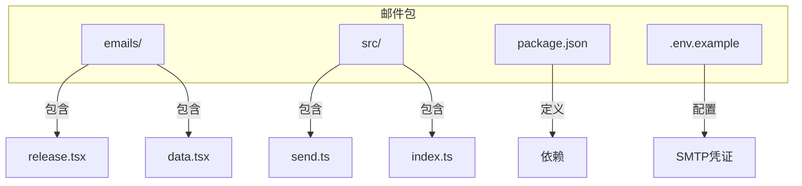
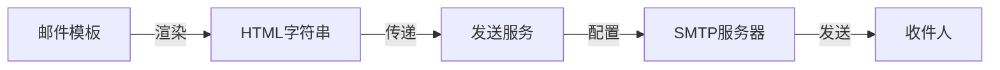
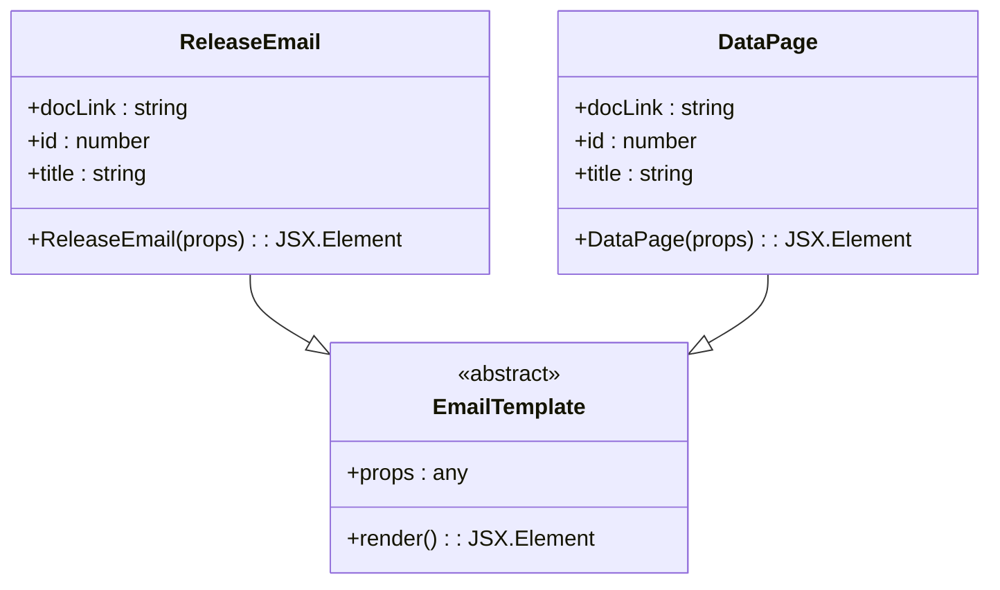
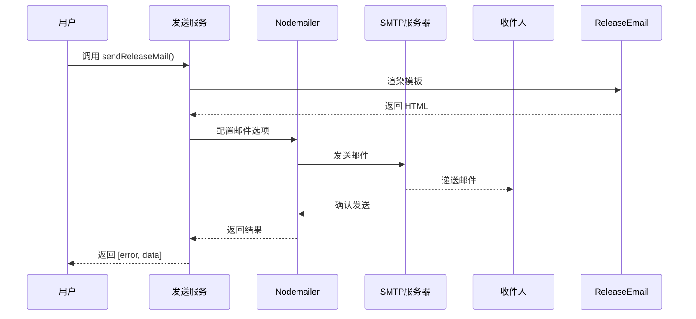

# 自定义邮件模板

<cite>
**本文档中引用的文件**  
- [release.tsx](file://packages/mail/emails/release.tsx)
- [data.tsx](file://packages/mail/emails/data.tsx)
- [send.ts](file://packages/mail/src/services/send.ts)
- [index.ts](file://packages/mail/src/index.ts)
- [.env.example](file://packages/mail/.env.example)
- [package.json](file://packages/mail/package.json)
- [promise.ts](file://packages/shared/src/utils/promise.ts)
</cite>

## 目录
1. [简介](#简介)
2. [项目结构](#项目结构)
3. [核心组件](#核心组件)
4. [架构概述](#架构概述)
5. [详细组件分析](#详细组件分析)
6. [依赖分析](#依赖分析)
7. [性能考虑](#性能考虑)
8. [故障排除指南](#故障排除指南)
9. [结论](#结论)

## 简介
本文档详细说明了如何在 `nemo-cli` 项目中创建和注册自定义邮件模板。重点介绍基于 React 的邮件模板设计，使用 `react-email` 组件库构建响应式 HTML 邮件的方法。文档涵盖模板数据结构（props）的定义、模板注册机制的实现，并以创建 'review-request' 邮件模板为例，用于请求代码评审，包含 PR 链接、变更摘要和评审指南。同时说明如何集成动态数据（如从 Git 获取提交信息）和环境变量（如 SMTP 配置），并提供邮件预览、测试发送和 A/B 测试的指导。最后强调邮件安全（防止 XSS）和合规性（GDPR、CAN-SPAM）的最佳实践。

## 项目结构
`nemo-cli` 项目的邮件功能主要集中在 `packages/mail` 目录下，该目录包含邮件模板、发送服务和相关配置。邮件模板使用 React 和 `@react-email/components` 库构建，确保在不同邮件客户端中的兼容性和响应式设计。



**Diagram sources**
- [release.tsx](file://packages/mail/emails/release.tsx)
- [data.tsx](file://packages/mail/emails/data.tsx)
- [send.ts](file://packages/mail/src/services/send.ts)
- [index.ts](file://packages/mail/src/index.ts)
- [.env.example](file://packages/mail/.env.example)

**Section sources**
- [release.tsx](file://packages/mail/emails/release.tsx)
- [data.tsx](file://packages/mail/emails/data.tsx)
- [send.ts](file://packages/mail/src/services/send.ts)
- [index.ts](file://packages/mail/src/index.ts)
- [.env.example](file://packages/mail/.env.example)

## 核心组件
核心组件包括邮件模板（如 `release.tsx` 和 `data.tsx`）、邮件发送服务（`send.ts`）以及主入口文件（`index.ts`）。这些组件共同协作，实现邮件的构建和发送功能。

**Section sources**
- [release.tsx](file://packages/mail/emails/release.tsx)
- [data.tsx](file://packages/mail/emails/data.tsx)
- [send.ts](file://packages/mail/src/services/send.ts)
- [index.ts](file://packages/mail/src/index.ts)

## 架构概述
系统架构采用模块化设计，邮件模板与发送服务分离。邮件模板使用 React 组件构建，通过 `@react-email/components` 库确保跨客户端兼容性。发送服务使用 `nodemailer` 库连接到 Gmail SMTP 服务器，将渲染后的 HTML 邮件发送给指定收件人。



**Diagram sources**
- [release.tsx](file://packages/mail/emails/release.tsx)
- [send.ts](file://packages/mail/src/services/send.ts)

## 详细组件分析
### 邮件模板分析
邮件模板使用 React 函数组件构建，接受特定的 props 并返回 JSX 元素。模板使用 `@react-email/components` 提供的组件（如 `Html`、`Body`、`Container` 等）来构建结构化的邮件内容。

#### 邮件模板类图


**Diagram sources**
- [release.tsx](file://packages/mail/emails/release.tsx)
- [data.tsx](file://packages/mail/emails/data.tsx)

#### 邮件发送流程序列图


**Diagram sources**
- [send.ts](file://packages/mail/src/services/send.ts)
- [release.tsx](file://packages/mail/emails/release.tsx)

### 创建 'review-request' 邮件模板
为了满足请求代码评审的需求，可以创建一个新的邮件模板 `review-request.tsx`。该模板将包含 PR 链接、变更摘要和评审指南。

```tsx
// packages/mail/emails/review-request.tsx
import React from 'react'
import {
  Body,
  Button,
  Container,
  Head,
  Heading,
  Html,
  Preview,
  Section,
  Tailwind,
  Text,
} from '@react-email/components'

type ReviewRequestProps = {
  prLink: string
  prTitle: string
  changes: string[]
  reviewerGuide: string[]
}

export const ReviewRequestEmail = ({ prLink, prTitle, changes, reviewerGuide }: ReviewRequestProps) => {
  return (
    <Html>
      <Head />
      <Tailwind>
        <Body className="mx-auto my-auto bg-white px-2 font-sans">
          <Preview>代码评审请求</Preview>
          <Container className="mx-auto my-10 max-w-lg rounded border border-[#eaeaea] border-solid p-5">
            <Heading className="mx-0 my-5 p-0 text-center font-normal text-[24px] text-black">{prTitle}</Heading>
            <Text className="text-[14px] text-black leading-[24px]">您好，</Text>
            <Text className="text-[14px] text-black leading-[24px]">我们请求您对以下 PR 进行评审：</Text>
            <Section className="mt-[32px] mb-[32px] text-center">
              <Button
                className="rounded bg-[#000000] px-5 py-3 text-center font-semibold text-[12px] text-white no-underline"
                href={prLink}
              >
                查看 PR
              </Button>
            </Section>
            <Text className="text-[14px] text-black leading-[24px]"><b>变更摘要：</b></Text>
            <ul className="list-disc pl-5">
              {changes.map((change, index) => (
                <li key={index} className="text-[14px] text-black leading-[24px]">{change}</li>
              ))}
            </ul>
            <Text className="text-[14px] text-black leading-[24px] mt-[16px]"><b>评审指南：</b></Text>
            <ol className="list-decimal pl-5">
              {reviewerGuide.map((guide, index) => (
                <li key={index} className="text-[14px] text-black leading-[24px]">{guide}</li>
              ))}
            </ol>
          </Container>
        </Body>
      </Tailwind>
    </Html>
  )
}

export default ReviewRequestEmail
```

然后在 `send.ts` 中添加相应的发送函数：

```ts
// packages/mail/src/services/send.ts
import ReviewRequestEmail from '../../emails/review-request'

export const sendReviewRequestMail = async ({
  prLink,
  prTitle,
  changes,
  reviewerGuide,
}: {
  prLink: string
  prTitle: string
  changes: string[]
  reviewerGuide: string[]
}) => {
  const subject = `代码评审请求: ${prTitle}`
  const template = await ReviewRequestEmail({ prLink, prTitle, changes, reviewerGuide })
  const emailHtml = await render(template)

  const options: Mail.Options = {
    from: process.env.GOOGLE_AUTH_USER,
    to: TO,
    subject,
    cc: CC,
    html: emailHtml,
  }

  const result = await safeAwait(transporter.sendMail(options))
  return result
}
```

**Section sources**
- [review-request.tsx](file://packages/mail/emails/review-request.tsx)
- [send.ts](file://packages/mail/src/services/send.ts)

## 依赖分析
邮件包依赖于多个外部库和内部工作区包。外部依赖包括 `@react-email/components` 用于构建邮件模板，`nodemailer` 用于发送邮件。内部依赖包括 `@nemo-cli/shared` 提供共享工具函数（如 `safeAwait`），`@nemo-cli/ui` 提供用户界面组件。

```mermaid
graph TD
MailPackage[@nemo-cli/mail] --> ReactEmail[@react-email/components]
MailPackage --> Nodemailer[nodemailer]
MailPackage --> Shared[@nemo-cli/shared]
MailPackage --> UI[@nemo-cli/ui]
Shared --> SafeAwait[safeAwait]
```

**Diagram sources**
- [package.json](file://packages/mail/package.json)
- [send.ts](file://packages/mail/src/services/send.ts)
- [promise.ts](file://packages/shared/src/utils/promise.ts)

**Section sources**
- [package.json](file://packages/mail/package.json)
- [send.ts](file://packages/mail/src/services/send.ts)
- [promise.ts](file://packages/shared/src/utils/promise.ts)

## 性能考虑
邮件模板的渲染性能主要取决于 React 组件的复杂度和 `@react-email/components` 的处理效率。由于邮件内容通常较为简单，渲染性能不是主要瓶颈。邮件发送的性能受网络延迟和 SMTP 服务器响应时间的影响。使用 `safeAwait` 包装异步操作可以确保错误被正确处理，避免阻塞主流程。

## 故障排除指南
常见问题包括 SMTP 凭证错误、邮件模板渲染失败和网络连接问题。确保 `.env.example` 中的环境变量正确配置，并在生产环境中使用安全的凭据管理方式。使用 `pnpm dev:email` 命令启动邮件预览服务器，可以在开发阶段预览邮件模板，及时发现布局问题。

**Section sources**
- [.env.example](file://packages/mail/.env.example)
- [send.ts](file://packages/mail/src/services/send.ts)

## 结论
通过使用 `react-email` 和 `nodemailer`，`nemo-cli` 实现了高效、可靠的邮件发送功能。创建自定义邮件模板的过程清晰明了，支持动态数据集成和环境变量配置。遵循最佳实践，可以确保邮件的安全性和合规性，为用户提供优质的通信体验。