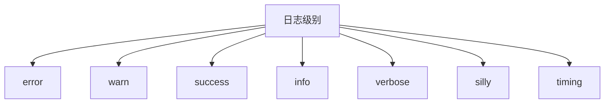
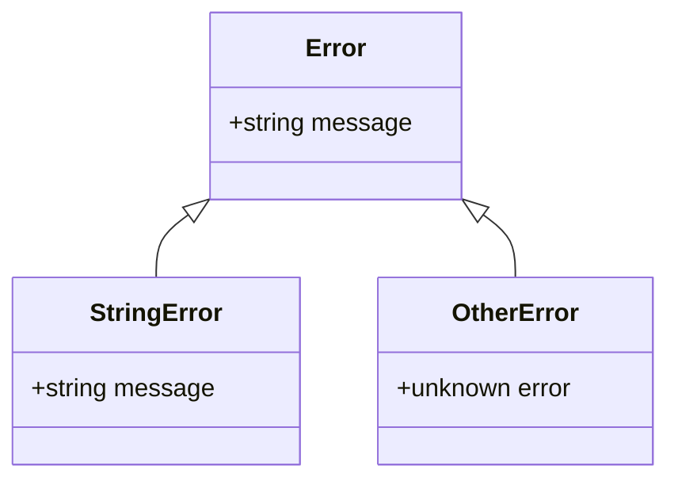
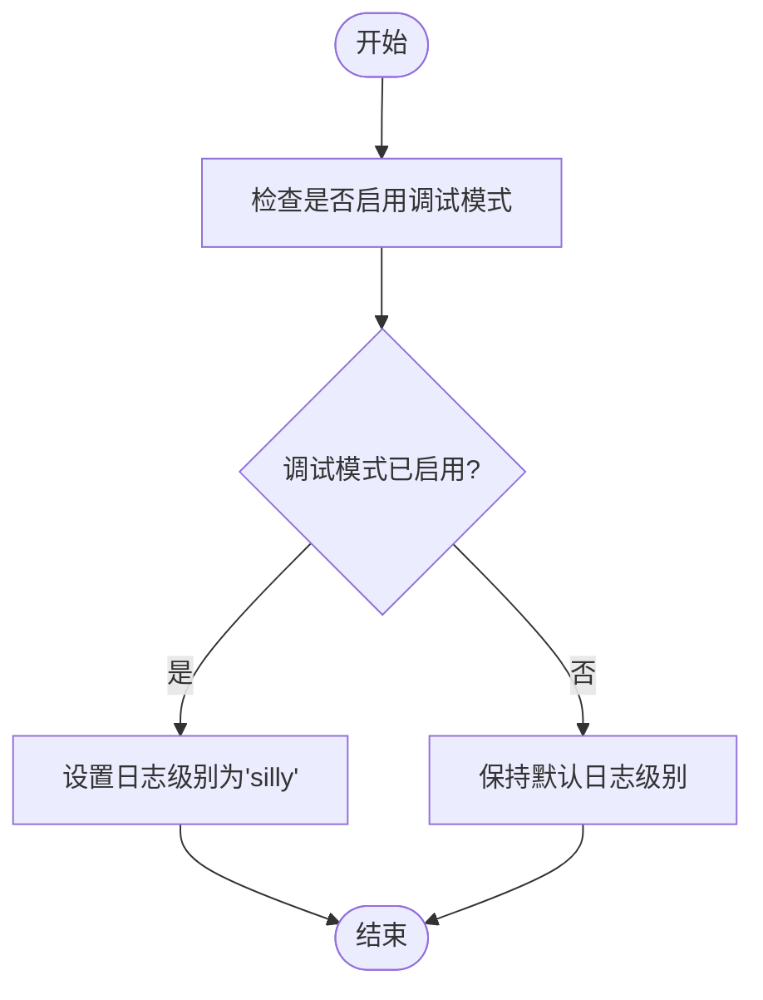

# 故障排查与参考

<cite>
**本文档中引用的文件**  
- [log.ts](file://packages/shared/src/utils/log.ts)
- [error.ts](file://packages/shared/src/utils/error.ts)
- [env.ts](file://packages/shared/src/utils/env.ts)
- [config.ts](file://packages/shared/src/utils/config.ts)
- [command.ts](file://packages/shared/src/utils/command.ts)
- [types.ts](file://packages/shared/src/utils/types.ts)
- [.env.example](file://.env.example)
- [ai/.env.example](file://packages/ai/.env.example)
- [message.tsx](file://packages/ui/src/components/message.tsx)
- [process-message.tsx](file://packages/ui/src/components/process-message.tsx)
- [constants.ts](file://packages/shared/src/constants.ts)
</cite>

## 目录
1. [简介](#简介)
2. [常见问题与解决方案](#常见问题与解决方案)
3. [日志系统工作原理](#日志系统工作原理)
4. [错误处理机制](#错误处理机制)
5. [调试技巧](#调试技巧)
6. [快速参考附录](#快速参考附录)

## 简介
本指南旨在为用户提供全面的故障排查与参考信息，涵盖命令执行失败、AI连接超时、配置不生效等常见问题的解决方案。同时，详细解释日志系统的工作原理，指导用户如何查看和分析日志以诊断问题，并提供调试技巧和快速参考信息。

## 常见问题与解决方案

### 命令执行失败
当命令执行失败时，首先检查命令是否正确输入，以及所需的环境变量是否已正确配置。确保所有依赖项已安装且版本兼容。

**解决方案**：
- 检查命令语法是否正确。
- 确认环境变量是否已正确设置。
- 查看日志文件以获取更多错误信息。

**Section sources**
- [command.ts](file://packages/shared/src/utils/command.ts#L145-L165)
- [error.ts](file://packages/shared/src/utils/error.ts#L5-L13)

### AI连接超时
AI连接超时通常是由于网络问题或API密钥无效导致的。检查网络连接状态，并确认API密钥是否正确。

**解决方案**：
- 检查网络连接是否稳定。
- 确认API密钥是否有效且未过期。
- 尝试重新启动服务。

**Section sources**
- [ai/.env.example](file://packages/ai/.env.example#L1-L6)
- [config.ts](file://packages/shared/src/utils/config.ts#L18-L27)

### 配置不生效
配置不生效可能是由于配置文件路径错误或配置项拼写错误引起的。确保配置文件位于正确路径，并且配置项名称拼写正确。

**解决方案**：
- 确认配置文件路径是否正确。
- 检查配置项名称是否拼写正确。
- 重启应用以使新配置生效。

**Section sources**
- [config.ts](file://packages/shared/src/utils/config.ts#L29-L35)
- [.env.example](file://.env.example#L1-L13)

## 日志系统工作原理

### 日志级别
日志系统支持多种日志级别，包括`error`、`warn`、`success`、`info`、`verbose`、`silly`和`timing`。不同级别的日志用于记录不同严重程度的信息。

**Diagram sources**
- [log.ts](file://packages/shared/src/utils/log.ts#L10-L28)

### 日志输出
日志输出通过Winston库实现，支持控制台输出和文件输出。日志格式化为彩色输出，便于区分不同类型的消息。

**Section sources**
- [log.ts](file://packages/shared/src/utils/log.ts#L37-L48)

## 错误处理机制

### 错误类型
系统定义了多种错误类型，包括字符串错误、Error对象错误和其他类型的错误。根据错误类型采取不同的处理策略。

**Diagram sources**
- [error.ts](file://packages/shared/src/utils/error.ts#L5-L13)
- [types.ts](file://packages/shared/src/utils/types.ts#L9-L15)

### 错误处理流程
当发生错误时，系统会调用`handleError`函数，根据错误类型显示相应的错误消息或记录日志。

**Section sources**
- [error.ts](file://packages/shared/src/utils/error.ts#L5-L13)

## 调试技巧

### 启用详细日志
通过在命令行中添加`-d`或`--debug`标志来启用详细日志输出，这有助于诊断问题。

**Diagram sources**
- [env.ts](file://packages/shared/src/utils/env.ts#L1)
- [log.ts](file://packages/shared/src/utils/log.ts#L72-L74)

### 使用调试标志
使用`-d`或`--debug`标志可以启用调试模式，提供更多详细的日志信息。

**Section sources**
- [env.ts](file://packages/shared/src/utils/env.ts#L1)

## 快速参考附录

### 命令速查表
| 命令 | 描述 |
|------|------|
| `nemo-cli start` | 启动CLI工具 |
| `nemo-cli stop` | 停止CLI工具 |
| `nemo-cli status` | 查看CLI工具状态 |

### 配置项列表
| 配置项 | 描述 |
|-------|------|
| `API_KEY` | AI服务API密钥 |
| `GOOGLE_API_KEY` | Google服务API密钥 |
| `CONFLUENCE_API_TOKEN` | Confluence API令牌 |

### 环境变量说明
| 环境变量 | 描述 |
|---------|------|
| `SLACK_BOT_TOKEN` | Slack机器人令牌 |
| `slack_team_id` | Slack团队ID |
| `slack_channel_ids` | Slack频道ID |

**Section sources**
- [.env.example](file://.env.example#L1-L13)
- [ai/.env.example](file://packages/ai/.env.example#L1-L6)