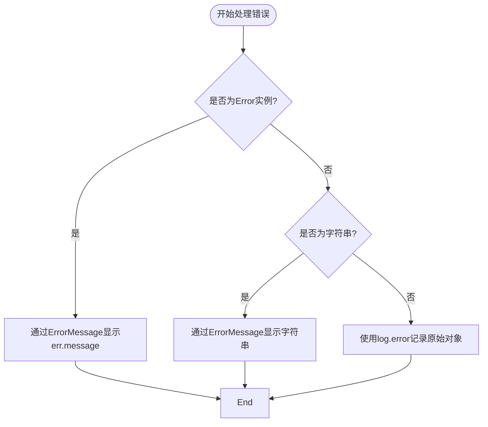
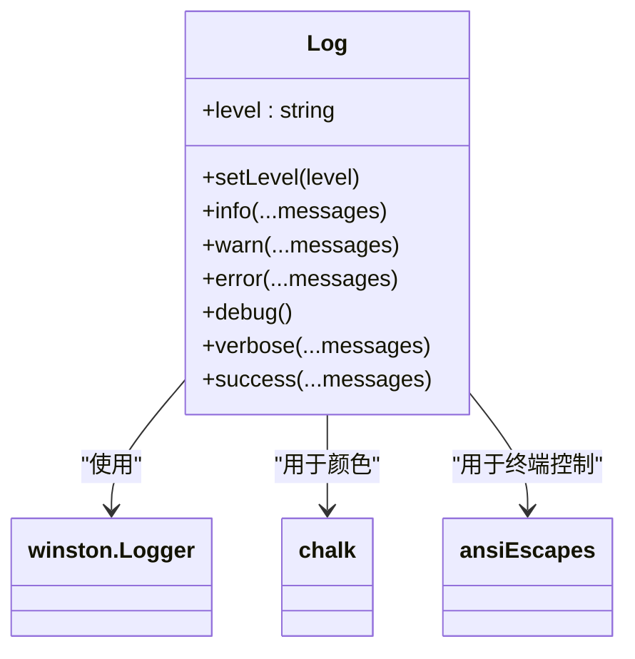

# 故障排查指南

<cite>
**本文档中引用的文件**  
- [error.ts](file://packages/shared/src/utils/error.ts)
- [log.ts](file://packages/shared/src/utils/log.ts)
- [env.ts](file://packages/shared/src/utils/env.ts)
- [add.ts](file://packages/package/src/commands/add.ts)
- [stash.ts](file://packages/git/src/commands/stash.ts)
- [index.ts](file://packages/ai/src/services/chat/index.ts)
- [.env.example](file://packages/ai/.env.example)
- [.env.example](file://packages/mail/.env.example)
</cite>

## 目录
1. [简介](#简介)
2. [常见问题分类](#常见问题分类)
3. [命令执行失败](#命令执行失败)
4. [AI服务连接与认证问题](#ai服务连接与认证问题)
5. [Git操作异常](#git操作异常)
6. [包管理命令无响应](#包管理命令无响应)
7. [错误处理机制分析](#错误处理机制分析)
8. [日志系统与调试模式](#日志系统与调试模式)
9. [分步诊断流程](#分步诊断流程)
10. [预防性建议](#预防性建议)

## 简介
本指南旨在为使用nemo-cli工具的用户提供全面的故障排查支持。通过深入分析代码库中的错误处理机制、日志系统以及核心命令实现，本文档将帮助用户快速定位并解决在实际使用过程中可能遇到的各种问题，包括命令执行失败、AI服务连接超时、Git操作冲突及包管理无响应等典型场景。

## 常见问题分类
nemo-cli在使用过程中可能出现的问题主要分为以下几类：
- **命令执行失败**：权限不足、依赖缺失或参数错误
- **AI服务连接与认证问题**：API密钥无效、环境变量未配置或网络超时
- **Git操作异常**：stash/pop操作冲突、分支状态不一致
- **包管理命令无响应**：pnpm命令卡住、工作区配置错误
- **配置问题**：`.env`文件缺失或格式错误
- **日志与调试问题**：无法查看详细错误信息

每类问题均对应特定的代码模块和处理逻辑，后续章节将逐一展开说明。

## 命令执行失败
当用户执行nemo-cli命令时，若出现权限问题或依赖缺失，通常由底层命令调用失败引起。例如，在`add`命令中，若未正确识别工作区（workspace），会导致无法安装依赖。

此类问题的根源在于：
- 工作区配置文件`pnpm-workspace.yaml`缺失或路径错误
- 用户权限不足以执行系统命令
- 所需的外部工具（如git、pnpm）未安装或不在PATH中

解决方案包括验证工作区配置、检查系统环境变量及确保必要工具已安装。

**Section sources**
- [add.ts](file://packages/package/src/commands/add.ts#L73-L78)

## AI服务连接与认证问题
AI服务连接失败通常与`.env`文件中的配置有关。nemo-cli通过读取环境变量来连接外部AI服务（如Google Generative AI、DeepSeek等）。

常见问题包括：
- `API_KEY`或`GOOGLE_API_KEY`未设置
- `.env`文件未加载导致环境变量为空
- 网络限制导致请求超时

例如，在`packages/ai/src/services/chat/index.ts`中，若`process.env.GOOGLE_API_KEY`为空，则会抛出认证错误。

建议用户检查`.env`文件是否存在，并确认其内容是否符合`.env.example`的格式要求。

**Section sources**
- [index.ts](file://packages/ai/src/services/chat/index.ts#L7-L9)
- [.env.example](file://packages/ai/.env.example#L1-L2)

## Git操作异常
Git相关命令（如stash、pop、commit）可能因仓库状态异常而失败。以`stash`命令为例，其实现位于`packages/git/src/commands/stash.ts`。

典型问题包括：
- 无stash记录时执行`pop`或`list`命令
- 多个stash条目间发生冲突
- 文件已被修改但仍尝试恢复stash

代码中通过`handleGitStashCheck()`函数检测当前stash列表，若为空则提示“No stash found.”。此外，`getStashFiles()`用于获取指定stash中的文件列表，防止误操作。

建议用户在执行stash操作前先运行`nemo git stash list`确认状态。

**Section sources**
- [stash.ts](file://packages/git/src/commands/stash.ts#L14-L16)
- [stash.ts](file://packages/git/src/commands/stash.ts#L26-L30)

## 包管理命令无响应
包管理命令（如`add`、`remove`）基于pnpm实现，若命令无响应，可能是由于：
- 工作区名称获取失败
- pnpm进程卡死或未正确退出
- 并发操作导致锁文件冲突

在`addCommand`中，程序首先调用`getWorkspaceNames()`获取所有工作区，若返回空数组，则提示“No workspace packages found.”。

此外，命令执行通过`ProcessMessage`封装，包含`onSuccess`和`onError`回调，确保用户能收到执行结果反馈。

**Section sources**
- [add.ts](file://packages/package/src/commands/add.ts#L72-L77)
- [add.ts](file://packages/package/src/commands/add.ts#L27-L44)

## 错误处理机制分析
nemo-cli采用统一的错误处理机制，核心实现在`packages/shared/src/utils/error.ts`中的`handleError`函数。

该函数根据错误类型进行分类处理：
- 若为`Error`实例，提取`message`并通过`ErrorMessage`组件显示
- 若为字符串，直接作为错误信息输出
- 其他类型则通过`log.error`记录完整对象

此机制确保了无论错误来源如何，都能以一致的方式呈现给用户。



**Diagram sources**
- [error.ts](file://packages/shared/src/utils/error.ts#L5-L12)

**Section sources**
- [error.ts](file://packages/shared/src/utils/error.ts#L5-L12)

## 日志系统与调试模式
日志系统由`log.ts`实现，基于`winston`库构建，支持多级别日志输出（error、warn、info、verbose、silly等）。

用户可通过`-d`或`--debug`参数启用调试模式，此时日志级别设为`silly`，输出最详细信息。

日志级别定义如下：
- `error`: 严重错误
- `warn`: 警告信息
- `info`: 一般信息
- `verbose`: 详细流程
- `silly`: 调试级信息

通过`log.setLevel()`可动态调整日志级别，便于问题追踪。



**Diagram sources**
- [log.ts](file://packages/shared/src/utils/log.ts#L10-L28)

**Section sources**
- [log.ts](file://packages/shared/src/utils/log.ts#L10-L28)
- [env.ts](file://packages/shared/src/utils/env.ts#L1)

## 分步诊断流程
以下是推荐的故障排查步骤：

### 第一步：启用DEBUG模式
在命令后添加`--debug`或`-d`参数，例如：
```bash
nemo ai get --debug
```
这将输出更详细的日志信息，有助于定位问题。

### 第二步：检查配置文件
确认项目根目录存在`.env`文件，并包含必要的API密钥：
```
API_KEY=your_key_here
GOOGLE_API_KEY=your_google_key_here
```

### 第三步：验证环境依赖
确保以下工具已安装并可执行：
- git
- pnpm
- node.js（版本匹配）

可通过以下命令验证：
```bash
git --version
pnpm --version
node --version
```

### 第四步：查看上下文堆栈
当命令失败时，查看完整错误堆栈。若使用`handleError`，错误信息会包含原始`err.message`，可用于进一步搜索解决方案。

### 第五步：验证配置有效性
使用`nemo git stash list`或`nemo package list`等命令测试基础功能是否正常，逐步排除模块问题。

## 预防性建议
为减少故障发生，建议采取以下措施：
- 始终在项目根目录运行nemo-cli命令
- 定期更新`.env`文件中的API密钥
- 避免在git有未提交更改时执行stash以外的操作
- 使用`--debug`模式定期检查命令执行流程
- 备份重要工作区配置
- 在执行高风险操作前手动创建git stash备份

通过遵循上述指南，用户可显著提升nemo-cli的使用稳定性与效率。