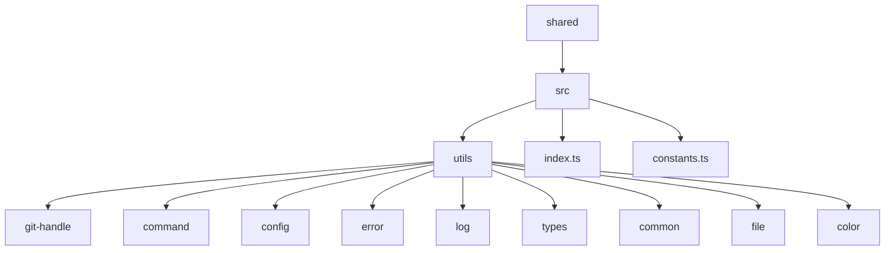
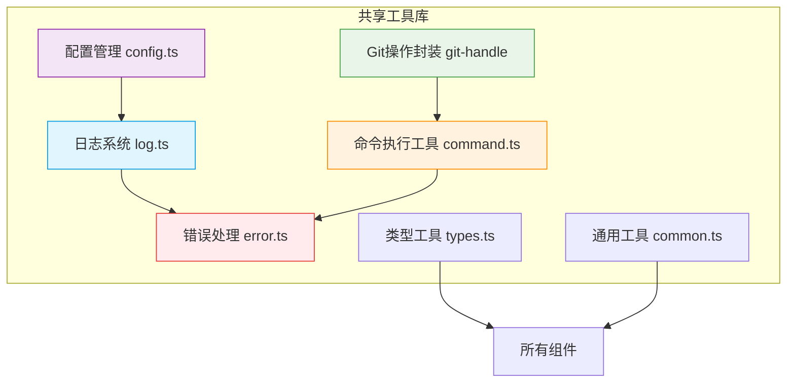
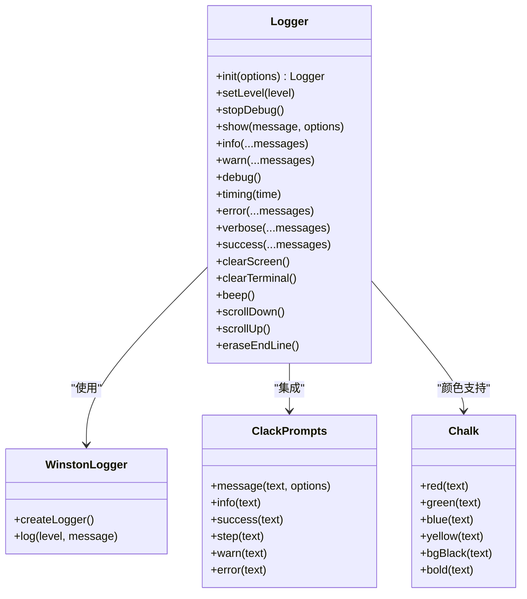
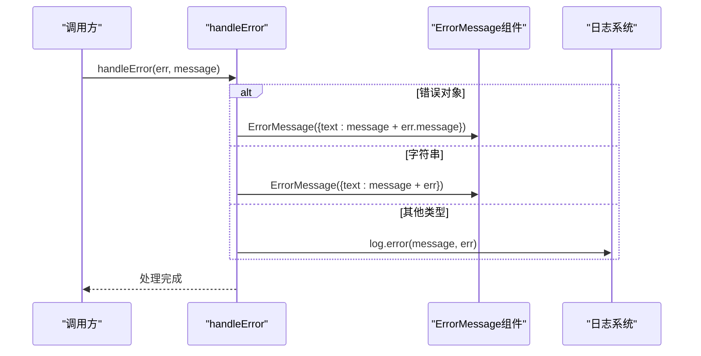
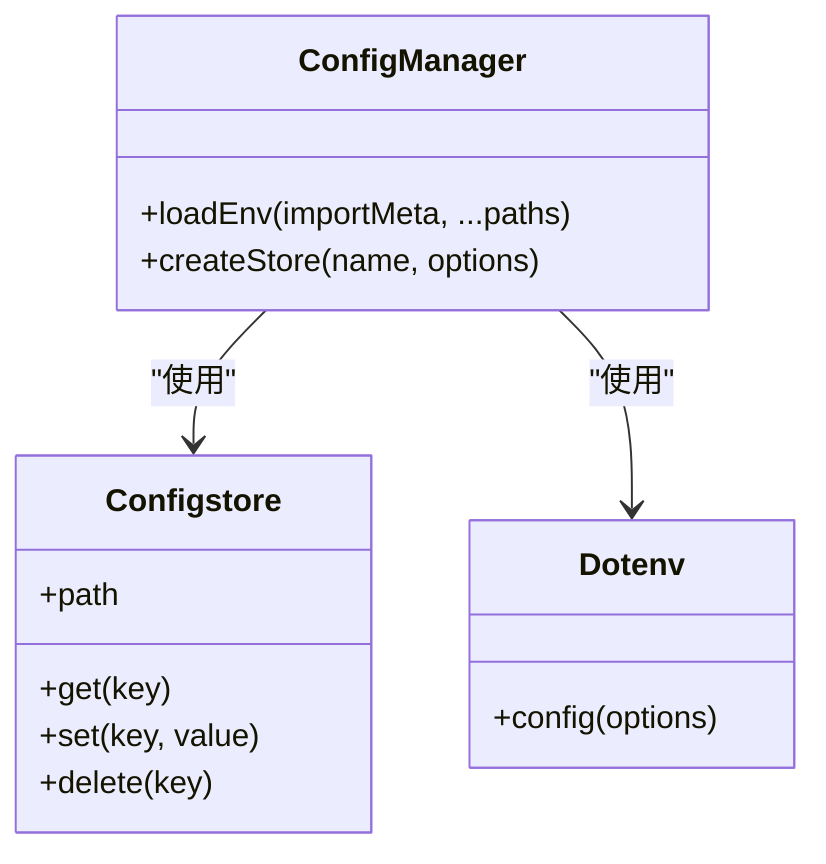
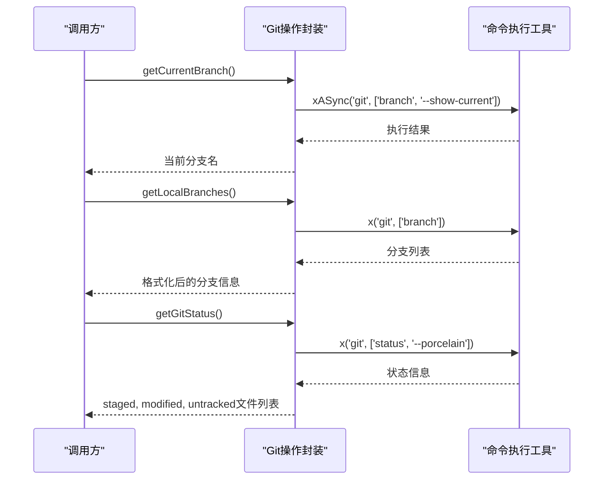
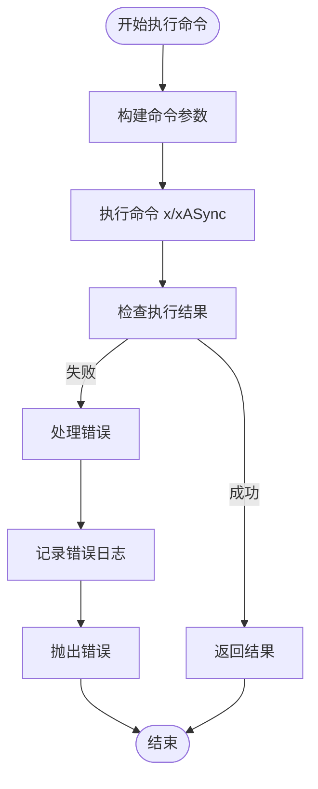
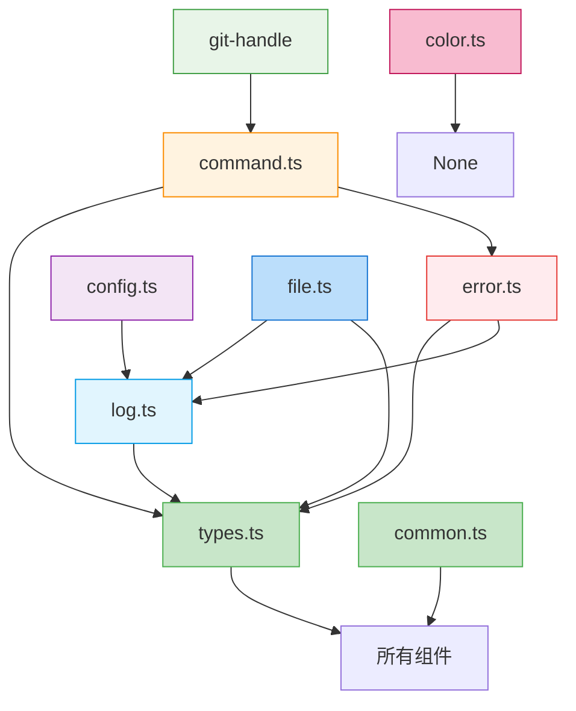

# 共享工具库

<cite>
**本文档中引用的文件**  
- [log.ts](file://packages/shared/src/utils/log.ts)
- [error.ts](file://packages/shared/src/utils/error.ts)
- [config.ts](file://packages/shared/src/utils/config.ts)
- [git-handle/index.ts](file://packages/shared/src/utils/git-handle/index.ts)
- [command.ts](file://packages/shared/src/utils/command.ts)
- [types.ts](file://packages/shared/src/utils/types.ts)
- [common.ts](file://packages/shared/src/utils/common.ts)
- [file.ts](file://packages/shared/src/utils/file.ts)
- [color.ts](file://packages/shared/src/utils/color.ts)
- [constants.ts](file://packages/shared/src/constants.ts)
- [index.ts](file://packages/shared/src/index.ts)
</cite>

## 目录
1. [简介](#简介)
2. [项目结构](#项目结构)
3. [核心组件](#核心组件)
4. [架构概述](#架构概述)
5. [详细组件分析](#详细组件分析)
6. [依赖分析](#依赖分析)
7. [性能考虑](#性能考虑)
8. [故障排除指南](#故障排除指南)
9. [结论](#结论)

## 简介
nemo-cli共享工具库为整个CLI工具生态系统提供基础能力支持。该库设计为可复用、类型安全且具有良好的错误边界处理机制，为上层功能模块（如AI、Git、文件操作等包）提供统一的工具集。工具库采用模块化设计，通过依赖注入模式实现组件间的协作，确保了高内聚低耦合的架构特性。

## 项目结构
共享工具库位于`packages/shared`目录下，采用清晰的模块化结构组织各类工具。主要结构包括：

**Diagram sources**
- [index.ts](file://packages/shared/src/index.ts#L1-L24)

**Section sources**
- [index.ts](file://packages/shared/src/index.ts#L1-L24)

## 核心组件
共享工具库的核心组件包括日志系统、错误处理、配置管理、Git操作封装和命令执行工具。这些组件共同构成了nemo-cli的基础能力层，为其他功能包提供统一的接口和服务。

**Section sources**
- [log.ts](file://packages/shared/src/utils/log.ts#L1-L169)
- [error.ts](file://packages/shared/src/utils/error.ts#L1-L14)
- [config.ts](file://packages/shared/src/utils/config.ts#L1-L39)
- [git-handle/index.ts](file://packages/shared/src/utils/git-handle/index.ts#L1-L78)
- [command.ts](file://packages/shared/src/utils/command.ts#L1-L169)

## 架构概述
共享工具库采用分层架构设计，各组件之间通过明确的接口进行通信。整体架构如下：

**Diagram sources**
- [log.ts](file://packages/shared/src/utils/log.ts#L1-L169)
- [error.ts](file://packages/shared/src/utils/error.ts#L1-L14)
- [config.ts](file://packages/shared/src/utils/config.ts#L1-L39)
- [git-handle/index.ts](file://packages/shared/src/utils/git-handle/index.ts#L1-L78)
- [command.ts](file://packages/shared/src/utils/command.ts#L1-L169)

## 详细组件分析

### 日志系统分析
日志系统基于winston库构建，提供了丰富的日志级别和格式化功能。

#### 类图

**Diagram sources**
- [log.ts](file://packages/shared/src/utils/log.ts#L1-L169)

**Section sources**
- [log.ts](file://packages/shared/src/utils/log.ts#L1-L169)

### 错误处理分析
错误处理模块提供统一的错误处理接口，确保错误信息的一致性和可读性。

#### 序列图

**Diagram sources**
- [error.ts](file://packages/shared/src/utils/error.ts#L1-L14)
- [log.ts](file://packages/shared/src/utils/log.ts#L1-L169)

**Section sources**
- [error.ts](file://packages/shared/src/utils/error.ts#L1-L14)

### 配置管理分析
配置管理模块提供环境变量加载和持久化配置存储功能。

#### 类图

**Diagram sources**
- [config.ts](file://packages/shared/src/utils/config.ts#L1-L39)

**Section sources**
- [config.ts](file://packages/shared/src/utils/config.ts#L1-L39)

### Git操作封装分析
Git操作封装模块提供对Git命令的高级抽象，简化Git相关操作。

#### 序列图

**Diagram sources**
- [git-handle/index.ts](file://packages/shared/src/utils/git-handle/index.ts#L1-L78)
- [command.ts](file://packages/shared/src/utils/command.ts#L1-L169)

**Section sources**
- [git-handle/index.ts](file://packages/shared/src/utils/git-handle/index.ts#L1-L78)

### 命令执行工具分析
命令执行工具提供安全可靠的子进程执行能力。

#### 流程图

**Diagram sources**
- [command.ts](file://packages/shared/src/utils/command.ts#L1-L169)

**Section sources**
- [command.ts](file://packages/shared/src/utils/command.ts#L1-L169)

## 依赖分析
共享工具库的依赖关系清晰，各组件之间遵循单一职责原则。

**Diagram sources**
- [types.ts](file://packages/shared/src/utils/types.ts#L1-L40)
- [common.ts](file://packages/shared/src/utils/common.ts#L1-L17)
- [log.ts](file://packages/shared/src/utils/log.ts#L1-L169)
- [error.ts](file://packages/shared/src/utils/error.ts#L1-L14)
- [command.ts](file://packages/shared/src/utils/command.ts#L1-L169)
- [git-handle/index.ts](file://packages/shared/src/utils/git-handle/index.ts#L1-L78)
- [config.ts](file://packages/shared/src/utils/config.ts#L1-L39)
- [file.ts](file://packages/shared/src/utils/file.ts#L1-L124)
- [color.ts](file://packages/shared/src/utils/color.ts#L1-L31)

**Section sources**
- [types.ts](file://packages/shared/src/utils/types.ts#L1-L40)
- [common.ts](file://packages/shared/src/utils/common.ts#L1-L17)

## 性能考虑
共享工具库在设计时充分考虑了性能因素：
- 使用缓存机制避免重复计算
- 提供异步API避免阻塞主线程
- 采用流式处理大文件
- 最小化依赖包体积
- 提供性能监控接口（timing日志级别）

## 故障排除指南
当共享工具库出现问题时，可参考以下排查步骤：

**Section sources**
- [log.ts](file://packages/shared/src/utils/log.ts#L1-L169)
- [error.ts](file://packages/shared/src/utils/error.ts#L1-L14)
- [command.ts](file://packages/shared/src/utils/command.ts#L1-L169)

## 结论
nemo-cli共享工具库通过模块化设计和清晰的接口定义，为整个CLI工具生态系统提供了稳定可靠的基础能力。其设计原则包括类型安全、可复用性和良好的错误边界处理，确保了代码的可维护性和扩展性。各工具模块之间的协作关系明确，依赖注入模式的实现使得组件间耦合度低，便于单元测试和独立开发。