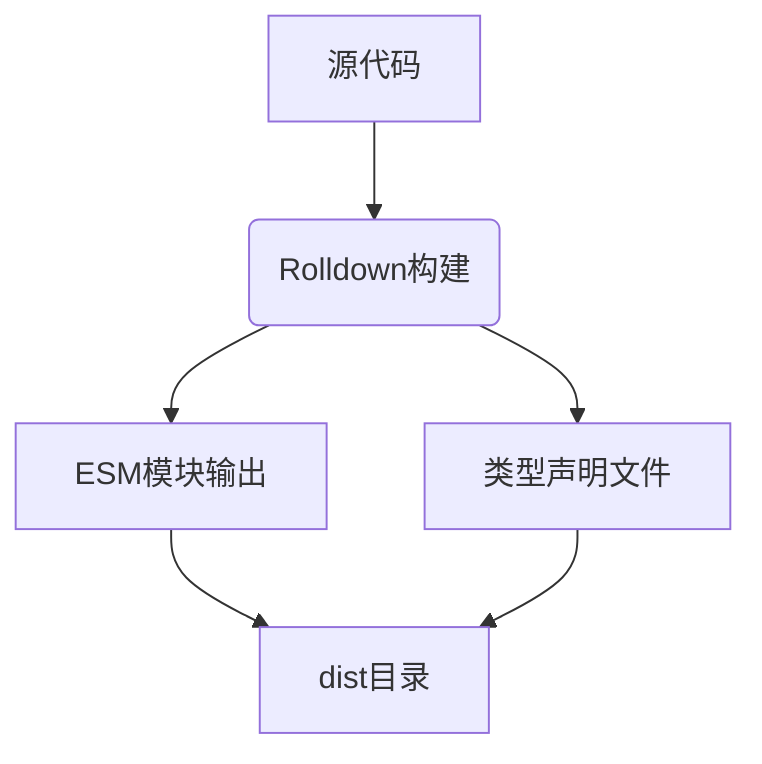
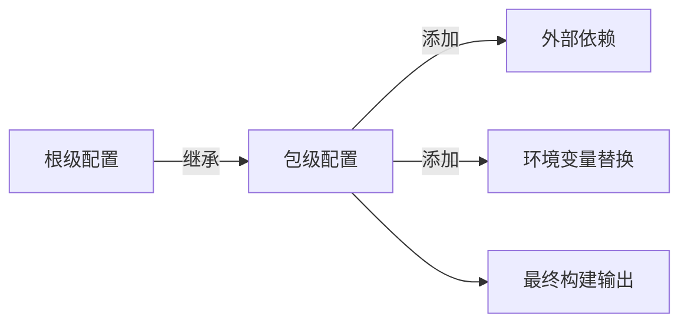
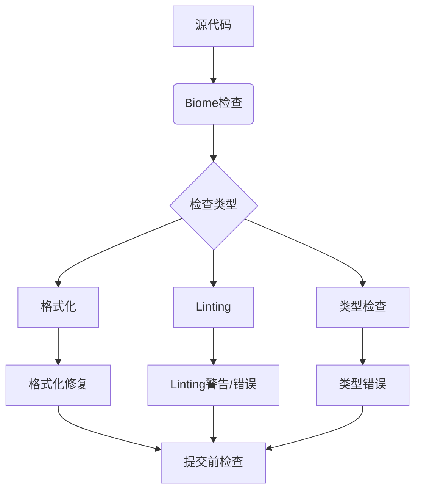
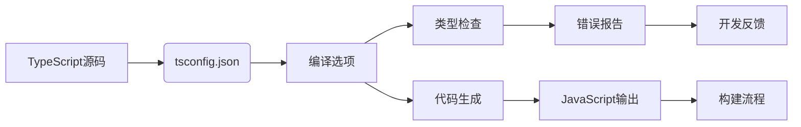
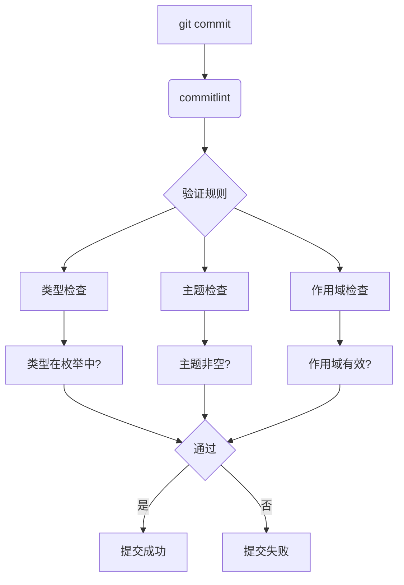
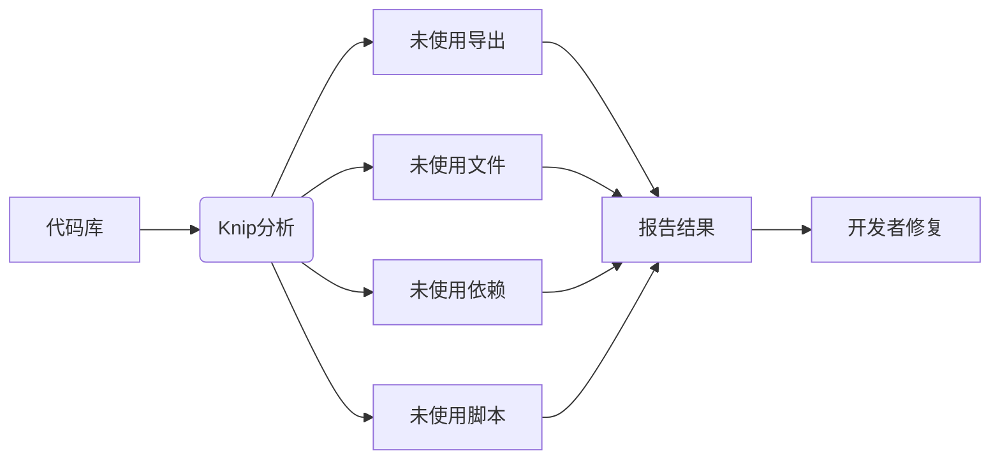

# 构建与质量保障体系

<cite>
**本文档中引用的文件**  
- [rolldown.config.ts](file://rolldown.config.ts)
- [biome.json](file://biome.json)
- [tsconfig.json](file://tsconfig.json)
- [commitlint.config.mjs](file://commitlint.config.mjs)
- [knip.json](file://knip.json)
- [package.json](file://package.json)
- [packages/ai/rolldown.config.ts](file://packages/ai/rolldown.config.ts)
- [packages/file/rolldown.config.ts](file://packages/file/rolldown.config.ts)
- [packages/git/rolldown.config.ts](file://packages/git/rolldown.config.ts)
- [packages/shared/rolldown.config.ts](file://packages/shared/rolldown.config.ts)
- [packages/ui/rolldown.config.ts](file://packages/ui/rolldown.config.ts)
- [packages/package/rolldown.config.ts](file://packages/package/rolldown.config.ts)
</cite>

## 目录
1. [简介](#简介)
2. [Rolldown构建工具配置与工作流程](#rolldown构建工具配置与工作流程)
3. [Biome代码质量工具配置](#biome代码质量工具配置)
4. [TypeScript编译配置](#typescript编译配置)
5. [提交信息规范与commitlint](#提交信息规范与commitlint)
6. [未使用代码检测与knip](#未使用代码检测与knip)
7. [最佳实践指南](#最佳实践指南)
8. [总结](#总结)

## 简介
本项目采用现代化的构建与质量保障体系，确保代码质量、构建效率和团队协作规范。体系核心包括Rolldown作为模块打包工具，Biome统一代码格式化与linting，TypeScript提供类型安全，commitlint规范提交信息，knip检测未使用代码。这些工具共同构成了nemo-cli项目的质量基石。

## Rolldown构建工具配置与工作流程

Rolldown是nemo-cli项目的核心构建工具，用于打包各个功能包。项目采用根级配置与包级配置相结合的方式，实现配置复用与定制化。

### 根级构建配置
根级`rolldown.config.ts`定义了基础构建配置：
- 入口文件为`./src/index.ts`
- 目标平台为Node.js
- 输出格式为ESM模块
- 使用`rolldown-plugin-dts`生成类型声明文件
- 提供`mergeConfig`函数用于合并配置



**Diagram sources**
- [rolldown.config.ts](file://rolldown.config.ts#L5-L30)

### 包级构建配置
各功能包（如ai、file、git等）通过继承根级配置实现定制化构建：

- **外部依赖处理**：所有包级配置都将`package.json`中的依赖项标记为外部依赖，避免重复打包
- **环境变量注入**：AI包通过`replacePlugin`将环境变量注入到构建结果中
- **配置合并机制**：使用`mergeConfig`函数合并根级配置与包级特定配置



**Diagram sources**
- [rolldown.config.ts](file://rolldown.config.ts#L22-L31)
- [packages/ai/rolldown.config.ts](file://packages/ai/rolldown.config.ts#L9-L22)

**Section sources**
- [rolldown.config.ts](file://rolldown.config.ts#L1-L32)
- [packages/ai/rolldown.config.ts](file://packages/ai/rolldown.config.ts#L1-L23)
- [packages/file/rolldown.config.ts](file://packages/file/rolldown.config.ts#L1-L7)
- [packages/git/rolldown.config.ts](file://packages/git/rolldown.config.ts#L1-L7)
- [packages/shared/rolldown.config.ts](file://packages/shared/rolldown.config.ts#L1-L7)
- [packages/ui/rolldown.config.ts](file://packages/ui/rolldown.config.ts#L1-L7)
- [packages/package/rolldown.config.ts](file://packages/package/rolldown.config.ts#L1-L7)

## Biome代码质量工具配置

Biome是项目统一的代码质量工具，集成了格式化、linting和类型检查功能。

### 全局代码格式化规则
`biome.json`配置了统一的代码风格：
- 缩进使用2个空格
- 行宽限制为120字符
- JavaScript单引号，JSX双引号
- 分号按需添加
- 尾随逗号遵循ES5标准

### 导入排序规则
Biome配置了详细的导入排序规则，确保导入语句的组织一致性：
1. Bun内置模块
2. Node.js内置模块
3. npm包
4. React相关
5. 带协议的包
6. URL导入
7. 常规包（排除@nemo-cli）
8. 空行分隔
9. @nemo-cli内部包
10. 别名导入
11. 相对路径导入

### Linting规则配置
项目配置了多层次的linting规则：
- **推荐规则**：启用所有推荐规则
- **复杂性**：无特殊配置
- **正确性**：未使用变量和导入标记为info级别
- **性能**：禁止命名空间导入
- **风格**：多项严格规则，如禁止默认导出、禁止枚举、禁止非空断言等
- **可疑代码**：数组索引作为key警告，禁止重复对象键



**Diagram sources**
- [biome.json](file://biome.json#L1-L160)

**Section sources**
- [biome.json](file://biome.json#L1-L160)
- [package.json](file://package.json#L11-L12)

## TypeScript编译配置

`tsconfig.json`文件定义了项目的TypeScript编译选项，为代码提供类型安全保证。

### 核心编译选项
- **目标版本**：ESNext，使用最新的ECMAScript特性
- **模块系统**：ESNext，支持现代模块语法
- **JSX支持**：react-jsx，支持JSX语法
- **类型检查**：启用严格模式，包括严格空值检查

### 项目结构配置
- **根目录**：项目根目录
- **输出目录**：temp目录用于临时编译
- **复合项目**：启用复合项目支持
- **隔离模块**：启用隔离模块编译

### 模块解析配置
- **解析策略**：bundler，适用于现代打包工具
- **基础路径**：项目根目录
- **ES模块互操作**：启用，支持CommonJS和ES模块的互操作

### 包含与排除
- **包含**：所有packages目录下的TypeScript、JSON和测试文件
- **排除**：packages目录下的JavaScript文件



**Diagram sources**
- [tsconfig.json](file://tsconfig.json#L1-L58)

**Section sources**
- [tsconfig.json](file://tsconfig.json#L1-L58)

## 提交信息规范与commitlint

`commitlint.config.mjs`配置了提交信息的规范，确保提交历史的可读性和一致性。

### 提交类型规范
项目定义了标准化的提交类型：
- `feat`：新功能
- `fix`：bug修复
- `docs`：文档更新
- `style`：代码格式调整
- `refactor`：代码重构
- `perf`：性能优化
- `test`：测试相关
- `build`：构建系统
- `ci`：CI配置
- `chore`：杂项更新
- `revert`：代码回退
- `wip`：进行中工作
- `release`：版本发布

### 作用域规范
定义了允许的作用域范围：
- `git`：Git相关功能
- `shared`：共享工具包
- `ai`：AI功能包
- `ui`：用户界面包
- `packages`：包管理
- `mail`：邮件功能

### 验证规则
- **类型必填**：提交类型不能为空
- **主题必填**：提交主题不能为空
- **作用域可选**：作用域字段可选
- **作用域枚举**：作用域必须在预定义列表中



**Diagram sources**
- [commitlint.config.mjs](file://commitlint.config.mjs#L1-L15)

**Section sources**
- [commitlint.config.mjs](file://commitlint.config.mjs#L1-L15)
- [package.json](file://package.json#L21-L22)

## 未使用代码检测与knip

`knip.json`配置了未使用代码的检测规则，帮助维护代码库的整洁性。

### 核心配置
- **忽略导出**：接口和类型导出即使未使用也不报告
- **标签过滤**：使用`-lintignore`标签忽略特定文件
- **工作区配置**：项目根目录作为工作区

### 检测范围
Knip工具用于检测：
- 未使用的导出
- 未使用的文件
- 未使用的依赖
- 未使用的脚本

### 集成方式
通过package.json中的脚本集成：
```json
"scripts": {
  "knip": "knip"
}
```

开发者可以运行`pnpm knip`来检查项目中的未使用代码。



**Diagram sources**
- [knip.json](file://knip.json#L1-L12)

**Section sources**
- [knip.json](file://knip.json#L1-L12)
- [package.json](file://package.json#L24-L25)

## 最佳实践指南

### 构建最佳实践
1. **配置继承**：包级配置应继承根级配置，避免重复
2. **外部依赖**：将`package.json`依赖标记为外部，减少打包体积
3. **环境变量**：敏感信息通过环境变量注入，不硬编码
4. **类型声明**：始终生成类型声明文件，支持TypeScript用户

### 代码质量最佳实践
1. **格式化**：提交前自动格式化代码
2. **Linting**：遵循Biome规则，保持代码风格一致
3. **类型安全**：充分利用TypeScript类型系统
4. **导入排序**：保持导入语句的逻辑组织

### 提交规范最佳实践
1. **清晰描述**：提交信息应清晰描述变更内容
2. **正确类型**：选择合适的提交类型
3. **作用域使用**：相关变更使用作用域限定
4. **原子提交**：每个提交应包含单一逻辑变更

### 代码维护最佳实践
1. **定期清理**：运行knip检测并清理未使用代码
2. **依赖管理**：定期审查和更新依赖
3. **文档同步**：代码变更同步更新相关文档
4. **测试覆盖**：确保关键功能有足够的测试覆盖

**Section sources**
- [rolldown.config.ts](file://rolldown.config.ts#L1-L32)
- [biome.json](file://biome.json#L1-L160)
- [tsconfig.json](file://tsconfig.json#L1-L58)
- [commitlint.config.mjs](file://commitlint.config.mjs#L1-L15)
- [knip.json](file://knip.json#L1-L12)

## 总结
nemo-cli项目的构建与质量保障体系通过Rolldown、Biome、TypeScript、commitlint和knip等工具的协同工作，建立了完整的开发质量闭环。该体系确保了代码的一致性、可维护性和团队协作效率，为项目的长期健康发展提供了坚实基础。开发者应遵循本文档的最佳实践，共同维护项目的高质量标准。