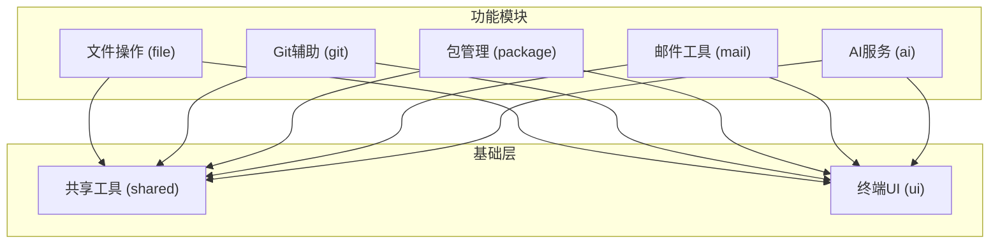
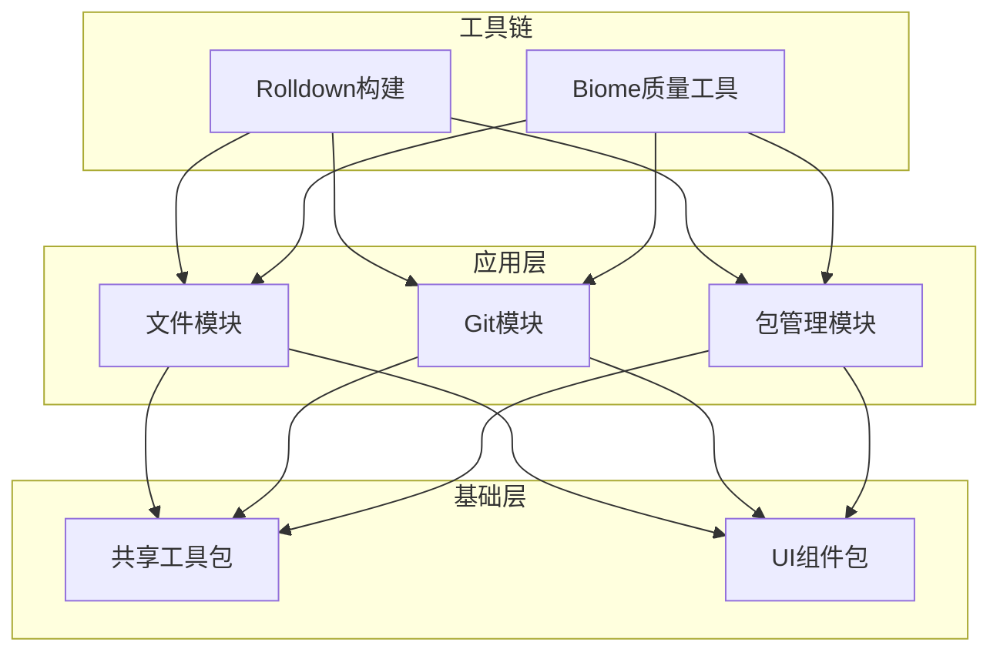
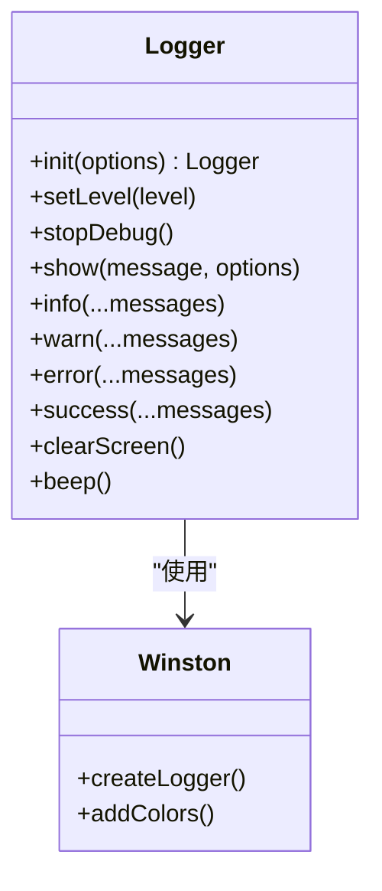
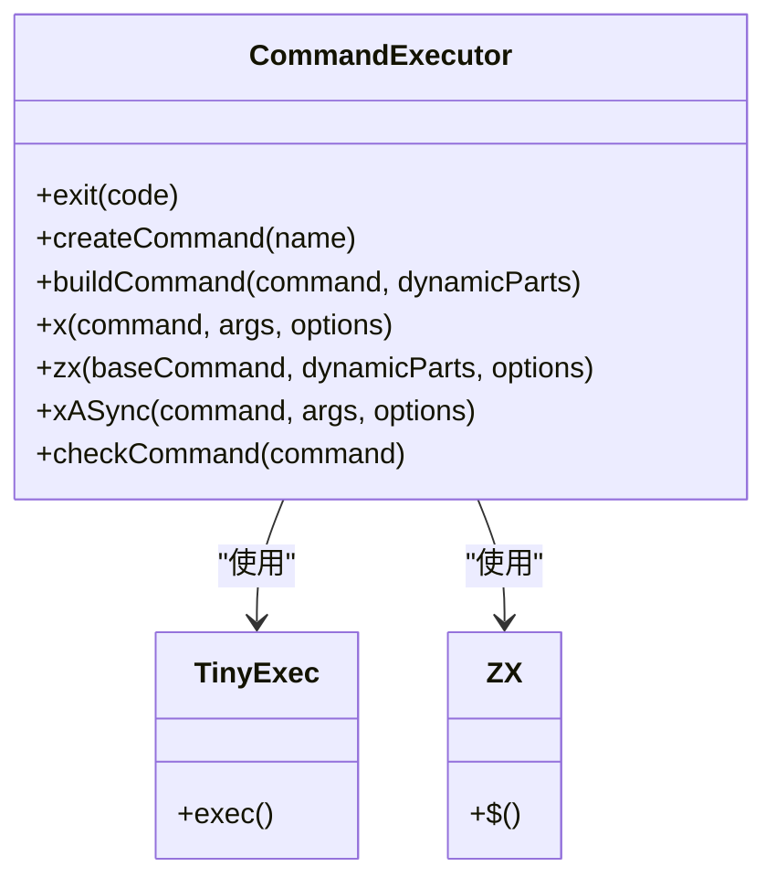
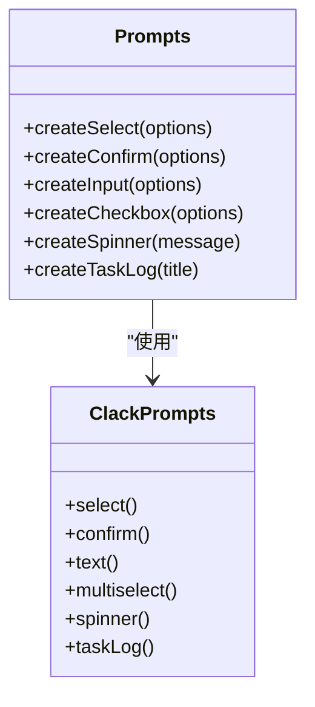
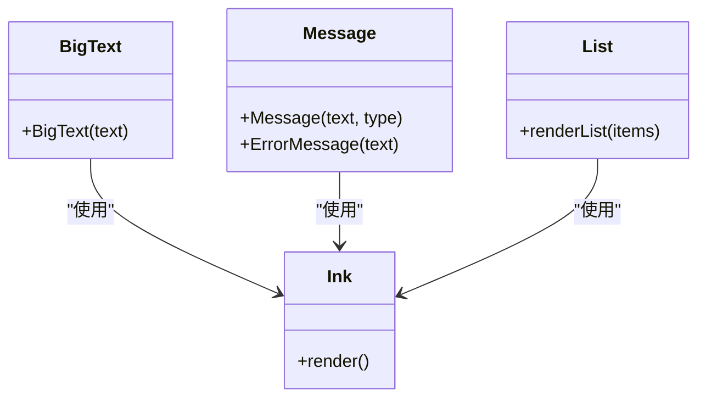
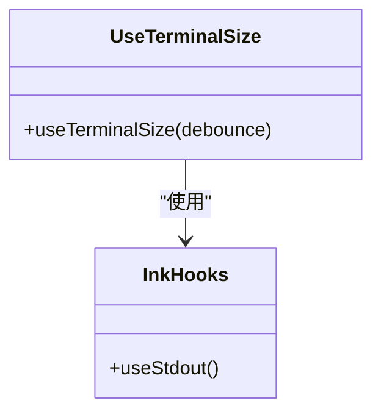
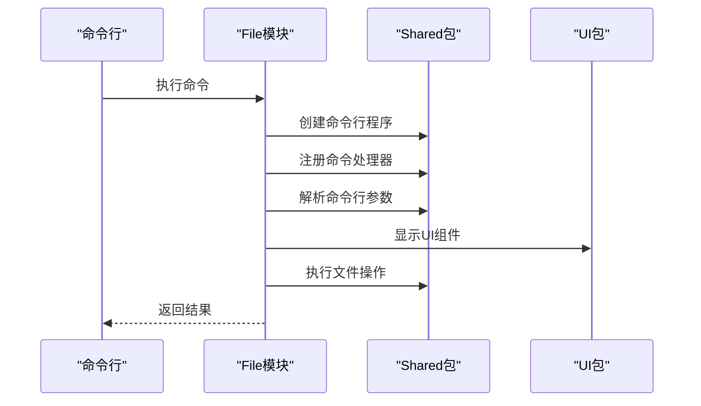
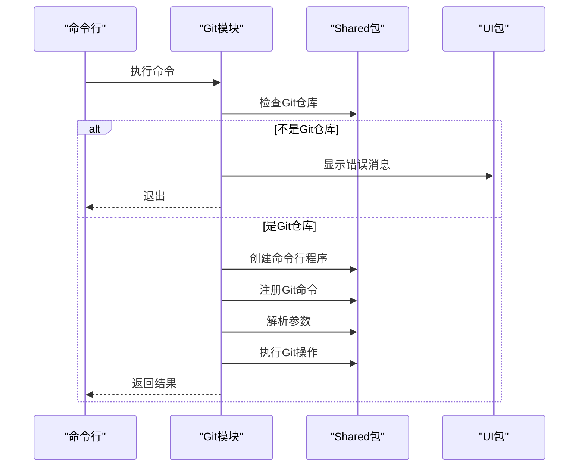
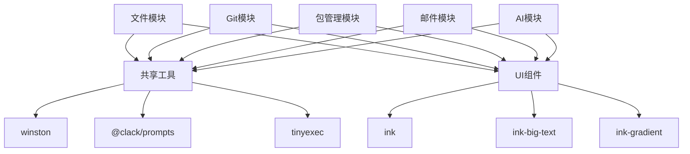

# 核心架构

<cite>
**本文档中引用的文件**  
- [shared/src/index.ts](file://packages/shared/src/index.ts)
- [shared/src/utils/log.ts](file://packages/shared/src/utils/log.ts)
- [shared/src/utils/command.ts](file://packages/shared/src/utils/command.ts)
- [shared/src/utils/prompts.ts](file://packages/shared/src/utils/prompts.ts)
- [ui/src/index.ts](file://packages/ui/src/index.ts)
- [ui/src/components/index.ts](file://packages/ui/src/components/index.ts)
- [ui/src/components/big-text.tsx](file://packages/ui/src/components/big-text.tsx)
- [ui/src/components/message.tsx](file://packages/ui/src/components/message.tsx)
- [ui/src/hooks/useTerminalSize.ts](file://packages/ui/src/hooks/useTerminalSize.ts)
- [rolldown.config.ts](file://rolldown.config.ts)
- [biome.json](file://biome.json)
- [package.json](file://package.json)
- [pnpm-workspace.yaml](file://pnpm-workspace.yaml)
- [file/src/index.ts](file://packages/file/src/index.ts)
- [git/src/index.ts](file://packages/git/src/index.ts)
</cite>

## 目录
1. [简介](#简介)
2. [项目结构](#项目结构)
3. [核心组件](#核心组件)
4. [架构概述](#架构概述)
5. [详细组件分析](#详细组件分析)
6. [依赖分析](#依赖分析)
7. [性能考虑](#性能考虑)
8. [故障排除指南](#故障排除指南)
9. [结论](#结论)

## 简介
nemo-cli 是一个模块化设计的命令行工具，旨在通过共享工具包和现代化的终端UI系统简化开发工作流。本架构文档深入探讨其模块化设计原则、核心共享包、UI组件系统以及构建和质量保障工具链。项目采用命令模式组织功能模块，每个CLI命令对应独立的实现模块，并通过依赖注入机制共享通用功能。架构设计强调可维护性、可扩展性和开发者体验。

## 项目结构
nemo-cli 采用基于pnpm工作区的单体仓库（monorepo）结构，将不同功能模块组织为独立的包。这种结构支持模块间的清晰边界和独立发布，同时通过共享包实现功能复用。核心功能模块如文件操作、Git辅助等作为独立包存在，而shared和ui包作为基础层为所有功能模块提供支持。

**图示来源**  
- [pnpm-workspace.yaml](file://pnpm-workspace.yaml#L1-L3)

**本节来源**  
- [package.json](file://package.json#L2-L66)
- [pnpm-workspace.yaml](file://pnpm-workspace.yaml#L1-L17)

## 核心组件
nemo-cli的核心架构围绕两个基础包构建：shared包提供通用工具函数，ui包提供基于Ink + React的终端UI组件。这些基础组件被所有功能模块依赖，形成了清晰的依赖层级。shared包封装了日志、配置、命令执行、错误处理等跨领域关注点，而ui包则抽象了终端渲染逻辑，提供一致的用户界面体验。

**本节来源**  
- [shared/src/index.ts](file://packages/shared/src/index.ts#L1-L24)
- [ui/src/index.ts](file://packages/ui/src/index.ts#L1-L2)

## 架构概述
nemo-cli采用分层架构设计，其中shared和ui包作为基础层，为上层的功能模块提供支持。每个功能模块（如file、git）实现特定的CLI命令集，遵循命令模式的设计原则。构建系统Rolldown负责将TypeScript代码编译为可分发的ESM模块，而Biome则统一管理代码格式化、linting和类型检查。这种架构确保了代码的一致性、可维护性和高质量。

**图示来源**  
- [rolldown.config.ts](file://rolldown.config.ts#L1-L32)
- [biome.json](file://biome.json#L1-L160)

## 详细组件分析
本节深入分析nemo-cli的核心组件，包括共享工具包、UI组件系统和模块化命令架构。通过具体示例展示这些组件如何协同工作，构建一个高效、可维护的CLI应用。

### 共享工具包分析
shared包是nemo-cli的基础设施，提供了一系列通用工具函数，被所有功能模块复用。该包通过index.ts文件导出所有工具模块，实现了清晰的API边界。核心功能包括日志记录、命令执行、配置管理、错误处理和用户提示等。

#### 日志系统
shared包的日志系统基于winston库构建，提供了结构化的日志记录能力。系统定义了自定义的日志级别（如error、warn、success、info等）和颜色方案，确保日志输出的可读性和一致性。日志工具还集成了ansi-escapes库，支持终端屏幕清除、蜂鸣等高级功能。

**图示来源**  
- [shared/src/utils/log.ts](file://packages/shared/src/utils/log.ts#L1-L169)

**本节来源**  
- [shared/src/utils/log.ts](file://packages/shared/src/utils/log.ts#L1-L169)

#### 命令执行系统
命令执行系统封装了底层的命令行执行逻辑，提供了安全、一致的接口。系统基于tinyexec和zx库构建，支持同步和异步命令执行、错误处理和输出捕获。`x`和`zx`函数提供了增强的命令执行能力，包括超时控制、环境变量设置和错误处理。

**图示来源**  
- [shared/src/utils/command.ts](file://packages/shared/src/utils/command.ts#L1-L169)

**本节来源**  
- [shared/src/utils/command.ts](file://packages/shared/src/utils/command.ts#L1-L169)

#### 用户提示系统
用户提示系统基于@clack/prompts库构建，提供了丰富的交互式UI组件。系统封装了选择、确认、输入、多选等常见交互模式，并处理用户取消操作的统一退出逻辑。`createSelect`、`createConfirm`、`createInput`等工厂函数简化了提示的创建和使用。

**图示来源**  
- [shared/src/utils/prompts.ts](file://packages/shared/src/utils/prompts.ts#L1-L155)

**本节来源**  
- [shared/src/utils/prompts.ts](file://packages/shared/src/utils/prompts.ts#L1-L155)

### UI组件系统分析
ui包基于Ink + React构建，提供了声明式的终端UI组件系统。该系统将React的组件模型应用于终端环境，实现了UI逻辑和渲染的分离。核心组件包括BigText、Message、List等，提供了丰富的视觉效果和交互能力。

#### 终端UI组件
ui包的组件系统基于Ink库，将React组件渲染为终端输出。`BigText`组件使用ink-big-text和ink-gradient库创建渐变的大字体文本，用于标题显示。`Message`组件提供带边框和颜色渐变的消息框，支持不同类型的视觉反馈。

**图示来源**  
- [ui/src/components/big-text.tsx](file://packages/ui/src/components/big-text.tsx#L1-L11)
- [ui/src/components/message.tsx](file://packages/ui/src/components/message.tsx#L1-L40)

**本节来源**  
- [ui/src/components/index.ts](file://packages/ui/src/components/index.ts#L1-L5)
- [ui/src/components/big-text.tsx](file://packages/ui/src/components/big-text.tsx#L1-L11)
- [ui/src/components/message.tsx](file://packages/ui/src/components/message.tsx#L1-L40)

#### 终端尺寸钩子
`useTerminalSize`钩子提供了响应式终端UI的能力。该钩子监听终端的resize事件，返回当前的列数和行数，并提供防抖机制以优化性能。此功能对于创建适应不同终端尺寸的UI布局至关重要。

**图示来源**  
- [ui/src/hooks/useTerminalSize.ts](file://packages/ui/src/hooks/useTerminalSize.ts#L1-L47)

**本节来源**  
- [ui/src/hooks/useTerminalSize.ts](file://packages/ui/src/hooks/useTerminalSize.ts#L1-L47)

### 模块化命令架构分析
nemo-cli采用模块化命令架构，每个功能模块（如file、git）独立实现其命令集。这种设计遵循单一职责原则，确保每个模块只关注特定领域的功能。主程序通过动态导入和注册机制组合这些模块，形成完整的CLI应用。

#### 文件操作模块
file模块实现了文件相关的CLI命令，如文件列表、删除、清理等。模块通过createCommand工厂函数创建命令行程序，并注册具体的命令处理器。每个命令处理器（如listCommand、deleteFilesCommand）独立实现其功能逻辑。

**图示来源**  
- [file/src/index.ts](file://packages/file/src/index.ts#L1-L30)

**本节来源**  
- [file/src/index.ts](file://packages/file/src/index.ts#L1-L30)

#### Git辅助模块
git模块提供了Git操作的CLI辅助功能。模块在执行前通过checkGitRepository函数验证当前目录是否为Git仓库，并使用ErrorMessage组件显示错误信息。命令注册顺序经过精心设计，确保常用命令的优先级。

**图示来源**  
- [git/src/index.ts](file://packages/git/src/index.ts#L1-L47)

**本节来源**  
- [git/src/index.ts](file://packages/git/src/index.ts#L1-L47)

## 依赖分析
nemo-cli的依赖关系清晰地反映了其分层架构。功能模块依赖于shared和ui基础包，而基础包之间保持独立。构建和质量工具作为开发依赖，不包含在运行时依赖中。这种依赖管理策略确保了模块间的松耦合和高内聚。

**图示来源**  
- [package.json](file://package.json#L2-L66)
- [shared/src/index.ts](file://packages/shared/src/index.ts#L1-L24)
- [ui/src/index.ts](file://packages/ui/src/index.ts#L1-L2)

**本节来源**  
- [package.json](file://package.json#L2-L66)
- [pnpm-workspace.yaml](file://pnpm-workspace.yaml#L1-L17)

## 性能考虑
nemo-cli在性能方面主要考虑启动时间和内存使用。通过使用ESM模块和Tree-shaking，构建系统Rolldown能够生成优化的输出，减少包大小。Biome的linting规则配置为在开发时提供快速反馈，不影响构建性能。异步操作的使用确保了CLI的响应性，避免阻塞主线程。

## 故障排除指南
当遇到nemo-cli问题时，首先检查是否安装了最新版本。对于命令执行失败，查看详细的错误日志以确定根本原因。如果UI显示异常，检查终端是否支持ANSI转义序列。构建问题通常与Node.js版本或依赖安装有关，尝试清理node_modules并重新安装依赖。

**本节来源**  
- [shared/src/utils/log.ts](file://packages/shared/src/utils/log.ts#L1-L169)
- [shared/src/utils/error.ts](file://packages/shared/src/utils/error.ts#L1-L50)

## 结论
nemo-cli通过精心设计的模块化架构，实现了功能的清晰分离和高度复用。shared和ui基础包为上层功能模块提供了强大的支持，而Rolldown和Biome工具链确保了代码质量和可维护性。这种架构不仅提升了开发效率，也为未来的扩展和维护奠定了坚实的基础。选择Ink进行终端渲染，使得创建丰富、交互式的CLI界面成为可能，显著提升了用户体验。