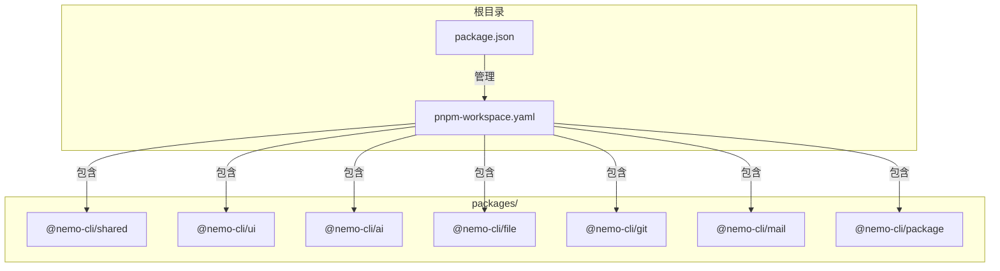
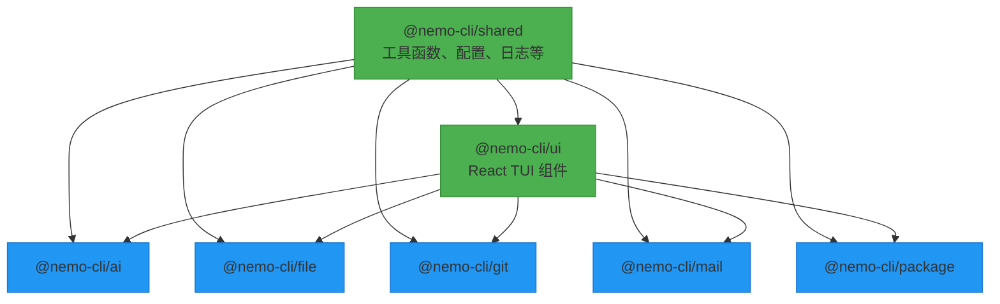
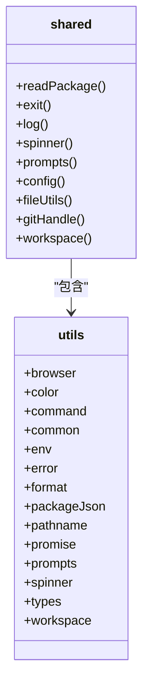
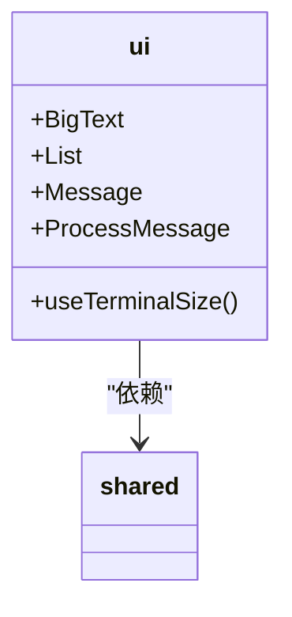
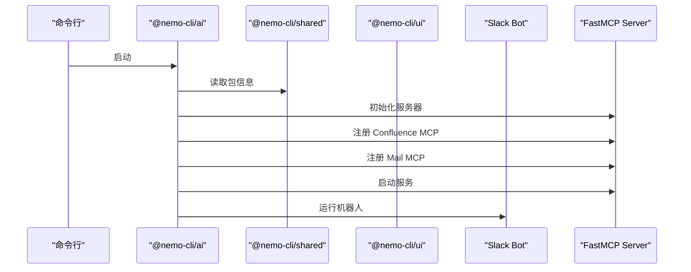
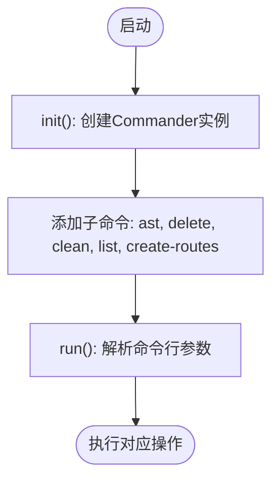
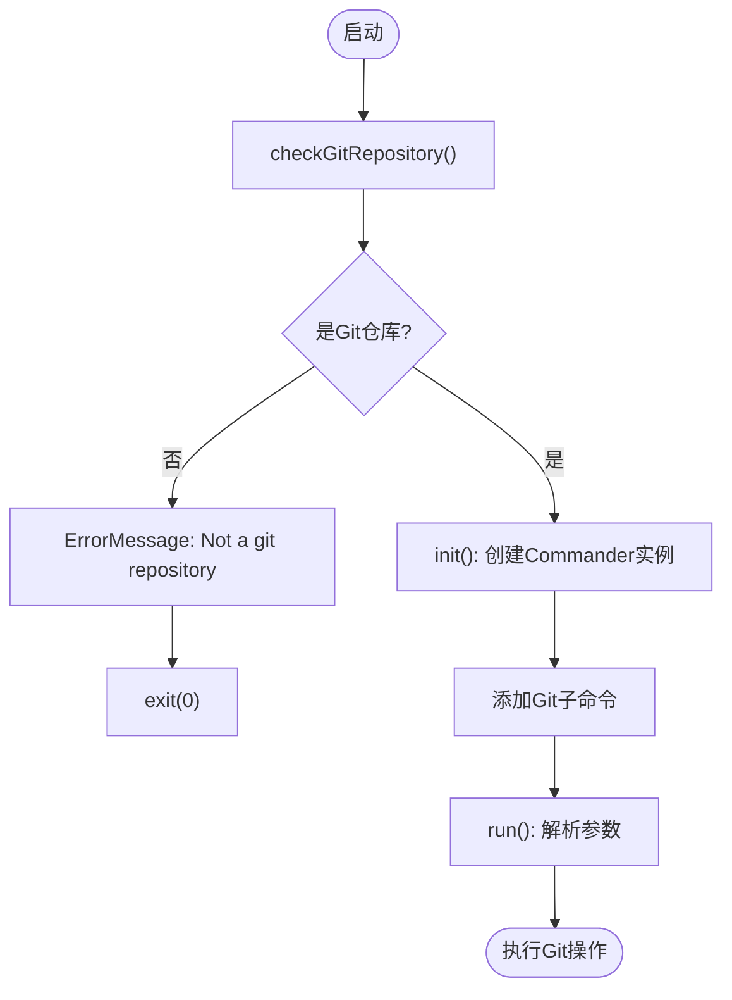
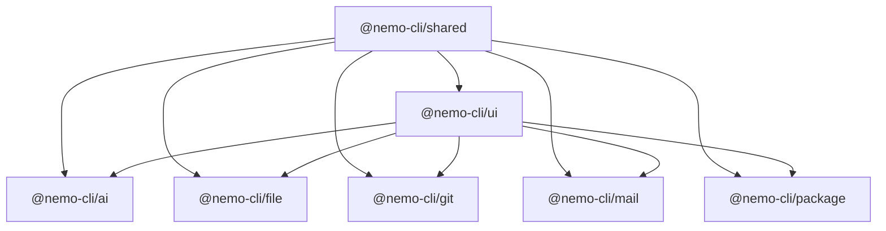

# 模块化架构设计

<cite>
**本文档引用的文件**  
- [package.json](file://package.json)
- [pnpm-workspace.yaml](file://pnpm-workspace.yaml)
- [packages/shared/package.json](file://packages/shared/package.json)
- [packages/ui/package.json](file://packages/ui/package.json)
- [packages/ai/package.json](file://packages/ai/package.json)
- [packages/file/package.json](file://packages/file/package.json)
- [packages/git/package.json](file://packages/git/package.json)
- [packages/mail/package.json](file://packages/mail/package.json)
- [packages/package/package.json](file://packages/package/package.json)
- [packages/shared/src/index.ts](file://packages/shared/src/index.ts)
- [packages/ui/src/index.ts](file://packages/ui/src/index.ts)
- [packages/ai/src/index.ts](file://packages/ai/src/index.ts)
- [packages/file/src/index.ts](file://packages/file/src/index.ts)
- [packages/git/src/index.ts](file://packages/git/src/index.ts)
- [packages/mail/src/index.ts](file://packages/mail/src/index.ts)
- [packages/package/src/index.ts](file://packages/package/src/index.ts)
</cite>

## 目录
1. [引言](#引言)
2. [项目结构](#项目结构)
3. [核心组件](#核心组件)
4. [架构概述](#架构概述)
5. [详细组件分析](#详细组件分析)
6. [依赖分析](#依赖分析)
7. [性能考虑](#性能考虑)
8. [故障排除指南](#故障排除指南)
9. [结论](#结论)

## 引言
nemo-cli 是一个基于 Monorepo 架构的命令行工具集合，采用 pnpm workspace 实现多包管理。该项目通过模块化设计将不同功能解耦为独立的 npm 包，包括 AI 集成、文件操作、Git 工作流、邮件发送、包管理等。这种架构提升了代码的可维护性、可扩展性和团队协作效率。本文档深入分析其模块化架构设计，重点阐述 shared 和 ui 作为基础层被其他模块依赖的模式。

## 项目结构

nemo-cli 采用典型的 Monorepo 结构，所有功能模块均位于 `packages/` 目录下，每个子目录代表一个独立的 npm 包。

**图示来源**  
- [package.json](file://package.json)
- [pnpm-workspace.yaml](file://pnpm-workspace.yaml)

**本节来源**  
- [package.json](file://package.json)
- [pnpm-workspace.yaml](file://pnpm-workspace.yaml)

## 核心组件

nemo-cli 的核心由多个功能模块组成，每个模块封装特定领域的功能。`@nemo-cli/shared` 和 `@nemo-cli/ui` 作为基础层，为上层功能模块提供通用工具和用户界面组件。所有功能模块（ai、file、git、mail、package）均依赖这两个基础包，形成清晰的分层架构。

**本节来源**  
- [packages/shared/package.json](file://packages/shared/package.json)
- [packages/ui/package.json](file://packages/ui/package.json)
- [packages/ai/package.json](file://packages/ai/package.json)
- [packages/file/package.json](file://packages/file/package.json)
- [packages/git/package.json](file://packages/git/package.json)
- [packages/mail/package.json](file://packages/mail/package.json)
- [packages/package/package.json](file://packages/package/package.json)

## 架构概述

nemo-cli 采用分层的模块化架构，其中 `shared` 和 `ui` 包构成基础层，其他功能模块作为应用层构建于其上。

**图示来源**  
- [packages/shared/package.json](file://packages/shared/package.json)
- [packages/ui/package.json](file://packages/ui/package.json)
- [packages/ai/package.json](file://packages/ai/package.json)
- [packages/file/package.json](file://packages/file/package.json)
- [packages/git/package.json](file://packages/git/package.json)
- [packages/mail/package.json](file://packages/mail/package.json)
- [packages/package/package.json](file://packages/package/package.json)

## 详细组件分析

### 基础层组件分析

#### @nemo-cli/shared 分析
`@nemo-cli/shared` 包提供跨模块的通用工具函数，包括文件操作、环境变量处理、日志记录、命令行交互、Git 操作辅助等。它作为所有其他模块的依赖，确保了功能的复用性和一致性。

**图示来源**  
- [packages/shared/src/index.ts](file://packages/shared/src/index.ts)

**本节来源**  
- [packages/shared/package.json](file://packages/shared/package.json)
- [packages/shared/src/index.ts](file://packages/shared/src/index.ts)

#### @nemo-cli/ui 分析
`@nemo-cli/ui` 包基于 React 和 Ink 框架构建，提供终端用户界面（TUI）组件，如消息显示、列表、大文本展示等。它依赖于 `@nemo-cli/shared`，并被所有需要用户交互的功能模块所依赖。

**图示来源**  
- [packages/ui/src/index.ts](file://packages/ui/src/index.ts)

**本节来源**  
- [packages/ui/package.json](file://packages/ui/package.json)
- [packages/ui/src/index.ts](file://packages/ui/src/index.ts)

### 功能层组件分析

#### @nemo-cli/ai 分析
`@nemo-cli/ai` 模块集成 AI SDK，支持与 Slack、Confluence 等服务的交互。它依赖 `shared` 进行基础操作，依赖 `ui` 进行用户界面展示，并通过 MCP（Model Context Protocol）实现 AI 工具的扩展。

**图示来源**  
- [packages/ai/src/index.ts](file://packages/ai/src/index.ts)

**本节来源**  
- [packages/ai/package.json](file://packages/ai/package.json)
- [packages/ai/src/index.ts](file://packages/ai/src/index.ts)

#### @nemo-cli/file 分析
`@nemo-cli/file` 提供基于 AST 的文件操作功能，如创建路由、清理文件等。它通过 Commander 库定义命令，并利用 `shared` 和 `ui` 包实现功能。

**图示来源**  
- [packages/file/src/index.ts](file://packages/file/src/index.ts)

**本节来源**  
- [packages/file/package.json](file://packages/file/package.json)
- [packages/file/src/index.ts](file://packages/file/src/index.ts)

#### @nemo-cli/git 分析
`@nemo-cli/git` 模块简化 Git 工作流操作。它在执行前检查当前目录是否为 Git 仓库，并通过 `shared` 的 `exit` 和 `ui` 的 `ErrorMessage` 处理错误。

**图示来源**  
- [packages/git/src/index.ts](file://packages/git/src/index.ts)

**本节来源**  
- [packages/git/package.json](file://packages/git/package.json)
- [packages/git/src/index.ts](file://packages/git/src/index.ts)

#### @nemo-cli/mail 分析
`@nemo-cli/mail` 模块用于发送邮件，依赖 `nodemailer` 和 React Email 进行邮件内容的构建与发送。它同样依赖 `shared` 和 `ui` 进行基础功能和用户交互。

**本节来源**  
- [packages/mail/package.json](file://packages/mail/package.json)
- [packages/mail/src/index.ts](file://packages/mail/src/index.ts)

#### @nemo-cli/package 分析
`@nemo-cli/package` 模块专为 pnpm workspace 设计，提供包管理的便捷命令。其架构与其他功能模块一致，依赖 `shared` 和 `ui`。

**本节来源**  
- [packages/package/package.json](file://packages/package/package.json)
- [packages/package/src/index.ts](file://packages/package/src/index.ts)

## 依赖分析

nemo-cli 的依赖关系清晰地体现了分层架构。`shared` 和 `ui` 作为基础层，被所有上层模块所依赖。

**图示来源**  
- [packages/shared/package.json](file://packages/shared/package.json)
- [packages/ui/package.json](file://packages/ui/package.json)
- [packages/ai/package.json](file://packages/ai/package.json)
- [packages/file/package.json](file://packages/file/package.json)
- [packages/git/package.json](file://packages/git/package.json)
- [packages/mail/package.json](file://packages/mail/package.json)
- [packages/package/package.json](file://packages/package/package.json)

**本节来源**  
- [package.json](file://package.json)
- [pnpm-workspace.yaml](file://pnpm-workspace.yaml)

## 性能考虑
Monorepo 架构结合 pnpm workspace 的硬链接和符号链接机制，有效减少了 node_modules 的磁盘占用和安装时间。通过 `pnpm-workspace.yaml` 的 `catalog` 字段统一管理 React 等大型依赖的版本，避免了版本碎片化。`onlyBuiltDependencies` 配置确保只有必要的包被构建，优化了构建性能。

## 故障排除指南
当遇到模块间依赖问题时，应首先检查 `pnpm-workspace.yaml` 中的 `packages/*` 配置是否正确包含所有模块。若出现版本冲突，可通过 `catalog` 字段进行版本锁定。对于构建问题，确保各模块的 `build` 脚本正确配置了 RollDown 构建工具。

## 结论
nemo-cli 的模块化架构设计通过 Monorepo 和 pnpm workspace 实现了高效的多包管理。`shared` 和 `ui` 作为坚实的基础层，支撑了上层功能模块的快速开发和维护。这种分层依赖模式不仅提高了代码复用率，也增强了项目的可扩展性和可维护性，为团队协作提供了良好的基础。