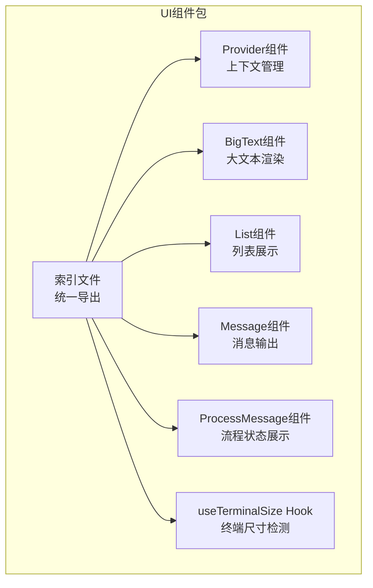
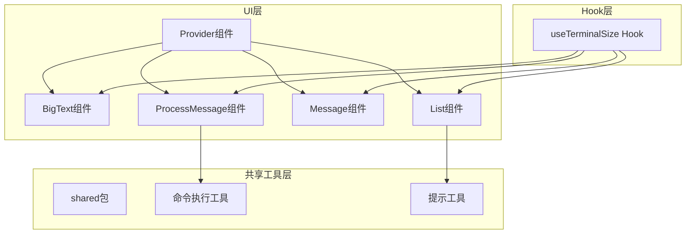
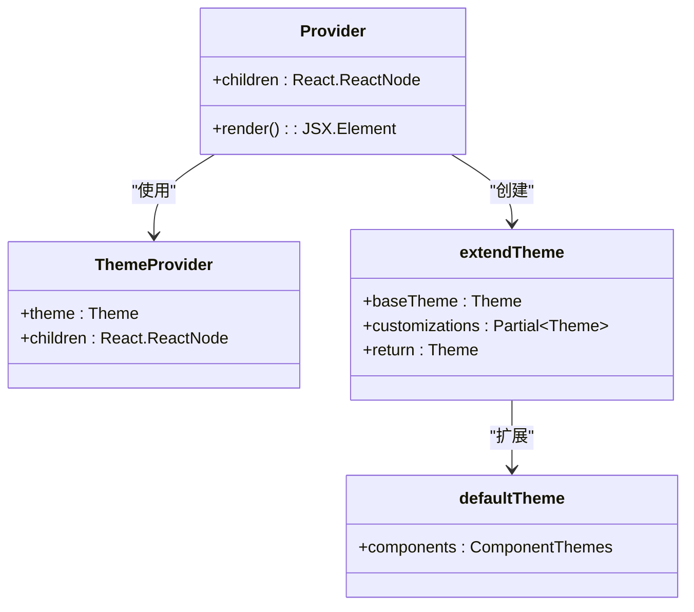
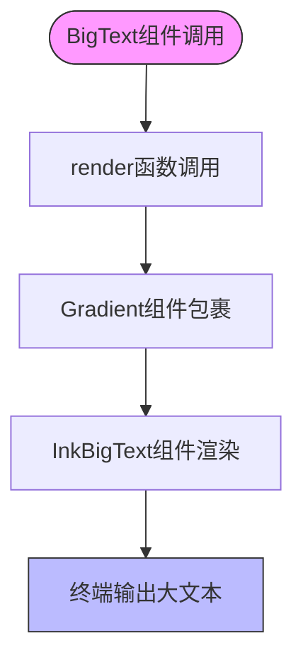
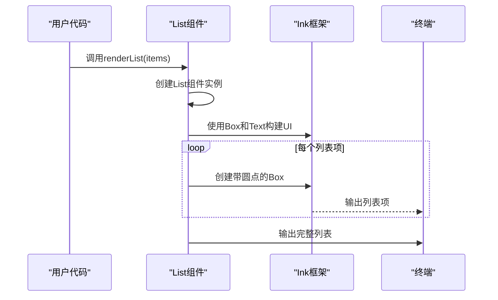
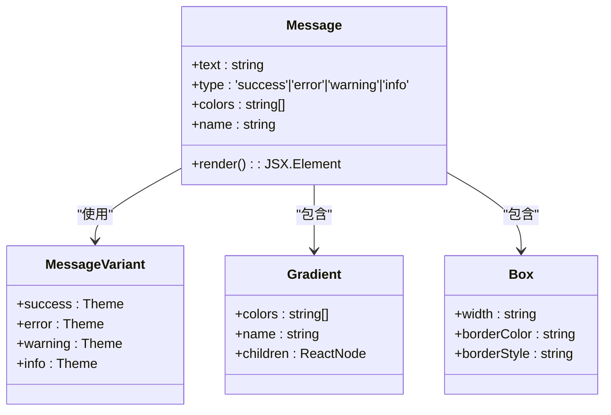
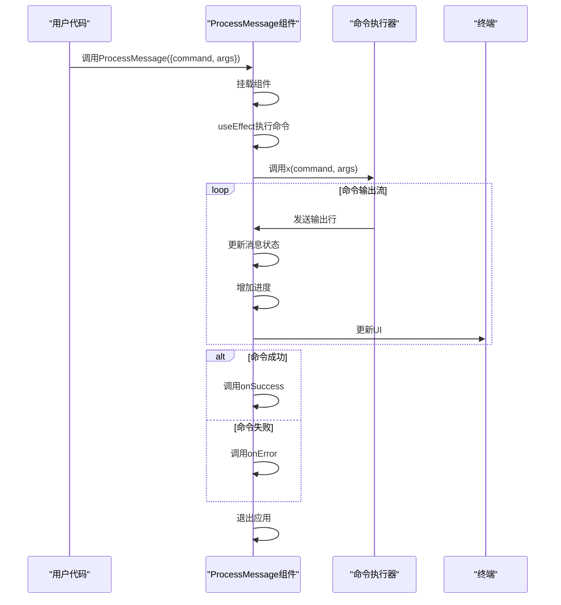
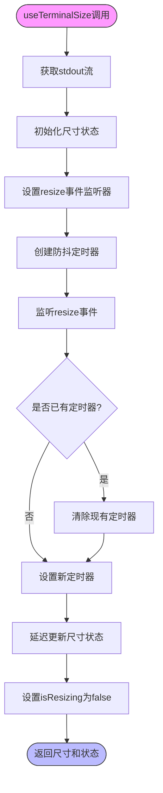

# 终端UI组件系统

<cite>
**本文档引用的文件**
- [big-text.tsx](file://packages/ui/src/components/big-text.tsx)
- [list.tsx](file://packages/ui/src/components/list.tsx)
- [message.tsx](file://packages/ui/src/components/message.tsx)
- [process-message.tsx](file://packages/ui/src/components/process-message.tsx)
- [useTerminalSize.ts](file://packages/ui/src/hooks/useTerminalSize.ts)
- [provider/index.tsx](file://packages/ui/src/components/provider/index.tsx)
- [prompts.ts](file://packages/shared/src/utils/prompts.ts)
- [command.ts](file://packages/shared/src/utils/command.ts)
</cite>

## 目录
1. [简介](#简介)
2. [项目结构](#项目结构)
3. [核心组件](#核心组件)
4. [架构概述](#架构概述)
5. [详细组件分析](#详细组件分析)
6. [依赖分析](#依赖分析)
7. [性能考虑](#性能考虑)
8. [故障排除指南](#故障排除指南)
9. [结论](#结论)

## 简介
本文档详细描述了nemo-cli项目中基于Ink和React构建的终端UI组件系统。该系统提供了一套完整的用户界面组件，用于创建丰富的终端用户界面。文档涵盖了Provider组件的上下文管理、BigText组件的文本渲染、List组件的列表展示、Message组件的消息输出以及ProcessMessage组件的流程状态展示。同时，文档还解释了useTerminalSize等自定义Hook的实现原理，提供了组件的属性定义、使用示例和样式定制方法，并阐述了组件如何协同工作以及与shared包中工具的集成方式。

## 项目结构
终端UI组件系统位于`packages/ui`目录下，采用模块化设计，将不同功能的组件分离到独立的文件中。系统主要由组件模块和Hook模块组成，通过索引文件统一导出，便于外部引用。



**Diagram sources**
- [index.ts](file://packages/ui/src/components/index.ts)
- [provider/index.tsx](file://packages/ui/src/components/provider/index.tsx)
- [big-text.tsx](file://packages/ui/src/components/big-text.tsx)
- [list.tsx](file://packages/ui/src/components/list.tsx)
- [message.tsx](file://packages/ui/src/components/message.tsx)
- [process-message.tsx](file://packages/ui/src/components/process-message.tsx)
- [useTerminalSize.ts](file://packages/ui/src/hooks/useTerminalSize.ts)

**Section sources**
- [index.ts](file://packages/ui/src/components/index.ts)
- [package.json](file://packages/ui/package.json)

## 核心组件
终端UI组件系统包含多个核心组件，每个组件都有特定的职责和功能。这些组件基于Ink框架构建，利用React的声明式特性来创建交互式的终端用户界面。系统通过Provider组件提供主题管理，确保UI风格的一致性；BigText组件用于渲染醒目的大标题文本；List组件展示项目列表；Message组件输出不同类型的系统消息；ProcessMessage组件则用于显示长时间运行的命令执行状态。

**Section sources**
- [big-text.tsx](file://packages/ui/src/components/big-text.tsx)
- [list.tsx](file://packages/ui/src/components/list.tsx)
- [message.tsx](file://packages/ui/src/components/message.tsx)
- [process-message.tsx](file://packages/ui/src/components/process-message.tsx)
- [provider/index.tsx](file://packages/ui/src/components/provider/index.tsx)

## 架构概述
终端UI组件系统的架构基于React和Ink框架，采用组件化设计模式。系统通过Provider组件建立上下文环境，为所有子组件提供统一的主题配置。各个UI组件通过props接收数据和配置，使用Ink提供的原语（如Box、Text）构建终端界面。自定义Hook useTerminalSize用于响应终端窗口尺寸变化，确保UI布局的适应性。ProcessMessage组件与shared包中的命令执行工具集成，实现命令执行状态的可视化。



**Diagram sources**
- [provider/index.tsx](file://packages/ui/src/components/provider/index.tsx)
- [big-text.tsx](file://packages/ui/src/components/big-text.tsx)
- [list.tsx](file://packages/ui/src/components/list.tsx)
- [message.tsx](file://packages/ui/src/components/message.tsx)
- [process-message.tsx](file://packages/ui/src/components/process-message.tsx)
- [useTerminalSize.ts](file://packages/ui/src/hooks/useTerminalSize.ts)
- [command.ts](file://packages/shared/src/utils/command.ts)
- [prompts.ts](file://packages/shared/src/utils/prompts.ts)

## 详细组件分析

### Provider组件分析
Provider组件是终端UI系统的上下文管理器，负责提供统一的主题配置。它基于@inkjs/ui的ThemeProvider组件构建，通过extendTheme函数扩展默认主题，自定义ProgressBar和Spinner组件的样式。这种设计确保了整个应用中UI组件风格的一致性，同时提供了主题定制的灵活性。



**Diagram sources**
- [provider/index.tsx](file://packages/ui/src/components/provider/index.tsx)

**Section sources**
- [provider/index.tsx](file://packages/ui/src/components/provider/index.tsx)

### BigText组件分析
BigText组件用于在终端中渲染醒目的大标题文本。它结合了ink-big-text和ink-gradient两个库，不仅能够生成大字体文本，还能添加渐变色彩效果。组件通过Gradient组件包裹InkBigText组件，实现视觉上的层次感和吸引力，常用于应用启动时的标题显示。



**Diagram sources**
- [big-text.tsx](file://packages/ui/src/components/big-text.tsx)

**Section sources**
- [big-text.tsx](file://packages/ui/src/components/big-text.tsx)

### List组件分析
List组件用于在终端中展示项目列表，提供了一致的视觉样式和布局。组件接收PromptOptions类型的数组作为输入，使用Box和Text组件构建带蓝色圆点符号的列表项。renderList函数提供了便捷的列表渲染方式，无需手动创建组件实例即可直接输出列表。



**Diagram sources**
- [list.tsx](file://packages/ui/src/components/list.tsx)
- [prompts.ts](file://packages/shared/src/utils/prompts.ts)

**Section sources**
- [list.tsx](file://packages/ui/src/components/list.tsx)

### Message组件分析
Message组件用于在终端中输出不同类型的系统消息，支持成功、错误、警告和信息四种消息类型。每种类型都有预定义的渐变样式，通过MessageVariant对象管理。组件提供了Message和ErrorMessage两个导出，分别用于一般消息和错误消息的显示，确保错误信息有更醒目的视觉表现。



**Diagram sources**
- [message.tsx](file://packages/ui/src/components/message.tsx)

**Section sources**
- [message.tsx](file://packages/ui/src/components/message.tsx)

### ProcessMessage组件分析
ProcessMessage组件用于显示长时间运行的命令执行过程。它结合了Spinner和ProgressBar组件，实时显示命令执行进度。组件通过useEffect Hook在挂载时自动执行指定命令，捕获命令输出并更新进度条。与shared包中的x函数集成，实现命令执行与UI更新的无缝衔接。



**Diagram sources**
- [process-message.tsx](file://packages/ui/src/components/process-message.tsx)
- [command.ts](file://packages/shared/src/utils/command.ts)

**Section sources**
- [process-message.tsx](file://packages/ui/src/components/process-message.tsx)

### useTerminalSize Hook分析
useTerminalSize Hook用于检测和响应终端窗口的尺寸变化。它利用Ink的useStdout Hook获取标准输出流，监听resize事件。通过防抖机制避免频繁的状态更新，确保性能优化。Hook返回包含列数、行数和是否正在调整大小的状态，为响应式终端UI提供基础支持。



**Diagram sources**
- [useTerminalSize.ts](file://packages/ui/src/hooks/useTerminalSize.ts)

**Section sources**
- [useTerminalSize.ts](file://packages/ui/src/hooks/useTerminalSize.ts)

## 依赖分析
终端UI组件系统依赖多个外部库和内部包，形成了清晰的依赖层次结构。系统直接依赖Ink框架及其相关组件库，用于构建终端用户界面；依赖@inkjs/ui提供高级UI组件；同时与shared包深度集成，复用其中的工具函数。

```mermaid
graph TD
subgraph "UI组件系统"
UI["@nemo-cli/ui"]
Provider[Provider]
BigText[BigText]
List[List]
Message[Message]
ProcessMessage[ProcessMessage]
UseTerminalSize[useTerminalSize]
end
subgraph "外部依赖"
Ink[ink]
InkBigText[ink-big-text]
InkGradient[ink-gradient]
InkUI[@inkjs/ui]
React[react]
end
subgraph "内部依赖"
Shared[@nemo-cli/shared]
end
UI --> Provider
UI --> BigText
UI --> List
UI --> Message
UI --> ProcessMessage
UI --> UseTerminalSize
BigText --> InkBigText
BigText --> InkGradient
Message --> InkGradient
Provider --> InkUI
ProcessMessage --> Shared
List --> Shared
UI --> Ink
UI --> React
```

**Diagram sources**
- [package.json](file://packages/ui/package.json)
- [package.json](file://packages/shared/package.json)

**Section sources**
- [package.json](file://packages/ui/package.json)
- [package.json](file://packages/shared/package.json)

## 性能考虑
终端UI组件系统在设计时考虑了多项性能优化措施。useTerminalSize Hook使用防抖机制避免因频繁的窗口调整而导致的过度渲染；ProcessMessage组件通过流式处理命令输出，避免一次性加载大量数据；所有组件都遵循React的最佳实践，确保高效的渲染性能。此外，系统采用按需导入的策略，减少不必要的依赖加载，优化启动时间。

## 故障排除指南
当终端UI组件系统出现问题时，可参考以下常见问题的解决方案：

1. **组件不显示**：检查是否正确调用了render函数，确保组件被正确渲染。
2. **样式异常**：确认Provider组件已正确包裹所有UI组件，确保主题应用。
3. **命令执行失败**：检查ProcessMessage组件的command和args参数是否正确，确认命令在系统中可用。
4. **终端尺寸检测失效**：确保终端支持resize事件，检查useTerminalSize的防抖设置是否合理。
5. **依赖缺失**：运行`pnpm install`确保所有依赖已正确安装。

**Section sources**
- [process-message.tsx](file://packages/ui/src/components/process-message.tsx)
- [useTerminalSize.ts](file://packages/ui/src/hooks/useTerminalSize.ts)

## 结论
nemo-cli的终端UI组件系统通过基于Ink和React的组件化设计，提供了一套完整、灵活且易于使用的终端界面构建方案。系统通过Provider组件实现主题管理，确保UI风格的一致性；各类UI组件分工明确，覆盖了终端应用的主要交互场景；自定义Hook useTerminalSize为响应式设计提供了基础支持。与shared包的深度集成使得UI组件能够无缝连接业务逻辑，实现命令执行状态的可视化。整体架构清晰，扩展性强，为构建现代化的终端应用提供了坚实的基础。